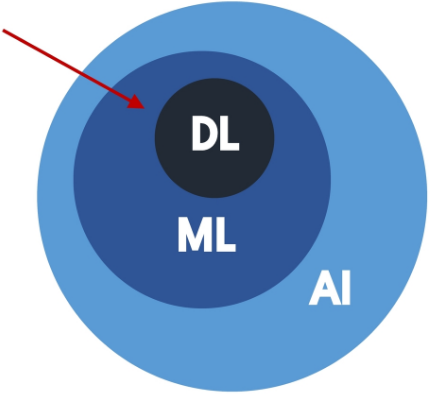
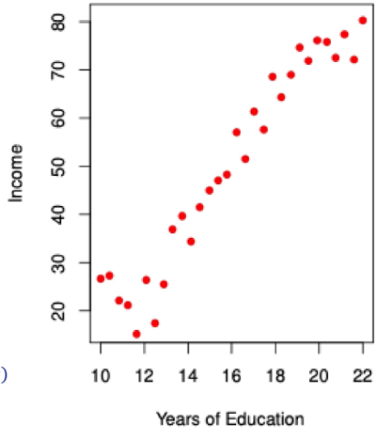
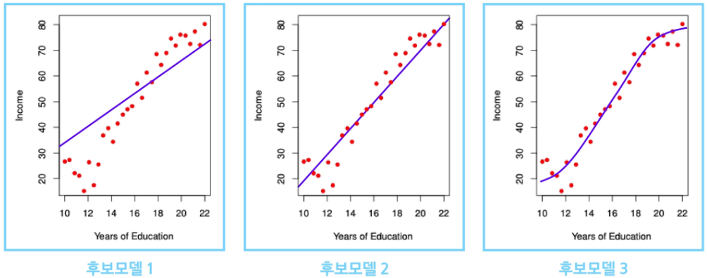
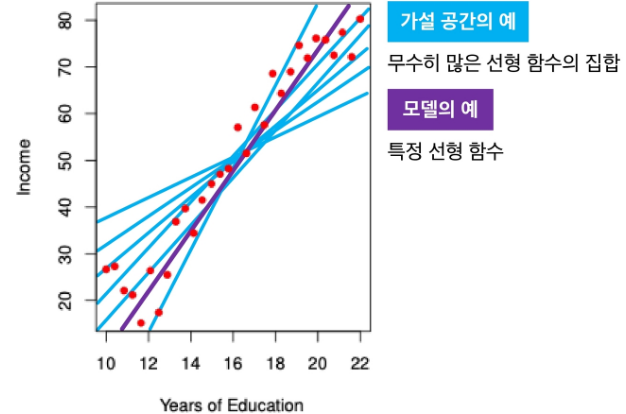
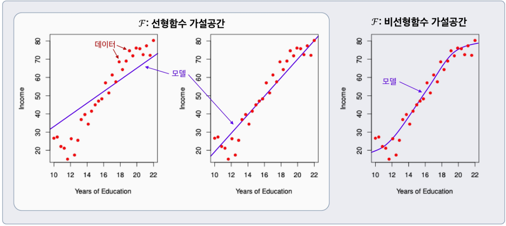
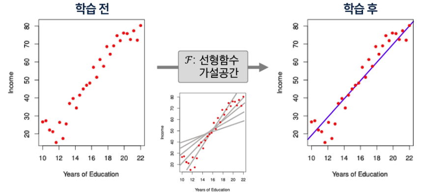
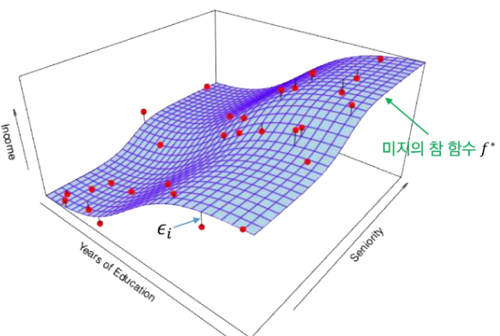
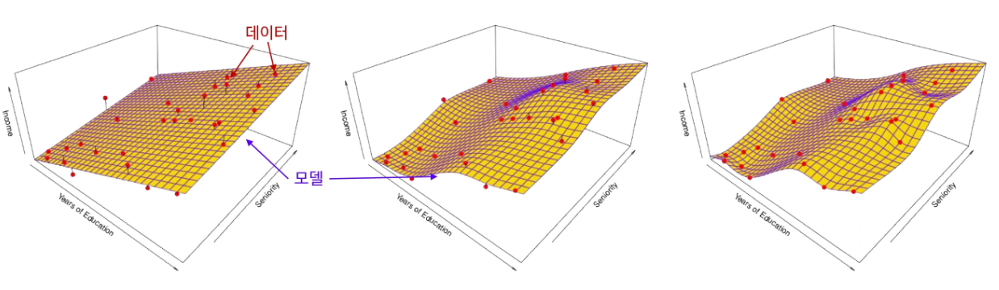
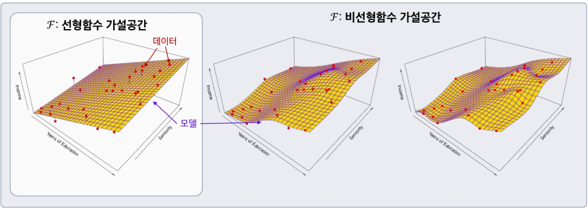

# AI & 기계학습 기초 1
## AI와 ML은 무엇인가?

## CONTENTS

### 1. AI, ML, DL의 정의

### 2. 데이터와 학습의 이해
    1. 데이터 구성 요소(Feature/Label)
    2. ML 실생활 예시

### 3. 단일 피쳐 기반 학습
    1. 1D 피쳐 기반 학습
    2. 모델과 가설공간
    3. 학습이란

### 4. 복수 피쳐 기반 학습
    1. 2D 피쳐 기반 학습
    2. 일반적 용어 정리 및 모델 가정
    3. 왜 $f(X)$를 학습하는가?

-----------------

# 0. 학습 시작(Overview)

## AI와 머신러닝(ML)이 내 일상에 미치는 영향

* 유튜브는 어떻게 내 취향을 알아맞힐까?
* 이메일은 어떻게 스팸/정상을 가려낼까?
* 공통점: 사람이 모든 규칙을 미리 코딩하지 않아도, 데이터에서 **규칙을 학습**해 성능을 향상함.

-----------------

# 1. AL, ML, DL의 정의

## AI(Artificial Intelligence)

* 주어진 환경/데이터를 인지·학습·추론을 통해 목표 달성을 하도록 예측·행동 선택·계획하는 시스템

## ML(Machine Learning)

* AI 범주 내에서 데이터로부터 학습하여 목적을 달성하는 접근 **방법론**
* 예: 언어 모델, 이미지 분류 모델, 추천 시스템

## DL (Deep Learning)

* ML 범주 내에서 **신경망(Neural Network) 함수**를 사용한 학습 **방법론**

## AI - ML (ML이 아닌 AI 시스템)의 예

* **규칙 기반 시스템**
* **휴리스틱 기반** (최적화)알고리즘
* 

-------------------

# 2. 데이터와 학습의 이해
## 2. 1 데이터 구성요소(Feature/Label)

## 데이터가 왜 중요한가?

* 머신러닝은 규칙을 직접 코딩하지 않고, 데이터에서 규칙을 학습
* 데이터(**Feature, Label**)의 분포와 관계가 머신러닝의 학습 결과를 결정

***

## Feature (피처, 특성)

* 모델이 예측에 사용하는 **입력 정보**
* 예측, 판단의 **근거/단서**

***

## Label (라벨, 목표값)

* 모델이 예측하려는 **정답**
* 학습의 **목표값**

## 2-2. ML 실생활 예시

## 예시 1 – 유튜브 추천

* Feature: 각 영상들의 정보(장르, 크리에이터, 조회수, 좋아요 수 등), 사용자 정보(시청 이력, 구독 채널 등)
* Label: 영상에 대한 사용자 피드백(시청 여부, 좋아요 클릭 여부)

***

## 예시 2 – 스팸메일 분류

* Feature: 메일 제목, 발신자, 단어 빈도
* Label: 스팸 / 정상

------------------

# 3. 단일 피쳐 기반 학습

## 3-1. 1D 피처 기반 학습

## 1D 피처 기반 학습(단일 피처 학습)이란?

* **1D = 1차원**
* Feature가 하나일 때 머신러닝이 학습하는 가장 단순한 형태

$$
\text{Income}_i = \underbrace{f^*(\text{Years of Education}_i)}_{\text{미지의 참 함수}} + \underbrace{\epsilon_i}_{\text{측정 오차}}
$$

* 데이터셋 $D$: 30명의 **Years of Education**(피처)와 **Income**(라벨) 쌍

$$
D = \{(\text{Years of Education}_i, \text{Income}_i)\}_{i=1}^{30}
$$

* 미지의 함수 ($f^*$):
    * Feature와 Label 사이의 실제 평균 관계
    * 하지만 **직접 관측할 수 없음**
    * 오차가 포함된 데이터(점)만 관측 가능
* 측정 오차 ($\epsilon$):
    * 데이터에는 주로 측정 오차가 섞여 있음

## 피처와 레이블의 관계를 잘 나타내는 함수 $f$는 없을까?

* 데이터를 설명하는 여러 함수 후보가 존재
* 어떤 함수가 가장 잘 맞는지 **학습해야 함**

## 3-2. 모델과 가설 공간

### 학습 (Learning)

* “입력(Feature) $\to$ 출력(Label)” 관계를 찾는 과정
* 평균 관계를 하나의 함수로 표현함
* 하지만 관계를 표현할 수 있는 함수는 **무수히 많음**

---

### 가설 공간 (Hypothesis Space)

* 관계를 표현할 수 있는 모든 후보 함수들의 모음
* 피처 공간과 레이블 공간 위에서 정의된 함수들의 집합 $\mathfrak{F}$

---

### 모델 (Model)

* 가설 공간 $\mathfrak{F}$에 속한 특정 함수 $f$

## 3-3. 학습이란

### 학습

* 주어진 데이터와 성능척도를 바탕으로 **가설공간 $\mathfrak{F}$의 후보들 중 최적의 모델을 선택**하는 과정
* **데이터 $D \to$ 가설공간 $\mathfrak{F} \to$ 선택된 모델 $f$**

-------------

# 4. 복수 피쳐 기반 학습

## 4-1. 2D 피처 기반 학습

### 참 함수와 관측

$$\text{Income} = \overset{\text{미지의 참 함수(입력과 출력을 이어주는 숨겨진 진짜 함수)}}{f^{\ast}(\text{Years of Education, Seniority})} + \epsilon$$

* **파란색 Surface**(=미지의 참 함수 $f^{\ast}$)는 **관측 불가**
* **빨간색 점들**(=데이터)만 관측 가능함

### 학습의 핵심 질문

* **학습 전**: 어떤 가설공간 $\mathfrak{F}$을 사용할까?
* **학습 후**: 데이터를 활용하여 어떤 모델 $f$를 선택해야 할까?

## 4-2. 일반적 용어 정리 및 모델 가정

$$\text{Income} = f^{\ast}(\text{Years of Education, Seniority,}\ \dots) + \epsilon \to Y = f^{\ast}(\mathbf{X}) + \epsilon$$

* **Income**: 우리가 예측하려는 레이블(반응/목표) 변수 $\to$ **$Y$로 표기**  

* **Years of Education**: 첫 번째 피처(입력/예측) 변수 $\to$ **$X_{1}$로 표기**  

* **Seniority**: 두 번째 피처(입력/예측) 변수 $\to$ **$X_{2}$로 표기**  
* 다른 $i$번째 피처가 있다면 역시 **$X_{i}$로 표기**  

* 일반적인 $p$차원 피처(총 $p$개의 피처) 벡터: 

* **모델(함수형)**: $f^{\ast}: \mathbb{R}^{p} \to \mathbb{R}$, $Y = f^{\ast}(\mathbf{X}) + \epsilon$  

* **측정오차 $\epsilon$**: $\epsilon$는 피처 $\mathbf{X}$와 **독립** 및 $\text{E}[\epsilon] = 0$으로 **가정함**   

## 4-3. 왜 $f(\cdot)$를 학습하는가?

### 예측

* 잘 학습된 $f$가 있으면, 새로운 입력 $X = x$에서 **반응/목표 $Y$를 예측** 가능

---

### 중요 특성 파악

* 피처들 $\mathbf{X} = (X_{1}, X_{2}, \dots, X_{p})$의 어떤 특성이 $Y$를 설명하는 데 **중요**하고, 어떤 것은 **덜 중요(무관)한지** 알 수 있음
* **예**: 근속연수(Seniority), 교육기간(Years of Education)은 소득(Income)에 큰 영향을 줄 수 있지만, 혼인 여부(Marital Status)는 영향이 거의 없을 것임

---

### 해석 가능성

* $f$의 복잡도에 따라 각 구성요소 $X_{i}$가 $Y$에 어떻게 영향을 미치는지(**증가/감소 방향, 민감도 등**) 이해 가능

-----------------

# 요약 및 정리

## AI와 ML

* **AI**: 주어진 환경/데이터를 인지·학습·추론하여 목표 달성을 위한 예측·행동 선택·계획을 수행하는 시스템
* **ML**: AI 범주 내에서 데이터로부터 학습하여 목적을 달성하는 방법론

---

## 데이터의 구성 요소

* **Feature**: 모델 입력 정보, 예측·판단의 근거
* **Label**: 모델이 예측하려는 정답, 학습의 목표

---

## 1D 피처 기반 학습

* Feature가 하나일 때(1차원) 수행되는 단순한 학습 형태
* Feature와 Label 사이의 관계를 함수 $f$로 표현하되, 실제 데이터에는 측정오차 ($\epsilon$)가 포함됨

## 모델과 가설 공간

* **가설 공간($\mathfrak{F}$)**: Feature와 Label 관계를 표현할 수 있는 함수들의 집합
* **모델**: 가설 공간 내 특정 함수 $f$

---

## 학습

* 데이터와 성능 척도를 바탕으로 가설 공간 $\mathfrak{F}$ 내 후보 중 **최적의 모델을 선택**하는 과정

---

## 모델 학습의 필요성

* **예측**: 새로운 입력값에 대해 Label을 추론
* **중요 특성 파악**: 어떤 Feature가 결과에 중요한지 확인
* **해석 가능성**: 각 Feature가 결과에 어떤 영향을 미치는지 이해

------------------

### 1. **다음 중 AI, ML, DL의 관계에 대한 설명으로 옳은 것은?**

① ML은 AI과 DL의 상위 개념이다.
② AI는 반드시 ML을 사용해야 한다.
③ ML은 AI의 한 부분으로, 데이터로부터 학습을 수행한다.
④ 규칙 기반 시스템은 ML의 한 분야이다.
⑤ ML은 사람이 직접 코딩한 규칙을 그대로 사용하는 방식이다.

---

### 정답 및 해설

정답: 3

* **해설**: ML은 AI의 한 분야로, 데이터로부터 규칙을 학습해 목표 달성을 돕는 방법.
* **①**: ML은 AI의 하위 개념으로 간결화.
* **②**: AI는 규칙/휴리스틱 기반만으로도 구현 가능으로 간결화.
* **④**: 규칙 기반 시스템은 AI의 대표적인 예시로 간결화.
* **⑤**: ML은 데이터에서 추론으로 간결화.

### 2. **다음 중 Feature와 Label에 대한 설명으로 옳지 않은 것은?**

① Feature는 모델이 예측에 사용하는 입력 정보이다.
② Label은 모델이 예측하려는 정답, 즉 학습의 목표이다.
③ Feature와 Label의 분포와 관계가 학습 결과를 결정한다.
④ Feature는 반드시 수치형 데이터만 될 수 있다.
⑤ Label은 분류 문제에서는 카테고리, 회귀 문제에서는 수치값이 될 수 있다.

---

### 정답 및 해설

정답: 4

* **해설**: Feature는 수치형뿐 아니라 범주형, 텍스트, 이미지/음성 등도 가능으로 간결화.

### 3. **다음 중 $f(X)$, 즉 미지의 참 함수를 학습하는 이유로 적절하지 않은 것은?**

① Feature($X$)와 label($Y$) 사이의 관계를 알기 위해
② 모든 데이터의 측정오차($\epsilon$)를 제거하기 위해
③ 새로운 입력 $X$에 대해 목표값 $Y$를 예측하기 위해
④ 여러 feature($X$)들 중 label($Y$)와 관계를 갖고 있는 feature를 알기 위해
⑤ Feature($X$) 값의 변화에 따라서 label($Y$)이 어떻게 변화하는지 알기 위해

---

### 정답 및 해설

정답: 2

* **해설**: 학습을 잘 한다고 하여 측정오차를 줄이거나 제거할 수 없음으로 간결화. (측정오차 $\epsilon$은 **피처 $\mathbf{X}$와 독립**이며 **$\text{E}[\epsilon]=0$으로 가정**되는, 모델로 설명할 수 없는 **고유한 오차**임.)

