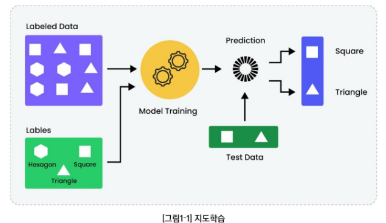
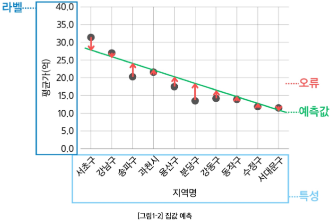
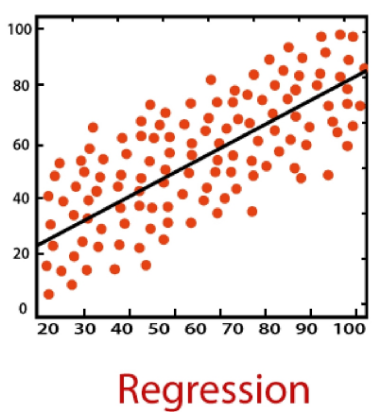
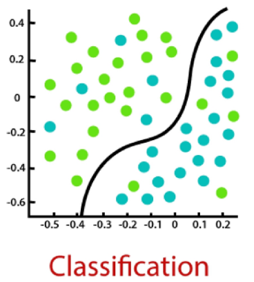
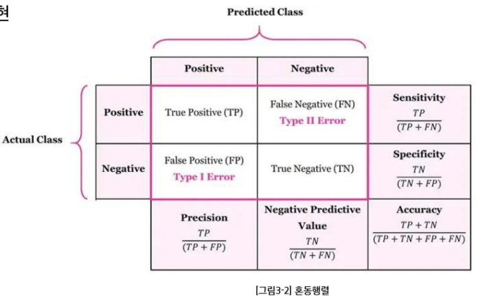
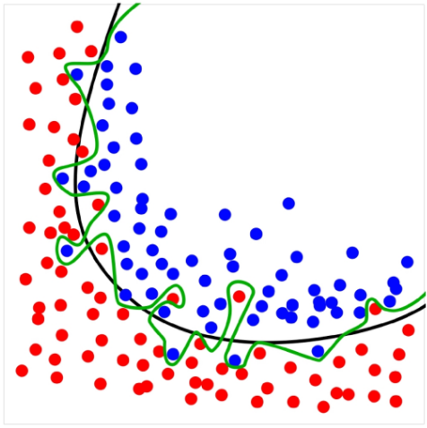
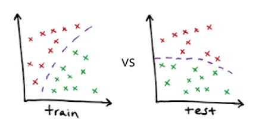
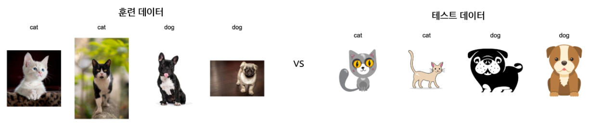
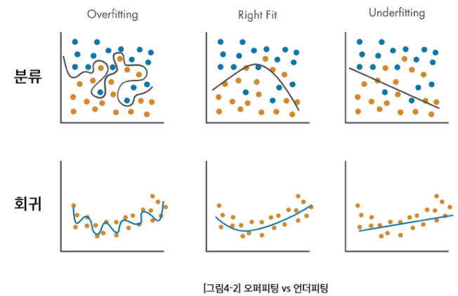

# AI & 기계학습 기초 2
# 지도학습은 무엇인가?

## CONTENTS

1. **지도학습의 개념**
2. **회귀(Regression)**
3. **분류(Classification)**
4. **학습의 목적**

-----------------------------

## 1-1. 지도학습(supervised learning)이란?

### 데이터

* 입력(특성)과 정답(레이블)이 **쌍**으로 있는 데이터

---

### 목표

* 새 입력이 들어오면 **정답을 잘 맞추는 규칙을 학습**

---

### 지도학습의 종류

* **회귀**: 예측값이 **숫자**(가격, 점수, 온도)
* **분류**: 예측값이 **범주**(스팸/정상, 질병 유/무)

## 1-2. 지도학습 용어

### 특성(Feature, $x$)

* 예측에 쓰는 **설명 변수**
* **예**:
    * 집값 예측 {지역, 평수, 방수, 연식}
    * 이메일 스팸 필터링 {제목, 내용 텍스트, 송신인}

---

### 레이블(Label, $y$)

* 맞춰야 하는 **정답**
* **예**: 집값, 스팸/정상 이메일

---

### 예측값($\hat{y}$)

* 모델이 내놓은 결과(**숫자 또는 범주**)

---

### 오류(Error)

* 예측값($\hat{y}$)과 레이블($y$)의 차이: **$\hat{y} - y$**

----------------------

# 2. 회귀(Regression)

## 2-1. 회귀(Regression) 문제

### 입력으로부터 숫자를 얼마나 정확히 예측할까?

* Feature: 면적·방수·연식 $\to$ Label: **집값**(원 단위)
* Feature: 매체별 광고비(TV/라디오/온라인) $\to$ Label: **매출액**

---

### 레이블 및 예측 모델의 출력

* **연속적인 수치**

## 2-2. 회귀 오류: 평균제곱오차(MSE)

### 평균제곱오차(Mean Squared Error)

* 각 데이터에서 정답($y_{i}$)과 예측($\hat{y}_{i}$)의 **평균 제곱 차이값**
$$\text{MSE} = \frac{1}{n} \sum_{i=1}^{n} (y_{i} - \hat{y}_{i})^{2}$$

---

### 해석

* **큰 오류를 더 크게 벌주**므로, 전체 오류 수준을 한눈에 봄

---

### 참고

* 데이터와 같은 단위를 쓰고 싶으면 **RMSE**(MSE의 제곱근)도 사용
$$\text{RMSE} = \sqrt{\text{MSE}} = \sqrt{\frac{1}{n} \sum_{i=1}^{n} (y_{i} - \hat{y}_{i})^{2}}$$

## 2-3. 회귀 설명력: $R^{2}$(결정계수)

### 결정계수

* 레이블의 분산 중에서 **특성으로 설명되는 비율**
* “**평균만 쓰는 단순한 예측**”보다 얼마나 더 잘 맞추는지를 $0 \sim 1$ 사이로 나타낸 값
$$\text{R}^{2} = 1 - \frac{\sum_{i=1}^{n} (y_{i} - \hat{y}_{i})^{2}}{\sum_{i=1}^{n} (y_{i} - \bar{y})^{2}} \quad (\bar{y} = y_{i}\text{들의 평균값})$$

---

### 해석

* **1에 가까울수록 설명력이 높고**, **낮을수록 설명력이 낮음**으로 간결화.

---

### 질문

* **$R^{2}$가 음수가 나올 수 있을까?** 나올 수 있음. 예측값($\hat{y}_{i}$)들이 평균값 $\bar{y}$보다도 못한다면...

---------------

# 3. 분류(Classification)

## 3-1. 분류(Classification) 문제

### 입력으로부터 범주는 얼마나 정확히 가려낼까?

* Feature: 메일 내용·보낸이 이메일주소 $\to$ Label: **스팸/정상**
* Feature: 종양 반경, 면적 $\to$ Label: **악성/양성**

---

### 레이블

* **범주 레이블**(이진/다중)

## 3-2. 분류 정확도(Accuracy)

### 정확도

* **전체 중 맞춘 비율**
$$\text{Accuracy} = \frac{1}{n} \sum_{i=1}^{n} \mathbb{I}(y_{i} = \hat{y}_{i})$$
$$\mathbb{I}: \text{지시(indicator) 함수}, \quad \mathbb{I}(\text{A}) = 1 \text{ if A true}$$

---

### 정확도만 보면 발생하는 문제

* **불균형 데이터**(양성 1%, 음성 99%)에서는 **전부 음성**이라 해도 정확도가 **99%**로 보일 수 있음

---

### 결론

* 정확도만 보지 말고 **다른 지표도 함께** 봐야 안전

## 3-3. 혼동행렬(Confusion Matrix)

### 혼동행렬

* 예측과 실제 값 사이의 관계를 행렬 형태로 표현
* **TP**: 실제 양성, 예측도 양성
* **TN**: 실제 음성, 예측도 음성
* **FP**: 실제는 음성인데 양성이라 함(**오탐**)
* **FN**: 실제는 양성인데 음성이라 함(**누락**)

---

### 정밀도(Precision)

* “**양성이라 판정한 것 중**” 진짜 양성의 비율 = **$\text{TP} / (\text{TP} + \text{FP})$**

---

### 재현율(Sensitivity or Recall)

* “**진짜 양성 가운데**” 잡아낸 예측 양성 비율 = **$\text{TP} / (\text{TP} + \text{FN})$**

---

### F1-score

* 정밀도와 재현율의 **조화평균**
$$\text{F1} = 2 \times \frac{\text{정밀도} \times \text{재현율}}{\text{정밀도} + \text{재현율}}$$

# 4. 학습의 목적

## 4-1. 학습의 목적

### 학습의 목적은 테스트 예측(일반화)

* 학습 모델의 성능 평가는 모델이 **처음 보는(학습에 사용되지 않은) 데이터로 평가**
    * **일반화**(generalization) 오류의 최소화 지향
* 훈련 데이터에서 성능이 아무리 좋아도, 새로운 데이터에서 성능이 떨어지면 실전엔 **사용할 수 없음**으로 간결화.
* 다음 차시(3차시)에서 **일반화 성능을 추정**(검증/교차검증)하는 방법을 배울 예정

## 4-2. 오버피팅(overfitting)이란?

### 오버피팅(overfitting)

* 훈련 데이터의 우연한 패턴/잡음까지 외워버려서 (초록색 함수) 훈련에서는 잘 맞지만 테스트에서는 성능이 나빠지는 현상
* 현상: 훈련 오류 급격히 낮음, 테스트 오류 높음/요동

### 오버피팅이 왜 안 좋은가?

* **표본(sample) 의존·불안정**: 훈련 데이터는 모집단의 일부 표본이라 우연한 잡음이 섞임. 이것에만 과하게 맞추어 학습하면 샘플 몇 개만 바뀌어도 예측이 크게 흔들림(분산$\uparrow$)  
* 일반화 실패: 보지 못한 데이터(테스트) 오류가 커짐, 모(population)집단 성능과 격차가 벌어짐

## 4-3. 오버피팅에 대한 오해

### 오버피팅 $\neq$ 분포 변화(distribution shift)로 인한 에러 증가

> 같은 분포에서 오는 문제

* 분포 변화로 인한 오류: **훈련 데이터 분포**와 **테스트 분포**가 다름으로 (환경·계절·센서 변경 등) 성능이 떨어지는 현상
* 분포 변화로 인한 에러 증가는 모델이 과적합하지 않아도 발생 **가능**

## 4-4. 오버피팅 vs 언더피팅

### 오버피팅 vs 언더피팅 (균형 잡기)

* 오버피팅: 모델이 너무 **복잡**
    * $\rightarrow$ 잡음까지 학습(테스트 성능 나쁨)
* 언더피팅: 모델이 **단순**하거나 학습이 완료되지 **않음**
    * $\rightarrow$ 중요한 패턴을 놓침(**오류 큼**)

### 해결 실마리

* 더 많은 데이터, 테스트 데이터를 활용한 모델 선정. 교차 검증(3차시)

-------------------------------

# 요약 및 정리

## 지도학습(Supervised Learning)

* 입력(Feature)과 정답(Label)이 쌍으로 있는 데이터로 학습
* 새로운 입력에 대해 정답을 잘 예측하는 규칙을 찾는 과정
* 종류
    * 회귀(Regression): **연속적인 값 예측** (집값, 점수, 매출액)
    * 분류(Classification): **범주 예측** (스팸/정상, 질병 유무)

## 회귀 평가 지표

* MSE(평균제곱오차): 큰 오류를 더 크게 반영해 **전체 오류 수준을 파악**
* $\text{R}^2$(결정계수): 모델이 데이터를 **얼마나 설명하는지** (0~1 사이, 높을수록 설명력 큼)

## 분류 평가 지표

* 정확도(Accuracy): 전체 중 맞춘 비율 (**불균형 데이터**에서 한계 존재)
* 혼동행렬(Confusion Matrix): 예측 vs 실제를 행렬로 표현

## 학습의 목적

* 일반화(Generalization): 처음 보는 데이터에서도 잘 작동해야 함
* 훈련 데이터 성능만 좋고 실제 성능이 낮으면 활용 **불가**

## 오버피팅(Overfitting)

* 훈련 데이터의 잡음까지 학습 $\rightarrow$ 훈련 성능$\uparrow$, 테스트 성능$\downarrow$
* 특징: 훈련 오류 작음, 테스트 오류 큼

## 언더피팅(Underfitting)

* 모델이 너무 단순하거나 학습이 부족 $\rightarrow$ 중요한 패턴을 놓침
* 특징: 훈련/테스트 모두 오류 큼

## 균형 잡기 (Overfitting vs Underfitting)

* 오버피팅: 모델이 너무 복잡 $\rightarrow$ **과적합**
* 언더피팅: 모델이 너무 단순 $\rightarrow$ **과소적합**
* 해결 방법: 더 많은 데이터 확보, 테스트 데이터를 활용한 모델 선정, 교차 검증

 
 
 
 
 
 
 
 

-------------------------------

# 확인 문제

## 1. 다음 중 지도학습(supervised learning)에 대한 설명으로 옳은 것은?

(1) 입력 데이터만 있고 정답(라벨)이 없는 데이터로 학습한다.  
(2) 새로운 입력에 대해 정답을 잘 맞추는 함수를 학습한다.  
(3) 오버피팅은 훈련 데이터에서의 오류를 최대한 줄이는 것으로 학습이 목표로 하는 방향이다.  
(4) 지도학습 모델의 출력은 반드시 범주(카테고리)이다.  
(5) 지도학습은 측정오차를 최소화하는 것이 목적이다.  

### 정답 및 해설

**정답: ②**

**해설:**

* 지도학습은 **입력(특성)과 정답(라벨)이 쌍으로 있는 데이터**를 학습하여 새로운 입력의 **정답을 맞추는 규칙**을 찾음.
* (1) **입력만 있고 정답이 없는 경우**는 **비지도 학습**
* (3) **일반화 성능을 높이는 것**이 궁극적인 목적이기에 오버피팅은 피해야 함
* (4) 지도학습 모델 출력은 **수치(회귀문제)**와 **범주(분류문제)** 모두 **가능**
* (5) 지도학습에서는 예측값과 정답의 차이(**오차**)를 줄이는 것이 핵심임

## 2. 다음 중 회귀(Regression) 문제의 특징으로 옳은 것은?

(1) 스팸/정상 분류와 같은 범주 예측 문제를 다룬다.  
(2) **예측값은 연속적인 숫자(예: 가격, 점수, 온도)로 나온다.**  
(3) 대표적인 성능 지표는 정확도(Accuracy)이다.  
(4) 예측 결과는 이산적인 값으로 한정된다.  
(5) 훈련 데이터와 테스트 데이터의 분포가 다르면 반드시 발생한다.  

### 정답 및 해설

**정답: ②**

**해설:**

* 회귀 문제는 **연속적인 수치**를 예측하는 문제. 예를 들어 집값, 매출액, 온도 등이 있음.
* (1) 범주를 예측하는 것은 **분류(Classification) 문제**
* (3) 회귀에서는 **MSE, RMSE, $R^2$** 등의 지표를 사용
* (4) 이산 값은 **분류 문제**의 특징
* (5) 훈련/테스트 분포 차이는 **데이터 쉬프트** 개념이지 회귀의 특징은 아님

## 3. 다음 중 혼동행렬에 대한 설명으로 옳지 않은 것은?

(1) TP(True Positive): 실제 양성을 양성으로 예측한 경우  
(2) TN(True Negative): 실제 음성을 음성으로 예측한 경우  
(3) FP(False Positive): 실제 음성인데 양성으로 잘못 예측한 경우  
(4) FN(False Negative): 실제 양성인데 음성으로 잘못 예측한 경우  
(5) 혼동행렬은 회귀 문제의 성능 평가에서 사용된다.

### 정답 및 해설

**정답: ⑤**

**해설:**

* 혼동행렬은 **분류 문제**의 성능 평가 지표.  
* 회귀 문제에서는 혼동행렬 대신 **MSE, RMSE, $R^2$** 등의 지표를 사용.

