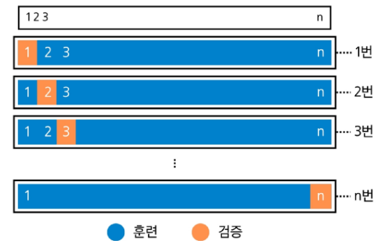

# AI & 기계학습 기초 3
# 교차검증(Cross-Validation)

## CONTENTS

1. 테스트 성능 평가

2. 검증셋(validation set) 접근

3. K-겹 교차검증 (K-fold Cross-Validation)

--------------------

# 1. 테스트 성능 평가

### 훈련 오류 vs 테스트 오류

* **훈련 오류**: 모델을 학습시킨 **같은 데이터**에 다시 적용해 계산한 오류
* **테스트 오류**: 학습에 쓰지 않은 **새 관측치**에 모델을 적용했을 때의 평균 예측 오류
* 보통 훈련 오류는 테스트 오류와 다르며, 특히 **훈련 오류는 테스트 오류를 (심하게) 과소평가**하는 경우가 많음
* 예: **암기 vs 응용 시험**

## 훈련 오류 vs 테스트 오류

* 파란색 선: **훈련 오류**
* **빨간색 선**: **테스트 오류**
* 훈련 오류는 **계속 $\downarrow$**, 테스트 오류는 **U자형**
* 목적: 테스트 오류의 **U자형의 바닥**이 되도록 하는 적절한 모델 찾기

## 테스트 예측 오류 계산

* 이상적 케이스: 충분히 큰 **별도 테스트 데이터셋** $\rightarrow$ 현실에선 구하기 **어려움**
* 현실에서는 테스트만을 위한 데이터를 갖기에 데이터 자체가 **부족**할 수 있음

## 대안: 재표본화(resampling)를 통한 테스트 오류 추정

* 데이터를 나눠 여러 번 **“훈련$\rightarrow$평가”**를 반복해 테스트 오류를 **가능**
* 방법: **검증셋(hold-out)**, **K겹 교차검증(K-fold Cross-Validation)**
* 장점: **별도의 테스트 데이터 없이** 데이터를 더 **효율적으로 사용**하여 일반화 오차 추정

-------------

# 2. 검증셋(Validation Set) 접근
## 2.1 검증셋(Validation Set) 방법
## 검증셋(홀드아웃) 방법

* 가용 샘플들을 **무작위로** 훈련셋과 **검증셋(hold-out)**으로 분할
* 훈련셋으로 모델 적합, 검증셋으로 예측 후 **검증 오류를 계산**
* 검증 오류는 보통 정량 반응은 **MSE**, 범주 반응은 **오분류율**(또는 F1-score)을 측정함

## 2-2. 검증셋 절차

### 검증 절차

* 데이터 순서 무작위 **셔플링** 후 두 부분으로 분할: 왼쪽(파랑)=**훈련셋**, 오른쪽(주황)=**검증셋**
* 학습은 **훈련셋**에서, 성능 평가는 **검증셋**에서 수행

## 2-3. 검증셋 방법 예시

### 예시: 자동차 데이터

* 목표: **선형(1차)** 모델부터 **고차항(다항식)** 모델 **비교**
* 392개 데이터를 무작위로 196개 훈련셋/196개 검증셋으로 분할 (일반적으로 반으로 나눌 필요는 없음)
* **좌측 패널**: 단 한 번 분할 시의 MSE 곡선
* **우측 패널**: 여러 번 (셔플 후) 다른 분할의 MSE 곡선들

## 2-4. 검증셋 접근의 한계

### 예시에서 보이는 검증셋 방법의 단점이 무엇일까?

* 어떤 표본이 훈련/검증에 들어가느냐에 따라 **검증 기반 테스트 오류 추정치**가 매우 **가변적**
* 검증 접근에서는 훈련셋(=전체의 일부)만으로 모델을 적합하므로, 전체 데이터로 학습했을 때보다 성능이 낮게 추정(즉, **테스트 오류를 과대 추정**될 수 있음)

### 왜 전체 데이터로 학습한 모델의 **테스트 오류를 과대 추정**하는 경향이 있을까?

* 학습에 데이터를 부분만 사용하기 때문  

-------------

# 3. K-겹 교차검증(K-fold Cross-Validation)

### K-겹 교차검증(K-fold Cross-Validation)

* **테스트 오류 추정의 표준적 접근**
* 추정치는 **모델 선택**과 **최종 모델의 테스트 오류 규모 파악**에 활용
* 데이터 전체를 **크기 동일한 $K$개 폴드**로 무작위 분할
    * $\rightarrow$ 폴드 $k \in \{1, 2, \cdots, K\}$를 검증, 나머지 $K-1$개를 훈련에 사용
* $k=1, \cdots, K$에 대해 반복 후, **평균 오류**로 테스트 오류를 추정

## K-겹 교차검증 단계

* 데이터를 먼저 **셔플링**한 뒤, 총 $n$개의 데이터를 **겹치지 않는 $K$개 그룹으로 분할**
* 각 그룹이 번갈아 **검증셋(주황)**, 나머지는 **훈련셋(파랑)**
* $K$개의 MSE를 평균해 테스트 오류를 추정

## 3-2. K-겹 교차검증 오류 계산

### K-겹 교차검증 오류 계산

* 폴드 집합 $C_1, \cdots, C_K$, 각 폴드 크기 $n_k$

$$
\text{CV}(K) = \sum_{i=1}^{n} \frac{n_k}{n} \text{MSE}_k
$$

* 여기서, $\text{MSE}_k = \frac{1}{n_k} \sum_{i \in C_k} (y_i - \hat{y}_i)^2$ ($k$-폴드를 검증셋으로 두고 나머지로 적합한 예측 $\hat{y}_i$)
* $K = n$이면 **Leave-One-Out 교차검증(LOOCV)**

### Leave-One-Out 교차검증에서 검증셋 크기는?
> 1

## 3-3 Leave-One-Out 교차검증

## Leave-One-Out 교차검증

* 훈련셋(파랑): **관측치 하나만 제외**한 나머지 전부
* 검증셋(주황): **제외한 1개 관측치**
* 이 과정을 $n$번 반복해 나온 **$n$개의 MSE 평균**으로 테스트 오류를 추정

## 3-4. K-겹 교차검증 비교

### Leave-One-Out 교차검증 vs 10-겹 교차검증

* 자동차 데이터에서 **LOOCV**와 **10-겹 CV** 결과 비교(다항 차수에 따른 MSE 곡선)
* 두 방법의 **경향**과 **최적 차수**가 비슷

## 시뮬레이션: 참/추정 테스트 MSE

* 파랑: **참(test) MSE**, 검은 점선: **LOOCV 추정**, 주황: **10-겹 CV 추정**
* **10-겹 CV 추정**: 테스트 성능에 추정의 좋은 **대안**

-------------------

# 요약 및 정리

## 테스트 성능 평가

* 훈련 오류: 학습에 사용된 데이터에서의 오류
* 테스트 오류: 새 데이터에서의 오류 $\rightarrow$ **일반화 성능 평가 기준**
* 목표: **테스트 오류가 최소**가 되는 모델 선택

## 오버피팅 vs 언더피팅

* 오버피팅: 모델이 지나치게 복잡 $\rightarrow$ 훈련 성능$\uparrow$, 테스트 성능$\downarrow$
* 언더피팅: 모델이 지나치게 단순 $\rightarrow$ **중요한 패턴을 놓쳐 오류 큼**

## 검증(Validation)

* 데이터를 훈련셋/검증셋으로 분리
* 훈련셋으로 모델 적합, 검증셋으로 성능 측정
* **Hold-out**, **K겹 교차검증(Cross-Validation)** 활용

## K겹 교차검증

* 데이터를 **$K$개로 나눠 반복적으로 학습·평가**
* **모든 데이터**를 검증에 사용해 일반화 성능을 더 **정확히 추정**
* $K=n$: **LOOCV (Leave-One-Out Cross Validation)**

 
 
 
 
 
 
 
 
 

-----------------------

# 확인 문제

## 1. 훈련 오류와 테스트 오류에 대한 설명으로 옳은 것은?

① 훈련 오류는 새로운 데이터에 대한 예측 정확도를 측정한다.  
② 테스트 오류는 학습에 사용된 데이터에 대해 계산한 평균 오차이다.  
③ 궁극적으로 테스트 오류를 최소화하는 것이 학습의 목적이다.  
④ 일반적으로 훈련 오류는 테스트 오류보다 크게 나타난다.  
⑤ 훈련 오류는 항상 0에 수렴해야 좋은 모델이다.

### 정답 및 해설

**정답: ③**

**해설:**

* 학습의 목적은 **일반화 성능**을 높이는 것이며, 이는 **테스트 오류를 최소화**하는 것이다.
* ① 새로운 데이터는 **테스트 오류**가 담당.
* ② 이는 **훈련 오류**에 대한 설명이다.
* ④ 일반적으로 **훈련 오류 $\lt$ 테스트 오류**이다.
* ⑤ 훈련 오류가 0에 가까우면 **오버피팅 가능성**이 높다.

## 2. 다음 중 언더피팅과 오버피팅의 특징을 올바르게 설명한 것은?

① 언더피팅은 훈련 오류와 테스트 오류 모두 크게 나타난다. 
② 언더피팅은 모델이 지나치게 복잡해 데이터 잡음까지 학습하는 현상이다.  
③ 오버피팅은 모델이 단순해 중요한 패턴을 놓치는 현상이다.  
④ 오버피팅은 훈련 오류가 크고 테스트 오류가 작게 나타난다.  
⑤ 두 경우 모두 모델 복잡도를 높이면 해결된다.

### 정답 및 해설

**정답: ①**

**해설:**

* 언더피팅은 모델이 **너무 단순**하여 데이터 패턴을 제대로 학습하지 못해 **훈련 오류와 테스트 오류 모두 크게** 나타남.
* ② **오버피팅**에 대한 설명.
* ③ **언더피팅**이 아니라 오버피팅의 **반대 현상**.
* ④ 오버피팅에서는 **훈련 오류 $\downarrow$, 테스트 오류 $\uparrow$** 임.
* ⑤ 언더피팅은 복잡도를 높이면 개선 **가능**하지만, 오버피팅은 오히려 **더 심해짐**.

---

## 3. K-겹 교차검증(K-fold CV)에 대한 설명으로 옳지 않은 것은?

① 데이터를 $K$개 그룹(폴드)으로 나누어, 각 그룹을 한 번씩 검증셋으로 사용한다.  
② $K$번 반복한 후 각 폴드별 평균 오차를 계산해 일반화 성능을 추정한다.  
③ $K=n$일 경우 Leave-One-Out 교차검증(LOOCV)이다.  
④ 교차검증은 데이터 활용성을 높이면서 테스트 오류에 대한 추정이 가능하다.  
⑤ 교차검증 시, 각 폴드에 속한 데이터가 겹쳐도 무방하다.

### 정답 및 해설

**정답: ⑤**

**해설:**

* 교차검증에서는 **각 폴드별 데이터가 겹치지 않도록 명확히 분리**해야 한다.
