# AI & 기계학습 기초 4
# 비지도 학습은 무엇인가?

## CONTENTS

1. 비지도 학습
2. **클러스터링(Clustering)**
3. **K-means 클러스터링**
4. **계층적 군집(Hierarchical Clustering)**
5. **클러스터링 주의점**

---------------------

# 1. 비지도 학습

## 비지도학습이란?

* 정의: 레이블(정답) 없이 데이터의 구조·패턴·집단(잠재 서브그룹)을 찾아내는 학습
* 대표 과제: 군집화(clustering), 차원축소(PCA 등), 밀도추정/이상치 탐지
* 출력: “정답 예측”이 아니라 구조/요약/표현(embedding)

***

## 핵심 질문

* 무엇을 비슷함/다름으로 볼 것인가(거리·유사도 선택)
* 전처리(스케일 표준화 등)를 어떻게 할 것인가
* 출력: “정답 예측”이 아니라 구조/요약/표현(embedding)

## 비지도 vs 지도학습

* **지도학습**: 입력+레이블로 예측 모델 학습
    * 예: 가격 예측, 악성 종양 예측
* **비지도학습**: 입력만으로 구조 학습
    * 예: 고객 세그먼트
* **비지도학습 예**
    * **클러스터링**: 서로 비슷한 데이터끼리 묶어 동질 그룹 만들기

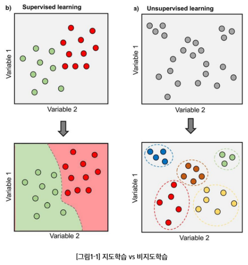

# 2. 클러스터링(Clustering)

## 클러스터링(Clustering)이란?

* **클러스터링**: 데이터 안에서 하위 집단(클러스터)을 찾는 기법들의 총칭
* **목표**: 집단 내부는 서로 유사, 집단 간은 상이하도록 데이터를 분할
* **유사/상이 정도**는 도메인 맥락에 따라 정의가 달라질 수 있음
* **문제**: 데이터 특성에 의존

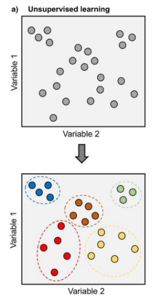

## 예시: **마케팅 세그먼테이션**

* 다수의 지표(가구 소득, 직업, 도심 거리 등)를 가진 많은 사람들에 대해 특정 광고/상품에 더 반응할 하위집단을 식별하고자 함.
* 시장 세분화 작업 자체가 **클러스터링**에 해당

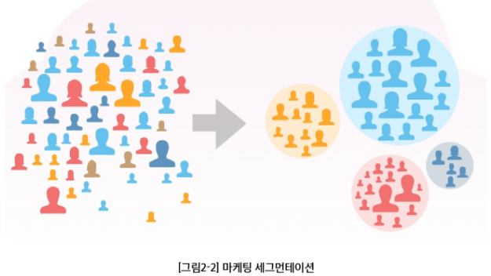

## 두 가지 대표 클러스터링 기법

* **K-평균(K-means)**: K(클러스터 수)를 미리 정해 분할
* **계층적 군집(Hierarchical)**: K를 사전에 고정하지 않음

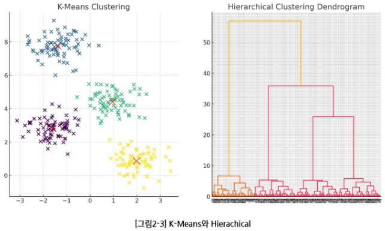

------------

# 3. K-means 클러스터링

## 3-1. K-means 클러스터링

## K-means 클러스터링 결과 예시

* 패널: K=2, 3, 4에서 각 K-means 결과(점 색상=할당된 클러스터)
* 클러스터 결과에서 특정 색상은 의미가 없고, 점들이 다른 색이라는 것은 서로 다른 클러스터에 속해있다는 의미

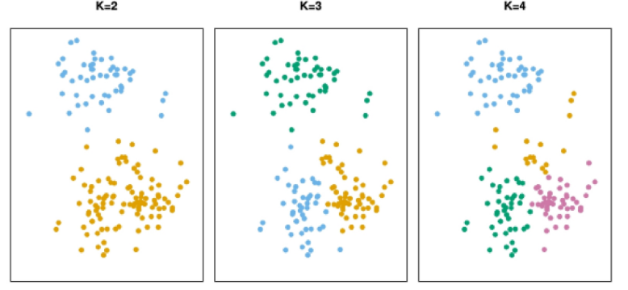

## K-means의 표기(군집 집합)

* 관측치 인덱스 집합을 $C_1, \dots, C_K$ 라 하면:
    * $C_1 \cup \dots \cup C_K = \{1, \dots, n\}$ (각 관측치는 적어도 하나의 군집에 속함)
    * 모든 다른 클러스터 $k \ne k'$ 에 대해, $C_k \cap C_{k'} = \emptyset$ (**겹치지 않음**)
* $i$ 번째가 $k$ 번째 군집이면 $i \in C_k$ (**비중첩 분할**)

***

## K-means의 핵심 아이디어

* 좋은 군집화 = 클러스터 내부 변동(Within-Cluster Variation)이 작은 분할
* **목표**: 클러스터 내부 변동의 합이 최소가 되도록 분할을 찾음
* 모든 클러스터의 내부 흩어짐 총합이 가장 작은 분할

## 3-2. K-means 클러스터링 알고리즘

## K-means 알고리즘

1. **초기화**: 관측치들에 무작위로 $1 \cdots K$ 클러스터를 임시 부여
2. **반복** (할당이 더 이상 바뀌지 않을 때까지):
    * 2a. 각 클러스터의 중심(**centroid**) 계산(특성 평균 벡터)
    * 2b. 각 관측치를 가장 가까운 중심의 클러스터에 **재할당**(거리 예=유클리드)

***

## K-means 알고리즘 특성

* 위 반복은 매 단계 목표함수 값을 감소시킴(군집 내 평균 제곱거리의 성질 때문)
* 단, **전역(global) 최솟값 보장 아님** $\rightarrow$ 초기값에 따라 **지역 최솟값**으로 수렴 가능

## K-means 알고리즘 순서

| 단계 | 내용 |
| :--- | :--- |
| **1** | 무작위 클러스터 초기화 |
| $\downarrow$ | |
| **2a** | 중심 계산 |
| $\downarrow$ | |
| **2b** | 클러스터 재배정 |
| $\rightarrow$ | (반복) |

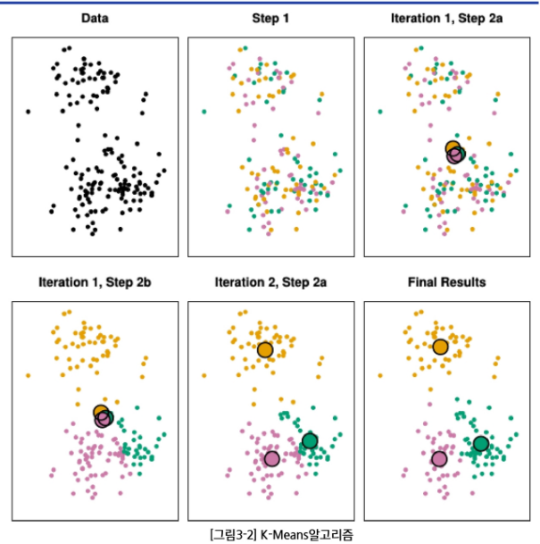

## 다른 초기값의 영향

* 서로 다른 초기 레이블에서 최종 분할과 목표값(패널 상단 숫자)이 달라짐
* 초기화의 중요성: **여러 번 시도 권장**

----------------

# 4. 계층적 군집(Hierarchical clustering)

## 4-1. 계층적 군집(Hierarchical Clustering)

## K-means 클러스터링 vs 계층적 군집(Hierarchical Clustering)

* K-means는 클러스터 수 **K를 미리 지정**해야 하는 단점이 존재함
* **계층적 군집**은 K를 고정하지 않고 **전체 구조를 덴드로그램으로 제공**
* 이번 강의에서는 상향식(**agglomerative**)을 다룸: 잎$\rightarrow$몸통으로 병합

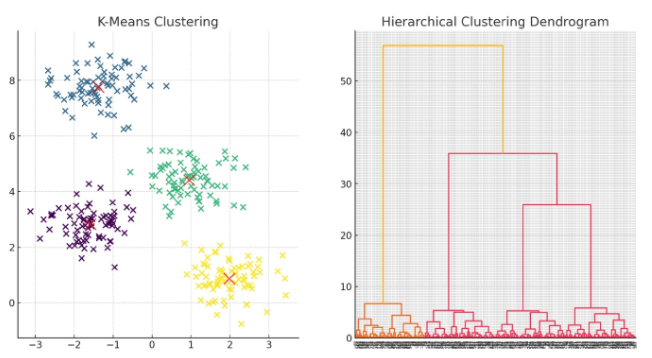

## 계층적 군집 결과 예시

* 덴드로그램에서 수평선 높이(**거리**)를 기준으로 가위질하여 $K$ 개 군집을 얻음

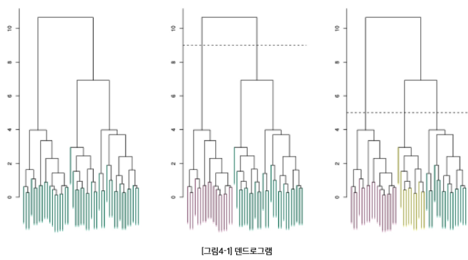

## 4-2. 계층적 군집 알고리즘(상향식)

## 계층적 군집 알고리즘(상향식)

1.  $n$ 개 관측치에 대해 **쌍별 비유사도 계산**. 각 관측치를 하나의 클러스터로 시작

2.  $i$ 개 클러스터 간 쌍별 비유사도를 모두 계산해 가장 유사한 두 클러스터를 **병합**

3.  병합 후 남은 $i+1$ 개 클러스터 사이의 **새 비유사도를 다시 계산**

    ($i=n, n-1, \dots, 2$ 에 대해 반복)

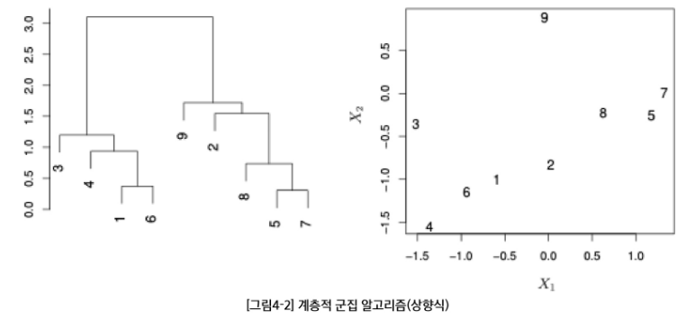

## 4-3. 계층적 군집 단계별 진행

## 계층적 군집 병합 진행 예

* 데이터들이 점차 큰 클러스터로 합쳐지는 과정
* 매 단계에서 클러스터들끼리의 병합이 이루어짐
* 1개의 단일 클러스터가 될 때까지 진행

***

## 계층적 군집의 계산량

* 매 단계에서 **모든 클러스터 쌍 간의 거리**를 계산해야 함
* 데이터의 수가 많은 경우 K-means에 비하여 **계산량이 많음**

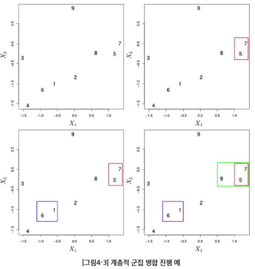

## 4-4. 계층적 군집의 링크 유형

## 링크(link)의 유형

* **Single(최소 거리) 링크**: 두 개 클러스터 내 데이터 쌍별 거리 중 **최솟값**을 군집 간 거리로
* **Complete(최대 거리) 링크**: 두 개 클러스터 내 데이터 쌍별 거리 중 **최댓값**을 군집 간 거리로
* **Average(평균 거리) 링크**: 두 개 클러스터 내 데이터 쌍별 거리의 **평균**을 군집 간 거리로

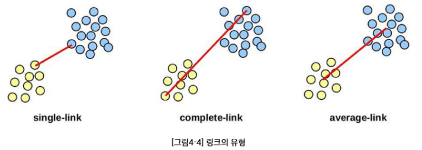

## 4-5. 링크 유형에 따른 계층적 군집 결과

## 링크에 따라 결과가 달라진다

* 같은 데이터라도 **링크 선택**에 따라 클러스터링 결과(**덴드로그램**)가 달라질 수 있음
* 하나의 링크만 시도하는 것이 아니라 **다른 종류의 링크도 사용 권장**

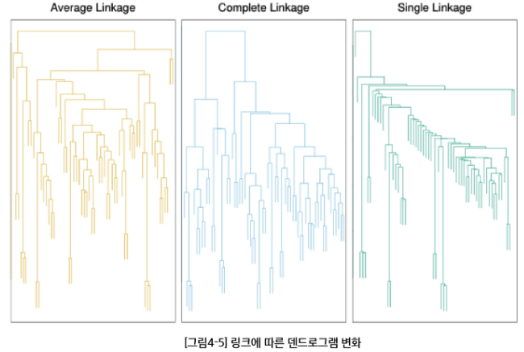

------------------

# 5. 클러스터링 시 주의점

## 클러스터링 체크리스트

* **스케일링**: 표준화(평균 0, 표준편차 1로 입력 변수 변환)가 필요한가?
    $\rightarrow$ **Yes**, 변수 단위 차이 영향 **큼**
* **몇 개의 클러스터가 적합**한지?
    $\rightarrow$ K-means·계층적 모두 어려운 문제, **합의된 정답 없음**
* **단일 시도**가 아닌 **여러 번 시도 권장**

-----------------------

# 요약 및 정리

## 비지도 학습

* 레이블(정답)이 없는 데이터를 통해 데이터의 구조·패턴·집단을 학습하는 방법
* 데이터 탐색, 군집 분석, 시각화, 차원 축소, 이상치 탐지 등

## 클러스터링(Clustering)

* **K-평균(K-means)**: K(클러스터 수)를 미리 정해 분할
* **계층적 군집(Hierarchical)**: K를 사전에 고정하지 않음

***

## 링크(link) 유형

* **Single(최소 거리) 링크**: 데이터 쌍별 거리 중 **최솟값**을 군집 간 거리
* **Complete(최대 거리) 링크**: 데이터 쌍별 거리 중 **최댓값**을 군집 간 거리
* **Average(평균 거리) 링크**: 데이터 쌍별 거리의 **평균**을 군집 간 거리

-----------------------

# 확인 문제

### 1. 다음 중 비지도 학습의 예로 해당하는 것은?

* A. 스팸/이메일 분류
* B. 집값 변화 예측
* C. (레이블이 없는 데이터에서) 구매 성향별 고객 묶음
* D. 주간 날씨 예측

***

## 정답 및 해설

* **정답**: C. 구매 성향별 고객 묶음
* **해설**: 정답이 없는 **묶음 문제**로 전형적인 **클러스터링 문제**

### 2. 다음은 클러스터링 기법에 대한 설명이다. 각 설명이 K-means의 특징인지, 계층적 군집의 특징인지 알맞게 분류하시오.

* A. 클러스터 수 K를 미리 지정해야 한다.
* B. 덴드로그램(Dendrogram)을 통해 전체 구조를 시각적으로 제공한다.
* C. 데이터 간 병합(상향식) 과정을 통해 클러스터를 형성한다.
* D. 클러스터 내부 변동(Within-cluster variation)의 합이 최소가 되도록 분할한다.
* E. 매우 큰 데이터셋에도 계산 복잡도가 크게 늘지 않아 효율적이다.

***

## 정답 및 해설

**정답**: K-means: A, D, E / 계층적 군집: B, C

### 해설

* **K-means**는 데이터를 **K개의 그룹**으로 나누는 대표적 기법으로, 군집 내 분산을 최소화하도록 반복 계산한다. **빠르고 대규모 데이터에 효율적**이지만 **클러스터 수를 미리 지정**해야 하고 복잡한 모양의 데이터에는 한계가 있다.
    * A: K-means 특징
    * D: K-means 목표
    * E: K-means 특징 (대규모 데이터에 효율적)
* **계층적 군집**은 데이터를 병합·분할하여 트리(**덴드로그램**) 구조를 만드는 방식으로, **클러스터 수를 미리 정하지 않아도** 되어 데이터 구조를 시각적으로 파악하기 쉽다. 그러나 데이터가 많을수록 **계산 비용이 커져 대규모 데이터에는 비효율적**이다.
    * B: 계층적 군집 특징 (덴드로그램 제공)
    * C: 계층적 군집 특징 (상향식 병합)

