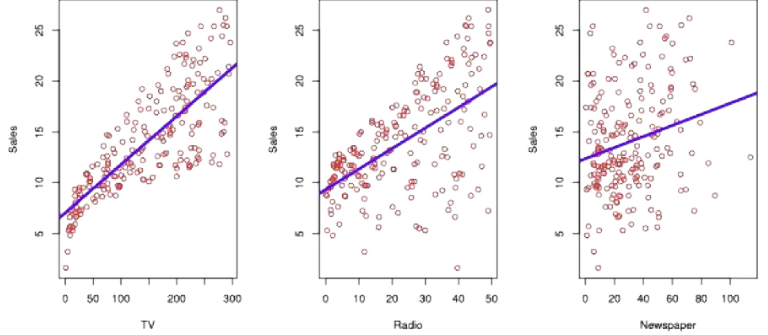

# 선형회귀(Linear Regression)

## CONTENTS
1. 선형회귀: 입력과 출력의 선형 관계를 찾는 방법
2. 단순선형회귀: 하나의 입력 변수로 출력 예측하기
3. 다중선형회귀: 여러 입력 변수를 활용한 예측
4. 선형회귀 주의사항: 변수 상관(**다중공선성**), 상관과 인과 구분

# 1. 선형 회귀
## 1-1. 선형회귀(Linear Regression)

### 선형회귀란?

* **입력 변수**와 **출력 변수** 사이의 관계를 **직선 형태**로 근사하여, 예측하는 통계적 방법이다.
* **지도 학습**의 가장 기초가 되는 접근 중 하나이다.
* 단순해 보이지만, 선형회귀는 **개념적으로도**, **실무적으로도** 매우 유용하다.

## 1-2. 광고 데이터 예시

### 선형회귀를 통해 대답할 수 있는 질문들

* **광고비와 매출 사이에 관계가 있는가?**
* **그 관계의 강도는 어느 정도인가?**
* **어떤 매체가 매출에 기여하는가?**
* **미래 매출을 얼마나 정확히 예측할 수 있는가?**
* **매체 간에 상호작용(시너지)가 있는가?**

# 2. 단순선형회귀(Simple Linear Regression)
## 2-1. 단순선형회귀: 단일 설명변수를 이용한 선형회귀

### 단순선형회귀(simple linear regression)란?
* **한 개의 설명변수($X$)**와 **하나의 반응변수($Y$)** 사이의 선형(직선) 관계를 찾는 방법
* **목표:** 데이터를 가장 잘 설명하는 **직선**을 찾아 **예측($\hat{y}$)**에 활용

### 단일 설명변수를 이용한 단순선형회귀
* **모형 가정:** $Y = \beta_0 + \beta_1 X + \epsilon$
    * $\beta_0$: **절편** ($X=0$일 때 $Y$ 값)
    * $\beta_1$: **기울기** ($X$가 $1$ 단위 증가할 때 $Y$의 평균 증가량)
    * $\epsilon$: **관측 오차**
* $\text{hat}(\text{예, } \hat{y}, \hat{\beta}_0, \hat{\beta}_1) \text{ 표기는}$ **추정값**을 의미

## 2.2 최소제곱법(least squares)
## 최소제곱법(least squares)

### 최소제곱법이란?

* **실제 관측값**과 **예측값의 차이**(잔차, residual)를 **제곱**해 합한 값(**RSS**, **잔차제곱합**)을 **최소화**하는 방법
* **목표:** 데이터를 가장 잘 설명하는 **직선**을 찾기 위해 **계수** $\beta_0, \beta_1$을 **추정**

### 잔차 및 RSS 정의

* **잔차(residual) 정의:**
$$e_i = y_i - \hat{y}_i \quad (\text{예측값 } \hat{y}_i = \hat{\beta}_0 + \hat{\beta}_1 x_i)$$
* **RSS(잔차제곱합) 정의:**
$$\text{RSS} = e_1^2 + e_2^2 + \cdots + e_n^2$$
* **다른 표현:**
$$\text{RSS} = \sum_{i=1}^{n} e_i^2 = \sum_{i=1}^{n} (y_i - \hat{y}_i)^2 = \sum_{i=1}^{n} (y_i - \hat{\beta}_0 - \hat{\beta}_1 x_i)^2$$

---

### 계수를 측정하기 위한 공식: closed-form solution(공식으로 바로 계산할 수 있는 해) 존재!

* **기울기 $\hat{\beta}_1$:**
$$\hat{\beta}_1 = \frac{\sum_{i=1}^{n} (x_i - \bar{x})(y_i - \bar{y})}{\sum_{i=1}^{n} (x_i - \bar{x})^2}$$
* **절편 $\hat{\beta}_0$:**
$$\hat{\beta}_0 = \bar{y} - \hat{\beta}_1 \bar{x}$$

**참고:**
$$\bar{y} = \frac{1}{n} \sum_{i=1}^{n} y_i, \quad \bar{x} = \frac{1}{n} \sum_{i=1}^{n} x_i$$

**추가 정보:** 1-2챕터 4차시에서 **경사 하강법**으로 선형회귀를 푸는 방법을 다룰 예정

## 2-3. 단순선형회귀: 광고 데이터

### 사례 설명
* **목표:** $\text{TV 광고비}(X)$와 **제품 판매량($Y$)의 선형 관계 예측**
* 단순선형회귀를 적용하여, 각 데이터에서 **잔차제곱을 가장 작게 만드는 직선(최소제곱법)**이 선택됨

### 도형의 의미
* **파란 직선:** 최소제곱법으로 계산한 **회귀선**
* **빨간 점:** **실제 관측 데이터**
* **회색 세로선(빨간 점에서 파란 선까지): 잔차(residual)**
* $\text{RSS}$(**잔차제곱합**)를 최소화할 때, **최적의 $\hat{\beta}_0, \hat{\beta}_1$**이 결정됨

### 수식
* **기울기 $\hat{\beta}_1$:**
$$\hat{\beta}_1 = \frac{\sum_{i=1}^{n} (x_i - \bar{x})(y_i - \bar{y})}{\sum_{i=1}^{n} (x_i - \bar{x})^2}$$
* **절편 $\hat{\beta}_0$:**
$$\hat{\beta}_0 = \bar{y} - \hat{\beta}_1 \bar{x}$$

## 단순선형회귀 결과 해석 (광고 데이터)

### 계수 해석

| | Coefficient | Std. Error | t-statistic | p-value |
| :---: | :---: | :---: | :---: | :---: |
| **Intercept** | $\hat{\beta}_0 = 7.0325$ | $0.4578$ | $15.36$ | $< 0.0001$ |
| **TV** | $\hat{\beta}_1 = 0.0475$ | $0.0027$ | $17.67$ | $< 0.0001$ |

* **절편(Intercept) $= 7.03 \rightarrow \text{TV}$ 광고비가 0이어도 기본적으로 평균 판매량은 7.03백만원**
* **$\text{TV}$ 광고비 계수 $= 0.0475 \rightarrow \text{TV}$ 광고비를 1단위(1백만원) 늘리면 평균 매출이 약 $0.0475 \times 1 \text{단위}(1\text{백만원}) = 4.72$만원 증가**

### 유의성 검정

* **계수의 $\text{p-value} < 0.0001$ (매우 작음, $\ll 0.05$) 이므로 통계적으로 매우 유의함 $\rightarrow \text{TV}$ 광고비와 매출 간 관계 존재**
    * $\text{p-value}$는 $\beta_1 = 0$일 때 관측값만큼(그 이상) 극단적일 확률을 의미함.

| Quantity | Value |
| :---: | :---: |
| $R^2$ | $0.612$ |

* **모형 적합도 ($R^2$ 높을 수록, 1에 가까울수록 좋음)**
* **$R^2 = 0.612 \rightarrow$ 판매량 변동의 약 $61\%$를 광고비로 설명 가능**
    * $R^2$: 결정계수(Coefficient of Determination)

---
*참고: $\hat{\beta}_0$와 $\hat{\beta}_1$은 추정된 계수를 나타냅니다.*

# 3. 다중 선형 회귀(Multiple Linear Regression)
## 3-1. 다중선형회귀(multiple linear regression)란?

### 단순선형회귀와 다중선형회귀
* **단순 선형 회귀**: "TV 광고 $\rightarrow$ 매출" **한 가지 관계**만 고려
* **다중 선형 회귀**: "**TV 광고, Radio 광고비, 가격, 계절, 경쟁사**" 등 **복수 요인**을 함께 고려하여 매출을 설명

## 다중선형회귀의 개념

* **독립 변수**(설명 변수, Feature)가 **여러 개** 존재할 때 사용하는 회귀 분석 기법
* **단순 선형 회귀**는 하나의 변수만 고려하지만, **다중 선형 회귀**는 **여러 독립 변수**($X_1, X_2, \dots$)를 동시에 고려하여, **종속 변수($Y$)**와의 관계를 구함

### 다중선형회귀 모형

$$Y = \beta_0 + \beta_1 X_1 + \beta_2 X_2 + \cdots + \beta_p X_p + \epsilon$$

## 각 변수의 의미

* $Y$: **종속 변수** (예측 대상, 예: 매출)
* $X_1, X_2, X_3, \dots, X_p$: **$p$개의 독립 변수들** (예: 광고비, 가격, 계절 등)
* $\beta_0$: **절편**
* $\beta_1, \beta_2, \beta_3, \dots, \beta_p$: **각 독립 변수에 대한 회귀 계수(모수)** (변수의 영향력 크기와 방향을 나타냄)
* $\epsilon$: **관측 오차** (모델이 설명하지 못하는 부분, 오류/잔차가 아님!)

### 해석

* **해석:** **다른 변수를 고정한 채** $X_j$가 1 단위 증가할 때 $Y$가 평균적으로 $\beta_j$만큼 변화
* **광고 데이터 예:** $\text{sales} = \beta_0 + \beta_1 \text{TV} + \beta_2 \text{radio} + \beta_3 \text{newspaper}$