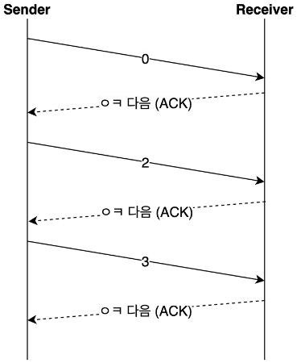
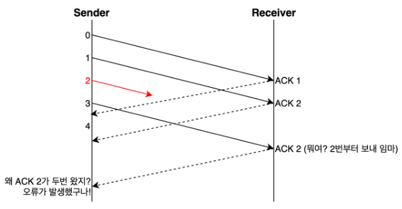

# TCP의 3가지 제어 기능

TCP에는 크게 3가지 제어 기능이 있다.
- 전송되는 데이터의 양을 조절하는 **흐름 제어**  
- 데이터가 유실되거나 잘못된 데이터가 수신되었을 경우 대처 **오류 제어**
- 네트워크 혼잡에 대처하는 **혼잡 제어**

이 기능들 덕분에 예외 상황에 크게 신경쓰지 않고 상위 레이어 동작에 집중 가능

## 흐름 제어
- 송신 측과 수신 측의 데이터 처리 속도가 다를 수 있다.

- 송신 측이 빠를 때 수신 측 버퍼가 넘치는 오버플로우 문제가 발생한다.

- 이러한 문제를 줄이기 위해 윈도우 크기로 송신 측의 데이터 전송량을 조절한다.

>윈도우 크기 : 자신이 처리할 수 있는 데이터의 양

### Stop and Wait
- 상대방에게 데이터를 보낸 후 잘 받았다는 응답이 올 때까지 기다리는 방식

### sliding winodw

송신 측이 수신 측에서 받은 윈도우 크기를 참고해서 데이터의 흐름을 제어하는 방식
- 수신 측이 한 번에 처리할 수 있는 데이터의 양(윈도우 크기)을 3 way handshake할 때 송신 측에 전달한다.  
- 상대방에게 응답을 받지 않아도 범위 내에서 데이터를 보낼 수 있다.
- 패킷의 왕복 시간(RTT)이 크다면 네트워크가 혼잡하다고 생각하여 윈도우 크기를 실제 버퍼의 크기보다 작게 설정한다.
- 통신 과정 중에도 네트워크 혼잡 등의 조건을 통해 윈도우 크기는 유동적으로 설정된다.

## 오류 제어
- TCP는 통신 중에 오류가 발생하면 해당 데이터를 재전송한다.

- 즉, 재전송 기반 오류 제어 ARQ(Automatic Repeat Request)를 사용한다.

- 재전송은 비효율적이므로 적을수록 좋다.

### 오류를 알 수 있는 방법?

- 송신 측이 ACK(긍정응답)을 받지 못함
    - 송신 측이 보낸 데이터가 유실되거나, 수신 측이 보낸 ACK 데이터가 유실될 경우
- 중복된 ACK를 받는다.

- 수신 측이 NACK(부정응답)을 보냄
    - ACK만으로 오류를 추정하기 위해 사용하지 않기도 한다.

