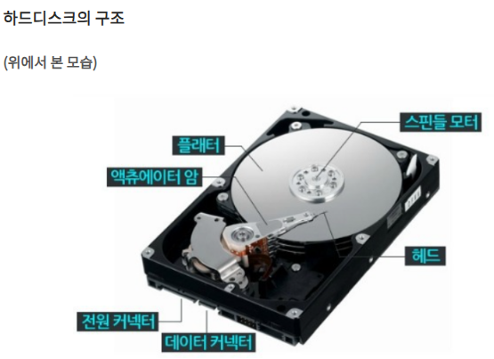
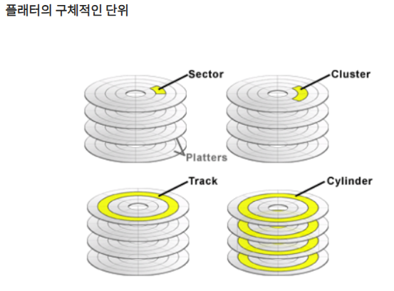
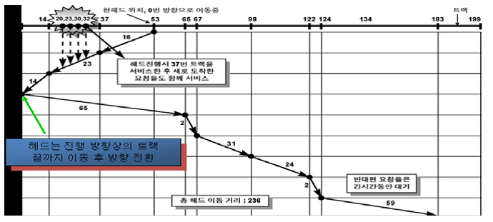
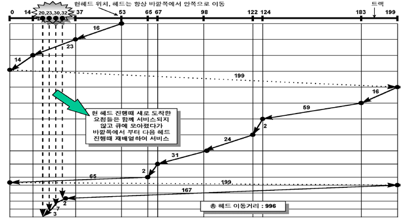
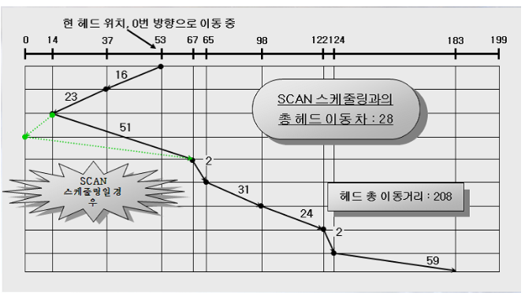
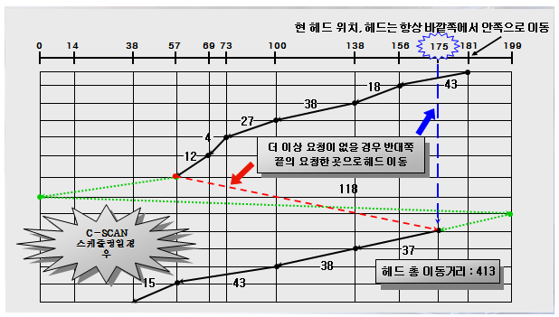

# 입출력 시스템 & 디스크 스케줄링

## 들어가기 전에

### 입출력(I/O)이란
Input/Output의 약자로, 컴퓨터와 외부 장치 간의 데이터 전송을 의미함

### I/O 장치의 종류
- **저장 장치**: HDD, SSD, USB 메모리
- **입력 장치**: 키보드, 마우스, 스캐너
- **출력 장치**: 모니터, 프린터, 스피커
- **네트워크 장치**: 네트워크 카드, 모뎀

---

## 1. I/O 시스템의 필요성

### CPU와 I/O 장치의 속도 차이

```
속도 비교 (상대적):
CPU: 1ns (나노초)
메모리: 100ns
SSD: 100μs (마이크로초) = 100,000ns
HDD: 10ms (밀리초) = 10,000,000ns

→ HDD는 CPU보다 1000만 배 느림
```

### 발생하는 문제
- CPU가 I/O 완료를 기다리면 시간 낭비
- I/O 장치마다 다른 제어 방식 필요
- 동시 다발적인 I/O 요청 관리 필요

### I/O 시스템의 목표
- CPU와 I/O 장치의 속도 차이 극복
- 장치 독립성 제공
- 효율적인 I/O 처리
- 오류 처리 및 복구

---

## 2. I/O 하드웨어 구조

### I/O 장치 구성 요소

#### (1) 기계적 부분 (Device)
실제 I/O 작업을 수행하는 물리적 장치

#### (2) 전자적 부분 (Device Controller)
장치와 컴퓨터를 연결하는 전자 회로

```
구조:
┌─────────┐
│   CPU   │
└────┬────┘
     │ 시스템 버스
┌────┴────────────────────┐
│  ┌──────────────┐       │
│  │   메모리     │       │
│  └──────────────┘       │
│                         │
│  ┌──────────────┐       │
│  │ Controller 1 │───────┼─→ 디스크
│  └──────────────┘       │
│                         │
│  ┌──────────────┐       │
│  │ Controller 2 │───────┼─→ 키보드
│  └──────────────┘       │
└─────────────────────────┘
```

### Device Controller의 구성

**레지스터**
- 명령 레지스터: CPU가 명령 전달
- 상태 레지스터: 장치 상태 정보
- 데이터 레지스터: 데이터 입출력

**로컬 버퍼**
- 데이터를 임시 저장하는 공간
- CPU와 장치 간 속도 차이 완화


**4KB 데이터를 읽는다면:**
```
[레지스터만 사용]
디스크 → 레지스터(8바이트) → 메모리
         512번 반복 필요

[로컬 버퍼 사용]
디스크 → 로컬 버퍼(4KB 한번에) → 메모리
         1번에 처리
```

```
디스크에서 데이터가 조금씩 계속 들어옴
CPU는 다른 일 하다가 나중에 가져감

→ 로컬 버퍼가 중간에서 임시 보관
```
```
HDD: 10ms (매우 느림)
CPU: 1ns (매우 빠름)

→ 로컬 버퍼에 모아뒀다가 한번에 전송
```

---

## 3. HDD (Hard Disk Drive) 구조

### 물리적 구조

```
디스크 구조:
        회전 축
         │
    ┌────┴────┐
    │  플래터  │  ← 자기 원판
    └─────────┘
         │
    ┌────┴────┐
    │  헤드   │  ← 읽기/쓰기 헤드
    └─────────┘
```

#### 주요 구성 요소

**플래터 (Platter)**
- 데이터를 저장하는 자기 원판
- 분당 5400~15000 RPM으로 회전

**헤드 (Head)**
- 데이터를 읽고 쓰는 자기 헤드
- 플래터 표면 위를 이동

**트랙 (Track)**
- 플래터의 동심원
- 각 트랙에 데이터 저장

**섹터 (Sector)**
- 트랙을 나눈 단위
- 보통 512바이트 또는 4KB

**실린더 (Cylinder)**
- 여러 플래터의 같은 위치 트랙들







### 디스크 주소 지정

```
블록 위치 = (실린더, 헤드, 섹터)

예시: (100, 2, 5)
- 실린더 100번
- 헤드 2번
- 섹터 5번
```

---

## 4. 디스크 접근 시간

### 총 접근 시간 구성

```
총 시간 = 탐색 시간 + 회전 지연 시간 + 전송 시간
```

### (1) 탐색 시간 (Seek Time)
헤드가 목표 트랙으로 이동하는 시간

```
헤드 이동:
현재 트랙 10 → 목표 트랙 100
이동 거리: 90 트랙
탐색 시간: 약 5~20ms
```

**가장 시간이 오래 걸리는 부분**

### (2) 회전 지연 시간 (Rotational Latency)
목표 섹터가 헤드 아래로 올 때까지 기다리는 시간

```
7200 RPM 디스크:
- 1회전: 60초 / 7200 = 8.33ms
- 평균 회전 지연: 4.17ms
```

### (3) 전송 시간 (Transfer Time)
실제 데이터를 읽거나 쓰는 시간

```
전송 시간 = 전송량 / 전송 속도

예시:
- 4KB 블록 읽기
- 전송 속도: 100MB/s
- 전송 시간: 0.04ms
```

### 시간 비교

```
일반적인 비율:
탐색 시간: 10ms (가장 큼)
회전 지연: 4ms
전송 시간: 0.04ms (가장 작음)

→ 탐색 시간을 줄이는 것이 핵심
```

## HDD vs SSD 비교표

| 항목 | HDD | SSD |
|------|-----|-----|
| **저장 방식** | 자기(magnetic) | 전기(flash memory) |
| **구동 방식** | 기계적 (회전, 이동) | 전자적 (회로) |
| **탐색 시간** | 5~10ms | 거의 0 (0.1ms 이하) |
| **회전 지연** | 4ms | 없음 |
| **접근 속도** | 느림 (ms 단위) | 빠름 (μs 단위) |
| **순차 읽기** | 유리 | 매우 빠름 |
| **랜덤 읽기** | 불리 (헤드 이동 필요) | 빠름 (위치 무관) |
| **소음** | 있음 (회전, 이동) | 없음 |
| **발열** | 많음 | 적음 |
| **충격** | 약함 (기계 부품) | 강함 |
| **수명** | 기계 마모 | 쓰기 횟수 제한 |
| **용량** | 대용량 (TB) | 상대적으로 적음 |
| **가격** | 저렴 (GB당) | 비쌈 |
| **디스크 스케줄링** | **필요** (탐색 시간 최소화) | **불필요** (접근 시간 동일) |

---

### 핵심 차이

```
HDD: 기계적 → 위치 중요 → 스케줄링 필요
SSD: 전자적 → 위치 무관 → FCFS로 충분
```

> 따라서 디스크 스케줄링 알고리즘은 SSD는 불필요

---


## 5. 디스크 스케줄링 알고리즘

### 스케줄링의 목표
- **탐색 시간 최소화** (가장 중요)
- 응답 시간 개선
- 처리량 최대화
- 공정성 보장

### 디스크 요청 큐 예시
```
현재 헤드 위치: 53
요청 큐: [98, 183, 37, 122, 14, 124, 65, 67]
```

---

### (1) FCFS (First-Come, First-Served)

#### 개념
도착 순서대로 처리

#### 동작
```
헤드 이동 경로:
53 → 98 → 183 → 37 → 122 → 14 → 124 → 65 → 67

총 헤드 이동: 640 트랙
```


#### 장점
- 구현 단순
- 공정함

#### 단점
- 탐색 시간 많이 걸림
- 헤드 이동 거리 최적화 안 됨

---

### (2) SSTF (Shortest Seek Time First)

#### 개념
현재 헤드 위치에서 가장 가까운 요청 먼저 처리

#### 동작
```
헤드 위치: 53
가장 가까운: 65

헤드 이동 경로:
53 → 65 → 67 → 37 → 14 → 98 → 122 → 124 → 183

총 헤드 이동: 236 트랙
```


#### 장점
- 평균 탐색 시간 감소
- FCFS보다 효율적

#### 단점
- **기아 현상 발생 가능**
- 바깥쪽 트랙 요청은 계속 대기

---

### (3) SCAN (엘리베이터 알고리즘)

#### 개념
헤드가 한 방향으로 이동하며 요청 처리, 끝에 도달하면 반대 방향

#### 동작
```
헤드 위치: 53
방향: 오른쪽으로 시작

헤드 이동 경로:
53 → 65 → 67 → 98 → 122 → 124 → 183 → 199(끝)
                                         ↓
                              37 ← 14 ← 0(끝)

총 헤드 이동: 236 트랙
```



#### 특징
- 양방향 왕복 운동
- 디스크 끝까지 이동

#### 장점
- 기아 현상 없음
- 예측 가능한 대기 시간
- 안정적인 성능

#### 단점
- 끝 부분 요청 없어도 끝까지 이동
- 가운데 트랙이 유리함

---

### (4) C-SCAN (Circular SCAN)

#### 개념
한 방향으로만 서비스하고, 끝에 도달하면 처음으로 이동

#### 동작
```
헤드 위치: 53
방향: 오른쪽만 처리

헤드 이동 경로:
53 → 65 → 67 → 98 → 122 → 124 → 183 → 199(끝)
                                         ↓
0(시작) → 14 → 37

총 헤드 이동: 183 트랙 (실제 서비스)
           + 199 트랙 (복귀)
```



#### 장점
- 더 균등한 대기 시간
- SCAN보다 공정함
- 바깥쪽 트랙 불이익 감소

#### 단점
- 복귀 시간 낭비

---

### (5) LOOK & C-LOOK

#### 개념
SCAN/C-SCAN의 개선 - 끝까지 가지 않고 마지막 요청까지만 이동

#### LOOK 동작
```
헤드 위치: 53
방향: 오른쪽

헤드 이동 경로:
53 → 65 → 67 → 98 → 122 → 124 → 183
                                    ↓
                         37 ← 14

마지막 요청까지만 가고 방향 전환
```



#### C-LOOK 동작
```
53 → 65 → 67 → 98 → 122 → 124 → 183
                                    ↓
                         14 → 37

마지막 요청까지만 가고 첫 요청으로 이동
```



#### 장점
- 불필요한 헤드 이동 제거
- SCAN/C-SCAN보다 효율적

---

## 6. 스케줄링 알고리즘 비교

### 성능 비교

| 알고리즘 | 총 헤드 이동 | 최대 대기 | 기아 현상 |
|----------|--------------|-----------|-----------|
| FCFS | 640 | 높음 | 없음 |
| SSTF | 236 | 매우 높음 | 가능 |
| SCAN | 236 | 중간 | 없음 |
| C-SCAN | 382 | 낮음 | 없음 |
| LOOK | 208 | 중간 | 없음 |
| C-LOOK | 322 | 낮음 | 없음 |

### 선택 기준

**FCFS**
- 간단한 시스템
- I/O 요청 적은 경우

**SSTF**
- 성능이 최우선
- 기아 현상 문제없는 환경

**SCAN/LOOK**
- 범용적 사용
- 안정성과 성능 균형
- **가장 많이 사용됨**

**C-SCAN/C-LOOK**
- 공정성이 중요한 경우
- 실시간 시스템

---
