## 목 차

## Cookie & Session
- HTTP
- 쿠키
- 세션

## Django Authentication System

## Custom User model
- User model 대체하기

## Login
ls
## Template with Authentication data

## 참고
- 쿠키의 수명
- 쿠키와 보안
- **Django**에서의 세션 관리
- **AuthenticationForm** 내부 코드
- **User 모델** 대체하기 **Tip**

------------------

# Cookie & Session
# HTTP

## HTTP (HyperText Transfer Protocol)

- **HTML** 문서와 같은 리소스들을 가져올 수 있도록 해주는 규약 (**웹**에서의 모든 데이터 교환의 기초)
- **HTTP**는 웹 브라우저와 서버가 서로 대화하기 위해 사용하는 공통 언어 또는 **약속**
- 브라우저가 '이 페이지 보여줘'라고 요청(**Request**)을 보내면, 서버는 그에 맞는 **HTML**, 이미지 등을 응답(**Response**)으로 보내주는 방식으로 동작
- 우리가 웹사이트를 보고, 이미지를 다운로드하고, 데이터를 주고받는 모든 과정이 바로 이 **HTTP**라는 규칙 위에서 이루어짐


## HTTP 특징

1.  **비 연결 지향 (connectionless)**
    - 서버는 요청에 대한 응답을 보낸 후 연결을 끊음
    - 클라이언트가 서버와 서로 연결되어 있는 상태가 아님

### TIP
- **HTTP**가 비 연결 지향으로 설계된 이유
    - 서버가 문서를 다 읽을 때까지 모든 사용자와의 연결을 계속 유지해야 한다면, 수많은 연결이 서버의 메모리와 자원을 차지하게 됨
    - 이러한 자원 낭비를 막기 위해 **HTTP**는 다음과 같은 **비 연결(Connectionless)** 방식을 채택


1.  **무상태 (stateless)**
    - 연결을 끊는 순간 클라이언트와 서버 간의 통신이 끝나며 상태 정보가 유지되지 않음
    - 무상태의 의미
        - 장바구니에 담은 상품을 유지할 수 없음
        - 로그인 상태를 유지할 수 없음

### TIP
- **HTTP**가 **무상태(Stateless)**로 설계된 이유
    - 서버가 모든 클라이언트 상태를 기억하고 저장한다고 가정하면, 관리해야 하므로 매우 복잡
    - 더 큰 문제는 여러 대의 서버를 운영할 때, 클라이언트 상태를 공유하기 위해서 서로 다른 서버가 연결되어야 하는 문제로 인해 확장성이 저하
    - 결국 무상태는 서버의 부담을 없애고 어떤 서버든 자유롭게 요청을 처리할 수 있게 만들어, **대규모 웹 서비스**를 구축하는 데 핵심적인 역할을 함

<br>
<br>
<br>


----------------------------


## 쿠키 (Cookie)
- 서버가 사용자의 웹 브라우저에 전송하는 작은 데이터 조각
    - 쿠키는 웹사이트가 사용자의 브라우저에 남기는 작은 '**데이터 조각**'
    - 이를 통해 서버는 '**나는 이전에 이 사이트에 방문 했었고, 로그인도 했어**'와 같이 사용자를 기억하고 식별 가능
    - 덕분에 매번 **ID**와 비밀번호를 다시 입력할 필요 없이 **자동 로그인**이 유지되거나, **장바구니**에 담은 상품이 저장되는 것

<br>


## 쿠키 특징
- 서버가 사용자의 웹 브라우저에 전송하는 작은 데이터 조각
- 사용자 **인증, 추적, 상태 유지** 등에 사용되는 데이터 저장 방식
- **key-value** 형식의 데이터

<br>


## 쿠키 사용 예시
- 로그인 유지 (세션 관리)
- 장바구니
- 언어, 테마 등 사용자 설정 기억

<br>
<br>


## 쿠키 동작 예시 (1/2)
1.  브라우저가 웹 서버에 웹 페이지를 요청
2.  웹 서버는 요청된 페이지와 함께 **쿠키를 포함한 응답**을 브라우저에게 전송
3.  브라우저는 받은 쿠키를 저장소에 저장하고, 쿠키의 속성 (**만료 시간, 도메인, 주소** 등)도 함께 저장됨


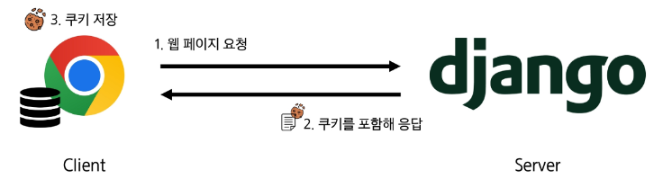


## 쿠키 동작 예시 (2/2)
4.  이후 브라우저가 같은 웹 서버에 웹 페이지를 요청할 때, 저장된 쿠키 중 해당 요청에 적용 가능한 **쿠키를 포함**하여 함께 전송
5.  웹 서버는 받은 쿠키 정보를 확인하고, 필요에 따라 **사용자 식별, 세션 관리** 등을 수행
6.  웹 서버는 요청에 대한 응답을 보내며, 필요한 경우 **새로운 쿠키를 설정**하거나 **기존 쿠키를 수정** 가능

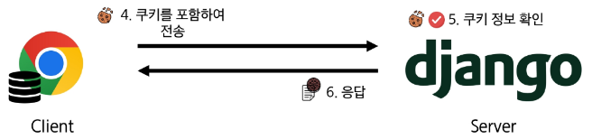

<br>
<br>


## 쿠키를 이용한 장바구니 예시
1.  장바구니에 상품 담기

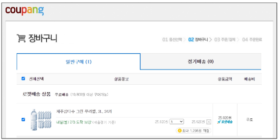


2.  서버는 응답과 함께 **Set-Cookie 응답 헤더**를 브라우저에게 전송
    - 개발자 도구 - **Network 탭** - `cartview.pang` 확인
    - 이 헤더는 클라이언트에게 **쿠키를 저장**하라고 전달하는 것

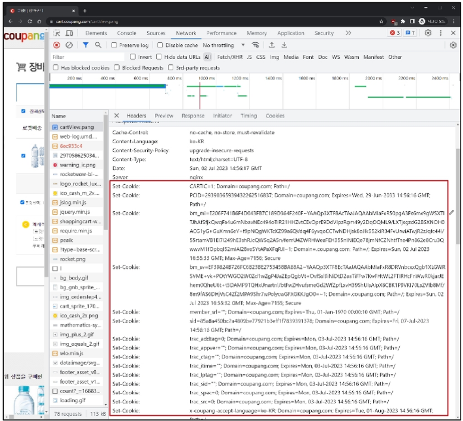


3.  **Cookie 데이터** 자세히 확인
    - **key - value** 형식의 데이터
    - 단순히 값만 저장하는 것이 아니라, 여러 **속성을 제어**할 수 있음
    - 하나의 웹사이트에서 많은 수의 쿠키를 동시에 사용
    - **Request Cookies & Response Cookies 탭**을 보면 쿠키의 **양방향 통신** 특징을 볼 수 있음

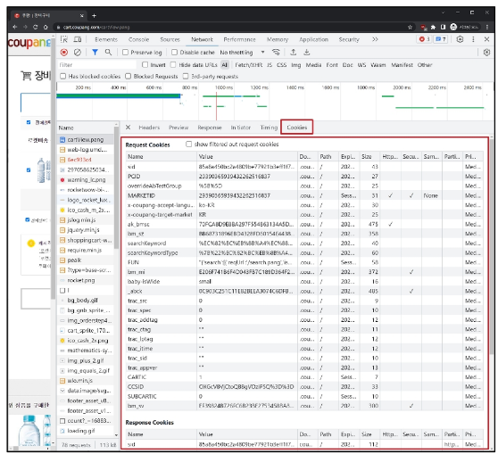

4. 메인 페이지 이동 - 장바구니 유지 상태 확인

5. 개발자 도구 - Application 탭 - Cookies
    - 마우스 우측 버튼 - Clear - 새로고침 - 장바구니가 빈 것을 확인

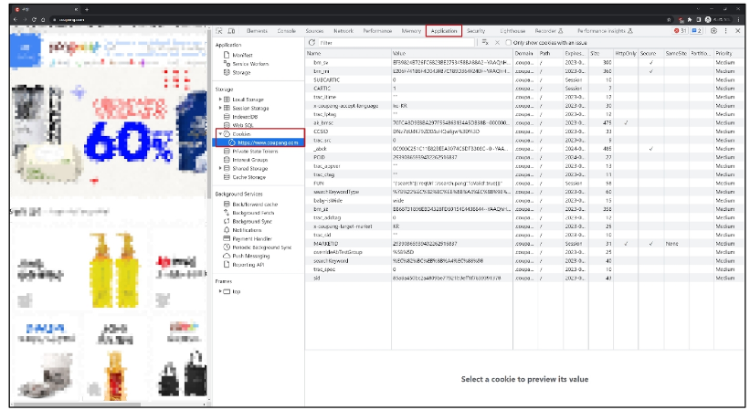


## 쿠키의 작동 원리와 활용 (1/2)

1.  **쿠키 저장 방식**
    - 브라우저(클라이언트)는 쿠키를 **KEY-VALUE**의 데이터 형식으로 저장
    - 쿠키에는 이름, 값 외에도 **만료 시간, 도메인, 경로** 등의 추가 속성이 포함됨

2.  **쿠키 전송 과정**
    - 서버는 **HTTP 응답 헤더**의 **Set-Cookie** 필드를 통해 클라이언트에게 쿠키를 전송
    - 브라우저는 받은 쿠키를 저장해 두었다가, 동일한 서버에 재요청 시 **HTTP 요청 Header**의 **Cookie** 필드에 저장된 쿠키를 함께 전송


3.  **쿠키의 주요 용도**
    - 두 요청이 **동일한 브라우저**에서 들어왔는지 아닌지를 판단할 때 주로 사용됨
    - 이를 이용해 사용자의 **로그인 상태를 유지** 가능
    - **상태가 없는(stateless) HTTP 프로토콜**에서 **상태 정보**를 기억시켜 주는 역할
    - $\triangleright$ 서버에게 "**나 로그인 된(인증된) 사용자야!**"라는 인증 정보가 담긴 쿠키를 매 요청마다 계속 보내는 것

<br>
<br>


## 쿠키 사용 목적

1.  **세션 관리 (Session management)**
    - 로그인, 아이디 자동완성, 공지 하루 안 보기, 팝업 체크, 장바구니 등의 정보 관리

2.  **개인화 (Personalization)**
    - 사용자 선호 설정 (언어 설정, 테마 등) 저장

3.  **추적, 수집 (Tracking)**
    - 사용자 행동을 기록 및 분석

### TIP
- 쿠키는 탈취될 수 있으니, 비밀번호 등 **민감한 정보는 절대 직접 저장하면 안** 됨  
- 쿠키는 모든 요청에 포함되어 전송되므로, **크기를 최소화**해야 사이트 성능에 유리  

  
<br>
<br>


<br>
<br>

--------------------------------
## 세션 (session)
- **서버 쪽에서 생성**되어 클라이언트와 서버 간의 **상태를 유지**, 상태 정보를 저장하는 데이터 저장 방식
    - 세션은 **로그인 정보**와 같은 중요 데이터를 클라이언트가 아닌 **서버 쪽**에 저장하고 유지하는 기술
    - 서버는 각 사용자를 구분하기 위해 고유한 **'세션 ID'**를 발급하고, 이 **ID**만 **쿠키**에 담아 클라이언트에게 보내 사용자를 식별
    - 실제 데이터는 서버에만 보관되므로 쿠키만 사용하는 방식보다 훨씬 **보안에 유리**하며, 사용자의 **로그인 상태를 안전하게 유지**하는 데 주로 사용


## 세션 작동 원리 (1/2)
1.  클라이언트가 로그인 요청 후 인증에 성공하면 서버가 **session 데이터**를 생성 후 저장
2.  생성된 **session 데이터**에 인증할 수 있는 **session id**를 발급
3.  발급한 **session id**를 클라이언트에게 응답 (데이터는 서버에 저장, **열쇠**만 주는 것)
4.  클라이언트는 응답 받은 **session id**를 **쿠키**에 저장
   
<br>


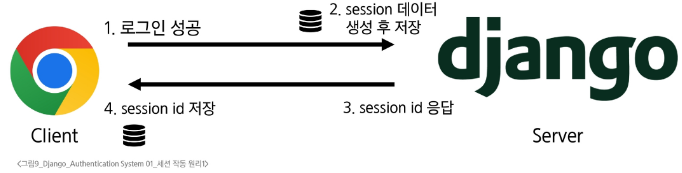


## 세션 작동 원리 (2/2)
5.  클라이언트가 다시 동일한 서버에 접속하면 요청과 함께 **쿠키(session id가 저장된)**를 서버에 전달
6.  쿠키는 요청 때마다 서버에 함께 전송되므로 서버에서 **session id**를 확인해 **로그인** 되어 있다는 것을 계속해서 확인하도록 함
7.  사용자의 요청을 처리하고 응답

<br>


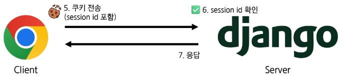


## 세션 특징
- **서버 쪽에서 생성**되어 클라이언트와 서버 간의 상태를 유지
    - 서버의 메모리나 데이터베이스에 저장되므로, 서버 리소스를 사용 (효율적 관리 필요)
- 상태 정보를 저장하는 데이터 저장 방식
- **쿠키**에 **세션 데이터**를 저장하여 매 요청시마다 세션 데이터를 함께 보냄
- 세션은 영구적으로 유지되지 않음
    - **중요한 데이터**를 저장하므로 **보안**을 신경써야 함
    - 공격자가 **세션 ID**를 탈취하면, 해당 사용자인 것처럼 위장하여 서버에 접근이 가능하므로 유의


## 세션 정리

1.  **서버 쪽에서는 세션 데이터를 생성 후 저장**하고, 이 데이터에 접근할 수 있는 **세션 ID를 생성**
2.  **이 ID를 클라이언트 쪽으로 전달**하고, **클라이언트는 쿠키에 이 ID를 저장**
3.  **이후 클라이언트가 같은 서버에 재요청 시마다 저장해 두었던 쿠키도 요청과 함께 전송**
    - 로그인 상태 유지를 위해 **로그인 되어 있다는 사실을 입증하는 데이터**를 매 요청마다 계속해서 보내는 것

<br>

## 쿠키와 세션의 목적
- **클라이언트와 서버 간의 상태 정보**를 유지하고 **사용자를 식별**하기 위해 사용

<br>
<br>

-----------------------------

# Django Authentication System

## 인증의 필요성
- 클라이언트와 서버 간의 상태 정보를 유지하기 위해서 **쿠키**와 **세션**을 사용
- 클라이언트와 서버는 각기 다른 사용자를 식별해야 하는 상태
- 그래서 사용자를 식별하기 위해서 필요한 과정이 바로 '**인증(Authentication)**'
- 다양한 인증이 존재
    - 아이디와 비밀번호
    - 소셜 로그인 (**OAuth**)
    - 생체 인증
- $\triangleright$ **Django**에서는 사용자 인증과 관련된 가장 중요하고 기본적인 뼈대를 제공 (**Django Authentication System**)


## Django Authentication System
- **Django**에서 사용자 인증과 관련된 기능을 모아 놓은 시스템
- 인증에 중요한 기본적인 기능을 제공
    - **User Model**: 사용자 인증 후 연결될 **User Model** 관리
    - **Session 관리**: 로그인 상태를 유지하고 서버에 저장하는 방식을 관리
    - **기본 인증(Id/Password)**: **로그인/로그아웃** 등 다양한 기능을 제공
- $\triangleright$ **Django Authentication System**을 활용하여 **로그인/로그아웃/회원가입/회원정보수정** 등 다양한 기능을 구현해보자!


## 내장된 auth 앱

  - 기본적으로 **username, password, email** 등의 필드를 가진 **User 모델**을 제공
  - 단순히 로그인 여부만 확인하는 것을 넘어, **사용자별** 또는 **그룹별**로 특정 행동에 대한 **권한 부여**가 가능

<!-- end list -->

```python
# settings.py
INSTALLED_APPS = [
    'django.contrib.admin',
    'django.contrib.auth',
    'django.contrib.contenttypes',
    'django.contrib.sessions',
    'django.contrib.messages',
    'django.contrib.staticfiles',
]
```


## User Model 대체의 필요성
- 프로젝트의 특정 요구사항에 맞춰 사용자 모델을 **확장** 가능
- 예를 들어
    - **이메일**을 **username**으로 사용하거나, 다른 **추가 필드**를 포함시킬 수 있음
    - 기본 **User 모델**의 **first\_name, last\_name**처럼 우리 프로젝트에 필요 없는 필드를 제거하여 데이터베이스 모델을 더 **간결하게 관리** 가능
- $\triangleright$ **Django**에서 제공하는 기본 유저 모델이 아닌 우리가 직접 **커스텀한 유저 모델**을 사용해보자!


<br>
<br>


---------
# Custom User model
## User model 대체하기


## 사전 준비

  - 두 번째 **app accounts** 생성 및 등록
      - **auth**와 관련된 경로나 키워드들을 **django** 내부적으로 **accounts**라는 이름으로 사용하고 있기 때문에 되도록 '**accounts**'로 지정하는 것을 **권장**

### accounts/urls.py

```python
# accounts/urls.py

from django.urls import path
from . import views

app_name = 'accounts'
urlpatterns = [
]
```

### crud/urls.py

```python
# crud/urls.py

urlpatterns = [
    . . . ,
    path('accounts/', include('accounts.urls')),
]
```


## Custom User Model로 대체하기 (1/3)

  - **AbstractUser 클래스**를 상속받는 커스텀 **User 클래스** 작성
  - $\triangleright$ 기존 **User 클래스**도 **AbstractUser**를 상속받기 때문에 커스텀 **User 클래스**도 기존 **User 클래스**와 **완전히 같은 모습**을 가지게 됨

<!-- end list -->

```python
# accounts/models.py

from django.contrib.auth.models import AbstractUser


class User(AbstractUser):
    pass
```


## Custom User Model로 대체하기 (2/3)

  - **django** 프로젝트에서 사용하는 기본 **User 모델**을 우리가 작성한 **User 모델**로 사용할 수 있도록 `AUTH_USER_MODEL` 값을 변경
      - 수정 전 기본 값은 `'auth.User'`
  - **accounts 앱**에 작성한 **User 모델**을 기본 모델로 설정

### accounts/models.py

```python
# accounts/models.py

from django.contrib.auth.models import AbstractUser


class User(AbstractUser):
    pass
```

### settings.py

```python
# settings.py

AUTH_USER_MODEL = 'accounts.User'
```


## Custom User Model로 대체하기 (3/3)

  - **admin site**에 대체한 **User 모델** 등록
      - 기본 **User 모델**이 아니기 때문에 등록하지 않으면 **admin** 페이지에 출력되지 않기 때문

<!-- end list -->

```python
# accounts/admin.py

from django.contrib import admin
from django.contrib.auth.admin import UserAdmin
from .models import User

admin.site.register(User, UserAdmin)
```
<br>
<br>


## AUTH\_USER\_MODEL
- **Django 프로젝트**의 **User**를 나타내는 데 사용하는 모델을 지정하는 속성

### ※ 주의 ※
- **Django**는 프로젝트 중간에 **AUTH\_USER\_MODEL**을 변경하는 것을 **강력하게 권장하지 않**음
- 이미 프로젝트가 진행되고 있을 경우 **데이터베이스 초기화 후 진행**


## 사용하는 User 테이블의 변화
- **accounts**에 만든 커스텀 유저 모델이 데이터베이스에 반영됨

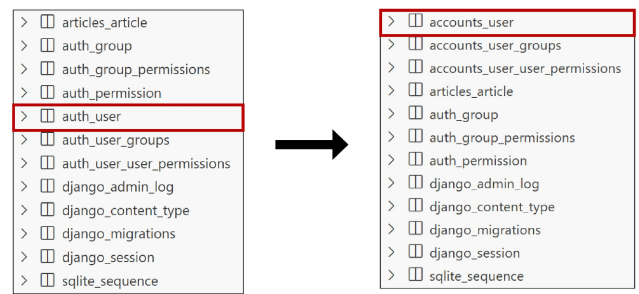


## 프로젝트를 시작하며 반드시 User 모델을 대체해야 함
- **Django**는 새 프로젝트를 시작하는 경우 비록 기본 **User 모델**이 충분하더라도 **커스텀 User 모델**을 설정하는 것을 **강력하게 권장**하고 있음
- 커스텀 **User 모델**은 기본 **User 모델**과 **동일하게 작동(1)** 하면서도 나중에 **맞춤 설정(2)** 할 수 있음
    - ※ 단, **User 모델** 대체 작업은 프로젝트의 모든 **migrations** 혹은 **첫 migrate**를 실행하기 전에 이 작업을 마쳐야 함

### TIP
- 지금 당장 필요 없어도 만드세요. 나중에 닉네임 등 필드를 추가하기가 매우 쉬워집니다.
- 모델 생성 후, `settings.py`의 **AUTH\_USER\_MODEL**을 설정해야만 **Django**가 이 모델을 사용합니다.


<br>
<br>

-----------------
# Login

## Login
- 클라이언트와 서버 간의 상태 정보를 유지하기 위해서 **쿠키**와 **세션**을 사용
- 클라이언트와 서버는 각기 다른 사용자를 식별해야 하는 상태
- 서버에 "**나**"임을 인증하는 과정이 바로 "**Login**"
- $\Rightarrow$ 결국 **Login**은 **인증(id/password)**을 완료하고, **Session**을 만들고 **클라이언트와 연결**하는 것

| 단계 | 설명 |
| :--- | :--- |
| 1. 로그인 (id/password) | (사용자가 ID/PW 입력) |
| 2. 로그인 인증 | (서버가 인증 확인) |
| 3. 세션 생성 후 서버 저장 | (인증 후 서버에 세션 데이터 생성 및 저장) |
| 4. 클라이언트에 쿠키 전달 | (세션 ID가 담긴 쿠키를 클라이언트에 전송) |


## 로그인 페이지 작성 (1/4)

  - 로그인 경로 **url** 생성

<!-- end list -->

```python
# accounts/urls.py

app_name = 'accounts'
urlpatterns = [
    path('login/', views.login, name='login'),
]
```


## 로그인 페이지 작성 (2/4)

  - `.../accounts/login/` **url**로 요청이 들어왔을 때 실행할 **login** 함수 작성
  - 로그인 인증에 사용할 데이터를 입력 받는 **built-in form** (**AuthenticationForm**) 사용

<!-- end list -->

```python
# accounts/views.py

from django.contrib.auth.forms import AuthenticationForm


def login(request):
    if request.method == 'POST':
        pass
    else:
        form = AuthenticationForm()
    context = {
        'form': form,
    }
    return render(request, 'accounts/login.html', context)
```


## AuthenticationForm()
- 로그인 인증에 사용할 데이터를 입력 받는 **built-in form**
- **User 모델**과 직접 연결된 "**ModelForm**"이 아닌, 일반 "**Form**"을 상속 받음
    - 일반 "**Form**"이기 때문에 사용자를 생성하거나 수정하는 용도가 아닌 "**인증**"하는 역할만 수행


## 로그인 페이지 작성 (3/4)

  - 로그인 정보를 서버에 안전하게 전송하기 위해 "**POST 방식**"을 사용
  - **CSRF 공격**을 방지하기 위해 `csrf_token` 작성
  - 서버로부터 전달받은 **AuthenticationForm**을 화면에 출력

<!-- end list -->

```html
<h1>로그인</h1>
<form action="" method="POST">
  
  {{ form }}
  <input type="submit">
</form>
```


## 로그인 페이지 작성 (4/4)

  - 사용자가 입력한 로그인 정보를 입력받는 로직을 **“POST” 조건문**에 작성
  - 입력 받은 정보를 기반으로 로그인하여 세션을 만드는 \*\*“login 함수”\*\*를 활용

<!-- end list -->

```python
# accounts/views.py

from django.shortcuts import render, redirect
from django.contrib.auth import login as auth_login

def login(request):
    if request.method == 'POST':
        form = AuthenticationForm(request, request.POST)
        # form = AuthenticationForm(request, data=request.POST)  # 주석 처리된 코드
        if form.is_valid():
            auth_login(request, form.get_user())
            return redirect('articles:index')
    else:
        form = AuthenticationForm()
    context = {
        'form': form,
    }
    return render(request, 'accounts/login.html', context)
```


## login(request, user)

  - **AuthenticationForm**을 통해 인증된 사용자를 로그인하는 함수

### request

  - 현재 사용자의 세션 정보에 접근하기 위해 사용

### user

  - 어떤 사용자가 로그인되었는지를 기록하기 위해 사용

## get\_user()

  - **AuthenticationForm**의 인스턴스 메서드
  - $\triangleright$ 유효성 검사를 통과했을 경우, **로그인**한 사용자 객체를 반환

<!-- end list -->

```python
# accounts/views.py

from django.shortcuts import render, redirect
from django.contrib.auth import login as auth_login


def login(request):
    if request.method == 'POST':
        form = AuthenticationForm(request, request.POST)
        # form = AuthenticationForm(request, data=request.POST)
        if form.is_valid():
            auth_login(request, form.get_user())
            return redirect('articles:index')
    else:
        form = AuthenticationForm()
    context = {
        'form': form,
    }
    return render(request, 'accounts/login.html', context)
```

## 세션 데이터 확인하기 (1/2)
1.  로그인 후 발급받은 세션 확인
    - `django_session` 테이블에서 확인

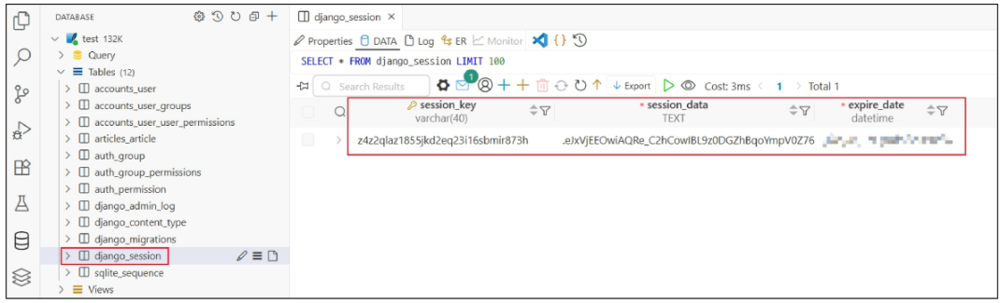

## 세션 데이터 확인하기 (2/2)
2.  브라우저에서 확인
    - 개발자도구 - **Application** - **Cookies**

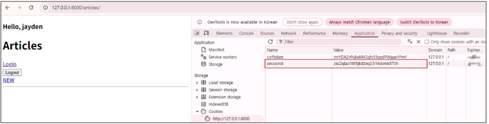


## 로그인 링크 작성

  - 메인 페이지에 로그인 페이지로 갈 수 있는 링크 작성

<!-- end list -->

```html
<h1>Articles</h1>
<a href="">Login</a>
<a href="">NEW</a>
<hr>
```


<br>
<br>

-----------

# Template with Authentication data

## Template with Authentication data

  - 템플릿에서 인증 관련 데이터를 출력하는 방법

## 현재 로그인 되어있는 유저 정보 출력하기

  - **user**라는 **context** 데이터를 사용할 수 있는 이유는?
  - $\triangleright$ **django**가 미리 준비한 **context 데이터**가 존재하기 때문 (**context processors**)

<!-- end list -->

```html
<h3>Hello, {{ user.username }}</h3>
```


## context processors

  - 템플릿이 렌더링 될 때 호출 가능한 컨텍스트 데이터 목록
  - 작성된 컨텍스트 데이터는 기본적으로 템플릿에서 사용 가능한 변수로 포함됨
  - **django**에서 자주 사용하는 데이터 목록을 미리 템플릿에 로드 해 둔 것

<!-- end list -->

```python
# settings.py
TEMPLATES = [
    {
        ...,
        "OPTIONS": {
            "context_processors": [
                "django.template.context_processors.debug",
                "django.template.context_processors.request",
                "django.contrib.auth.context_processors.auth",
                "django.contrib.messages.context_processors.messages",
            ],
        },
    },
]
```

<br>
<br>

-------------------
# 참고
## 쿠키의 수명

## 쿠키 종류별 Lifetime (수명)

1.  **Session cookie**
    - 현재 세션 (**current session**)이 종료되면 삭제됨
    - 브라우저 종료와 함께 세션이 삭제됨

2.  **Persistent cookies**
    - **Expires 속성**에 지정된 날짜 혹은 **Max-Age 속성**에 지정된 기간이 지나면 삭제됨

<br>

-----------
## 쿠키와 보안

## 쿠키의 보안 장치

1.  **제한된 정보**
    - 쿠키에는 보통 **중요하지 않은 정보**만 저장. (사용자 **ID**나 세션 번호 같은 것)

2.  **암호화**
    - 중요한 정보는 서버에서 **암호화**해서 쿠키에 저장

3.  **만료 시간**
    - 쿠키에는 **만료 시간**을 설정, 시간이 지나면 자동으로 삭제

4.  **도메인 제한**
    - 쿠키는 **특정 웹사이트**에서만 사용할 수 있도록 설정 가능


## 쿠키와 개인정보 보호
- 많은 국가에서 **쿠키 사용에 대한 사용자 동의**를 요구하는 법규를 시행
- 웹사이트는 **쿠키 정책**을 명시하고, 필요한 경우 사용자의 **동의**를 얻어야 함


## Django에서의 세션 관리
## 세션 in Django
- **Django**는 '**database-backed sessions**' 저장 방식을 기본 값으로 사용
- **session** 정보는 **DB**의 **django\_session 테이블**에 저장
- **Django**는 요청 안에 특정 **session id**를 포함하는 **쿠키**를 사용해서 각각의 브라우저와 사이트가 연결된 **session 데이터**를 알아냄
- $\triangleright$ **Django**는 우리가 세션 메커니즘 (복잡한 동작원리)에 대부분을 생각하지 않게끔 많은 도움을 줌


<br>

----------------


## 핵심 키워드

| 개념 | 설명 | 예시 |
| :--- | :--- | :--- |
| **HTTP** | 웹 리소스를 가져오는 규약 | 요청(**Request**)과 응답(**Response**) |
| **쿠키 (Cookie)** | 브라우저에 저장하는 데이터 조각 | 장바구니, 자동 로그인 유지 |
| **세션 (Session)** | 서버에 저장 및 관리되는 데이터 | 서버가 발급한 **세션 ID**를 **쿠키**에 저장 |
| **Django 인증** | 사용자 인증 관련 기능 모음 | `django.contrib.auth` |
| **커스텀 유저 모델** | 기본 **User 모델**을 대체하는 모델 | **AbstractUser** 상속받아 작성 |
| **AUTH\_USER\_MODEL** | 사용할 **User 모델**을 지정하는 속성 | `AUTH_USER_MODEL = 'accounts.User'` |
| **AuthenticationForm** | 로그인 인증 데이터를 받는 **Form** | `form = AuthenticationForm()` |


------------

## 요약 및 정리

## HTTP (HyperText Transfer Protocol)
- **HTTP**는 웹 브라우저와 서버가 데이터를 주고받기 위해 사용하는 규약
- 이 프로토콜은 두 가지 중요한 특징을 가짐
    - **비연결 지향 (Connectionless)**
        - 서버는 클라이언트의 요청에 응답한 후 연결을 끊음
        - 이는 수많은 사용자와의 연결을 계속 유지할 때 발생하는 서버 자원 낭비를 막기 위함
    - **무상태 (Stateless)**
        - 연결이 끊어지면 서버는 클라이언트의 이전 상태 정보를 저장하지 않음. 이 때문에 **로그인 상태**나 **장바구니 정보**가 유지되지 않는 문제가 발생

<br>

## 쿠키 (Cookie)
- 쿠키는 서버가 사용자의 웹 브라우저에 보내는 작은 데이터 조각으로, **key-value 형식**으로 저장
- 이를 통해 서버는 사용자를 식별하고 **로그인 유지, 장바구니, 사용자 설정 기억** 등의 상태를 유지 가능
- 동작 방식
    1.  서버는 응답 시 **Set-Cookie 헤더**를 통해 쿠키를 브라우저에 보냄
    2.  브라우저는 이 쿠키를 저장했다가, 같은 서버에 다시 요청할 때마다 저장된 쿠키를 함께 전송
    3.  서버는 쿠키 정보를 확인하여 사용자 식별
   
<br>

## 세션 (Session)
- 세션은 **로그인 정보**와 같은 **중요한 데이터**를 클라이언트가 아닌 **서버 쪽**에 저장하는 기술
- 실제 데이터는 서버에 보관되므로 쿠키만 사용하는 방식보다 **보안에 유리**
- 동작 방식
    1.  사용자가 로그인에 성공하면 서버는 세션 데이터를 생성하고 고유한 **session id**를 발급
    2.  서버는 이 **session id**만 쿠키에 담아 클라이언트에게 보냄
    3.  클라이언트는 이후 요청마다 **session id**가 담긴 **쿠키**를 서버로 전송하여 인증 상태를 유지

<br>

## Django 인증 시스템
- **Django**의 인증 시스템은 사용자 인증과 관련된 **핵심 기능**을 제공
- 하지만 기본으로 제공되는 **User 모델**은 필드가 제한적이고, **생년월일**이나 **주소** 같은 추가 정보를 다루기 어려움
- **Custom User Model**
    - 프로젝트 시작 단계에서 **Django**의 기본 **User 모델**을 **직접 만든 모델**로 대체하는 것이 **강력하게 권장**
    - 나중에 필드를 추가하는 등 **유연하게 확장** 가능


<br>


## 로그인 기능 구현
- 로그인은 사용자가 자신임을 서버에 **인증**하고, 서버가 **세션**을 만들어 클라이언트와 **연결**하는 과정
- 구현 절차
    1.  로그인 데이터를 입력받기 위해 **Django**에 내장된 **AuthenticationForm**을 사용함 (이 폼은 모델과 직접 연결되지 않고 오직 "**인증**" 역할만 수행함)
    2.  사용자가 정보를 제출하면(**POST**), 폼의 **유효성**을 검사함
    3.  유효하다면 `auth_login` 함수를 호출하여 사용자를 로그인시키고, **세션 데이터**를 생성하여 `django_session` 테이블에 저장함
    4.  이때 발급된 **sessionid**는 브라우저의 **쿠키**에 저장되어 사용자의 **로그인 상태를 유지**하는 데 사용됨
1.  


## 확인 문제

**1. HTTP의 특징이 아닌 것을 고르시오.**
a) 상태 유지 (Stateful)
b) 무상태 (Stateless)
c) 웹 데이터 교환의 기초
d) 비연결 지향 (Connectionless)

---

**2. 서버가 브라우저에 보내는 작은 데이터 조각은?**
a) 캐시 (Cache)
b) 쿠키 (Cookie)
c) 세션 (Session)
d) 프로토콜 (Protocol)

---

**3. 쿠키의 주된 사용 목적이 아닌 것은?**
a) 세션 관리
b) 사용자 개인화
c) 사용자 행동 추적
d) 데이터베이스 역할

---

**4. 서버 측에서 사용자 상태를 저장하는 기술은?**
a) 캐시 (Cache)
b) 쿠키 (Cookie)
c) 세션 (Session)
d) 로컬 스토리지

**5. 세션 ID는 어디에 저장되어 전달되는가?**
a) URL 파라미터
b) 서버 데이터베이스
c) 쿠키
d) 자바스크립트 변수

---

**6. Django의 기본 User 모델에 없는 필드는?**
a) password
b) phone\_number
c) username
d) email

---

**7. 커스텀 User 모델 설정은 언제 해야 하는가?**
a) 프로젝트 중간
b) 기능 개발 완료 후
c) 데이터베이스 마이그레이션 후
d) 프로젝트 시작 시

---

**8. Django에서 사용자 인증에 사용되는 폼은?**
a) CustomForm
b) AuthenticationForm
c) ModelForm
d) UserCreationForm


**9. 로그인 성공 후 세션을 생성하는 함수는?**
a) start\_session()
b) authenticate()
c) login()
d) session\_create()

---

**10. 커스텀 User 모델을 지정하는 설정 항목은?**
a) USER\_MODEL\_AUTH
b) DJANGO\_USER\_MODEL
c) CUSTOM\_USER\_MODEL
d) AUTH\_USER\_MODEL

---

**11. HTTP의 '무상태(stateless)'란?**
a) 이전 요청 정보를 유지하지 않음
b) 서버가 클라이언트 정보를 기억함
c) 연결을 계속 유지함
d) 모든 요청은 다르게 처리됨

---

**12. 쿠키와 세션의 공통적인 목적은?**
a) 서버 부하 감소
b) 데이터 영구 저장
c) 빠른 데이터 전송
d) 상태 정보 유지 및 사용자 식별


## 정답 및 해설

---

**1. a) 상태 유지 (Stateful)** 2. **b) 쿠키 (Cookie)** 3. **d) 데이터베이스 역할** 4. **c) 세션 (Session)** 5. **c) 쿠키** 6. **b) phone\_number** 7. **d) 프로젝트 시작 시** 8. **b) AuthenticationForm** 9. **c) login()** 10. **d) AUTH\_USER\_MODEL** 11. **a) 이전 요청 정보를 유지하지 않음** 12. **d) 상태 정보 유지 및 사용자 식별**

---

1.  **HTTP**는 상태를 유지하지 않는 **무상태(Stateless)** 프로토콜입니다.
2.  **쿠키**는 서버가 사용자의 웹 브라우저에 전송하는 작은 **데이터 조각**입니다.
3.  쿠키는 간단한 데이터를 저장하며, **데이터베이스를 대체할 수 없습니다**.
4.  **세션**은 **서버 측**에서 클라이언트와의 상태를 유지하고 정보를 저장합니다.
5.  서버가 발급한 **세션 ID**는 **쿠키**에 저장되어 클라이언트와 서버 간에 전달됩니다.
6.  **전화번호**와 같은 추가 정보는 기본 User 모델에 없어 커스텀이 필요합니다.
7.  Django는 **프로젝트 시작 시** 커스텀 User 모델 설정을 강력히 권장합니다.
8.  **AuthenticationForm**은 사용자 로그인(인증)을 위해 사용되는 내장 폼입니다.
9.  `auth` 모듈의 **`login()`** 함수가 인증된 사용자의 **세션을 생성**하고 로그인 처리합니다.
10. **`settings.py`** 파일에서 **`AUTH_USER_MODEL`**에 커스텀 모델 경로를 지정합니다.
11. 연결이 끊어지면 통신이 끝나, **이전 요청의 상태 정보가 유지되지 않음**을 의미합니다.
12. 두 기술 모두 **상태가 없는 HTTP**에서 **상태를 유지하고 사용자를 구분**하기 위해 사용됩니다.

