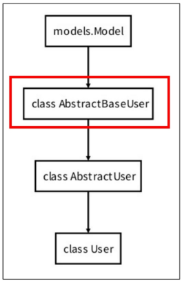

# 목차

## [지난 시간] Login  

## Logout  

## AbstractUser class  

## 회원 가입  

## 회원 탈퇴

## 인증된 사용자에 대한 접근 제한
- is_authenticated 속성
- login_required 데코레이터

## 참고
- is_authenticated 코드
- 회원가입 후 자동 로그인
- 회원 탈퇴 개선
- Auth built-in form 코드
----

<br>
<br>

--------------
# Logout


## Logout
- 로그아웃은 **Session**을 Delete하는 과정
- 서버의 세션 데이터를 비우고, 클라이언트의 세션 쿠키를 삭제

### Cookie
서버가 사용자의 웹 브라우저에 전송하는 작은 데이터 조각

---

## logout(request)
1. DB에서 현재 요청에 대한 Session Data를 삭제
2. 클라이언트의 쿠키에서도 Session Id를 삭제


## 로그아웃 로직 작성 (1/3)

  - 로그아웃 경로 url 생성

<!-- end list -->

```python
# accounts/urls.py
urlpatterns = [
    path('login/', views.login, name='login'),
    path('logout/', views.logout, name='logout'),
]
```

## 로그아웃 로직 작성 (2/3)

  - `../accounts/logout/` url로 요청이 들어왔을 때 실행할 **logout** 함수 작성
  - DB에서 현재 요청에 대한 **Session Data**를 삭제하고, 클라이언트의 쿠키에서도 **Session Id**를 삭제하는 내장 **logout** 함수 작성

<!-- end list -->

```python
from django.contrib.auth import logout as auth_logout

def logout(request):
    auth_logout(request)
    return redirect('articles:index')
```


## 로그아웃 로직 작성 (3/3)

  - 로그인한 사용자 정보를 서버에 안전하게 전송하기 위해 \*\*“POST 방식”\*\*을 사용
  - CSRF 공격을 방지하기 위해 **`csrf_token`** 작성

<!-- end list -->

```html
<h1>Articles</h1>
<a href="">Login</a>
<form action="" method="POST">
  
  <input type="submit" value="Logout">
</form>
```

----------

<br>
<br>

# AbstractUser class



## Abstract base classes (추상 기본 클래스)
- 몇 가지 공통 정보를 여러 다른 모델에 넣을 때 사용하는 클래스
- 데이터베이스 테이블을 만드는 데 사용되지 않으며, 대신 다른 모델의 기본 클래스로 사용되는 경우 해당 필드가 하위 클래스의 필드에 추가됨
- 인증에 필요한 최소한의 기능만 제공

---

## AbstractUser class
- 관리자 권한과 함께 완전한 기능을 가지고 있는 User model을 구현하는 추상 기본 클래스
- 기본 User 모델이 가진 모든 필드가 이미 구현되어 있음


## 추상 기본 클래스(Abstract Base Class) 정리

| 구분 | AbstractBaseUser | AbstractUser |
|:---:|:---:|:---:|
| **제공 필드** | **최소한의 인증 필드** (비밀번호, `last_login` 등) | **기본 User 모델의 모든 필드** (`username`, `email` 등) |
| **장점** | 최대의 유연성과 자유도 | 개발 속도가 빠르고 편리함 |
| **사용 케이스** | 이메일이 아닌 전화번호 등으로 로그인하는 등, **완전히 새로운 인증 체계**를 만들 때 | 기존 인증 방식은 유지하면서 **프로필 사진, 닉네임 등 필드만 추가**하고 싶을 때 (대부분의 경우) |
| **예시** | 기본 피자 도우 | 토핑이 올려진 피자 |


----

<br>
<br>

----
# 회원 가입

## 회원 가입
- **User 객체**를 **Create**하는 과정
- 사용자로부터 아이디, 비밀번호 등의 정보를 입력 받아, DB에 새로운 **User 객체**를 생성하고 저장

## 회원 가입 페이지 작성 (1/3)

  - 회원가입 경로 url 생성

<!-- end list -->

```python
# accounts/urls.py
app_name = 'accounts'
urlpatterns = [
    ...,
    path('signup/', views.signup, name='signup'),
]
```


## 회원 가입 페이지 작성 (2/3)

  - `../accounts/signup/` url로 요청이 들어왔을 때 실행할 **`signup`** 함수 작성
  - 회원가입에 사용할 데이터를 입력 받는 **`UserCreationForm`** built-in form 사용

<!-- end list -->

```python
# accounts/views.py
from django.contrib.auth.forms import UserCreationForm

def signup(request):
    if request.method == 'POST':
        pass
    else:
        form = UserCreationForm()
    context = {
        'form': form,
    }
    return render(request, 'accounts/signup.html', context)
```


## UserCreationForm()
- 회원 가입 시 사용자 입력 데이터를 받는 **built-in ModelForm**
- **ModelForm**이기 때문에, 유효성 검사를 통과한 데이터로 새로운 **User 객체**를 생성하고 데이터베이스에 저장하는 역할을 수행 (**이때 비밀번호는 자동으로 암호화됨**)


## 회원 가입 페이지 작성 (3/3)

  - 회원가입을 위해 작성한 정보를 서버에 안전하게 전송하기 위해 \*\*“POST 방식”\*\*을 사용
  - CSRF 공격을 방지하기 위해 **`csrf_token`** 작성
  - 서버로부터 전달받은 \*\*`UserCreationForm`\*\*을 화면에 출력

<!-- end list -->

```html
<h1>회원가입</h1>
<form action="" method="POST">
  
  {{ form }}
  <input type="submit">
</form>
```


## 회원 가입 로직 에러 (1/2)
- 회원가입 시도 후 에러 페이지 확인
  > Manager isn't available; **`'auth.User'`** has been swapped for **`'accounts.User'`**

---

### TIP
- AI가 대부분의 디버깅을 도와줄지라도, 그럼에도 에러 페이지를 직접 확인할 수 있는 능력을 길러야 해요.
- 에러 메시지는 그 자체로 학습 자료입니다. 내가 놓친 개념을 다시 확인할 수 있기 때문이죠.


## 회원 가입 로직 에러 (2/2)

  - 회원가입에 사용하는 \*\*`UserCreationForm`\*\*이 대체한 커스텀 유저 모델이 아닌 과거 Django의 기본 유저 모델로 인해 작성된 클래스이기 때문에
    > \*\*`model`\*\*에 **Custom User Model**을 연결하자\!

<!-- end list -->

```python
class BaseUserCreationForm(SetPasswordMixin, forms.ModelForm):
  """
  A form that creates a user, with no privileges, from the given username and password.

  This is the documented base class for customizing the user creation form.
  It should be kept mostly unchanged to ensure consistency and compatibility.
  """
  ...
  password1, password2 = SetPasswordMixin.create_password_fields()

  class Meta:
    model = User
    fields = ('username',)
    field_classes = {'username': UsernameField}
```


## 커스텀 유저 모델을 사용을 하기 위해서 Form을 다시 작성

  - **Custom User model**을 사용할 수 있도록 상속 후 일부 부분만 재작성

<!-- end list -->

```python
# accounts/forms.py
from django.contrib.auth import get_user_model
from django.contrib.auth.forms import UserCreationForm

class CustomUserCreationForm(UserCreationForm):
    class Meta(UserCreationForm.Meta):
        model = get_user_model()
```


## `get_user_model()`
"현재 프로젝트에서 활성화된 사용자 모델(**active user model**)"을 반환하는 함수

- 프로젝트 설정(**`AUTH_USER_MODEL`**)에 따라 기본 **User** 모델일 수도, 우리가 직접 만든 **커스텀 User 모델**일 수도 있기 때문에 올바른 모델을 동적으로 가져오기 위해 사용됩니다.
- 모델을 직접 가져오는 대신 **`get_user_model()`**을 쓰면, **User 모델**이 바뀌어도 코드를 수정할 필요가 없어 재사용성과 유연성이 높아집니다.


## User 모델을 직접 참조하지 않는 이유
- **`get_user_model()`**을 사용해 User 모델을 참조하면 **커스텀 User 모델**을 자동으로 반환해주기 때문
- Django는 필수적으로 User 클래스를 직접 참조하는 대신 **`get_user_model()`**을 사용해 참조해야 한다고 강조하고 있음


## 회원 가입 로직 완성

  - 내장 폼이었던 \*\*`UserCreationForm`\*\*을 \*\*`CustomUserCreationForm`\*\*으로 변경

<!-- end list -->

```python
# accounts/views.py
from .forms import CustomUserCreationForm

def signup(request):
    if request.method == 'POST':
        form = CustomUserCreationForm(request.POST)
        if form.is_valid():
            form.save()
            return redirect('articles:index')
    else:
        form = CustomUserCreationForm()
    context = {
        'form': form,
    }
    return render(request, 'accounts/signup.html', context)
```


<br>
<br>

----

# 회원 탈퇴

## 회원 탈퇴
- **User 객체**를 **Delete**하는 과정
- **`request.user.delete()`**를 활용해서 유저 객체 삭제를 진행

---

### TIP
- 실제 서비스에서는 사용자를 물리적으로 삭제하는 대신, **계정을 비활성화 처리**하는 경우가 더 많습니다.


## 회원 탈퇴 로직 작성 (1/2)

  - 회원 탈퇴 경로 url 생성

<!-- end list -->

```python
# accounts/urls.py
from django.urls import path
from . import views

app_name = 'accounts'
urlpatterns = [
    ...,
    path('delete/', views.delete, name='delete'),
]
```


## 회원 탈퇴 로직 작성 (2/2)

  - `../accounts/delete/` url로 요청이 들어왔을 때 실행할 **`delete` 메서드** 작성
  - 현재 로그인한 사용자 정보를 활용해 삭제하고, 메인 페이지로 이동

<!-- end list -->

```python
# accounts/views.py
def delete(request):
    request.user.delete()
    return redirect('articles:index')
```

```html
<form action="" method="POST">
  
  <input type="submit" value="회원탈퇴">
</form>
```

----
# 인증된 사용자에 대한 접근 제한
1. **`is_authenticated`** 속성
2. **`login_required`** 데코레이터


## 1. `is_authenticated` 속성
- 사용자가 인증되었는지 여부를 알 수 있는 **User model**의 읽기 전용 속성
- 인증 사용자에 대해서는 항상 **True**, 비인증 사용자에 대해서는 항상 **False**

### 사용되는 경우
- 사용자의 로그인 상태에 따라 다른 메뉴를 보여줄 때
- **view** 함수 내에서 특정 기능을 로그인한 사용자에게만 허용하고 싶을 때


## `is_authenticated` 적용하기 (1/2)

  - 로그아웃과 비로그인 상태에서 화면에 출력되는 링크를 다르게 설정하기

<!-- end list -->

```html

  <h3>Hello, {{ user.username }}</h3>
  <a href="">NEW</a>
  <form action="" method="POST">
    
    <input type="submit" value="Logout">
  </form>
  <form action="" method="POST">
    
    <input type="submit" value="회원탈퇴">
  </form>
  <a href="">회원정보 수정</a>

  <a href="">Login</a>
  <a href="">Signup</a>

```


## `is_authenticated` 적용하기 (2/2)

  - 인증된 사용자라면 로그인/회원가입 로직을 수행할 수 없도록 하기

<!-- end list -->

```python
# accounts/views.py
def login(request):
    if request.user.is_authenticated:
        return redirect('articles:index')
    ...

def signup(request):
    if request.user.is_authenticated:
        return redirect('articles:index')
    ...
```


## 2. `login_required` 데코레이터
- **인증된 사용자**에 대해서만 **view 함수**를 실행시키는 데코레이터
- **비인증 사용자**의 경우 **`/accounts/login/`** 주소로 **redirect** 시킴

### 데코레이터
기존 함수를 감싸, 특별한 기능(인증 등)을 추가하는 함수

### 사용되는 경우
- 게시글 작성, 댓글 달기 등 **누가 작성했는지 중요한 곳**에서 사용


## `login_required` 적용하기 (1/2)

  - 인증된 사용자만 게시글을 작성/수정/삭제 할 수 있도록 수정

<!-- end list -->

```python
# articles/views.py
from django.contrib.auth.decorators import login_required

@login_required
def create(request):
    pass

@login_required
def delete(request, article_pk):
    pass

@login_required
def update(request, article_pk):
    pass
```


## `login_required` 적용하기 (2/2)

  - 인증된 사용자만 로그아웃/탈퇴/수정/비밀번호 변경 할 수 있도록 수정

<!-- end list -->

```python
# accounts/views.py
from django.contrib.auth.decorators import login_required

@login_required
def logout(request):
    pass

@login_required
def delete(request):
    pass

@login_required
def update(request):
    pass

@login_required
def change_password(request):
    pass
```

----------
# 참고

## `is_authenticated` 코드

  - 메서드가 아닌 **속성 값**임을 주의

<!-- end list -->

```python
@property
def is_authenticated(self):
    """
    Always return True. This is a way to tell if the user has been
    authenticated in templates.
    """
    return True
```


## 회원가입 후 자동 로그인
## 회원가입 후 로그인까지 이어서 진행하려면?

  - 회원가입 성공한 **User 객체**를 활용해 **login** 진행

<!-- end list -->

```python
# accounts/views.py
from django.contrib.auth import login as auth_login # auth_login import 필요

def signup(request):
    if request.method == 'POST':
        form = CustomUserCreationForm(request.POST)
        if form.is_valid():
            user = form.save()
            auth_login(request, user)
            return redirect('articles:index')
    else:
        form = CustomUserCreationForm()
    context = {
        'form': form,
    }
    return render(request, 'accounts/signup.html', context)
```

### UserCreationForm의 save 메서드

```python
def save(self, commit=True):
    user = super().save(commit=False)
    user.set_password(self.cleaned_data["password1"])
    if commit:
        user.save()
    return user
```


## 회원 탈퇴 개선

## 탈퇴와 함께 기존 사용자의 Session Data 삭제 방법

  - 사용자 객체 삭제 이후 로그아웃 함수를 호출해야 함
  - 단, **"탈퇴(1) 후 로그아웃(2)"의 순서가 바뀌면 안됨**
  - 먼저 로그아웃이 진행되면 해당 요청 객체 정보가 없어지면서, 탈퇴에 필요한 유저 정보 또한 없어지기 때문

<!-- end list -->

```python
# accounts/views.py
from django.contrib.auth import logout as auth_logout # auth_logout import 필요

@login_required
def delete(request):
    request.user.delete()
    auth_logout(request)
    return redirect('articles:index')
```


--------------
## 핵심 키워드

| 개념 | 설명 | 예시 |
|:---:|:---:|:---:|
| 로그아웃 | DB 세션과 클라이언트 쿠키를 삭제 | `auth_logout(request)` |
| 회원가입 폼 | 사용자 생성을 위한 내장 **ModelForm** | `form = UserCreationForm()` |
| 활성 유저 모델 | 현재 프로젝트의 활성 유저 모델 반환 | `model = get_user_model()` |
| 유저 추상 클래스 | **User 모델**을 구현하는 추상 클래스 | `class User(AbstractUser):` |
| 인증 확인 속성 | 사용자 인증 여부를 확인하는 속성 | `` |
| 로그인 요구 | 인증된 사용자만 **view**를 실행 | `@login_required` |
| 회원 탈퇴 | 현재 로그인된 **User 객체**를 삭제 | `request.user.delete()` |


-----------

## 요약 및 정리

## 로그아웃
- 로그아웃은 세션(**Session**)을 삭제하는 과정
- 서버의 세션 데이터를 지우고, 클라이언트 브라우저에 있는 **세션 쿠키를 삭제**
- **`logout` 함수**를 사용하며, 이 함수는 현재 요청에 대한 세션 데이터를 **DB에서 삭제**하고 클라이언트의 쿠키에서도 **세션 ID를 제거**
- 로그아웃 요청은 보통 **POST 방식**으로 처리하여 **CSRF 공격을 방지함**


## 회원 가입
- 회원 가입은 **사용자(User) 객체를 생성(Create)**하는 과정
- 사용자의 정보를 입력받아 데이터베이스에 **새로운 User 객체를 만들고 저장**
- **`UserCreationForm`**은 회원 가입 시 사용자 입력을 받는 **ModelForm**
- 이 폼은 유효성 검사를 통과한 데이터로 새로운 **User 객체**를 생성하고, **비밀번호를 자동으로 암호화**하여 저장함
- **Custom User Model**을 활용한 회원가입
  - 커스텀 유저 모델을 사용할 때는 **`UserCreationForm`**을 그대로 사용하면 에러가 발생함
  - 따라서 **`UserCreationForm`**을 상속받는 **`CustomUserCreationForm`**을 직접 만들어야 함


## 회원 탈퇴
- 회원 탈퇴는 **User 객체**를 **삭제(Delete)**하는 과정
- **`request.user.delete()`** 코드를 통해 로그인한 사용자의 객체를 삭제
- 실제 서비스에서는 데이터를 바로 삭제하기보다 **계정을 비활성화 처리**하는 경우가 많음
- 사용자를 삭제한 후에는 **로그아웃 함수**를 호출하여 **세션 데이터를 정리**해야 함
- **"탈퇴 후 로그아웃" 순서**를 지켜야 함. 반대로 하면 요청 객체 정보가 사라져 탈퇴할 유저 정보를 찾을 수 없게 됨


## 인증된 사용자의 접근 제한
- **`is_authenticated`** 속성
  - **`is_authenticated`**는 사용자의 인증 여부를 알려주는 **User 모델**의 읽기 전용 속성
  - 인증된 사용자는 항상 **True**, 비인증 사용자는 항상 **False** 값을 가짐
  - 템플릿에서 사용자의 로그인 상태에 따라 다른 메뉴를 보여줄 때 유용

- **`login_required`** 데코레이터
  - **`login_required`**는 인증된 사용자에게서만 **view 함수**를 실행시키는 데코레이터
  - 비인증 사용자가 이 데코레이터가 적용된 **view**에 접근하면, 설정된 로그인 페이지로 **리디렉션**됨


<br>
<br>
<br>
<br>
<br>
<br>
<br>
<br>
<br>
<br>


------------


# 확인 문제

### 1. 로그아웃의 역할로 가장 옳은 것은?
a) 세션 데이터만 삭제
b) 클라이언트 쿠키만 삭제
c) 세션 데이터와 쿠키 모두 처리
d) 사용자 계정 정보 삭제

---

### 2. 회원가입 기능에 사용하는 Django 내장 폼은?
a) AuthenticationForm
b) UserCreationForm
c) UserChangeForm
d) CustomUserForm

---

### 3. `get_user_model()` 함수를 사용하는 가장 큰 이유는?
a) 사용자 객체를 삭제하기 위해
b) 비밀번호를 암호화하기 위해
c) 활성화된 User 모델을 참조하기 위해
d) 모든 사용자 정보를 조회하기 위해

---

### 4. 로그인된 사용자의 회원 탈퇴를 구현하는 코드는?
a) `request.user.delete()`
b) `User.objects.delete(request.user)`
c) `delete(request.user)`
d) `request.user.remove()`


---

### 5. 템플릿에서 사용자의 로그인 여부를 확인하는 속성은?
a) `is_active`
b) `is_staff`
c) `is_loggedin`
d) `is_authenticated`

---

### 6. `@login_required` 데코레이터의 역할은 무엇인가요?
a) 로그인 페이지를 렌더링
b) 비인증 사용자의 접근을 제한
c) 모든 사용자의 접근을 허용
d) 관리자만 접근을 허용

---

### 7. 회원가입 직후 자동 로그인을 시키는 방법은?
a) `form.save()` 후 `login()` 호출
b) `login()` 호출 후 `form.save()`
c) `form.save()`만 호출
d) `login()`만 호출

---

### 8. 회원 탈퇴 시 올바른 처리 순서는?
a) 로그아웃 후 계정 삭제
b) 계정 삭제 후 로그아웃
c) 순서는 상관 없음
d) 동시에 처리해야 함


## 예상 문제
### 9. AbstractUser와 AbstractBaseUser의 주요 차이점은?
a) AbstractUser가 더 자유도가 높다
b) AbstractBaseUser는 필드가 더 많다
c) AbstractUser는 기본 필드를 포함한다
d) 둘은 기능적으로 완전히 동일하다

---

### 10. 로그아웃 요청은 어떤 방식으로 보내야 안전한가요?
a) GET
b) POST
c) PUT
d) DELETE

<br>
<br>
<br>
<br>
<br>
<br>
<br>
<br>
<br>
<br>


## 정답 및 해설

### 정답 요약
1.  **c) 세션 데이터와 쿠키 모두 처리**
2.  **b) UserCreationForm**
3.  **c) 활성화된 User 모델을 참조하기 위해**
4.  **a) `request.user.delete()`**
5.  **d) `is_authenticated`**
6.  **b) 비인증 사용자의 접근을 제한**
7.  **a) `form.save()` 후 `login()` 호출**
8.  **b) 계정 삭제 후 로그아웃**
9.  **c) AbstractUser는 기본 필드를 포함한다**
10. **b) POST**

---

### 상세 해설

1.  로그아웃은 서버의 **세션 데이터**를 삭제하고, 클라이언트의 쿠키에 저장된 **세션 ID** 삭제로 연결을 완전히 끊는 과정입니다.
2.  **`UserCreationForm`**은 새로운 사용자 생성(회원가입)하기 위해 Django에서 기본으로 제공하는 **ModelForm**입니다.
3.  프로젝트의 **User 모델**이 기본이든 커스텀이든, 현재 **활성화된 모델**을 동적으로 가져와 코드의 유연성을 높입니다.
4.  `request` 객체에 담겨있는 현재 로그인된 사용자(`user`) 객체의 **`delete()`** 메서드를 호출하여 간단하게 탈퇴시킬 수 있습니다.
5.  **`is_authenticated` 속성**은 사용자가 인증(로그인)되었는지 여부를 **True/False**로 반환하는 가장 확실한 방법입니다.
6.  인증되지 않은 사용자가 해당 **view**에 접근하면, 지정된 **로그인 페이지로 리디렉션**시켜 접근을 막습니다.
7.  `form.save()`가 반환하는 **User 객체**를 **`login()` 함수**에 인자로 넘겨주면 세션이 생성되어 **자동 로그인**됩니다.
8.  **계정**을 먼저 삭제한 뒤, 남아있는 세션 정보를 **로그아웃**으로 정리해야 합니다. 반대로 하면 어떤 계정을 지워야 할지 알 수 없게 됩니다.
9.  **`AbstractUser`**는 **기본 User 모델의 모든 필드**를 포함하여 확장이 용이하고, **`AbstractBaseUser`**는 **최소한의 필드**만 제공하여 자유도가 높습니다.
10. **GET 요청**은 데이터 변경을 유발해서는 안 되므로, **서버 상태를 변경**하는 로그아웃은 **POST 방식**으로 처리해야 안전합니다.
