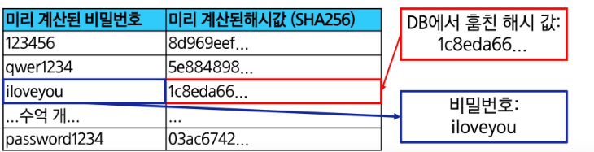

# Authentication 03

## 목차
---
### 회원정보 수정

### 비밀번호 변경

### 비밀번호 암호화

### 참고
- 비밀번호 초기화
- **PasswordChangeForm** 인자 순서
- Auth built-in form 코드


----------
<br>
<br>


# 회원정보 수정
## 회원정보 수정
- **User 객체**를 **Update**하는 과정
- 수정할 대상 **User 객체**를 가져오고, 입력받은 새로운 정보로 기존 내용을 갱신


## 회원정보 수정 페이지 작성 (1/5)

  - 회원정보 수정 경로 url 생성

<!-- end list -->

```python
# accounts/urls.py
app_name = 'accounts'
urlpatterns = [
    ...,
    path('update/', views.update, name='update'),
]
```

## UserChangeForm()
- 회원정보 수정 시 사용자 입력 데이터를 받는 **built-in ModelForm**
- **ModelForm**이기 때문에, 유효성 검사를 통과한 데이터로 기존 **User 객체**의 내용을 갱신하고 저장 (주로 관리자 페이지에서 사용)


## 회원정보 수정 페이지 작성 (2/5)

  - [복습] 커스텀 유저 모델을 사용을 하기 위해서 **Form**을 다시 작성
  - **Custom User model**을 사용할 수 있도록 상속 후 일부 부분만 재작성

<!-- end list -->

```python
# accounts/forms.py
from django.contrib.auth import get_user_model
from django.contrib.auth.forms import UserChangeForm

class CustomUserChangeForm(UserChangeForm):
    class Meta(UserChangeForm.Meta):
        model = get_user_model()
```


## 회원정보 수정 페이지 작성 (3/5)

  - `../accounts/update/` url로 요청이 들어왔을 때 실행할 **`update` 함수** 작성
  - 회원정보 수정에 사용할 데이터를 입력 받는 **`CustomUserChangeForm`** built-in form 사용

<!-- end list -->

```python
# accounts/views.py
from .forms import CustomUserChangeForm

def update(request):
    if request.method == 'POST':
        pass
    else:
        form = CustomUserChangeForm(instance=request.user)
    context = {
        'form': form,
    }
    return render(request, 'accounts/update.html', context)
```


## 회원정보 수정 페이지 작성 (4/5)

  - 회원가입을 위해 작성한 정보를 서버에 안전하게 전송하기 위해 \*\*“POST 방식”\*\*을 사용
  - 서버로부터 전달받은 \*\*`CustomUserChangeForm`\*\*을 화면에 출력

<!-- end list -->

```html
<h1>회원정보 수정</h1>
<form action="" method="POST">
  
  {{ form }}
  <input type="submit">
</form>
```

## 회원정보 수정 페이지 작성 (5/5)

  - 메인 페이지에서 회원정보 수정 페이지에 접근할 수 있는 태그 생성

<!-- end list -->

```html
<a href="">회원정보 수정</a>
```


## UserChangeForm 사용 시 문제점
- **User 모델**의 모든 정보(**fields**)까지 모두 출력됨
- 일반 사용자들이 접근하면 안 되는 정보는 출력하지 않아야 함

> `CustomUserChangeForm`에서 출력 필드를 다시 조정하기


## CustomUserChangeForm 출력 필드 재정의

  - User Model의 필드 목록 확인

<!-- end list -->

```python
# accounts/forms.py
class CustomUserChangeForm(UserChangeForm):
    class Meta(UserChangeForm.Meta):
        model = get_user_model()
        fields = ('first_name', 'last_name', 'email',)
```


## 회원정보 수정 로직 완성

```python
# accounts/views.py
@login_required
def update(request):
    if request.method == 'POST':
        form = CustomUserChangeForm(request.POST, instance=request.user)
        # form = CustomUserChangeForm(data=request.POST, instance=request.user)
        if form.is_valid():
            form.save()
            return redirect('articles:index')
    else:
        form = CustomUserChangeForm(instance=request.user)
    context = {
        'form': form,
    }
    return render(request, 'accounts/update.html', context)
```

<br>
<br>
<br>
<br>


# 비밀번호 변경

## 비밀번호 변경
- 인증된 사용자의 **Session** 데이터를 **Update**하는 과정
- 기존 비밀번호를 통해 사용자를 인증하고, 새로운 비밀번호를 암호화하여 갱신

### session
로그인 후, 브라우저를 닫기 전까지 사용자를 기억하는 방법

## 비밀번호 변경 페이지 작성 (1/5)
- django는 비밀번호 변경 페이지를 회원정보 수정 form 하단에서 **별도 주소**로 안내


## 비밀번호 변경 페이지 작성 (2/5)

  - Django에서 안내하는 **비밀번호 변경 URL**에 맞춰서 작성

<!-- end list -->

```python
# accounts/urls.py
app_name = 'accounts'
urlpatterns = [
    ...,
    path('password/', views.password, name='password'),
]
```

## 비밀번호 변경 페이지 작성 (3/5)

  - `../accounts/password/` url로 요청이 들어올 때 실행할 **`password` 함수** 작성
  - 비밀번호 변경에 사용할 데이터를 입력받는 **`PasswordChangeForm`** built-in form 사용

<!-- end list -->

```python
# accounts/views.py
from django.contrib.auth.forms import PasswordChangeForm

def password(request):
    if request.method == 'POST':
        pass
    else:
        form = PasswordChangeForm(request.user)
    context = {
        'form': form,
    }
    return render(request, 'accounts/password.html', context)
```

## PasswordChangeForm()
- 비밀번호 변경 시 사용자 입력 데이터를 받는 **built-in Form**
- 일반 **Form**이며, 유효성 검사(기존 비밀번호 확인, 새 비밀번호 일치 여부)를 통과한 데이터로 사용자의 비밀번호를 안전하게 암호화하여 갱신하는 역할을 수행


## 비밀번호 변경 페이지 작성 (4/5)

```html
<h1>비밀번호 변경</h1>
<form action="" method="POST">
  
  {{ form }}
  <input type="submit">
</form>
```

## 비밀번호 변경 페이지 작성 (5/5)

```python
# accounts/views.py
def password(request):
    if request.method == 'POST':
        form = PasswordChangeForm(request.user, request.POST)
        # form = PasswordChangeForm(user=request.user, data=request.POST)
        if form.is_valid():
            user = form.save()
            return redirect('articles:index')
    else:
        form = PasswordChangeForm(request.user)
    context = {
        'form': form,
    }
    return render(request, 'accounts/password.html', context)
```

## 세션 무효화 방지
## 암호 변경 시 세션 무효화
- 비밀번호가 변경되면 기존 세션과의 회원 인증 정보가 일치하지 않게 되어 바로 **로그인 상태가 유지되지 못하고 로그아웃 처리됨**
- 비밀번호가 변경되면서 기존 세션과의 회원 인증 정보가 일치하지 않기 때문

> 암호 변경 시 세션 무효화를 막는 방법은?


## 암호 변경 시 세션 무효화를 막아주는 함수 - `update_session_auth_hash`

`update_session_auth_hash(request, user)`

  - 암호가 변경되면 새로운 \*\*`password`\*\*의 **Session Data**로 기존 세션을 자동으로 갱신
  - \*\*`update_session_auth_hash`\*\*를 **`password` 함수**에 적용

<!-- end list -->

```python
# accounts/views.py
from django.contrib.auth import update_session_auth_hash

def password(request):
    if request.method == 'POST':
        form = PasswordChangeForm(request.user, request.POST)
        if form.is_valid():
            user = form.save()
            update_session_auth_hash(request, user)
            return redirect('articles:index')
    ...
```

<br>
<br>
<br>
<br>


# 비밀번호 암호화

## 암호화의 중요성
- 많은 해킹사태가 발생하고 있고, 데이터가 유출되더라도 그 내용을 알 수 없도록 **암호화**하는 것은 특히 중요  


## 우리가 사용하는 비밀번호는 어떻게 저장되고 있을까? (1/3)
1. 사용자가 입력한 비밀번호 **그대로** 저장하는 방식 => **보안에 매우 취약하므로 X**
   - 데이터베이스가 해킹 당하면, 공격자는 아이디와 비밀번호 목록을 그대로 손에 넣게 되고, 이를 통해 **직접 로그인**하여 개인정보, 금융 정보, 주소록 등 모든 데이터를 유출하거나 서비스를 악용할 수 있음
   - 악의적인 내부 직원이 데이터베이스에 접근하여 모든 사용자의 비밀번호를 볼 수 있음
   - 대부분의 사람들은 여러 서비스에서 동일한 아이디와 비밀번호를 사용하기에 탈취된 정보를 이용해 다른 사이트에 그대로 대입하여 2차 피해를 발생시킴 (**Credential Stuffing 공격**)


## 우리가 사용하는 비밀번호는 어떻게 저장되고 있을까? (2/3)
2. 일정한 규칙에 따라 비밀번호를 알아볼 수 없는 문자로 **'인코딩'** 한 후 저장 => **보안에 매우 취약하므로 X**

- 데이터베이스에 알아볼 수 없는 문자로 저장되어 있다고 하더라도,
  - 인코딩은 **비밀키 없이도** 정해진 규칙에 따라 누구나 **원래의 값으로 되돌릴 수 있음**
  - 공격자는 아주 간단한 디코딩 작업만으로 모든 사용자의 실제 비밀번호를 즉시 알아낼 수 있음
- 사실상 비밀번호를 평문으로 저장하는 것과 **동일한 수준의 위험을 초래**

### 인코딩
정보를 표현하는 형식을 다른 형식으로 변환하는 과정

### 비밀키
암호화된 데이터를 풀거나, 디지털 서명을 만들 때 쓰는 열쇠


## 우리가 사용하는 비밀번호는 어떻게 저장되고 있을까? (3/3)
3. 비밀번호를 **복원이 불가능한 고정된 길이의 문자열**로 변환 후 저장 => **보안에 필수**
- 데이터베이스가 유출되어도 공격자는 복잡하게 얽힌 문자열을 보게 되고, 복원이 불가능하기 때문에 실제 비밀번호를 알 수 없음
- 악의적인 내부 직원이 비밀번호를 보더라도 **암호화된 비밀번호**를 보게 되므로, 실제 비밀번호를 유출할 수 없음

> 비밀번호를 **복원이 불가능한 고정된 길이**로 바꾸는 과정을 **“해시(hash)”**라고 함

---

### TIP
**고정된 길이의 문자열로 변환하는 이유가 뭐예요?**
- **보안성**: 변환된 문자열의 길이가 다르다면, 길이만 보고도 원래 비밀번호의 길이를 유추할 수 있음
- **일관성**: 길이가 동일하기 때문에 저장 공간을 예측하고 설계하기 쉬우며, 검색/비교하는 처리 속도도 일정하게 유지할 수 있습니다.


## 해시 (Hash)
임의의 크기를 가진 데이터를 **고정된 크기의 고유한 값**으로 변환하는 것

---
해시는 **과일**을 믹서기에 갈아 **주스**로 만드는 것과 같습니다.
한 번 주스로 만들면, **원래 과일의 모습으로 되돌릴 수 없는 것**과 같은 원리입니다.
이처럼 해시는 어떤 데이터를 완전히 다른 모습으로 바꾸고, **절대로 원래 모습으로 되돌릴 수 없는 변환 과정**을 말해요.
그리고 어떤 데이터를 다른 데이터로 변환시키는 함수를 **해시 함수**라고 합니다.


## 해시 함수 (Hash function)
임의의 길이의 데이터를 입력 받아 **고정 길이(정수)**로 변환해 주는 함수.
---
- 어떤 길이의 데이터를 넣을 수 있고, 항상 **고정된 길이의 결과물(해시 값)**이 나옵니다.
- 입력 값으로 해시 값을 만들 수는 있지만, **해시 값만 보고 원래 입력값을 알아낼 수 없습니다. (단방향)**
- 입력 값이 단 한 글자만 달라져도 **해시 값은 완전히 달라집니다. (눈사태 효과)**
- 같은 입력 값을 넣으면 **언제나 똑같은 해시 값**이 나옵니다.


## 해시(hash)
- 데이터를 **고정된 크기의 값**으로 변환하는 과정
- 작은 변화에도 **해시 값이 크게 달라지는 특성**으로 인해 변조 여부를 쉽게 확인할 수 있음
- 입력 값이 들어오더라도 해시 함수에 의해서 다른 값으로 바뀌며, 동일한 값은 항상 **동일한 해시 값**을 생성


## Django의 암호화
- Django는 기본적으로 **SHA-256** 해시 함수를 사용해서 암호화
- 입력한 비밀번호의 길이와는 상관없이 **동일한 길이의 해시 값**을 생성
- 1글자만 다르더라도 **전혀 다른 해시 값**을 생성


## SHA-256
Secure Hash Algorithm - 256

안전한 해시 알고리즘으로, 어떤 데이터를 입력하든 **256비트 길이의 결과물**을 만들어 냄
---
이름 그대로 **'안전한 해시 알고리즘'**이라는 뜻을 가지고 있습니다.
전 세계적인 표준으로 사용되고 있으며, 비트코인과 같은 **블록체인 기술**에서도 사용됩니다.


## 해시 함수를 활용해 단방향 암호화를 하면 더 이상 문제가 없을까?
- 비밀번호를 **해시 값**으로 저장하면 공격자가 유출된 데이터베이스를 봐도 원래 비밀번호를 알 수 없으니 안전해 보일 수 있음
- 하지만 공격자들은 **해시 값**을 미리 계산해두는 방식으로 공격을 시도

> 이 방식이 바로 **'레인보우 테이블'** 공격


## 레인보우 테이블(Rainbow Table)
- 공격자가 자주 사용되는 비밀번호들(예: `123456`, `qwer1234`, ...)을 **미리 수백만, 수십억 개**를 **해시로 변환해 저장해 둔 거대한 정답지**

### 공격 방식
1.  공격자가 **DB를 탈취**해 사용자의 비밀번호 해시 값을 얻음
2.  해시 값을 공격자 자신의 **레인보우 테이블에서 검색**
3.  테이블에서 일치되는 값을 찾아내면서, 역방향으로 되돌리지 않고 **비밀번호를 알아내는 데 성공**





## 그러면 레인보우 테이블 공격은 어떻게 방어할까?
- 공격자가 아무리 거대한 레인보우 테이블을 가지고 있더라도, 사용자의 해시 값이 레인보우 테이블에 없도록 해시 값을 만들면 됨
- 해시 값은 입력 값이 단 한 글자만 달라져도 해시 값이 완전히 달라지는 **눈사태 효과**가 있음
- 결국 같은 비밀번호라도 사용자마다 **“임의의 문자열”**을 비밀번호에 붙여서 해시 암호화를 진행
  - 임의의 문자열이 추가된 상태로 해시 값을 만들기 때문에 **눈사태 효과**에 의해 같은 비밀번호도 다른 해시 값이 나옴

> 여기서 **“임의의 문자열”** 역할을 하는 것이 바로 **“솔트(Salt)”**


## 솔트(Salt)
- 각 사용자마다 **고유하게 생성된 임의의 문자열(솔트)**을 비밀번호에 덧붙여서 **해시 값**을 생성
- 이 **솔트(Salt)**는 해시 값과 함께 데이터베이스에 저장

| 사용자 | 비밀번호 | 해시 값 |
|:---:|:---:|:---:|
| User A | `qwer1234` | `5e884898...` |
| User B | `qwer1234` | `5e884898...` |
| **솔트 X** | | **동일** |

| 사용자 | 비밀번호 | 솔트 | 해시 값 |
|:---:|:---:|:---:|:---:|
| User A | `qwer1234` | `!@#$` | `a1b2c3d4...` |
| User B | `qwer1234` | `%^&*` | `x7y8z9w0...` |
| **솔트 O** | | | **동일하지 않음** |

---

### TIP
**공격자가 솔트(Salt) 값을 알아도 되나요?**
- 공격자가 **솔트(Salt) 값**을 알아도 상관없습니다.
- `user A`의 솔트와 해시 값을 훔쳤다면, 공격자는 `user A`만을 위한 **레인보우 테이블**을 만들어야 합니다.
- 이는 **'하나의 정답지로 수백만 명을 공격하는 방식'**에서 **'한 명을 공격하기 위해 매번 새로운 정답지를 만드는 방식'**으로 바뀌면서, 공격의 효율성을 극도로 떨어뜨립니다.


## 솔트(Salt)로 레인보우 테이블 공격을 막았으니, 안전할까요?
- 공격자는 이제 미리 만들어 둔 정답지를 쓸 수 없어짐
- 그래서 단순하지만 확실한 방식으로 **가능한 모든 비밀번호를 하나씩 직접 대입**해보는 방식으로 공격
- 이 방식은 현대 컴퓨터의 엄청난 속도 때문에 생각보다 훨씬 **위협적**
  - 최신 GPU는 초당 약 **1,500억 번 이상 추측**할 수 있음

> 이 방식이 바로 **“무차별 대입 공격(Brute-force Attack)”**


## 무차별 대입 공격(Brute-force Attack)
- 가장 원시적이지만 강력한 방법으로써 **가능한 모든 비밀번호를 하나씩 대입**하는 방식
- 이 공격은 시간과의 싸움이며, 현대 컴퓨터의 **빠른 연산 속도**가 공격자의 무기가 됨


## 그러면 무차별 대입 공격(Brute-force Attack)은 어떻게 막을까요?
- 공격자는 현대 컴퓨터의 **빠른 연산 속도**를 무기로 공격을 시도하고 있음
- 결국 해결책은 **“연산 속도를 늦추는 것”**이 핵심
- 연산 속도를 늦추기 위해서 의도적으로 비밀번호 검증 과정을 느리게 만듦
  - 느리게 만들기 위해서 의도적으로 **해시 연산을 수십만 번 반복**시켜, 공격 속도를 늦춤

> 이 방식이 바로 **“키 스트레칭(Key Stretching)”**

---

### TIP
**연산 속도를 늦추면 사용자가 로그인할 때 느리다는 불편을 겪을 수도 있지 않을까요?**
- 사용자는 실제로 체감하지 못합니다.
- 해시 연산 속도를 1개당 **0.2초**로 바꾼다고 하면, 실제로 공격자는 1초에 5번의 공격만 가능합니다.
- 하지만 사용자에게 **0.2초**는 느리다고 하기엔 충분히 빠른 시간입니다.


## 키 스트레칭(Key Stretching)
- **솔트(Salt)**를 적용한 해시 함수를 **수만~수십만 번 반복**하여 연산 시간을 의도적으로 늘리는 기법
- **'속도'**가 무기인 **무차별 대입 공격(Brute-force Attack)**을 방어할 수 있음
- Django는 이 **키 스트레칭**을 구현하기 위해서 **PBKDF2**라는 검증된 알고리즘을 기본으로 사용
- 최근에는 더 강력한 보안을 제공하는 **Argon2**, **bcrypt** 같은 알고리즘도 지원

### ❄️ PBKDF2, Argon2, bcrypt 알고리즘은 키 스트레칭을 구현하는 다양한 방법 정도로만 이해하기

| 구분 | 키 스트레칭 없음(1회) | 키 스트레칭 적용(39만 회) |
|:---:|:---:|:---:|
| 1개 비밀번호 검증 시간 | 0.000001초 | 0.1초 |
| 10억 개 비밀번호 검증 | 11.5일 | **약 3,170년** |


## Django에서의 비밀번호 암호화

### How Django stores passwords

Django provides a flexible password storage system and uses **PBKDF2** by default.
The **`password`** attribute of a **`User`** object is a string in this format:

```
<algorithm>$<iterations>$<salt>$<hash>
```

1.  `<algorithm>`: 어떤 알고리즘을 쓰는 지
2.  `<iterations>`: **키 스트레칭 횟수**
3.  `<salt>`: **생성된 솔트**
4.  `<hash>`: 생성된 최종 해시


## 비밀번호 암호화 정리
- 암호화 과정을 이해한 후, **검증된 프레임워크의 보안 기능**을 신뢰하고 사용하기
  - 보안은 매우 어렵고 복잡한 분야이며, Django 공식에도 가급적 **재발명하지 않을 것**을 권장하고 있음
- 단순히 코드를 복사해서 붙여넣는 것을 넘어, 이 기능이 **'왜'** 이렇게 만들어졌는지 이해하면, 더 견고하고 안전한 애플리케이션을 만들 수 있음
- 사용자는 우리의 서비스를 믿고 소중한 개인정보를 맡기고, 그들의 데이터를 안전하게 지키는 것은 개발자의 **'가장 기본적인 책임이자 직업윤리'**


<br>
<br>
<br>


# 참고

## 비밀번호 초기화
- 비밀번호를 잊어버린 사용자가 **이메일**을 활용하여 비밀번호를 다시 설정하는 과정

### 비밀번호 초기화 과정
1. 비밀번호를 찾으려고 하는 **이메일 입력**
2. 이메일로 **비밀번호 재설정 링크**를 전송
3. 비밀번호 재설정 페이지에서 **새로운 비밀번호 설정**
4. 초기화 후 다시 **로그인**


## 1. 비밀번호를 찾으려고 하는 이메일 입력 (1/3)
- 이메일을 입력하는 페이지를 직접 만들어야 할까?
  > **No!**
- Django 에서는 비밀번호에 관련된 다양한 기능을 **관리자 페이지**로 제공하고 있음


## 1\. 비밀번호를 찾으려고 하는 이메일 입력 (2/3)

  - Django에서 제공하는 비밀번호 관련 기능을 활용하기 위해 \*\*`django.contrib.auth.urls`\*\*를 \*\*`crud/urls.py`\*\*에 포함

<!-- end list -->

```python
# crud/urls.py
from django.contrib import admin
from django.urls import path, include

urlpatterns = [
    path("admin/", admin.site.urls),
    path('articles/', include('articles.urls')),
    path('accounts/', include('accounts.urls')),
    path('accounts/', include('django.contrib.auth.urls')),
]
```

-----

### TIP

**같은 `accounts`에 2개의 `include`가 사용되어도 괜찮나요?**

  - 같은 **prefix**로 여러 번 \*\*`include`\*\*를 해도, 각 \*\*`include`\*\*의 내부 URL 패턴을 순차적으로 모두 시도합니다.
  - 내부 URL이 겹치지 않으면 모두 정상 동작하기 때문에 괜찮습니다.


## 1. 비밀번호를 찾으려고 하는 이메일 입력 (3/3)
- `.../accounts/` 만 입력해보고, 제공하는 url 목록을 확인
- 제공되는 url 목록에서 **`password_reset`** 경로를 입력해보고, 비밀번호 초기화 페이지로 접근

----------
<br>
<br>
<br>
<br>
<br>


---------
## 2. 이메일로 비밀번호 재설정 링크를 전송 (1/4)
- 비밀번호를 찾으려고 하는 이메일을 작성하고 **`Reset my password` 버튼**을 눌러 이메일 전송


- 입력한 이메일에 매칭되는 사용자 이메일이 없다면 이메일 기능은 동작하지 않음

---

### TIP
**왜 입력한 이메일에 매칭되는 사용자 이메일이 없다면 이메일 기능이 동작하지 않나요?**
- 에러나 주의 문구가 나타나면 사용자 입장에서는 편리하겠지만, **임의의 사용자**가 **이메일의 존재 여부를 확인하는 용도**로 악용하는 사례를 막기 위해서 동작하지 않습니다.


## 2. 이메일로 비밀번호 재설정 링크를 전송 (2/4)
- 이메일 관련 설정을 따로 하지 않았기 때문에 **이메일 전송 실패**


## 2\. 이메일로 비밀번호 재설정 링크를 전송 (3/4)

  - Django에서는 이메일을 보낸 내용을 **콘솔에서 볼 수 있는 기능**을 제공
  - `settings.py`에서 **`EMAIL_BACKEND`** 세팅 후 다시 이메일 전송하기

<!-- end list -->

```python
# crud/settings.py
EMAIL_BACKEND = 'django.core.mail.backends.console.EmailBackend'
```

## 2. 이메일로 비밀번호 재설정 링크를 전송 (4/4)
- 콘솔창에 비밀번호 초기화 설정 페이지 안내 이메일을 확인하고, 해당 링크 들어가기


## 3. 비밀번호 재설정 페이지에서 새로운 비밀번호 설정
- 새로운 비밀번호 설정 후, **비밀번호 설정 완료 페이지** 보여주기

## 4. 초기화 후 다시 로그인
- **변경한 비밀번호**로 로그인

----------

<br>
<br>
<br>


## Django의 모듈 활용
- Django 에서는 수많은 **'완성된 기능 모듈'**을 제공
- 단순히 **'비밀번호 초기화'** 기능을 구현한 것이 아니라, **잘 만들어진 모듈을 활용하는 법을 학습한 것**
- **`django.contrib.auth.urls`** 외에도 **`admin`**, **`sessions`**, **`sitemaps`** 등 다양한 기능을 제공
- 이메일 서버가 없어도 테스트가 가능한 것처럼, 실제 서비스 환경을 흉내 내는 많은 모듈을 제공하고 있음
- 이런 다양한 모듈을 활용해서 개발 기술을 숙련하는 데 활용


## PasswordChangeForm의 인자 순서
- **`PasswordChangeForm`**이 다른 Form과 달리 **`user` 객체**를 첫 번째 인자로 받는 이유
  - 부모 클래스인 **`SetPasswordForm`**의 생성자 함수 구성을 따르기 때문


<br>
<br>
<br>


## 핵심 키워드

| 개념 | 설명 | 예시 |
|:---:|:---:|:---:|
| 회원정보 수정 폼 | 회원정보 수정을 위한 내장 **ModelForm** | `form = CustomUserChangeForm()` |
| 비밀번호 변경 폼 | 비밀번호 변경을 위한 내장 **Form** | `form = PasswordChangeForm(user)` |
| 세션 무효화 방지 | 비밀번호 변경 후 로그인 유지 | `update_session_auth_hash(req, user)` |
| 해시 (Hash) | 데이터를 고유한 값으로 변환하는 것 | 원본 복원이 불가능한 **단방향 암호화** |
| 솔트 (Salt) | 해시 전 추가하는 임의의 문자열 | **레인보우 테이블 공격**을 방어함 |
| 키 스트레칭 | 해시 연산을 반복하여 시간 지연 | **무차별 대입 공격(Brute-force Attack)** 방어 |
| 비밀번호 초기화 | 이메일로 비밀번호를 재설정 | `include('django.contrib.auth.urls')` |

-------------


## 요약 및 정리

## 회원정보 수정
- 회원정보 수정은 **User 객체**를 **갱신(Update)**하는 과정
- Django에 내장된 **`UserChangeForm`**은 회원정보 수정을 위한 **ModelForm**
- **`UserChangeForm`**은 관리자 페이지용이라 사용자의 모든 필드를 보여주므로, 일반 사용자에게는 필요한 필드만 보여주도록 **커스텀 폼**을 만들어야 함
- 커스텀 폼(**`CustomUserChangeForm`**)은 **`UserChangeForm`**을 상속받고, **Meta 클래스**에서 **`fields` 속성**을 조정하여 출력할 필드를 지정


## 비밀번호 변경
- 비밀번호 변경은 **인증된 사용자**의 **세션(Session) 데이터**를 갱신하는 과정
- **`PasswordChangeForm`**을 사용
- 이 폼은 기존 비밀번호를 확인하고 새 비밀번호가 일치하는지 검증한 후, 비밀번호를 **안전하게 암호화하여 갱신**
- 비밀번호를 변경하면 기존 세션이 무효화되어 **자동으로 로그아웃**
- **`update_session_auth_hash` 함수**를 사용하면 비밀번호 변경 후에도 **로그인 상태를 유지**할 수 있음


## 비밀번호 암호화

  - 비밀번호는 데이터베이스 유출 시에도 안전하도록 **복원이 불가능한 문자열**로 변환하여 저장해야 함
  - 이 과정을 \*\*해시(`hash`)\*\*라고 하며, 데이터를 **고정된 길이의 고유한 값**으로 바꾸는 **단방향 변환**

### 암호화 공격과 방어 기법

  - **레인보우 테이블 공격**: 자주 쓰는 비밀번호의 해시 값을 미리 계산해 둔 목록을 이용해 비밀번호를 찾아내는 공격 방식
  - **솔트(Salt)**: 레인보우 공격을 막기 위해, 각 사용자의 비밀번호에 \*\*고유한 임의의 문자열(솔트)\*\*을 추가하여 해시
  - **무차별 대입 공격**: 가능한 모든 비밀번호를 하나씩 대입해보는 공격
  - **키 스트레칭**: 무차별 공격을 막기 위해, 해시 연산을 수만 번 반복하여 **검증 시간을 의도적으로 늘리는 기법**
  - Django는 기본적으로 **PBKDF2 알고리즘**을 사용해 **키 스트레칭**과 **솔트**를 적용하며, 비밀번호를 다음 형식으로 저장함:
    ```
    <algorithm>$<iterations>$<salt>$<hash>
    ```


## 비밀번호 초기화
- 비밀번호 초기화는 사용자가 **이메일 인증**을 통해 비밀번호를 재설정하는 과정
- Django는 **`django.contrib.auth.urls`**를 통해 비밀번호 초기화에 필요한 기능과 URL을 제공
- 개발 중에는 `settings.py`에 **`EMAIL_BACKEND = 'django.core.mail.backends.console.EmailBackend'`** 설정을 추가하여, 실제 이메일 발송 없이 **콘솔 창에서 초기화 링크를 확인할 수 있음**


----

## 확인 문제

### 1. 회원 정보 수정 시 사용하는 Django 내장 폼은?
a) `UserCreationForm`
b) `AuthenticationForm`
c) `UserChangeForm`
d) `PasswordChangeForm`

---

### 2. `UserChangeForm`을 커스텀할 때, 불필요한 필드를 제외하는 방법은?
a) `exclude` 옵션 사용
b) `fields` 옵션에 원하는 필드만 명시
c) `Meta` 클래스를 삭제
d) 폼 템플릿에서 직접 HTML 태그 삭제

---

### 3. 비밀번호 변경 시 사용하는 Django 내장 폼은?
a) `UserChangeForm`
b) `PasswordChangeForm`
c) `SetPasswordForm`
d) `AuthenticationForm`

---

### 4. 비밀번호 변경 후 로그아웃되는 현상을 막는 함수는?
a) `login(request, user)`
b) `logout(request)`
c) `update_session_auth_hash(request, user)`
d) `save_session(request)`

---

### 5. 비밀번호를 복원이 불가능한 고정 길이의 문자열로 바꾸는 과정은?
a) 인코딩 (Encoding)
b) 디코딩 (Decoding)
c) 해싱 (Hashing)
d) 암호화 (Encryption)

---

### 6. 해시 함수의 특징이 아닌 것은?
a) 입력값이 같으면 항상 같은 결과가 나온다.
b) 해시값으로 원래 입력값을 쉽게 알 수 있다.
c) 입력값이 조금만 달라도 결과는 크게 달라진다.
d) 어떤 길이의 입력이든 고정된 길이로 출력된다.

---

### 7. '레인보우 테이블' 공격을 방어하기 위한 기법은?
a) 키 스트레칭 (Key Stretching)
b) 솔트 (Salt) 사용
c) 2단계 인증 (2FA)
d) HTTPS 사용

---

### 8. '무차별 대입 공격'의 효율을 떨어뜨리기 위한 기법은?
a) 솔트 (Salt) 사용
b) 키 스트레칭 (Key Stretching)
c) 비밀번호 복잡도 규칙 적용
d) 캡챠 (CAPTCHA) 사용

---


### 9. Django가 기본으로 사용하는 비밀번호 해싱 알고리즘은?
a) MD5
b) SHA-1
c) PBKDF2
d) bcrypt

---

### 10. Django 비밀번호 해시값에 포함되지 않는 정보는?
a) 알고리즘 (algorithm)
b) 반복 횟수 (iterations)
c) 솔트 (salt)
d) 사용자 아이디 (username)

---

### 11. 비밀번호 초기화 기능을 위해 `settings.py`에 설정해야 하는 것은?
a) `PASSWORD_RESET_TIMEOUT_DAYS`
b) `EMAIL_BACKEND`
c) `AUTH_PASSWORD_VALIDATORS`
d) `LOGIN_REDIRECT_URL`

---------


<br>
<br>
<br>
<br>
<br>
<br>
<br>
<br>
<br>
<br>
<br>
<br>
<br>
<br>
<br>
<br>
<br>
<br>
<br>


----------

## 정답 및 해설


### 정답 요약
1.  c) UserChangeForm
2.  b) fields 옵션에 원하는 필드만 명시
3.  b) PasswordChangeForm
4.  c) update_session_auth_hash(request, user)
5.  c) 해싱 (Hashing)
6.  b) 해시값으로 원래 입력값을 쉽게 알 수 있다.
7.  b) 솔트 (Salt) 사용
8.  b) 키 스트레칭 (Key Stretching)
9.  c) PBKDF2
10. d) 사용자 아이디 (username)
11. b) EMAIL\_BACKEND

---

### 상세 해설

1.  **`UserChangeForm`**은 등록된 사용자의 정보를 수정하기 위해 Django에서 기본으로 제공하는 **ModelForm**입니다.
2.  커스텀 폼의 **Meta 클래스** 안에 **`fields` 튜플**에 **`'first_name'`, `'last_name'`** 등 원하는 필드 이름만 지정하여 출력 필드를 제어할 수 있습니다.
3.  **`PasswordChangeForm`**은 사용자가 기존 비밀번호를 입력하고 새 비밀번호로 변경할 수 있도록 돕는 내장 폼입니다.
4.  이 함수는 비밀번호가 변경되었을 때, **새로운 비밀번호 해시값**으로 현재 **세션 정보**를 갱신하여 **로그아웃을 방지**합니다.
5.  해싱은 임의의 데이터를 **고정된 길이**로 변환하는 **단방향 과정**으로, 비밀번호 저장에 사용됩니다.
6.  해시 함수는 **단방향 변환**이 특징이며, **결과 값(해시)**으로는 원본 데이터를 역추적하는 것은 **불가능**합니다.
7.  각 비밀번호에 **'솔트'**라는 **임의의 문자열**을 추가하여 해싱하면, 동일한 비밀번호라도 사용자마다 **다른 해시값**을 갖게 되어 **레인보우 테이블을 무력화**시킵니다.
8.  해시 연산을 의도적으로 수만 번 이상 반복하여 **한 번의 비밀번호 검증에 걸리는 시간을 늘림**으로써, 무차별 대입 공격의 속도를 극단적으로 늦춥니다.
9.  Django는 **솔트**와 **키 스트레칭**을 구현한 **PBKDF2 알고리즘**을 기본값으로 사용하여 안전하게 비밀번호를 저장합니다.
10. Django의 비밀번호 필드 값(예: `<algorithm>$<iterations>$<salt>$<hash>`)에는 **사용자 아이디**는 포함되지 않습니다.
11. 비밀번호 초기화 링크를 이메일로 보내기 때문에, Django가 이메일을 어떻게 처리할지 정의하는 **`EMAIL_BACKEND`** 설정이 필요합니다. (콘솔 테스트 포함)