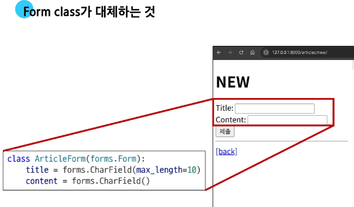
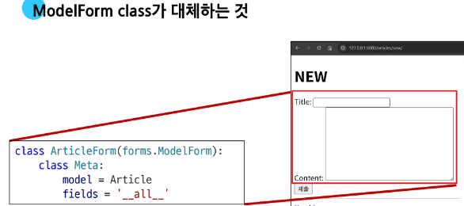

## 목 차

## Django Form
- Form class
- Widgets

## Django ModelForm
- Meta class
- ModelForm 적용
- save 메소드

## HTTP 요청 다루기
- View 함수 구조 변화
- new & create 함수 결합
- edit & update 함수 결합

## 참고
- ModelForm의 키워드 인자 구성
- Widgets 응용
- 필드를 수동으로 렌더링

----
# Django Form

## HTML Form의 한계

## HTML 'form'
- 지금까지 사용자로부터 데이터를 제출 받기 위해 활용한 방법
- 그러나 비정상적 혹은 악의적인 요청을 필터링 할 수 없음
    - 유효한 데이터인지에 대한 확인이 필요

## 유효성 검사

- 수집한 데이터가 정확하고 유효한지 확인하는 과정
    - **Django Form**의 유효성 검사는 사용자가 입력한 데이터가 올바른 형식인지 자동으로 점검하는 기능을 제공
    - 예를 들어, 필수 입력 값이 비어 있거나 잘못된 이메일 형식을 입력하면 오류를 알려줌
    - 이 과정을 통해 서버에 잘못된 데이터가 저장되지 않도록 보호 가능

## 유효성 검사 구현의 어려움

- 유효성 검사를 구현하기 위해서는 입력 값, 형식, 중복, 범위, 보안 등 많은 것을 고려해야 함
- 이런 과정과 기능을 직접 개발하는 것이 아닌 **Django**가 제공하는 **Form**을 사용


# Form Class

## Django Form
- 사용자 입력 데이터를 수집하고, 처리 및 유효성 검사를 수행하기 위한 도구
    - 유효성 검사를 단순화하고 자동화할 수 있는 기능을 제공
    - 사용자가 잘못 입력한 데이터는 자동으로 오류로 처리되어 안전성을 높임
    - 개발자는 이를 통해 빠르고 일관된 입력 검증 기능을 구현 가능


## Form Class 정의

  - **Form Class**를 상속받아 내용과 제목에 대한 사용자 입력을 받는 **ArticleForm**을 정의하는 방법

<!-- end list -->

```python
# articles/forms.py

from django import forms


class ArticleForm(forms.Form):
    title = forms.CharField(max_length=10)
    content = forms.CharField()
```


## Form Class를 적용한 new logic(1/3)

  - view 함수 new 변경

<!-- end list -->

```python
# articles/views.py

from .forms import ArticleForm


def new(request):
    form = ArticleForm()
    context = {
        'form': form,
    }
    return render(request, 'articles/new.html', context)
```


## Form Class를 적용한 new logic(2/3)

  - new 페이지에서 form 인스턴스 출력

<!-- end list -->

```html
<h1>NEW</h1>
<form action="" method="POST">
  
  {{ form }}
  <input type="submit">
</form>
```


## Form Class를 적용한 new logic(3/3)
- new 페이지에서 form 인스턴스 출력



--------
# Widgets

## Widgets

- 폼 필드를 화면에 표시하는 **HTML 입력 요소**를 정의하는 구성요소
- **HTML 'input' element**의 표현을 담당
    - **Django Form**의 **widgets**은 각 필드가 **HTML**에서 어떻게 렌더링 될지를 결정
    - 예를 들어, **TextInput**, **Select**, **CheckboxInput** 등 다양한 위젯 클래스를 사용해 입력 방식과 속성을 세부 조정 가능


## Widget 적용

  - **Widget**은 단순히 input 요소의 속성 및 출력되는 부분을 변경하는 것

<!-- end list -->

```python
# articles/forms.py

from django import forms


class ArticleForm(forms.Form):
    title = forms.CharField(max_length=10)
    content = forms.CharField(widget=forms.Textarea)
```


----------
# Django ModelForm

## Form vs. ModelForm

| Form | ModelForm |
| :--- | :--- |
| 사용자 입력 데이터를 **DB에 저장하지 않을 때** | 사용자 입력 데이터를 **DB에 저장해야 할 때** |
| (ex. 검색, 로그인) | (ex. 게시글 작성, 회원가입) |


## ModelForm 기능

## ModelForm
- **Model**과 연결된 **Form**을 자동으로 생성해주는 기능을 제공
    - **ModelForm**은 **Form** 클래스와 **Model** 클래스를 결합한 형태로, 모델 필드를 기반으로 입력 폼을 자동 생성
    - 데이터 수집과 저장 과정을 동시에 처리할 수 있도록 도와줌


## ModelForm class 정의

  - 기존 **ArticleForm** 클래스 수정

<!-- end list -->

```python
# articles/forms.py

from django import forms
from .models import Article


class ArticleForm(forms.ModelForm):
    class Meta:
        model = Article
        fields = '__all__'
```





-----------
# Meta class

## Meta class

- **ModelForm**의 정보를 작성하는 곳
    - **Meta class**는 **ModelForm** 내부에서 어떤 모델과 연결할지, 어떤 필드를 사용할지 등을 정의하는 설정 공간
    - 폼의 동작 방식을 제어하는 핵심 역할을 함

## 'fields' 및 'exclude' 속성

  - **exclude** 속성을 사용하여 모델에서 포함하지 않도록 필드를 지정할 수도 있음

<!-- end list -->

```python
# articles/forms.py

class ArticleForm(forms.ModelForm):
    class Meta:
        model = Article
        fields = ('title',)
```

```python
# articles/forms.py

class ArticleForm(forms.ModelForm):
    class Meta:
        model = Article
        exclude = ('title',)
```


## Meta class 주의사항
- **Django**에서 **ModelForm**에 대한 추가 정보나 속성을 작성하는 클래스 구조를 **Meta 클래스**로 작성했을 뿐이며, 파이썬의 **inner class**와 같은 문법적인 관점으로 접근하지 말 것


-----------
# ModelForm 적용

## ModelForm을 적용한 create 로직 (1/2)

```python
# articles/views.py

from .forms import ArticleForm


def create(request):
    form = ArticleForm(request.POST)
    if form.is_valid():
        article = form.save()
        return redirect('articles:detail', article.pk)
    context = {
        'form': form,
    }
    return render(request, 'articles/new.html', context)
```

## ModelForm을 적용한 create 로직 (2/2)
- 제목 input에 **공백**을 입력 후 제출 시 에러 메시지 출력 확인
    - $\Rightarrow$ 유효성 검사의 결과


## is_valid()
- 여러 유효성 검사를 실행하고, 데이터가 유효한지 여부를 **Boolean**으로 반환


## 공백 데이터가 유효하지 않은 이유와 에러메시지가 출력되는 과정

  - 별도로 명시하지 않았지만 모델 필드에는 기본적으로 빈 값을 허용하지 않는 제약조건이 설정되어 있음
  - 빈 값은 `is_valid()`에 의해 **False**로 평가되고 **form** 객체에는 그에 맞는 에러 메시지가 포함되어 다음 코드로 진행됨

<!-- end list -->

```python
# articles/models.py
class Article(models.Model):
    title = models.CharField(max_length=10)
    content = models.TextField()
    created_at = models.DateTimeField(auto_now_add=True)
    updated_at = models.DateTimeField(auto_now=True)


# articles/views.py
def create(request):
    form = ArticleForm(request.POST)
    if form.is_valid():
        article = form.save()
        return redirect('articles:detail', article.pk)
    context = {
        'form': form,
    }
    return render(request, 'articles/new.html', context)
```

## ModelForm을 적용 edit 로직

```python
# articles/views.py

def edit(request, pk):
    article = Article.objects.get(pk=pk)
    form = ArticleForm(instance=article)
    context = {
        'article': article,
        'form': form,
    }
    return render(request, 'articles/edit.html', context)
```

```html
<h1>EDIT</h1>
<form action="" method="POST">
  
  {{ form }}
  <input type="submit">
</form>
```

## ModelForm을 적용한 update 로직

```python
# articles/views.py

def update(request, pk):
    article = Article.objects.get(pk=pk)
    form = ArticleForm(request.POST, instance=article)
    if form.is_valid():
        form.save()
        return redirect('articles:detail', article.pk)
    context = {
        'article': article,
        'form': form,
    }
    return render(request, 'articles/edit.html', context)
```

-------------

# save 메서드

## save()

- 데이터베이스 객체를 만들고 저장하는 **ModelForm**의 인스턴스 메서드
    - 폼 데이터가 유효한 경우, `save()` 메서드를 호출하면 모델 인스턴스를 생성하고 데이터베이스에 저장
    - **instance** 인자를 통해 새 객체 생성과 기존 객체 수정도 구분 가능
    - 이 과정을 통해 코드 없이 쉽게 **DB** 연동이 가능


## save() 메서드가 생성과 수정을 구분하는 법
- 키워드 인자 **instance** 여부를 통해 생성할 지, 수정할 지를 결정


## save() 메서드가 생성과 수정을 구분하는 법

  - 키워드 인자 **instance** 여부를 통해 생성할 지, 수정할 지를 결정

### CREATE (생성)

```python
# CREATE

form = ArticleForm(request.POST)
form.save()
```

### UPDATE (수정)

```python
# UPDATE

form = ArticleForm(request.POST, instance=article)
form.save()
```


