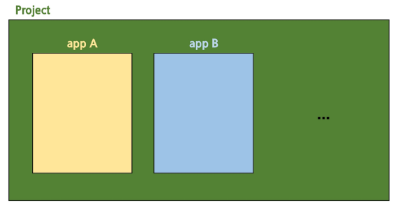
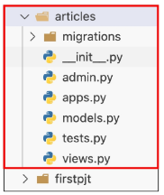
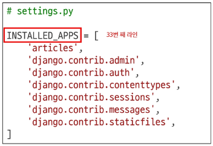
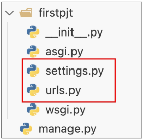
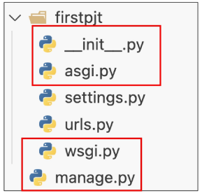
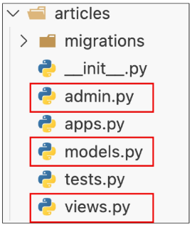
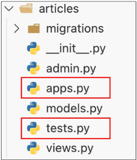
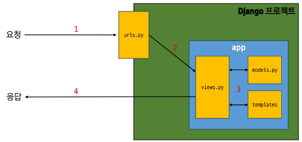

## 목차
### Web Application
* 클라이언트와 서버
* Frontend & Backend
  > 클라이언트와 서버의 관계는 면접에서도 종종 나옴

### Framework
* Web Framework
* Django Framework
  
### 가상 환경
* 가상 환경 생성 및 활성화
* 의존성 패키지
* 의존성 패키지 기반 설치
* 가상 환경 주의사항

### Django 프로젝트
* 프로젝트 생성 및 서버 실행

### Django Design Pattern
* Design Pattern
* 프로젝트와 앱
* 프로젝트 및 앱 구조
> MVC 패턴은 매번 시험 나옴

### 요청과 응답
* Django에서의 요청과 응답
> Django의 동작 흐름 의워두기

### 참고
* 가상 환경 생성 루틴 
* Django 관련
* Python 패키지 설치법
* render 함수 v
* MTV 디자인 패턴 정리 v
* Trailing Comma
* 프레임워크의 규칙 및 설계 철학


---
# Wep application
---
## Web application (web service) 개발
* 인터넷을 통해 사용자에게 제공되는 소프트웨어 프로그램을 구축하는 과정
* 다양한 디바이스(모바일, 태블릿, PC 등)에서 웹 브라우저를 통해 접근하고 사용 가능
  * 네이버를 비롯한 포털, 쿠팡과 같은 인터넷 쇼핑몰부터 Google Docs와 같은 웹 문서 작업 도구 등 - 인터넷을 통해 접할 수 있으며 이를 통해 제공되는 서비스를 통틀어 **Web Service**라고 불림

## 클라이언트와 서버

### 웹의 동작 방식
우리가 컴퓨터 혹은 모바일 기기로 웹 페이지를 보게 될 때까지 무슨 일이 일어날까?

## 클라이언트 - 서버 구조
**requests** $\to$ **responses**

### Client - 서비스를 요청하는 주체
* 사용자의 웹 브라우저, 모바일 앱

### Server - 클라이언트의 요청에 응답하는 주체
* 웹 서버, 데이터베이스 서버
* 일반적인 웹 서비스에서는 클라이언트가 페이지를 달라고 "**요청**"할 경우 서버가 페이지를 "**응답**"해 줍니다.

> 클라이언트의 요청이 먼저, 그 다음 서버에서 응답

## 우리가 웹 페이지를 보게 되는 과정

1. 웹 브라우저(**클라이언트**)에서 '**https://www.google.com/search?q=google.com**'을 입력 후 Enter  
2. 웹 브라우저는 인터넷에 연결된 전세계 어딘가에 있는 구글 컴퓨터(**서버**)에게 '**메인 홈페이지.html**' 파일을 달라고 요청  
3. 요청을 받은 구글 컴퓨터는 데이터베이스에서 '**메인 홈페이지.html**' 파일을 찾아 응답  
4. 웹 브라우저는 전달받은 '**메인 홈페이지.html**' 파일을 사람이 볼 수 있도록 해석해주고 사용자는 구글의 메인 페이지를 보게 됨  


----

# Frontend & Backend

---

## 웹 개발에서의 Frontend와 Backend
* **Frontend**(프론트엔드)
  * 사용자 인터페이스(UI)를 구성하고, 사용자가 애플리케이션과 상호작용 가능
  * $\text{HTML, CSS, JavaScript, 프론트엔드 프레임워크 등}$
* **Backend**(백엔드)
  * 서버 측에서 동작하며, 클라이언트의 요청에 대한 처리와 데이터베이스와의 상호작용 등을 담당
  * $\text{서버 언어(Python, Java 등) 및 백엔드 프레임워크, 데이터베이스, API, 보안 등}$

---
### HTML
웹 페이지의 의미와 구조를 정의하는 언어
### CSS
웹 페이지의 디자인과 레이아웃을 구성하는 언어


## Frontend & Backend
* Frontend: $\text{HTML, CSS, JavaScript}$를 이용해 $\text{UI}$를 구성
  * $\text{Vue.js}$: 프론트엔드로 활용되는 대표적인 프레임워크
* **Backend**: 클라이언트의 요청에 대한 처리와 데이터베이스 상호작용
  * Django는 백엔드로 활용되는 대표적인 프레임워크


---

# Framework

---
## Web Framework
웹 애플리케이션을 빠르게 개발할 수 있도록 도와주는 도구
개발에 필요한 기본 구조, 규칙, 라이브러리 등을 제공 (로그인/로그아웃, 회원관리, 데이터베이스, 보안 등)

* 일반적인 웹 서비스에 필요한 다양한 보편적인 기능들이 존재
* 이런 기능을 전부 혼자 개발하기보다는 이미 만들어진 도구를 효과적으로 활용하는 능력은 현대 웹 개발의 핵심이라고 볼 수 있습니다.

## Django Framework

## django
Python 기반의 대표적인 웹 프레임워크

**클라이언트 - 서버 구조의 서버를 구현하는 것이 Django를 배우는 목적!**

## 왜 Django를 사용?
* **다양성**
  * Python 기반으로 웹, 모바일 앱 백엔드, API 서버 및 빅데이터 관리 등 광범위한 서비스 개발에 적합
* **확장성**
  * 대량의 데이터에 대해 빠르고 유연하게 확장 가능한 기능을 제공
* **보안**
  * 취약점으로부터 보호하는 보안 기능이 기본적으로 내장
* **커뮤니티 지원**
  * 개발자를 위한 지원, 문서 및 업데이트를 제공하는 활성화된 커뮤니티


## 검증된 웹 프레임워크
* 대규모 트래픽 서비스에서도 안정적인 서비스 제공

## 웹 개발 시장을 주도하는 백엔드 프레임워크 (2024 ~ 2025)
1. **Django (Python)**
2. Spring Boot (Java)
3. ASP.NET Core (C#)
4. Laravel (PHP)
5. Express.js (Node.js)

---
# 가상 환경
---

## 가상 환경
Virtual Environment

하나의 컴퓨터 안에서 또 다른 '**독립된**' 파이썬 환경

* 같은 집 안에 방을 따로 만들어 두고, 필요한 물건들을 각 방에만 들여놓는 것과 비슷
* 각 방의 물건은 서로 간섭하지 않게 됨

## 가상 환경이 필요한 시나리오 1
1.  한 개발자가 2개의 프로젝트(A와 B)를 진행해야 하는 상황
2.  프로젝트 A는 **requests 패키지 버전 1**이 필요
3.  프로젝트 B는 **requests 패키지 버전 2**이 필요
4.  하지만 파이썬 환경에서 패키지는 1개의 버전만 존재 가능
5.  A와 B의 프로젝트의 다른 패키지 버전 사용을 위한 **독립적인 개발 환경**이 필요

---
### 패키지
관련된 모듈들을 하나의 디렉토리에 모아 놓은 것


## 가상 환경이 필요한 시나리오 2
1.  한 개발자가 2개의 프로젝트(A와 B)를 진행해야 하는 상황
2.  프로젝트 A는 water라는 패키지가 필요
3.  프로젝트 B는 fire라는 패키지가 필요
4.  하지만 파이썬 환경에서 water 패키지와 fire 패키지를 함께 사용하면 충돌이 발생하기 때문에 설치 불가
5.  A와 B의 프로젝트의 패키지 충돌을 피하기 위해 각각 **독립적인 개발 환경**이 필요


## 가상 환경 비유
* 같은 집(**컴퓨터**) 안에, 방(**가상 환경**)을 따로 만들어 두고,
* 필요한 물건(라이브러리, 패키지 등)을 그 방에만 들여놓는 것과 유사
* 방이 다르면 들여놓은 물건이 달라도 서로 간섭하지 않음


---
# 가상 환경 생성 및 활성화


## 가상 환경 생성 및 활성화 과정
1. 가상 환경 생성
2. 가상 환경 활성화
3. 가상 환경 종료


## 1\. 가상 환경 생성

```
$ python -m venv venv
```

  * 현재 디렉토리 안에 `venv`라는 폴더가 생성됨
  * `venv` 폴더 안에는 파이썬 실행 파일, 라이브러리 등을 담을 공간이 마련됨
  * `venv`라는 이름의 가상 환경을 생성한 것
      * 임의의 이름으로 생성 가능하나 관례적으로 **venv** 이름을 사용


## 2\. 가상 환경 활성화

```
$ source venv/Scripts/activate
```

  * 활성화 후, 프롬프트 앞에 `(venv)`와 같이 표시된다면 성공
  * **Mac / Linux에서는 명령어**가 다르니 주의

<!-- end list -->

```
$ source venv/bin/activate
```

-----

### TIP

  * 사용하고 있는 컴퓨터의 $\\text{OS}$($\\text{Windows, Macos, Linux}$ 등)에 따라 만들어진 `venv` 폴더의 구조가 다름
  * 그렇기 때문에 가상 환경을 실행하는 명령어의 구조도 다름\!

## 3\. 가상 환경 종료

```
$ deactivate
```

  * 활성화된 상태에서 `deactivate` 명령을 입력하면, 다시 $\\text{Python Global}$ 환경으로 돌아옴

---
# 의존성

## 의존성
Dependencies

하나의 소프트웨어가 동작하기 위해 필요로 하는 다른 소프트웨어**나 라이브러리**

* 컴퓨터가 잘 작동하기 위해서는 $\text{CPU, GPU, RAM}$ 등이 필요
* 이들은 컴퓨터의 입장에서는 **의존성**이라 볼 수 있음


## 의존성 패키지
프로젝트가 의존하는 "**개별 라이브러리**"들을 가리키는 말
* "프로젝트가 실행되기 위해 꼭 필요한 각각의 패키지"
* 컴퓨터의 의존성인 $\text{CPU, GPU, RAM}$ 등을 각각 의존성 패키지라고 할 수 있음

## 1\. 패키지 목록 확인

```
$ pip list
```

  * 현재 가상 환경에 설치된 라이브러리 목록을 확인
  * 갓 생성된 가상 환경은 별도의 패키지가 없음
      * 기본 환경 구성을 위한 `pip`, `setuptools` 정도만 존재

| Package | Version |
|:---:|:---:|
| pip | 24.0 |
| setuptools | 65.5.0 |


## 2\. 의존성 기록

```
$ pip freeze > requirements.txt
```

  * **pip freeze 명령어**
      * 가상 환경에 설치된 모든 패키지를 버전과 함께 특정한 형식으로 출력
  * 이를 `requirements.txt`라는 파일로 저장하면 나중에 동일한 환경을 재현할 때 유용
  * 협업 시에도 팀원들이 똑같은 버전의 라이브러리를 설치하도록 공유 가능
      * 다른 파일명으로도 가능하나 관례적으로 \*\*`requirements.txt`\*\*를 사용

-----

### pip

외부 패키지들을 설치하도록 도와주는 파이썬의 패키지 관리 시스템

-----

### TIP

  * `>`는 `pip` 명령어가 아닌 $\\text{CLI}(\\text{Shell})$의 $\\text{Redirection operator}$로, 이전 명령어의 출력을 파일로 `redirect`, 즉 생성하고 작성
  * 같은 명령어를 다시 사용할 경우 이전 파일의 내용을 덮어씀

`requirements.txt` 를 공유해서 다른 팀원들도 같은 가상환경을 만들 수 있음


## 의존성 리스트 공유 시나리오
1.  2명(A와 B)의 개발자가 하나의 프로젝트를 함께 개발한다고 가정
2.  개발자 $\text{A}$가 먼저 가상 환경을 생성 후 프로젝트를 설정하고 관련 패키지를 설치하고 개발하다가 협업을 위해 $\text{GitHub}$에 프로젝트를 $\text{push}$
3.  개발자 $\text{B}$는 해당 프로젝트를 $\text{clone}$ 받고 실행해보려 하지만 실행되지 않음
4.  개발자 $\text{A}$가 이 프로젝트를 위해 어떤 패키지를 설치했고, 어떤 버전을 설치했는지 $\text{A}$의 가상 환경 상황을 알 수 없음
5.  가상 환경에 대한 정보 즉 **패키지 목록**이 공유되어야 함


## 의존성 패키지 관리가 필요한 이유
* 패키지마다 버전이 다름
  * 버전이 다른 경우 함수명이나 동작이 달라질 수 있음
* 프로젝트가 커질수록 사용하는 패키지의 개수가 늘어나게 됨
  * 어떤 버전을 쓰고 있는지 기록 및 공유가 필수적
* 다른 $\text{PC}$나 팀원들이 같은 환경을 구성할 때 **의존성 리스트**가 반드시 필요


---
# 의존성 패키지 기반 설치

## 의존성 패키지 기반 설치

`requirements.txt`를 활용하여 다른 환경(혹은 팀원의 $\\text{PC}$)에서도 동일한 패키지 버전을 설치하는 방법

1.  **가상 환경 준비**
      * 새로운 가상 환경을 생성 및 활성화

<!-- end list -->

```
$ python -m venv venv
$ source venv/Scripts/activate
```

2.  **requirements.txt로부터 패키지 설치**

<!-- end list -->

```
$ pip install -r requirements.txt
```

  * `requirements.txt`에 기록된 패키지 버전을 읽어와 같은 환경으로 설치

---

# 가상 환경 주의사항

## 가상 환경 주의사항 및 권장사항
1. 가상 환경에 "**들어가고 나오는**" 것이 아니라 사용할 $\text{Python}$ 환경을 "**On/Off**"로 전환하는 개념
   * 가상 환경 활성화는 현재 터미널 환경에만 영향을 끼침
   * 새 터미널 창을 열면 다시 활성화해야 함
2. 프로젝트마다 **별도의 가상 환경**을 사용
3. 일반적으로 가상 환경 폴더 `venv`는 **관련 프로젝트와 동일한 경로에 위치**
4. 폴더 `venv`는 `.gitignore`파일에 작성되어 **원격 저장소에 공유하지 않음**
   * 저장소 크기를 줄여 효율적인 협업과 배포를 가능하게 함
   * $\text{OS}$ 별 차이점으로 인한 문제를 방지
   * 대신 `requirements.txt`를 공유하여 각자의 가상 환경을 구성


## 가상 환경이 필요한 이유
1.  **프로젝트마다 다른 버전의 라이브러리 사용**
    * 한 프로젝트에서는 Django 4.2를 다른 프로젝트에서는 Django 5.2를 사용해야 할 수도 있음
    * 가상 환경을 사용하면 서로 다른 버전을 동시에 설치해도 충돌 없이 각각의 프로젝트를 유지 가능
2.  **의존성 충돌 방지**
    * 프로젝트별로 라이브러리를 독립적으로 관리
    * 여러 프로젝트가 동시에 같은 라이브러리를 쓰더라도 버전 충돌 문제를 예방
3.  **팀원 간 협업**
    * 누구든지 동일한 방식으로 가상 환경을 만들어서, 똑같은 버전의 라이브러리를 설치하면 에러 가능성을 줄일 수 있음


## 요약
1.  가상 환경 생성
    * `python -m venv venv`
2.  가상 환경 활성화
    * `source venv/Scripts/activate`
3.  필요한 의존성 패키지 설치
    * `pip install`
4.  현재 환경의 패키지 목록을 "**pip freeze > requirements.txt**"로 저장하여 의존성을 관리
5.  다른 컴퓨터나 팀원도 같은 환경이 필요하다면, "**pip install -r requirements.txt**"로 동일한 버전의 라이브러리를 설치
6.  작업이 끝나면 "**deactivate**"로 가상 환경을 비활성화


---
# Django 프로젝트
## Django 프로젝트 생성 및 서버 실행

## Django 프로젝트 생성 및 서버 실행 과정
1.  Django 설치
2.  프로젝트 생성
3.  서버 실행
   
 
## 1\. Django 설치

```
$ pip install django
```

  * 현재 환경에 Django 패키지를 설치

<!-- end list -->

```
Downloading django-5.2...-py3-none-any.whl (8.3 MB)
|████████████████████████████████| 8.3/8.3 MB 50.1 MB/s eta 0:00:00
```

  * Django 버전을 명시하지 않을 경우 python 3.11 기준 최신 버전인 **5.2.x 버전이 설치**됨


## 2\. 프로젝트 생성

```
$ django-admin startproject firstpjt .
```

  * "**firstpjt**"라는 이름의 django 프로젝트를 생성

- firstpjt 라는 폴더가 생기고, manage.py 파일 생성됨

## 3\. 서버 실행

```
$ python manage.py runserver
```

  * "**manage.py**"와 동일한 위치에서 명령어 진행


`python manage.py runserver` 명령어 입력

`Starting development server at http://127.0.0.1:8000`
- 로컬 서버 이므로 다른 사람이 열어도 뭐 없음
- http://127.0.0.1:8000 라는 입력을 통해 장고 서버에 요청을 보냄
- 장고가 나한테 로켓 페이지를 줘서 볼 수 있음
- 홈페이지에서 엔터 누르면 터미널에 `[18/Sep/2025 10:22:04] "GET / HTTP/1.1" 200 12068` 라는 요청이 들어왔다는 알림 뜸 
- 터미널에서 컨트롤 + C로 서버 끌 수 있음


---
# Django Design Pattern

## Design Pattern
## 디자인 패턴
Design Pattern

소프트웨어 설계에서 반복적으로 발생하는 문제에 대한, 검증되고 재사용 가능한 일반적인 해결책

* "애플리케이션의 구조는 이렇게 구성하자"라는 모범 답안 또는 관행
* 대표적인 디자인 패턴: $\text{MVC}$


## MVC 디자인 패턴
* 하나의 애플리케이션을 구조화하는 대표적인 **구조적 디자인 패턴**
* **Model**
  * 데이터 및 비즈니스 로직을 처리
* **View**
  * 사용자에게 보이는 화면을 담당
* **Controller**
  * 사용자의 입력을 받아 $\text{Model}$과 $\text{View}$를 제어
* 시각적 요소와 뒤에서 실행되는 로직을 서로 영향 없이, 독립적이고 쉽게 유지 보수할 수 있는 애플리케이션을 만들기 위함


## MTV 디자인 패턴
(Model, Template, View)

Django에서 애플리케이션을 구조화하는 디자인 패턴
* View $\to$ Template
* Controller $\to$ View

* 기존 **MVC 패턴과 동일**하나 단순히 명칭을 다르게 정의한 것
* 파이썬 짱구들이 만든 Django에서 씀


---
# 프로젝트와 앱

## 프로젝트와 앱
* Django에서 프로젝트와 앱의 관계



## Django project
* 애플리케이션의 집합
  * DB 설정, URL 연결, 전체 앱 설정 등을 처리
## Django application
* 독립적으로 작동하는 기능 단위 모듈
  * 각각 특정한 기능을 담당
  * 다른 앱들과 함께 하나의 프로젝트를 구성

## 만약 온라인 커뮤니티 카페를 만든다면?
| 프로젝트 | 앱 |
|---|---|
| 카페 (전체 설정 담당) | 게시글, 댓글, 회원 관리 등 ($\text{DB, 인증, 화면}$) |


## 다양한 서비스에 대입
* **카페 프로젝트**
  * 게시글, 댓글, 회원 관리 앱
* **쇼핑몰 프로젝트**
  * 상품 조회, 배송 조회, 결제 앱
* **교육 관리 프로젝트**
  * 학생 관리, 문제 관리, 점수 관리 앱


## 1\. 앱 생성

```
$ python manage.py startapp articles
```

  * '**articles**'라는 폴더와 내부에 여러 파일이 새로 생성됨
      * **앱의 이름은 '복수형'으로 지정하는 것을 권장**




## 2\. 앱 등록

  * 반드시 앱을 **생성**(1)한 **후**에 **등록**(2)해야 함
      * **등록 후 생성은 불가**



  * 등록을 먼저 할 경우, 생성을 위한 명령어 실행 중 아직 존재하지 않는 `articles` 앱을 찾으려다 실패


---
# 프로젝트 및 앱 구조

## 프로젝트 구조 (1/2)
* **settings.py**
  * 프로젝트의 모든 설정을 관리
* **urls.py**
  * 요청 들어오는 $\text{URL}$에 따라 이에 해당하는 적절한 $\text{views}$를 연결

- 중요, 주구장창 씀




## 프로젝트 구조 (2/2)
* **\_\_init\_\_.py**
  * 해당 폴더를 패키지로 인식하도록 설정하는 파일
* **asgi.py**
  * 비동기식 웹 서버와의 연결 관련 설정
* **wsgi.py**
  * 웹 서버와의 연결 관련 설정
* **manage.py**
  * $\text{Django}$ 프로젝트와 다양한 방법으로 상호작용하는 커맨드라인 유틸리티



- 크게 중요하지 않음. 역할 정도만 알아둬도 됨. 수업 과정에서 수정할 일도 없음


-----


## 앱 구조 (1/2)
* **admin.py**
  * 관리자용 페이지 설정
* **models.py**
  * $\text{DB}$와 관련된 $\text{Model}$을 정의
  * $\text{MTV}$ 패턴의 $\text{M}$
* **views.py**
  * $\text{HTTP}$ 요청을 처리하고 해당 요청에 대한 응답을 반환
  * $\text{url, model, template}$과 연동
  * $\text{MTV}$ 패턴의 $\text{V}$

- Django는 기본적으로 백엔드에 특화되어있어서 MTV의 T3mplate가 빠져있음  





## 앱 구조 (2/2)
* **apps.py**
  * 앱의 정보가 작성된 곳
* **tests.py**
  * 프로젝트 테스트 코드를 작성하는 곳




---
# 요청과 응답

## Django와 요청 & 응답
* 사용자가 서버에 접속하는 과정




- 대부분의 코드를 views.py에서 작성할 것
- views.py는 MVC 디자인 패턴에서 Controller 담당
- 수많은 view 함수들이 만들어지게 됨
- urls.py 에서 호출함 -> return 이 client에 전달되어 응답이 됨


## 1\. URLs

  * `http://127.0.0.1:8000/articles/`로 요청이 왔을 때
      * `request` 객체를 $\\text{views}$ 모듈의 `index view` 함수에 전달하며 호출

<!-- end list -->

```python
# urls.py
from django.contrib import admin
from django.urls import path
from articles import views # articles 패키지에서 views 모듈을 가져오는 것

urlpatterns = [
    path('admin/', admin.site.urls),
    path('articles/', views.index),
] # url 경로는 반드시 '/' (slash)로 끝나야 함
```


## 2\. View

  * `view` 함수가 정의되는 곳
  * 특정 경로에 있는 `template`과 `request` 객체를 결합해 응답 객체를 반환

<!-- end list -->

```python
# views.py
from django.shortcuts import render

def index(request):
    return render(request, 'articles/index.html')
```

  * **모든 view 함수는 첫번째 인자로 요청 객체를 필수적으로 받음**
  * 매개변수 이름은 `request`가 아니어도 되지만 관례적으로 `request`로 작성


## 3. Template
1.  `articles` 앱 폴더 안에 `templates` 폴더 생성
    * **폴더명은 반드시 templates이어야 하며 개발자가 직접 생성해야 함**
2.  `templates` 폴더 안에 `articles` 폴더 생성
3.  `articles` 폴더 안에 템플릿 파일 생성


```html
<!DOCTYPE html>
<html lang="en">
<head>
...
<title>Document</title>
</head>
<body>
<h1>Hello, Django!</h1>
</body>
</html>
```


------

## 가상환경 & django 생성 및 실행까지의 흐름

1. `python -m venv venv` 를 통해 가상 환경 만들기 -> venv 폴더는 직접 수정 x, .gitignore 파일에 작성되어 원격 저장소에 공유하지 않음
2. `source venv/Scripts/activate` 를 통해 활성화하기. 프롬프트 앞에 (venv) 표시되면 성공
> venv 폴더의 Scrips 폴더의 activate라는 파일을 source를 통해 실행한 것
> On/Off의 개념이라 폴더 간의 이동 상관 없이 가상환경에서 개발 중 
---- 필요 시 따로 실행 ----
3. `deactivate` : 가상환경 종료. 터미널을 꺼도 종료 됨
4. `pip list` : 설치된 라이브러리 목록 확인. 가상환경 활성화 후 사용하면 가상환경에 설치된 목록 나옴
5. `pip freeze > requirements.txt` : requirements.txt라는 이름으로 가상 환경에 설치된 모든 패키지를 버전과 함께 특정 형식으로 출력  
6. `pip install -r requirements.txt` : 텍스트 파일에 기록된 패키지 버전을 읽어와 같은 환경으로 설치
---------------------------
7. `pip install django` : django 설치
8. `django-admin startproject firstpjt .` : 
- `startproject` : 프로젝트 시작할거임
- `firstpjt` : pjt의 이름
- ` .` : 현재 디렉토리에 수행. 이거 없으면 디렉토리 하나 임의로 만들어서 거기다가 수행함
9. `python manage.py runserver` : 'manage.py'와 동일한 위치에서 명령어 실행. 
- 'manage.py'는 장고 명령어 제공
10. `ctrl + C` : 서버 끄기
11. `python manage.py startapp articles` : 앱 생성
12. firstpjy의 settings.py 파일(프로젝트 설정을 관리) -> INSTALLED APPS에 'articles' 추가 : 앱 등록
- 사용자가 생성한 app은 상단부터 작성하는 것을 권장(Django의 내부 구동 순서 때문)
13.  http://127.0.0.1:8000/ariticles/ 를 메인 페이지로 하고싶으면 urls.py 파일에서  `path('articles/', 뷰함수)` 함수를 선언. `from articles import views` 추가
14. articles의 views.py로 들어가
```python
def index(request):
    return render(request, 'articles/index.html')
```
추가 해주기

15. articles 폴더에 templates 폴더 만들고 articles 폴더 만들기
16. index.html 파일 만들기 기본 템플릿 작성


1. PJT 폴더 생성
2. VSCode 열고
3. .gitignore.io 생성
4. terminal 열고
5. django설치하고 
6. django pjt 생성