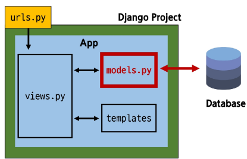

# Model

` > ` 다음에 쓰인 문구는 TIL 부분에 해당

# 목차

## Model
- Model class

## Model Field
- Field types
- Field options

## Migrations
- 추가 Migrations

## Admin site
- 관리자 인터페이스

## 참고
- 데이터베이스 초기화
- Migrations 관련
- SQLite

---------
# Model
---------
## Model

**데이터베이스와 Python 클래스(객체)로 추상화된 형태로 상호작용**

- Django의 강력한 기능: 개발자가 데이터베이스에 대한 깊은 지식 없이도 쉽게 데이터 관리 가능
- 유지보수 및 확장성 증대: 데이터베이스 변경 시에도 코드 수정 최소화, 재사용 가능한 데이터 모델을 통해 개발 효율성 향상
> 추상화? -> 구체적인 SQL 언어가 아닌 Python으로 할거라서 추상적
> 장고에서 제공하는 기능 이용 -> 유지보수 확장정 증대


## Model을 통한 DB(데이터베이스) 관리
> 모델과 DB는 다름  
- **urls.py**: 사용자 요청의 시작점
- **views.py**: 요청을 처리하고 models.py를 통해 데이터를 다룸
- **models.py**: 데이터베이스를 정의하고, 데이터베이스와 상호작용
- **templates**: views.py로부터 받은 데이터를 사용자에게 보여줌




## Model class

**DB의 테이블을 정의하고 데이터를 조작할 수 있는 기능들을 제공**

Model class는 데이터베이스 테이블의 구조를 설계하는 '정사진(blueprint)' 역할

어떤 데이터(컬럼)를 저장할지, 그 데이터의 형태는 어떠할지(타입, 길이 등)를 Python 코드로 명확히 정의

### Model 클래스 작성 


> models.Model : 상속 받은, 부모 클래스를 가져온 상태  
> models라는 모듈 안에 Model이라는 클래스가 있음  
> Article에는 부모 클래스로부터 상속받으 후 핵심 코드만 작성  


## Model 클래스 살펴보기 (1/4)

- 작성한 모델 클래스는 최종적으로 DB에 다음과 같은 테이블 구조를 만듦

```python
# articles/models.py
# 패키지와 모듈 관점
# 내장된 django 패키지 안에 db 서브 패키지 안에 models.py라는 모듈을 import
from django.db import models

class Article(models.Model):
    '''게시판에 관한 함수 만들 것
    '''
    # 2개의 클래스 변수 선언
    title = models.CharField(max_length=10) # 이름이 파스칼 케이스 >> **클래스**임
    content = models.TextField() # CharField의 인스턴스 title, TextField의 인스턴스 content
    # 인스턴스 생성 시 초기값 주는 경우 있음. 생성자 형성
```

> title과 content라는 column을 만든 것

**'모델 클래스 == 테이블 설계도'**

| id | title | content |
|----|-------|---------|
| .. | ..    | ..      |
| .. | ..    | ..      |

**id 필드는 Django가 자동 생성**
> 각각의 데이터는 고유 식별 키가 필요. >> id가 그 역할을 함  


## Model 클래스 살펴보기 (2/4)

- django.db.models 모듈의 Model이라는 부모 클래스를 상속받음
  - Model은 model에 관련된 모든 코드가 이미 작성되어있는 Class
  - 개발자는 가장 중요한 **테이블 구조를 어떻게 설계할지에 대한 코드만 작성하도록** 하기 위한 것
    ('상속'을 활용한 프레임워크의 기능 제공)

```python
# articles/models.py
class Article(models.Model):
    title = models.CharField(max_length=10)
    content = models.TextField()
```

## Model 클래스 살펴보기 (3/4)

- 클래스 변수명
  - 테이블의 각 "**필드**(열) 이름"

> 필드 = 열

## Model 클래스 살펴보기 (4/4)

- Model Field
  - 데이터베이스 테이블의 열(column)을 나타내는 중요한 구성 요소
  - "데이터의 유형"과 "제약 조건"을 정의
> Model 필드 클래스를 통애 데이터 타입, 길이 제한 등을 정해줌  
> title을 보면 CharField 는 문자열인 것 같음. 제약 조건으로 길이 제한이 있음  
> content도 문자열인거같음 


```python
# articles/models.py
class Article(models.Model):
    title = models.CharField(max_length=10)
    content = models.TextField()
```

**TIP**
- CharField의 max_length매개변수를 지정하는 것은 선택 사항
- SQLite는 문자열 컬럼의 길이에 대한 엄격한 제한을 강제하지 않기 때문
> django는 SQLite 사용. db를 SQLite로 넘길 것  
- 하지만, **유효성 검사 및 컬럼에 들어갈 데이터의 명확성을 위해 명시적으로 설정하는 것은 여전히 매우 권장**

**유용한 정보**  
정해진 규칙이나 조건에 따라 데이터의 정확성을 확인하는 과정


-----------
# Model Field
> 타입 / 제약 조건을 만들어냄
> 클래스로 이루어짐


## Model Field

**DB 테이블의 **필드(열)** 정의**  
**데이터 타입 및 제약 조건 명시**

Django는 이러한 필드 정의를 바탕으로 데이터베이스 컬럼을 자동으로 생성하고, 데이터 입력 시 유효성 검사 등 필요한 기능을 제공. 정확한 필드 정의는 애플리케이션의 안정성을 높이는 데 필수적


## Model Field

1. **Field types (필드 유형)**
   - 데이터베이스에 저장될 "데이터의 종류"를 정의

2. **Field options (필드 옵션)**
   - 필드의 "동작"과 "제약 조건"을 정의

```python
# articles/models.py
class Article(models.Model):
    title = models.CharField(max_length=10)
    content = models.TextField()
```

**Field types**: `CharField`, `TextField`  
**Field options**: `max_length=10`


## Field Types

데이터베이스에 저장될 **"데이터의 종류"**를 정의  
(models 모듈의 클래스로 정의되어 있음)

> 클래스를 통해 인스턴스 생성으로 컬럼 정의

## CharField()

제한된 길이의 문자열을 저장  
(필드의 최대 길이를 결정하는 max_length는 선택 옵션)

## TextField()

길이 제한이 없는 대용량 텍스트를 저장  
(무한대는 아니며 사용하는 시스템에 따라 달라짐)

## 주요 필드 유형

- **문자열 필드**
  - CharField, TextField

- **숫자 필드**
  - IntegerField, FloatField

- **날짜/시간 필드**
  - DateField, TimeField, DateTimeField

- **파일 관련 필드**
  - FileField, ImageField

**TIP**
다양한 Django 모델 필드 유형을 모두 다루기는 어려움

필요한 필드 유형은 Django 공식 문서를 참고

## Field Options

필드의 **"동작"**과 **"제약 조건"**을 정의

## 제약 조건
**Constraint**

특정 규칙을 강제하기 위해 테이블의 열이나 행에 적용되는 규칙이나 제한사항

수강생 정작도로 제한을 두거나, 문자가 100자 까지만 저장되도록 하는 등의 제한 조건을 의미


## 주요 필드 옵션

- **null**
  - 데이터베이스에서 NULL 값을 허용할지 여부를 결정 (기본값: False)

- **blank**
  - form에서 빈 값을 허용할지 여부를 결정 (기본값: False)

- **default**
  - 필드의 기본값을 설정

**DB에서 제약조건을 설정하는 방법은 DB 참조에서 학습할 예정**

**TIP**
다양한 Django 모델 필드 유형만이나 필드 옵션 또한 매우 다양. 각 모델 필드가 어떤 옵션을 가질 수 있는지는 Django 공식 문서를 참고하여 필요에 맞게 찾아 사용하길 권장


## Migrations

model 클래스의 변경사항(**필드 생성, 수정 삭제 등**)을 DB에 최종 반영하는 방법

모든 변경 사항이 코드로 관리되어 협업 시 모델 변경 내역에 대한 추적과 공유가 수월


## Django 모델 클래스와 Migration 과정 (1/2)

- 모델 정의부터 마이그레이션 파일 생성까지

```python
# articles/models.py
class Article(models.Model):
    title = models.CharField(max_length=10)
    content = models.TextField()
```

**모델 클래스 작성/수정**  
Django에서는 Python 클래스로 정의
- CharField: 제한된 길이의 문자열 저장
- TextField: 길이 제한 없는 대용량 텍스트

```bash
$ python manage.py makemigrations
```

**마이그레이션 파일 생성 명령어**  
Python 코드를 DB migration 파일(설계도)을 만드는 방법

```bash
$ python manage.py makemigrations

Migrations for 'articles':
  articles/migrations/0001_initial.py
    + Create model Article
```

**모델 변경을 감지하고 migration 파일을 생성하는 명령어**  
**migration 파일 == 최종 설계도**

## Django 모델 클래스와 Migration 과정 (2/2)

- 생성된 최종 설계도(0001_initial.py) 마이그레이션 파일을 DB에 반영하기

**마이그레이션 파일(0001_initial.py)**
- 마이그레이션 파일은 모델 변경사항을 기록한 Python 코드

**마이그레이션 파일을 DB 테이블 변경 내역을 순차적으로 저장하여 추적 관리**

```bash
$ python manage.py migrate
```

**SQL 실행 (자동 번역)**
- migrate 명령어는 마이그레이션 파일의 Python 코드를 SQL 문으로 자동 번역
- 변환 과정
  - Python 코드 → 번역 → SQL 쿼리 → 데이터베이스 실행

**SQL**  
DB를 조작하는데 사용되는 프로그래밍 언어나 쿼리 언어이자 데이터베이스 실행

## Migrations 과정 핵심 정리


## Migrations 핵심 명령어 2가지

```bash
$ python manage.py makemigrations
```
- **역할**: model class를 기반으로 최종 설계도(migration)를 작성

```bash
$ python manage.py migrate
```
- **역할**: 최종 설계도를 DB에 전달하여 반영


> 처음 migrate 실행 시 내장 앱들도 migration 진행하여 뜨는게 많음

**TIP**
- 마이그레이션 파일은 되도록이면 직접 건드리지 마세요!  
- migrations 폴더에 자동으로 생성되는 파일들은 직접 수정하거나 삭제하지 않는 것이 원칙


## Migration 경고 메시지

- Django 서버를 시작할 때 출력되는 migration 관련 경고 메시지
  - 이 메시지는 프로젝트 실행 시 **미적용 마이그레이션 파일**이 있을 때 나타남

```bash
$ python manage.py runserver
Watching for file changes with StatReloader
Performing system checks...

System check identified no issues (0 silenced).

You have 18 unapplied migration(s). Your project may not work properly until you apply the migrations for app(s): admin, auth, contenttypes, sessions.
Run 'python manage.py migrate' to apply them.
```

- **해결방법**
  - 경고 메시지에 명시된 대로 `python manage.py migrate` 명령어를 실행

- **중요한 이유**
  - 최신 모델 변경 사항이 데이터베이스에 반영되지 않아 **프로젝트가 제대로 작동하지 않을 수 있음**


> articles_article : 앱 이름_클래스 이름의 구조

------

# 추가 Migrations

## 이미 생성된 테이블에 필드를 추가해야 한다면?

- 이미 기존 테이블이 존재하는 경우, 새 필드를 추가할 때 문제가 발생할 수 있음
  - 기존에 레코드가 있는 테이블에 새로운 필드를 추가하면 어떤 값으로 채울지 결정해야 함
  - Django의 makemigrations 실행 시 기본값 설정을 요구하는 프롬프트가 표시됨

| id | title | content | created_at | updated_at |
|----|-------|---------|------------|------------|
| .. | ..    | ..      | ..         | ..         |
| .. | ..    | ..      | ..         | ..         |
| .. | ..    | ..      | ..         | ..         |

## Migration 과정 - 추가 모델 필드 작성 (1/5)

- 새로운 필드 작성

**모델 클래스 수정**  
Django 기존 모델을 수정

```python
# articles/models.py
class Article(models.Model):
    title = models.CharField(max_length=10)
    content = models.TextField()
    created_at = models.DateTimeField(auto_now_add=True)
    updated_at = models.DateTimeField(auto_now=True)
```

**Model Field**  
models.필드 유형(필드 옵션)

## DateTimeField의 필드 옵션 (optional)

**auto_now**
데이터가 **저장될 때마다** 자동으로 현재 날짜시간을 저장

**auto_now_add**
데이터가 **처음 생성될 때만** 자동으로 현재 날짜시간을 저장


## Migration 과정 - 추가 모델 필드 작성 (2/5)

- 새로운 필드 추가 후 makemigrations 명령어 입력

```bash
$ python manage.py makemigrations
```

- 이미 기존 데이터가 존재하기 때문에 필드를 추가 할 때 필드의 기본 값 설정이 필요
> 서술형 자주 출제
- **1번은 현재 대화를 유지하면서 직접 기본 값을 입력 하는 방법**
- **2번은 현재 대화에서 나간 후 models.py에 기본 값 관련 설정을 하는 방법**

```
It is impossible to add the field 'created_at' with 'auto_now_add=True' to article without providing a default.
This is because the database needs something to populate existing rows.
1) Provide a one-off default now which will be set on all existing rows
2) Quit and manually define a default value in models.py.
Select an option:
```

**TIP**
옵션 1: 일회성 기본값 제공
- 현재 대화를 프롬프트에서 기본값을 직접 입력
- 입력한 기본값은 기존의 모든 데이터 행에 적용


## Migration 과정 - 추가 모델 필드 작성 (3/5)

- 추가하는 필드의 기본 값을 입력해야 하는 상황

- 날짜 데이터이기 때문에 직접 입력하기 보다 Django가 제안하는 기본 값을 사용하는 것을 권장

- 아무것도 입력하지 않고 enter를 누르면 Django가 제안하는 기본 값으로 설정 됨

```
Please enter the default value as valid Python.
Accept the default 'timezone.now' by pressing 'Enter' or provide another value.
The datetime and django.utils.timezone modules are available, so it is possible to
provide e.g. timezone.now as a value.
Type 'exit' to exit this prompt
[default: timezone.now] >>>
```


## Migration 과정 - 추가 모델 필드 작성 (4/5)

- migrations 과정 종료 후 2번째 migration 파일이 생성됨을 확인

- 이처럼 Django는 설계도를 쌓아가면서 추후 문제가 생겼을 시 복구하거나 되돌릴 수 있도록 함
  (마치 'git commit'과 유사)

```
Migrations for 'articles':
  articles\migrations\0002_article_created_at_article_updated_at.py
    + Add field created_at to article
    + Add field updated_at to article
```

**migrations 폴더 구조:**
- migrations
  - __pycache__
  - __init__.py
  - 0001_initial.py
  - 0002_article_created_at_article_updated_at.py


## Migration 과정 - 추가 모델 필드 작성 (5/5)

- migrate 후 테이블 필드 변경 확인

```bash
$ python manage.py migrate
```

## 언제 Migration이 필요할까?

model class에 **변경사항(1)**이 생겼다면,

반드시 새로운 **설계도를 생성(2)**하고,

이를 **DB에 반영(3)**해야 한다.

**(1) model class 생성/수정 → (2) makemigrations → (3) migrate**

----

# Admin site

## 관리자 인터페이스
**Automatic admin interface**

**Django가 추가 설치 및 설정 없이 자동으로 제공하는 관리자 인터페이스**

- Django 관리자 인터페이스는 추가 설정 없이 자동 생성되는 웹 기반 관리 도구
- 주요 기능: 데이터베이스 모델의 CRUD(생성, 읽기, 업데이트, 삭제) 작업을 간편하게 수행할 수 있음
- 활용: 빠른 **프로토타이핑, 비개발자 데이터 관리, 내부 시스템 구축에 이상적**


## Django admin 계정 생성

1. **터미널 열기**
   - Django 프로젝트 폴더로 이동해서 터미널을 열 (manage.py 파일이 있는 위치에서 진행하면 됨)

2. **관리자 계정 생성 명령어 입력**
   ```bash
   $ python manage.py createsuperuser
   ```

3. **정보 입력**
   - 사용자 이름(username): 관리자 페이지에 로그인할 때 사용할 아이디를 입력
   - 이메일(email address): 선택 사항이며 입력하지 않고 엔터를 눌러 넘어가도 됨
   - 비밀번호(password): 로그인할 때 사용할 비밀번호 입력(**비밀번호 입력 시 글자 창에 아무것도 나타나지 않음**)
   - 비밀번호 확인(password(again)): 비밀번호를 한 번 더 입력해서 확인


### DB에 생성된 admin 계정 확인


## 관리자 인터페이스 페이지

- 웹 브라우저를 열고 다음 주소로 이동
  - http://127.0.0.1:8000/admin
  - 생성한 관리자 계정으로 정상 로그인 확인


## 관리자 인터페이스 접속 확인

- 로그인 후 아무것도 보이지 않는 것이 정상!
  - 우리가 만든 모델을 관리하려면 추가 설정이 필요


-----
# 참고

## 데이터베이스 초기화

## 데이터베이스 초기화 방법

1. **Migration 파일 삭제**
   - makemigrations 명령어로 생성되는 설계도(Migration 파일)
   - 아래 파일과 폴더는 삭제 금지
     - `__init__.py`
     - migrations 폴더

2. **db.sqlite3 파일 삭제**

## Migrations 관련


## Migrations 기타 명령어

- **showmigrations**
  - migrations 파일들이 migrate 됐는지 안됐는지 여부를 확인하는 명령어
  - [X] 표시가 있으면 migrate가 완료되었음을 의미

```bash
$ python manage.py showmigrations
```

- **sqlmigrate**
  - 해당 migrations 파일이 SQL 언어(DB에서 사용하는 언어)로 어떻게 번역되어 DB에 전달되는지 확인하는 명령어
  - `python manage.try sqlmigrate` **앱 이름** **마이그레이션 이름**

```bash
$ python manage.py sqlmigrate articles 0001
```


## 최초 migrate 시 출력 내용이 많은 이유는?

- Django 프로젝트가 동작하기 위해 미리 작성되어있는

- **기본 내장 app들에 대한 migration 파일들이 함께 migrate 되기 때문**


## SQLite

**데이터베이스 관리 시스템 중 하나이며 Django의 기본 데이터베이스로 사용됨**

- 파일 기반: 데이터베이스가 하나의 파일로 저장되어, 설치/설정 없이 **간편하게 복사/이동/백업 가능**
- 가벼고 빠름: 별도 서버 없이 파일로 직접 데이터 처리. 소규모 앱이나 모바일 환경에 최적화
- 높은 호환성: 다양한 운영체제와 프로그래밍 언어에서 폭넓게 사용 가능


## SQLite 주의사항

- **db.sqlite3 파일은 Git 등 버전 관리 시스템에서 관리하지 않는 것이 원칙**
  - 데이터가 변경될 때마다 **파일 전체가 변경됨**

- **SQLite 파일은 로컬 컴퓨터에 저장된 데이터 기록**

- **.gitignore 파일에 db.sqlite3을 추가하여 Git 버전 관리에서 제외해야 함**

**TIP**
**gitignore.io란?**
- gitignore.io는 개발자들이 .gitignore 파일을 쉽게 생성할 수 있도록 도와주는 웹 서비스
- gitignore.io에서 Django를 기준 스택으로 추가하면 .gitignore 파일을 자동 생성하며 db.sqlite3 가 자동으로 포함

**유용한 정보**  
.gitignore  
git 버전 관리 시스템에서 특정 파일이나 폴더를 추적하지 않도록 설정하는 파일


------

## Migration 과정

```bash
touch .gitignore
python -m venv venv
source venv/Scripts/activate
pip install -r requirement.txt
# models 만들기
python manage.py makemigrations
python manage.py migrate
# 첫 migration 진행
# 추가로 models.py에 코드(열) 추가한 뒤
python manage.py makemigraions
# 반영
python manage.py migrate

```

> model class에 변경사항 있으면  
> 새로운 설계도를 생성 (makemigrations)
> 이를 DB에 반영 (migrate)

## 관리자 인터페이스

```bash
python manage.py createsuperuser
# username 입력
# Email 입력(선택)
# password 입력(출력 안나옴)
python manage.py runserver
# 주소에 /admin/ 하고 name, password 입력
```
> 이후 admin.py 에서
```python
from .models import Article

admin.site.register(Article)
```
> `admin.site.register()` 는 단답형 자주 출제  


---------------

## 확인 문제

## Django 모델 연습 문제

**1. Django에서 모델 클래스는 어떤 클래스의 서브클래스로 정의되어야 하는가?**

a) HttpResponse  
b) ModelForm  
c) models.Model  
d) admin.ModelAdmin

**2. 사용자의 이름을 저장하기에 가장 적절한 필드 타입은 무엇인가?**

a) IntegerField  
b) CharField  
c) BooleanField  
d) DateTimeField

**3. 필드를 필수 입력 항목으로 설정하려면 어떤 옵션을 사용해야 하는가?**

a) max_length  
b) default  
c) null=True  
d) blank=False

**4. 모델 필드에 기본값을 지정하는 옵션은 무엇인가?**

a) default  
b) unique  
c) choices  
d) max_length


**5. 날짜와 시간을 모두 저장해야 할 경우 적절한 필드 타입은 무엇인가?**

a) DateField  
b) TimeField  
c) DateTimeField  
d) DurationField

**6. 모델 변경 사항을 반영하여 migration 파일을 생성하는 명령어는 무엇인가?**

a) python manage.py runserver  
b) python manage.py makemigrations  
c) python manage.py migrate  
d) python manage.py startapp

**7. migration 파일을 실제 데이터베이스에 적용하려면 어떤 명령어를 사용해야 하는가?**

a) makemigrations  
b) startproject  
c) migrate  
d) collectstatic

**8. 다음 중 CharField를 정의할 때 입력 값 길이 제한을 위해 부여할 수 있는 옵션은 무엇인가?**

a) null  
b) max_length  
c) unique  
d) default

**9. Django의 기본 데이터베이스 엔진으로 설정된 것은?**

a) MySQL  
b) PostgreSQL  
c) Oracle  
d) SQLite

**10. Django 모델 클래스 안에서 정의된 각 필드는 어떤 의미를 가지는가?**

a) HTML 입력 필드  
b) 뷰 함수  
c) 데이터베이스 컬럼  
d) URL 라우팅

**11. Admin 사이트에 모델을 등록하려면 어떤 함수를 사용해야 하는가?**

a) include()  
b) register()  
c) admin.site.register()  
d) path()

**12. Django에서 객체가 생성된 시점을 자동으로 기록하려면 DateTimeField에 어떤 옵션을 설정해야 하는가?**

a) auto_add=True  
b) auto_now=True  
c) auto_created=True  
d) auto_now_add=True


## 정답 및 해설

**1. c) models.Model  2. b) CharField  3. d) blank=False  4. a) default  5. c) DateTimeField  6. b) python manage.py makemigrations  7. c) migrate  8. b) max_length  9. d) SQLite  10. c) 데이터베이스 컬럼  11. c) admin.site.register()  12. d) auto_now_add=True**

1. Django의 모델은 models.Model 클래스를 상속받아 정의되어야 함

2. CharField는 문자열 데이터를 저장하는 데 사용되며, 이름과 같은 짧은 텍스트에 적합

3. blank=False는 해당 필드가 빈 값을 허용하지 않음을 의미하여 폼에서 필수로 입력하도록 만듦

4. default 옵션은 객체를 생성할 때 필드에 지정된 기본값을 자동으로 설정

5. DateTimeField는 날짜와 시간을 모두 저장할 수 있는 필드 타입

6. makemigrations 명령어는 모델의 변경 사항을 기반으로 새로운 migration 파일을 생성

7. migrate 명령은 migration 파일을 바탕으로 데이터베이스를 실제로 변경

8. CharField는 문자열 길이를 제한하기 위해 max_length 옵션을 지정할 수 있음

9. Django는 기본 설정에서 SQLite를 데이터베이스 엔진으로 사용

10. 모델 클래스의 각 필드는 실제 데이터베이스 테이블의 컬럼에 해당

11. admin.site.register() 함수를 사용하여 모델을 Admin 사이트에 등록할 수 있음

12. auto_now_add=True는 객체가 처음 생성될 때만 시각을 자동으로 기록해줌


-----------

## 핵심키워드

## Django Model 정리표

| 개념 | 설명 | 예시 |
|------|------|------|
| Model 클래스 | DB 테이블 구조를 설계 및 조작하는 청사진 역할의 Python 클래스 | `class Article(models.Model): ...` |
| Model Field | 테이블의 열(column)을 정의하며 데이터 유형과 제약을 명시 | `title = models.CharField(max_length=10)` |
| Field Type | DB에 저장될 데이터 종류를 지정하는 클래스 | CharField – 짧은 문자열, TextField – 대용량 텍스트 |
| Field Option | 필드의 동작 제약 조건을 설정 | `max_length=10, null=False, default='-'` |
| Migration | 모델 변경 사항을 DB에 반영하는 설계도 변경 이력 | 모델 수정 → makemigrations → migrate* 흐름 |
| makemigrations | 모델 변경을 감지해 migration 파일(설계도)을 생성 | `$ python manage.py makemigrations` |
| migrate | 생성된 migration을 실행해 DB 구조를 실제로 수정 | `$ python manage.py migrate` |
| Admin Site | 모델을 등록하면 웹 UI에서 CRUD를 즉시 수행 가능 | `admin.site.register(Article) 후 /admin 접속` |
---

## Django Model 핵심 요약

- **Model 클래스 = DB 설계도**
  - Article 등 models.Model을 상속해 컬럼을 파이썬 코드로 정의하면, 그 코드가 곧 데이터베이스 테이블 정사진이 됨

- **Django_modelField type & option으로 컬럼 속성 지정**
  - CharField, TextField 같은 유형과 max_length, null, default 같은 제약 옵션으로 데이터 형태와 규칙을 명확히 설정

- **Django_model마이그레이션 두 단계**
  - 모델 변경 ▶ python manage.py makemigrations(설계도 생성) ▶ python manage.py migrate(DB 적용) 순서로 진행하며, 변경 이력은 파일로 관리됨

- **Django_modelAdmin Site로 즉시 CRUD**
  - admin.site.register(Article) 후 /admin에 접속하면 브라우저에서 게시글 생성·조회·수정·삭제를 바로 실행할 수 있음


