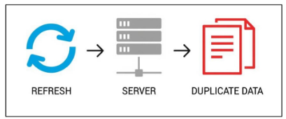
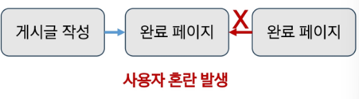
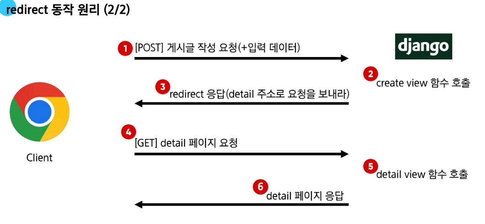

# ORM with view

**목차**

## Read

## Create

## HTTP request methods
- HTTP
- GET method
- POST method
- Post method 변경

## HTTP response status code
- CSRF

## Redirect

## Delete

## Update

## 참고
- GET & POST 비교
- 캐시 (Cache)

------------------
# Read

**2가지 Read(조회) 진행**

1. 전체 게시글 조회

2. 단일 게시글 조회 ✅


## 전체 게시글 조회

```python 
# articles/views.py
# 전체 게시글 조회(1) 후 메인 페이지 응답(2)
def index(request):
    # 1. DB에 전체 게시글을 조회
    articles = Article.objects.all()

    # 2. 전체 게시글 목록을 템플릿과 함께 응답
    context = {
        'articles': articles,
    }
    return render(request, 'articles/index.html', context)

```


```html
<!-- articles/index.html -->
 전체 게시글 출력 

<p>글 번호: {{ article.pk }}</p>
<a href="">
    글 제목: {{ article.title }}
</a>
<p>글 내용: {{ article.content }}</p>
<hr>


```

## 단일 게시글 조회

• 단일 게시글 조회 구현

```python
# articles/urls.py
urlpatterns = [
    ...
    path('<int:pk>/', views.detail, name='detail'),
]
```

```python
# articles/views.py
def detail(request, pk):
    article = Article.objects.get(pk=pk)
    context = {
        'article': article,
    }
    return render(request, 'articles/detail.html', context)
```

```html
<!-- templates/articles/detail.html -->
<h2>DETAIL</h2>
<h3>{{ article.pk }} 번째 글</h3>
<hr>
<p>제목: {{ article.title }}</p>
<p>내용: {{ article.content }}</p>
<p>작성일: {{ article.created_at }}</p>
<p>수정일: {{ article.updated_at }}</p>
<hr>
<a href="">[back]</a>
```
-------------

## 단일 게시글 이동 페이지 링크 작성

• 단일 게시글 이동 페이지 링크 구현

```html
<!-- templates/articles/index.html -->

<h1>Articles</h1>
<hr>

  <p>글 번호: {{ article.pk }}</p>
  <a href="">
    <p>글 제목: {{ article.title }}</p>
  </a>
  <p>글 내용: {{ article.content }}</p>
  <hr>

```

----
# Create

## Create 로직을 구현하기 위해 필요한 view 함수의 개수는?

사용자 입력 데이터를 받을  페이지를 렌더링 → 사용자가 입력한 요청 데이터를 받아 DB에 저장

**new** → **create**

Create 로직 구현에는 두 개의 view 함수가 필요함

## new - 페이지 렌더링 기능 구현

• 게시글 생성 페이지 구현

```python
# articles/urls.py
urlpatterns = [
    ...
    path('new/', views.new, name='new'),
]
```

```python
# articles/views.py
def new(request):
    return render(request, 'articles/new.html')
```

```html
<!-- templates/articles/new.html -->
<h1>NEW</h1>
<form action="#" method="GET">
  <div>
    <label for="title">Title: </label>
    <input type="text" name="title" id="title">
  </div>
  <div>
    <label for="content">Content: </label>
    <textarea name="content" id="content"></textarea>
  </div>
  <input type="submit">
</form>
<hr>
<a href="">[back]</a>
```

• Index 페이지에 new 페이지로 이동할 수 있는 하이퍼링크 작성

```html
<!-- templates/articles/index.html -->

<h1>Articles</h1>
<a href="">NEW</a>
<hr>
...
```

---

## create - 데이터 저장 기능 구현

• **데이터 저장 기능 구현 (1/2)**

```python
# articles/urls.py
urlpatterns = [
    ...
    path('create/', views.create, name='create'),
]
```

```python
# articles/views.py
def create(request):
    title = request.GET.get('title')
    content = request.GET.get('content')
    # 1. 인스턴스 생성 후 속성 할당 및 저장
    # article = Article()
    # article.title = title
    # article.content = content
    # article.save()
    # 2. 인스턴스 생성 시 속성 할당 후 저장
    article = Article(title=title, content=content)
    article.save()
    # 3. create() 메서드를 통한 인스턴스 생성 및 즉시 저장
    # Article.objects.create(title=title, content=content)
    return render(request, 'articles/create.html')
```

> 3번 방법의 경우 객체 생성과 저장이 동시에 일어남  
> 따라서 중간에 검증이나 추가 로직 넣기 어려움  
> 2번 방법을 통해 객체 생성과 저장을 분리하여 나중에 유효성 검사나 추가 로직 넣기 용이하게 함  

```html
<!-- templates/articles/create.html -->
<h1>게시글이 작성 되었습니다.</h1>
```


**• 데이터 저장 기능 구현 (2/2)**

```html
<!-- templates/articles/new.html -->
<h1>NEW</h1>
<form action="" method="GET">
  <div>
    <label for="title">Title: </label>
    <input type="text" name="title" id="title">
  </div>
  <div>
    <label for="content">Content: </label>
    <textarea name="content" id="content"></textarea>
  </div>
  <input type="submit">
</form>
<hr>
<a href="">[back]</a>
```

-----
# HTTP request methods
## HTTP

네트워크 상에서 데이터(리소스)를 주고 받기위한 약속

### **HTTP request methods란?**

• 데이터에 대해 수행을 원하는 작업(행동)을 나타내는 것  
  • 서버에게 원하는 작업의 종류를 알려주는 역할

• 대표적인 메서드

✓ **GET**  
• 리소스 조회  
• URL에 데이터가 노출됨  
• 캐싱 가능

✓ **POST**  
• 데이터 생성/전송  
• 요청 본문에 데이터  
• 데이터 노출 없음

**캐싱**  
자주 사용하는 데이터나 결과를 임시로 저장해두고 재활용하여 처리 속도를 높이는 기술

------------

## 'GET' Method

서버로부터 데이터를 요청하고 받아오는 데(조회) 사용

GET 메서드는 주로 검색 쿼리 전송, 웹 페이지 요청, 그리고 API에서 데이터를 조회하는 것과 같이 서버로부터 **데이터를 요청하고 받아오는 데 사용됨**

### 'GET' Method 특징

1. 데이터 전송  
   • URL의 쿼리 문자열(Query String)을 통해 데이터를 전송  
   • http://127.0.0.1:8000/articles/create?title=제목&content=내용

2. 데이터 제한  
   • URL 길이에 제한이 있어 대량의 데이터 전송에는 적합하지 않음

3. 브라우저 히스토리  
   • 요청 URL이 브라우저 히스토리에 남음

4. 캐싱  
   • 브라우저는 GET 요청의 응답을 로컬에 저장할 수 있음  
   • 동일한 URL로 다시 요청할 때, 서버에 접속하지 않고 저장된 결과를 사용  
   • 페이지 로딩 시간을 크게 단축

----------

## 'POST' method

서버에 데이터를 제출하여 리소스를  
**변경(생성, 수정, 삭제)** 하는 데 사용

POST 메서드는 주로 로그인 정보 제출, 파일 업로드, 새 데이터 생성(예: 새 게시글 작성), 그리고 API에서 데이터 변경을 요청하는 것과 같이 클라이언트가 **서버로 데이터를 전송하여 서버의 상태를 변경할 때** 사용됨

### 'POST' Method 특징

1. 데이터 전송  
   • HTTP Body를 통해 데이터를 전송

2. 데이터 제한  
   • GET에 비해 더 많은 양의 데이터를 전송할 수 있음

3. 브라우저 히스토리  
   • POST 요청은 브라우저 히스토리에 남지 않음

4. 캐싱  
   • POST 요청은 기본적으로 캐시 할 수 없음  
   • POST 요청이 일반적으로 서버의 상태를 변경하는 작업을 수행하기 때문

-------------
### 'GET' & 'POST' Method 정리

• GET과 POST는 각각의 특성에 맞게 적절히 사용해야 함

• GET  
  • 데이터 조회

• POST  
  • 데이터 생성이나 수정에 주로 사용


-----------

## Post method 변경

### Create 로직 수정 - "http method POST로 변경"

• new.html의 form 요청은 **새로운 article(새로운 데이터)을 생성하는 요청**  
  • POST method로 서버에 전달되는 것이 적절함

```html
<!-- templates/articles/new.html -->
<form action="" method="POST">
  <div>
    <label for="title">Title: </label>
    <input type="text" name="title" id="title">
  </div>
  <div>
    <label for="content">Content: </label>
    <textarea name="content" id="content"></textarea>
  </div>
  <input type="submit">
</form>
```

```python
# articles/views.py
def create(request):
    title = request.POST.get('title')
    content = request.POST.get('content')
```

> 이렇게 요청하면 403 에러뜸 >> CSRF token이 누락되었다고 뜸

## HTTP response status code

서버가 클라이언트의 요청에 대한  
처리 결과를 나타내는 3자리 숫자

클라이언트는 이 코드를 통해 요청이 성공했는지, 실패했는지, 아니면 추가적인 조치가 필요한지 즉시 파악할 수 있습니다. 이를 통해 웹 브라우저는 적절한 메시지를 사용자에게 표시하거나, 개발자는 문제 해결을 위한 단서를 얻게 됨


## 403 Forbidden

서버에 요청이 전달되었지만,  
**권한 때문에 거절되었다**는 것을 의미  

**403 Forbidden 응답으로 거절 된 이유**

• "CSRF token이 누락되었다" 라는 응답


## CSRF
Cross-Site-Request-Forgery

사이트 간 요청 위조

사용자가 자신의 의지와는 무관하게 공격자가 의도한 행동(글쓰기, 정보 수정, 송금 등)을 특정 웹사이트에 요청하게 만드는 해킹 방식


### CSRF (위조된 인감도장)

1. **신뢰할 수 있는 관계 (로그인)**   
   • 사용자는 은행(예: bank.com)에 정상적으로 로그인하여, 은행은 사용자를 신뢰하고 있다는 증표(세션 쿠키)를 브라우저에 발급. 이 쿠키가 바로 당신의 '인감도장'

2. **악성 위험장 (악성 링크)**   
   • 사기꾼(해커)은 "무료 경품 이벤트!"와 같은 미끼 링크를 사용자에게 보냄. 이 링크의 실제 내용은 "내 돈 100만원을 해커에게 송금하라"는 내용이 담긴, 당신의 인감도장과 쪼으면 되는 '위조된 위임장'

3. **나도 모르는 날인 (요청 전송)**  
   • 사용자가 미끼 링크를 클릭하는 순간, 당신의 브라우저는 자기도 모르게 bank.com에 위조된 위임장(송금 요청)을 보냄. 이때 브라우저는 bank.com에 보낼 때마다 인감도장(세션 쿠키)을 자동으로 찍어서 보냄

4. **은행의 착각 (공격 성공)**  
   • 은행 입장에서는 정상적인 인감도장이 찍힌 위임장이 도착했으므로, 이 요청이 당신의 진짜 의사라고 믿고 송금을 실행


### CSRF 공격의 방어

• Django는 이러한 공격을 막기 위해 **CSRF 토큰**이라는 안전장치를 사용

• 이는 위임장에 진짜 서명이 있는지 확인하는 것처럼, 모든 중요한 요청에 대해 "내가 직접 보낸 요청이 맞다"는 일회용 비밀 코드를 함께 보내도록 하여 위조된 요청을 막아줌


**CSRF Token 적용**

• DTL의 csrf_token 태그를 사용해 손쉽게 사용자에게 토큰 값을 부여

• 요청 시 토큰 값도 함께 서버로 전송될 수 있도록 하는 것

```html
<!-- templates/articles/new.html -->
<h1>NEW</h1>
<form action="" method="POST">
  
```
-----------

### 요청 시 CSRF Token을 함께 보내야 하는 이유

• Django 서버는 해당 요청이 DB에 데이터를 하나 생성하는(DB에 영향을 주는) 요청에 대해 "Django가 직접 제공한 페이지에서 데이터를 작성하고 있는 것인지"에 대한 확인 수단이 필요한 것

• 겉모습이 똑같은 위조 사이트나 정상적이지 않은 요청에 대한 방어 수단

• 기존 요청 형태  
  • 요청 데이터 → 게시글 작성

• 변경 요청 형태  
  • 요청 데이터 + **인증 토큰** → 게시글 작성


### 그런데 왜 POST일 때만 Token을 확인할까?

• POST는 단순 조회(GET)와 달리 **리소스의 변경(생성, 수정, 삭제)을 요청하는 의미와 기술적 특성**을 지님

• **DB에 조작을 가하는 요청은 반드시 인증 수단이 필요**

➤데이터베이스에 대한 변경사항을 만드는 요청이기 때문에 토큰을 사용해 최소한의 신원 확인을 하는 것

**게시글 작성 결과**

• 더 이상 URL에 Query String 형태로 보냈던 데이터가 표기되지 않음 (기존 GET method 방식)

• 게시글 생성 후 개발자 도구를 사용해 Form Data가 전송되는 것 확인

-----------

# Redirect

## 현재 문제 상황: 게시글 작성 후 응답 방식

• 현재 서비스는 게시글 작성(POST 요청) 이후, "게시글이 성공적으로 작성되었습니다"와 같은 완료 메시지 페이지를 직접 반환함. **게시글 저장 후 페이지를 응답하는 것은 POST 요청에 대한 적절한 응답이 아님**

• 이는 후속 행동(예: 새로고침, 뒤로 가기)에서 예기치 않은 동작을 유발할 수 있음

## 게시글 작성 성공 페이지 응답의 문제점

• HTTP 표준 관점  
  • POST 요청은 데이터 생성/변경에 사용되며, 동일 요청이 반복되면 안됨  
  • 현재 방식에서 사용자가 완료 페이지에서 새로고침 시 **중복 게시글 작성의 위험이 있음**

  

• 사용자 경험(UX) 관점  
  • 작성 완료 후 완료 페이지를 직접 응답하는 방식은 직관적이지 않고, 사용자가 예상하는 흐름과 다름  
  • 브라우저의 페이지 기록 관리와 상태 관리에 혼란을 줄 수 있음

  


## 게시글 작성 성공 후 적절한 응답 방법

**서버는 데이터 저장 후 페이지를 응답하는 것이 아닌, 사용자를 적절한 기존 페이지로 보내야 한다.**

• "사용자를 보낸다." ➤ "사용자가 GET 요청을 한번 더 보내도록 해야 한다."

• **실제로 서버가 클라이언트를 직접 다른 페이지로 보내는 것이 아닌 클라이언트가 GET 요청을 한번 더 보내도록 응답하는 것**

## redirect()

클라이언트가 인자에 작성된 주소로  
다시 요청을 보내도록 하는 함수


## redirect() 함수 적용

• create view 함수 변경

```python
# articles/views.py
from django.shortcuts import render, redirect

...

def create(request):
    title = request.POST.get('title')
    content = request.POST.get('content')
    article = Article(title=title, content=content)
    article.save()
    return redirect('articles:detail', article.pk)
```


## redirect 동작 원리 (1/2)

1. redirect 응답을 받은 클라이언트는 **detail url로 다시 요청을 보내게 됨**

2. 결과적으로 detail view 함수가 호출되어 detail view 함수의 반환 결과인 detail 페이지를 응답 받게 되는 것

➤결국 사용자는 게시글 작성 후 작성된 게시글의 detail 페이지로 이동하는 것으로 느끼게 됨

```python
from django.shortcuts import import render, redirect

def create(request):
    return redirect('articles:detail', article.pk)
```

## redirect 동작 원리 (2/2)

1. [POST] 게시글 작성 요청(+입력 데이터)

2. create view 함수 호출

3. redirect 응답(detail 주소로 요청을 보내라)

4. [GET] detail 페이지 요청

5. detail view 함수 호출

6. detail 페이지 응답



-----------

# Delete

## delete - 기능 구현 (2/2)

-----

### articles/urls.py

```python
urlpatterns = [
    ...
    path('<int:pk>/delete/', views.delete, name='delete'),
]
```

-----

### articles/views.py

```python
def delete(request, pk):
    article = article.objects.get(pk=pk)
    article.delete()
    return redirect('articles:index')
```

-----

### articles/detail.html

```html
<body>
<h2>DETAIL</h2>
<hr>
<form action="" method="POST">
    
    <input type="submit" value="DELETE">
</form>
<a href="">[back]</a>
</body>
```

-----------

# Update

## Update 로직 구현에 필요한 view 함수의 개수
---

### Update 로직 구성

1.  **edit**
    * **사용자 입력 데이터**를 받을 페이지를 렌더링
2.  **update**
    * **사용자**가 입력한 **요청 데이터**를 받아 **DB에 저장**

Update 로직 구현에는 두 개의 view 함수가 필요
----
## edit - 페이지 렌더링 기능 구현


#### articles/urls.py

```python
urlpatterns = [
    ...
    path('<int:pk>/edit/', views.edit, name='edit'),
]
```

-----

#### articles/views.py

```python
def edit(request, pk):
    article = Article.objects.get(pk=pk)
    context = {
        'article': article,
    }
    return render(request, 'articles/edit.html', context)
```

### 기능 구현: **수정 시 이전 데이터**가 출력될 수 있도록 작성

```html
<h1>EDIT</h1>
<form action="#" method="POST">
    
    <div>
        <label for="title">Title: </label>
        <input type="text" name="title" id="title" value="{{ article.title }}">
    </div>
    <div>
        <label for="content">Content: </label>
        <textarea name="content" id="content">{{ article.content }}</textarea>
    </div>
    <input type="submit">
</form>
<hr>
<a href="">[back]</a>
```
## input과 textarea에 기존 데이터 출력 **방법**

-----

### input 요소

한 줄 텍스트(예: 제목) **value** 속성으로 기존 데이터 입력

```html
<input type="text" name="title" id="title" value="기존데이터">
```

-----

### textarea 요소

여러 줄 텍스트(예: 본문) **value** 속성이 없고 태그 여닫는 사이에 값을 넣음

```html
<textarea name="content" id="content">기존 데이터</textarea>
```

-----

### TIP

  * **input**과 **textarea** 모두 기존 데이터를 화면에 미리 출력해 사용자가 **편리하게 수정 가능**
------

### 기능 구현: **edit 페이지**로 이동하기 위한 하이퍼링크 작성

```html
<body>
<a href="">EDIT</a><br>
<form action="" method="POST">
    
    <input type="submit" value="DELETE">
</form>
<a href="">[back]</a>
</body>
```
--------

## update - 기능 구현

-----

### articles/urls.py

```python
urlpatterns = [
    ...
    path('<int:pk>/update/', views.update, name='update'),
]
```

-----

### articles/views.py

```python
def update(request, pk):
    article = Article.objects.get(pk=pk)
    article.title = request.POST.get('title')
    article.content = request.POST.get('content')
    article.save()
    return redirect('articles:detail', article.pk)
```

## 작성 후 게시글 수정 테스트

```html
<h1>EDIT</h1>
<form action="" method="POST">
    
    <div>
        <label for="title">Title: </label>
        <input type="text" name="title" id="title" value="{{ article.title }}">
    </div>
    <div>
        <label for="content">Content: </label>
        <textarea name="content" id="content">{{ article.content }}</textarea>
    </div>
    <input type="submit">
</form>
<hr>
<a href="">[back]</a>
```

-----------
# 참고
## GET과 POST 비교

| 구분 | GET | POST |
| :--- | :--- | :--- |
| 데이터 전송 **방식** | URL의 Query string parameter | HTTP body |
| 데이터 크기 **제한** | 브라우저 제공 URL의 최대 길이 | **제한 없음** |
| 사용 **목적** | 데이터 검색 및 조회 | 데이터 제출 및 **변경** |
---------


## GET 요청이 필요한 **경우**

---

### 캐싱 및 **성능**

* **GET 요청**은 **캐시(Cache) 가능**, 이전에 요청한 정보를 새로 요청하지 않고 **사용 가능**
* 특히, 동일한 검색 결과를 여러 번 요청하는 경우 GET 요청은 **캐시를 활용**하여 더 **빠르게 응답 가능**

---

### 가시성 및 **공유**

* GET 요청은 **URL에 데이터가 노출**되어 사용자가 해당 URL을 **북마크**하거나 다른 사람과 **공유하기 용이**

---

### RESTful API **설계**

* HTTP 메서드의 의미에 따라 동작하도록 디자인된 **API의 일관성을 유지**할 수 있음
--------

## HTTP request methods를 활용한 효율적인 URL **구성**

* **동일한 URL** 한 개로 **method**에 따라 서버에 요구하는 **행동을 다르게 요구**
* **HTTP Methods**를 통해 웹 서버와 클라이언트 간의 통신에서 '**내가 무엇을 할지**'를 **명시적**으로 전달
* URL이 같아도 사용되는 **메서드(GET, POST 등)**에 따라 서버의 동작이 달라짐

---

### **예시**

* (GET) `articles/1/`
    * → 1번 게시글 **조회 요청**
* (POST) `articles/1/`
    * → 1번 게시글 **조작 요청**

## 캐시 (Cache)

**데이터나 정보**를 **임시로 저장**하여, 다시 요청할 때 **빠르게 제공**하는 저장 **공간**

---

### 캐시의 **장점**

* **빠른 응답 시간**: 이미 저장된 데이터를 즉시 제공하여 **사용자 경험 향상**
* **서버 부하 감소**: **반복적인 데이터 요청**을 줄여 **서버 자원 절약**

------------------------------------------

**1. GET 메서드의 특징으로 옳은 것은?**

a) 요청 본문(Body)에 데이터를 숨겨 전송
b) 서버 상태를 변경하는 작업에 주로 사용
c) 응답 결과를 브라우저가 캐시 가능
d) 브라우저 기록(History)에 남지 않음

---

**2. POST 메서드를 사용해야 하는 가장 적절한 상황은?**

a) 데이터 조회
b) 새 게시글 작성
c) 정적 파일 다운로드
d) 단순 페이지 이동

---

**3. HTTP 상태 코드 403 Forbidden이 의미하는 것은?**

a) 요청이 성공적으로 처리됨
b) 리소스를 찾을 수 없음
c) 권한 문제로 요청이 거절됨
d) 서버 오류가 발생

---

**4. Django에서 CSRF 토큰을 사용하는 주된 목적은?**

a) 데이터 압축
b) 사이트 간 요청 위조 방지
c) 정적 자원 캐싱
d) URL 라우팅 단축

**5. redirect() 함수가 render()와 다른 점으로 옳은 것은?**

a) 템플릿을 직접 렌더링
b) 클라이언트에게 다른 URL로 다시 요청하라는 응답을 줌
c) 데이터베이스 세션을 초기화
d) HTTP 404 오류를 발생

---

**6. Article.objects.create() 메서드의 특징으로 옳은 것은?**

a) 인스턴스를 생성하지만 저장하지 않음
b) 객체를 만들고 즉시 DB에 저장
c) 특정 조건에 맞는 객체를 조회
d) 기존 객체를 삭제

---

**7. URL에 데이터가 노출되는 전송 방식은?**

a) GET
b) POST
c) 둘 다
d) 둘 다 아님

---

**8. 캐시(Cache) 활용 시 기대할 수 있는 이점이 아닌 것은?**

a) 페이지 응답 속도 향상
b) 서버 부하 감소
c) 데이터 무결성 자동 보장
d) 반복 조회 시 네트워크 비용 절감


**9. URL 패턴 `<int:pk>/` 의 주된 용도는?**

a) 새 글 작성 페이지로 이동
b) 글 번호를 받아 해당 글 상세 페이지로 라우팅
c) 정적 파일 제공
d) 전체 글 목록 출력

---

**10. 모든 Article 레코드를 조회하여 QuerySet을 반환하는 메서드는?**

a) get()
b) filter()
c) all()
d) delete()

---

**11. HTTP 404 Not Found 응답을 반환해야 하는 가장 적절한 상황은?**

a) 사용자가 인증되지 않음
b) 서버 내부 로직 오류로 처리에 실패
c) 클라이언트가 요청한 URL에 해당하는 리소스가 존재하지 않음
d) 클라이언트의 요청 본문 형식이 잘못됨

---

**12. objects.get() 메서드에 대한 설명으로 옳은 것은?**

a) 조건에 맞는 모든 레코드를 QuerySet으로 반환
b) 조건과 일치하는 단 하나의 객체를 반환하며, 없으면 DoesNotExist 예외를 발생
c) 항상 새로운 객체를 생성하고 저장
d) 조건이 여러 개여도 예외 없이 첫 번째 객체만 반환


## 정답 및 해설

---

### 정답

1.  c) 응답 결과를 브라우저가 **캐시 가능**
2.  b) 새 게시글 작성
3.  c) 권한 문제로 요청이 거절됨
4.  b) 사이트 간 요청 위조 방지
5.  b) 클라이언트에게 다른 URL로 다시 요청하라는 응답을 줌
6.  b) 객체를 만들고 즉시 DB에 저장
7.  a) GET
8.  c) 데이터 무결성 자동 보장
9.  b) 글 번호를 받아 해당 글 상세 페이지로 라우팅
10. c) all()
11. c) 클라이언트가 요청한 URL에 해당하는 리소스가 존재하지 않음
12. b) 조건과 일치하는 단 하나의 객체를 반환하며, 없으면 DoesNotExist 예외를 발생

---

### 해설

1.  **GET**은 주로 조회에 사용되며, 동일 URL에 재요청 시 **브라우저 캐시**를 활용할 수 있음
2.  **POST**는 서버의 리소스를 생성·수정·삭제하는 요청에 사용되며, **게시글 작성**이 대표적
3.  **403**은 서버가 요청을 이해했으나 **권한 부족** 등으로 거부했음을 나타냄
4.  **CSRF 토큰**은 사용자가 의도하지 않은 악의적 **POST 요청을 차단**하는 보안 장치
5.  **Redirect()**는 3xx 응답을 보내어 브라우저가 지정된 URL로 GET 요청을 다시 보내도록 유도
6.  **create()**는 객체를 만들면서 **save()**까지 한 번에 수행
7.  **GET**은 **쿼리 문자열**로 데이터를 전달하므로 **URL에 보임**. POST는 HTTP Body에 담김
8.  **캐시**는 성능과 비용 측면에서 유리하지만 데이터 변경 시 **일관성 관리가 필요**
9.  `<int:pk>`는 **정수형 기본 키 값**을 캡처하여 **detail view**처럼 특정 객체 상세 조회에 사용
10. **all()**은 조건 없이 테이블의 모든 레코드를 담은 **QuerySet**을 돌려줌
11. **404**는 요청한 경로는 유효하지만, 그 경로에 매핑되는 데이터나 뷰가 존재하지 않을 때 사용
12. **get()**은 단일 객체 조회 전용이며, 결과가 없거나 2개 이상이면 **예외를 발생**시킴


