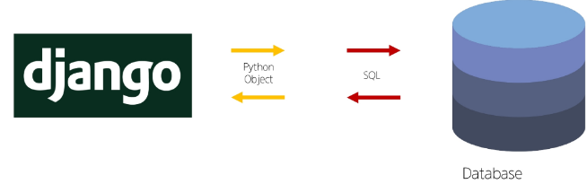
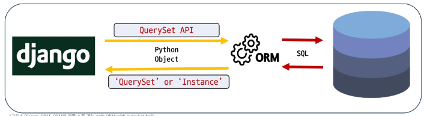
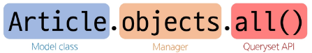
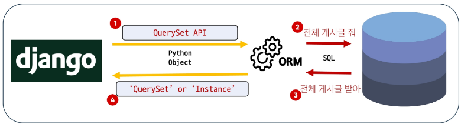
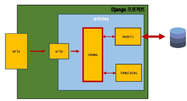

# **목차**

## ORM

## QuerySet API

## QuerySet API 실습

• Create
• Read
• Update
• Delete

## ORM with view

• 전체 게시글 조회

## **참고**

• Field lookups
• ORM, QuerySet API를 사용하는 이유

----

## ORM

Object-Relational-Mapping

객체 지향 프로그래밍 언어의 객체(Object)와
데이터베이스의 데이터를 매핑(Mapping)하는 기술


**문제 상황: 언어 차이로 인한 소통 불가**

• Django는 Python 언어를 사용하지만 데이터베이스는 SQL 언어를 사용함



**ORM의 역할: 번역자 역할**

• ORM은 Django와 데이터베이스 사이에서 언어 번역자 역할을 수행  

**TIP**
• 마치 외국과의 대화할 때 '통역사'가 중간에서 **언어를 번역**해 주는 것과 같음  
• 덕분에 개발자는 데이터베이스 구조를 잘 몰라도 파이썬 코드로 쉽게 데이터를 다룰 수 있음  
• 코드 작성 시간을 줄이고, 실수를 줄이는 데 큰 도움  

**Django의 데이터 상호작용: ORM이 일하는 방법**

• ORM은 Django 개발자를 위해 'QuerySet API'라는 특별한 도구를 제공함  
• QuerySet API는 ORM의 기능을 개발자가 Python 코드 안에서 객체 지향적이고 직관적인 방식으로 데이터베이스를 조작할 수 있도록 제공하는 인터페이스  


## QuerySet API

데이터베이스의 복잡한 SQL 쿼리문을,
직관적인 Python 코드로 다룰 수 있게 해주는
강력한 번역기

• 개발자는 SQL을 직접 작성하지 않고도 `.filter()`, `.exclude()`, `.order_by()` 등 파이썬다운 메서드를 사용하여 원하는 데이터를 손쉽게 생성, 조회, 수정, 삭제할 수 있음

• 눈 코드의 가독성을 높이고, 개발 생산성을 극대화하는 Django ORM의 핵심 기능


**QuerySet API와 ORM의 동작 방식**

1. Django → DB: Django(QuerySet API)에서 ORM을 통해 데이터베이스로 정보를 요청할 때
   • SQL 쿼리로 변환되어 데이터베이스로 전달됨

2. DB → Django: 데이터베이스가 요청에 대한 응답을 보낼 때,
   • ORM은 이 SQL 결과를 다시 파이썬이 이해할 수 있는 Python Object
   • QuerySet 또는 Instance 형태로 변환하여 Django로 반환




## QuerySet API 구문 기본 구조



• Article (모델 클래스)
  • 역할: 데이터베이스 테이블에 대한 Python 클래스 표현  
  • articles_article 테이블의 스키마(컬럼, 데이터 타입 등)를 정의하며, Django ORM이 데이터베이스와 상호작용할 때 사용하는 기본적인 구조  

• .objects (매니저, manager)
  • 역할: 데이터베이스 조회(Query) 작업을 위한 기본 인터페이스  
  • 모든 Django 모델 클래스는 쿼리 작업을 수행할 수 있는 특별한 속성을 자동으로 지정받음  
  • Django는 모든 모델에 objects라는 이름의 매니저를 자동으로 추가하며, 이 매니저를 통해 `.all()`, `.filter()` 등의 쿼리 메서드를 호출  

• .all() (QuerySet API 메서드)
  • 역할: 특정 데이터베이스 작업을 수행하는 명령  
  • 매니저를 통해 호출되는 메서드로, 해당 모델과 연결된 테이블의 모든 레코드(rows)를 조회하는 SQL 쿼리를 생성하고 실행  

## QuerySet API와 ORM의 동작 방식 예시

  


**Query란?**

• 데이터베이스에 특정한 데이터를 보여 달라는 요청

• "쿼리문을 작성한다."  
  • "원하는 데이터를 얻기 위해 데이터베이스에 요청을 보낼 코드를 작성한다."

• Django에서 Query가 처리되는 과정 정리

1. 파이썬 코드 → ORM: 개발자의 QuerySet API(파이썬 코드)가 ORM으로 전달

2. ORM → SQL 번역: ORM이 이를 데이터베이스용 SQL 쿼리로 번역하여 데이터베이스에 전달

3. DB 응답 → ORM: 데이터베이스가 SQL 쿼리를 처리하고 결과 데이터를 ORM에 반환

4. ORM → QuerySet 반환: ORM이 데이터베이스의 결과를 QuerySet (파이썬 객체) 형태로 변환하여 우리에게 전달


**QuerySet이란?**

• 데이터베이스에서 전달받은 객체 목록(데이터 모음)

• 순회 가능한 데이터로 1개 이상 데이터를 불러와 사용 가능함

• Django ORM을 통해 만들어진 자료형

• 단, 데이터베이스가 단일 객체를 반환할 때는 QuerySet이 아닌 모델(Class)의 인스턴스로 반환됨


-------------

# QuerySet API 실습

## CRUD

대부분의 소프트웨어가 가지는 기본적인 데이터 처리 기능인 생성, 조회, 수정, 삭제를 묶어서 일컫는 말

Django에서는 QuerySet API를 통해, 복잡한 SQL문 없이 Python 코드 이러한 CRUD 작업을 직관적으로 수행할 수 있음

• Create: 새로운 데이터를 생성 (저장)
• Read: 기존 데이터를 조회
• Update: 기존 데이터를 수정 (갱신)
• Delete: 기존 데이터를 삭제


## Create

**QuerySet API 실습 사전 준비**

• 외부 라이브러리 설치 및 의존성 기록  
  • IPython은 일반 파이썬 쉘(명령창)보다 자동 완성 등 편리한 파이썬 작업 환경을 만들어주는 도구

```
$ pip install ipython
```

```
$ pip freeze > requirements.txt
```


**QuerySet API 실습 사전 준비**

• Django Shell 접속하기: Django Shell이란?  
  • Django 프로젝트의 코드를 명령창에서 바로 실행하고 테스트하는 특별한 파이썬 환경  
  • Django 환경 내에서 실행되기 때문에 입력하는 QuerySet API 구문이 Django 프로젝트에 영향을 미침

• Django Shell 접속하기

```
$ python manage.py shell
```

**QuerySet API 실습 사전 준비**

• Shell "-v" 옵션 (기본값: 1)  
  • 출력 상세도(verbosity) 설정: 얼마나 자세한 정보를 더 많은 디버깅 정보나 진행 상황 메시지를 보여달라는 요청  
  • 아래 예시는 shell 시작 시 Django 프로젝트에 등록된 model이 자동으로 import 될 내용이 출력되는 것

```
$ python manage.py shell -v 2
```

**데이터 객체를 만드는(생성하는) 3가지 방법**

1. 빈 객체 생성 후 값 할당 및 저장

2. 초기 값과 함께 객체 생성 및 저장

3. create() 메서드로 한 번에 생성 및 저장


**첫번째 방법: 빈 객체 생성 후 값 할당 및 저장(1/3)**

```
# 특정 테이블에 새로운 행을 추가하여 데이터 추가

>>> article = Article() # Article(class)로부터 article(instance) 생성
>>> article
<Article: Article object (None)>

>>> article.title = 'first' # 인스턴스 변수(title)에 값을 할당
>>> article.content = 'django!' # 인스턴스 변수(content)에 값을 할당
```

```
# save를 하지 않으면 아직 DB에 값이 저장되지 않음

>>> article
<Article: Article object (None)>
>>> Article.objects.all()
<QuerySet []>
```


**첫번째 방법: 빈 객체 생성 후 값 할당 및 저장(2/3)**

```
# save를 호출하고 확인하면 저장된 것을 확인

>>> article.save()
>>> article
<Article: Article object (1)>

>>> article.id
1

>>> article.pk
1

>>> Article.objects.all()
<QuerySet [Article: Article object (1)]>
```

**첫번째 방법: 빈 객체 생성 후 값 할당 및 저장(3/3)**

```
# 인스턴스 article을 활용하여 인스턴스 변수 활용하기

>>> article.title
'first'

>>> article.content
'django!'

>>> article.created_at
datetime.datetime(2023, 6, 30, 6, 55, 42, 322526, tzinfo=datetime.timezone.utc)
```

**두번째 방법: 초기 값과 함께 객체 생성 및 저장**

```
>>> article = Article(title='second', content='django!')
# 아직 저장 되어있지 않음
>>> article
<Article: Article object (None)>

# save를 호출해야 저장됨
>>> article.save()

>>> article
<Article: Article object (2)>

>>> Article.objects.all()
<QuerySet [<Article: Article object (1)>, <Article: Article object (2)>]>
```

```
# 값 확인

>>> article.pk
2

>>> article.title
'second'

>>> article.content
'django!'
```

• 첫번째 방법 두번째 방법 모두 결국 **save 메서드를 호출해야 비로소 DB에 데이터가 저장됨**

• 테이블에 한 행(레코드)이 쓰여진 것


## save()

객체를 데이터베이스에 저장하는 인스턴스 메서드

**TIP**
• save()가 필요한 경우는?  
  • 객체를 만지 생성한 후, 데이터베이스에 저장하기 전에 추가적인 처리  
    (예: 다른 데이터와 관계 설정, 유효성 검사)가 필요할 때 save()를 호출함


**세번째 방법: create() 메서드로 한 번에 생성 및 저장**

```
# 위 2가지 방법과 달리 바로 저장 이후 바로 생성된 데이터가 반환된다.

>>> Article.objects.create(title='third', content='django!')
<Article: Article object (3)>
```

**TIP**
• save()를 명시적으로 호출하지 않는 것처럼 보이는 이유는 create() 메서드 자체가 객체 생성과 데이터베이스 저장을 한 번에 처리하는 단축 메서드이기 때문

-----------

## Read

**대표적인 조회 메서드**

• QuerySet 반환 메서드  
  • all()  
  • filter()

• QuerySet을 반환하지 않는 메서드  
  • get()

QuerySet  
데이터베이스에서 전달받은  
객체 목록


## all()

전체 데이터 조회

```
>>> Article.objects.all()
<QuerySet [<Article: Article object (1)>, <Article: Article object (2)>, <Article: Article object (3)>]>
```

## filter()

주어진 매개변수와 일치하는 객체를 포함하는 QuerySet 반환

```
>>> Article.objects.filter(content='django!')
<QuerySet [<Article: Article object (1)>, <Article: Article object (2)>, <Article: Article object (3)>]>

>>> Article.objects.filter(title='abc')
<QuerySet []>

>>> Article.objects.filter(title='first')
<QuerySet [<Article: Article object (1)>]>
```

**QuerySet을 반환하지 않는 메서드: get()**

## get()

주어진 매개변수와 일치하는 **객체를 반환**

```
>>> Article.objects.get(pk=1)
<Article: Article object (1)>

>>> Article.objects.get(pk=100)
DoesNotExist: Article matching query does not exist.

>>> Article.objects.get(content='django!')
MultipleObjectsReturned: get() returned more than one Article -- it returned 2!
```

**get()의 특징**

• 객체를 찾을 수 없으면 DoesNotExist 에외를 발생시키고,  
  둘 이상의 객체를 찾으면 MultipleObjectsReturned 에러를 발생시킴

• 위와 같은 특징을 가지고 있기 때문에 **primary key**와 같이 고유성(uniqueness)을 보장하는 조회에서 사용해야 함

**Primary key(pk)**  
DB 테이블에서 각 행을 고유하게 식별할  
수 있는 속성

## Update
**데이터 수정 방법**

• 인스턴스 변수를 변경 후 save 메서드 호출

```
# 수정할 인스턴스 조회
>>> article = Article.objects.get(pk=1)

# 인스턴스 변수를 변경
>>> article.title = 'byebye'

# 저장
>>> article.save()
```

## delete
**데이터 삭제 방법**

• 삭제하려는 데이터 조회 후 delete 메서드 호출

```
# 삭제할 인스턴스 조회
>>> article = Article.objects.get(pk=1)

# delete 메서드 호출 (삭제 된 객체가 반환)
>>> article.delete()
(1, {'articles.Article': 1})

# 삭제한 데이터는 더이상 조회할 수 없음
>>> Article.objects.get(pk=1)
DoesNotExist: Article matching query does not exist.
```

-------
#  ORM with view
## 전체 게시글 조회

## ORM with view

• View 함수에서 QuerySet API 활용하기  
  • View에서의 QuerySet API:  
    • 웹 페이지에 보여줄 데이터를 DB에서 가져올 때 사용함  
    • 사용자가 입력한 새로운 데이터를 DB에 저장할 때 사용함

• 2가지 Read(조회)

1. 전체 게시글 조회
2. 단일 게시글 조회




## 전체 게시글 조회

• 요청 정의

```python
#crud/urls.py
from django.urls import path, include

urlpatterns = [
    path('admin/', admin.site.urls),
    path('articles/', include('articles.urls')),
]
```

```python
# articles/urls.py
from django.urls import path
from . import views

urlpatterns = [
    path('', views.index, name='index'),
]
```

**crud는 Django 프로젝트 이름**

**TIP**
• 앱 URL에서 빈 문자열('')의 의미는?  
  • 프로젝트 urls.py에서 include("articles.urls")는 articles/로 시작하는 모든 요청을 articles 앱의 urls.py로 넘겨줍니다.  
  이때, articles/ 뒤에 아무것도 없는 경우 (articles/ 자체)를 의미하여, 해당 view 함수를 실행하게 됩니다.

  ```python
# articles/views.py
from .models import Article

def index(request):
    articles = Article.objects.all()
    context = {
        'articles': articles,
    }
    return render(request, 'articles/index.html', context)
```

```html
<!--articles/index.html-->
<h1>Articles</h1>
<hr>

  <p>글 번호: {{ article.pk }}</p>
  <p>글 제목: {{ article.title }}</p>
  <p>글 내용: {{ article.content }}</p>
  <hr>

```

----------

# 참고

## Field lookups

다양 등치 비교(=)를 넘어 더 상세한 조건으로 데이터를 조회할 수 있도록 Django ORM이 제공하는 기능

• 예를 들어 '특정 단어가 포함된 제목', '특정 날짜 이후에 작성된 글' 등을 찾을 수 있게 해줍니다.  
• 이를 통해 복잡한 데이터 조회도 파이썬 코드로 간결하고 강력하게 처리할 수 있습니다.

**Field lookups의 간단한 예시**

• title 필드가 'second'으로 시작하는 Article 데이터(레코드)를 모두 찾고 싶다면?


• Field Lookups은 모델의 필드 이름 뒤에 이중 밑줄(double underscore, __)을 붙이고, 원하는 조회 유형을 명시하는 방식으로 사용

• filter(), exclude() 및 get()에 대한 키워드 인자로 지정, 순쉽게 필터링 로직을 구성

```python
# Field lookups 예시
# "내용에 'dja'가 포함된 모든 게시글 조회"
Article.objects.filter(content__contains='dja')

# "제목이 he로 시작하는 모든 게시글 조회"
Article.objects.filter(title__startswith='he')
```

**다양한 조건의 Field lookups 조회 조건**

• exact / iexact  
  • exact: 대소문자를 구분하여 정확히 일치하는 값을 찾음  
  • iexact: 대소문자 구분 없이(대소문자 무시) 정확히 일치하는 값을 찾음

• contains / icontains  
  • contains: 문자열 내에 특정 값이 포함되어 있는지 (대소문자 구분)  
  • icontains: 문자열 포함 여부를 대소문자 구분 없이 확인

• 비교 연산자 (gt, gte, lt, lte)  
  • 숫자 또는 날짜 필드에 대해 크거나 작음을 비교


  ---------

## ORM, QuerySet API를 사용하는 이유는?

1. 데이터베이스 추상화  
   • 개발자는 특정 데이터베이스 시스템에 종속되지 않고 일관된 방식으로 데이터를 다룰 수 있음

2. 생산성 향상  
   • 복잡한 SQL 쿼리를 직접 작성하는 대신 Python 코드로 데이터베이스 작업을 수행할 수 있음

3. 객체 지향적 접근  
   • 데이터베이스 데이터를 Python 객체로 다룰 수 있어 객체 지향 프로그래밍의 이점을 활용할 수 있음


----------------
## 핵심 키워드

| 개념 | 설명 | 예시 |
|------|------|------|
| Django Shell | 프로젝트 코드 안에서 ORM 명령을 바로 실행·테스트할 수 있는 특수 파이썬 환경 | python manage.py shell 또는 python manage.py shell -v 2 |
| 객체 생성 ① | 빈 인스턴스 생성 → 필드 값 할당 → save() 호출 | article = Article(); article.title='first'; article.save() |
| 객체 생성 ② | 초기 값 포함 인스턴스 생성 → save() 호출 | article = Article(title='second', content='django!'); article.save() |
| 객체 생성 ③ | create() 단축 메서드로 생성+저장을 한 번에 수행 | Article.objects.create(title='third', content='django!') |
| save() | 인스턴스의 변경 사항을 데이터베이스에 저장하는 메서드 | 설명 : "객체를 DB에 저장하는 인스턴스 메서드" |
| all() | 테이블의 모든 레코드를 조회하는 QuerySet 메서드 | Article.objects.all() → <QuerySet [...]> |
| filter() | 조건에 맞는 다중 레코드 QuerySet 반환 | Article.objects.filter(content='django!') |

## 요약

• Django Shell에서 Article 모델로 직접 CRUD 흐름을 실행하며 ORM 동작 원리를 확인했다.

• 객체 생성은 세 가지 방법으로 가능함을 익혔다.
  1. 빈 인스턴스 → 필드 값 입력 → save()
  2. 필드 값을 포함해 인스턴스 생성 → save()
  3. Article.objects.create() 단축 메서드

• 조회는 all()로 전체, filter()로 조건 다중, get()으로 조건 단일 레코드를 반환하며, get()은 반환 건수가 0 또는 2 건 이상일 때 에외를 발생시킨다.

• 수정은 조회된 인스턴스의 필드 변경 후 save()를 호출해 반영하며, 삭제는 delete()로 수행한다.

• QuerySet API를 사용하면 Python 문법만으로 데이터 추가·검색·변경·삭제가 가능하고, SQL을 직접 작성할 필요가 없다.

----------------
## 확인 문제

1. Django에서 ORM(Object Relational Mapping)의 주된 목적은 무엇인가?

a) HTML 렌더링을 단순화하기 위해  
b) SQL 쿼리를 직접 작성하지 않고 데이터베이스를 조작하기 위해  
c) 서버의 속도를 향상시키기 위해  
d) CSS 파일을 자동으로 생성하기 위해

2. 다음 중 Django ORM으로 새로운 게시글 객체를 생성하는 코드로 올바른 것은?

a) Post.new(title="New Post")  
b) Post.make(title="New Post")  
c) Post.objects.create(title="New Post")  
d) Post.objects.add(title="New Post")

3. 모든 게시글을 조회하기 위한 Django ORM 코드는?

a) Post.all()  
b) Post.objects()  
c) Post.objects.get()  
d) Post.objects.all()

4. 게시글 ID가 1인 객체의 제목을 수정하는 올바른 코드 조합은?

a) Post.objects.set(id=1, title="수정됨")  
b) Post.objects.get(id=1).update(title="수정됨")  
c) Post.update(id=1, title="수정됨")  
d) post = Post.objects.get(id=1)  
   post.title="수정됨"  
   post.save()

5. 게시글 하나를 삭제하는 가장 알맞은 방법은?

a) Post.objects.delete(id=1)  
b) Post.objects.get(id=1).delete()  
c) Post.remove(id=1)  
d) delete Post where id=1

6. 제목이 정확히 "Welcome"인 게시글만 조회하고 싶을 때 알맞은 쿼리는?

a) Post.objects.filter(title="Welcome")  
b) Post.objects.filter(title__contains="Welcome")  
c) Post.objects.get(title__startswith="Welcome")  
d) Post.objects.exclude(title="Welcome")

7. 제목에 "Django"라는 단어가 포함된 게시글을 조회하는 코드는?

a) Post.objects.filter(title__has="Django")  
b) Post.objects.filter(title_contains="Django")  
c) Post.objects.filter(title__contains="Django")  
d) Post.objects.get(title__contains="Django")

8. Django ORM을 사용하는 주요 장점 중 틀린 것은?

a) 코드의 가독성이 높아진다  
b) SQL Injection의 위험을 줄인다  
c) 모든 쿼리를 수동으로 작성해야 한다  
d) 다양한 데이터베이스에 대해 추상화된 접근이 가능하다

9. 작성자가 'anonymous'인 게시글을 모두 삭제하는 가장 적절한 방법은?

a) Post.delete(author="anonymous")  
b) Post.objects.filter(author="anonymous").delete()  
c) Post.remove(author="anonymous")  
d) Post.objects.get(author="anonymous").delete_all()

10. 다음 중 게시글 제목을 일괄 변경할 때 사용할 수 있는 QuerySet API는?

a) update()  
b) set()  
c) save_all()  
d) apply()

11. 전체 게시글을 삭제하려면 어떤 코드를 사용할까?

a) Post.delete()  
b) Post.remove_all()  
c) Post.objects.all().delete()  
d) Post.objects.clear()

12. 다음 중 Post.objects.all()과 Post.objects.get(id=1)의 리턴값에 대한 설명으로 옳은 것은?

a) 둘 다 단일 객체를 반환한다  
b) 둘 다 QuerySet을 반환한다  
c) all()은 QuerySet을 반환하고, get()은 단일 객체를 반환한다  
d) get()은 리스트를 반환하고, all()은 None을 반환한다

----


**정답 및 해설**

1. b) SQL 쿼리를 직접 작성하지 않고 데이터베이스를 조작하기 위해 2. c) Post.objects.create(title="New Post") 3. d) Post.objects.all() 4. d) post = Post.objects.get(id=1) post.title="수정됨" post.save() 5. b) Post.objects.get(id=1).delete() 6. a) Post.objects.filter(title="Welcome") 7. c) Post.objects.filter(title__contains="Django") 8. c) 모든 쿼리를 수동으로 작성해야 한다 9. b) Post.objects.filter(author="anonymous").delete() 10. a) update() 11. c) Post.objects.all().delete() 12. c) all()은 QuerySet을 반환하고, get()은 단일 객체를 반환한다

1. Django ORM은 파이썬 코드만으로 데이터베이스를 다룰 수 있게 해주며, SQL을 별도로 복잡한 데이터 조작이 가능하게 함

2. Post.objects.create()는 새 레코드를 생성하고 저장하는 데 사용됨

3. Post.objects.all()은 해당 모델의 모든 게시글을 반환함

4. 객체를 조회하고 필드를 수정한 후 .save()로 반영하는 것이 일반적인 방법

5. 객체를 get()으로 조회한 다음 .delete() 메서드를 호출해 삭제할 수 있음

6. 조건 없이 문자열과 정확히 일치할 때는 필드명만 써도 되며, title="Welcome"은 title이 정확히 "Welcome"인 값을 찾음

7. field__contains는 해당 필드에 특정 문자열이 포함된 객체를 조회할 수 있음

8. ORM을 사용하면 이전 중 하나는 쿼리를 자동으로 생성해주는 기능으로, 직접 작성할 필요가 줄어듦

9. .filter()로 조건에 맞는 객체들을 선택하고, .delete()를 호출하면 해당 객체들이 모두 삭제됨

10. update() 메서드는 필터링된 QuerySet에 대해 필드 값을 일괄적으로 수정할 때 사용함

11. Post.objects.all()은 전체 게시글을 선택하고, .delete()는 이를 삭제함

12. all()은 여러 객체가 담긴 QuerySet을 반환하고, get()은 조건에 일치하는 하나의 객체만 반환함. get() 결과는 QuerySet이 아닌 모델 인스턴스


--------

## QuerySet 진행 과정

```bash

python manage.py migrate
python manage.py shell
# 또는
python manage.py shell -v 2
Atricle.objects.all()

```
## create
> 빈거 만들고 채우는 방식
```bash

article = Article() # 인스턴스 생성
# title이라는 인스턴스 변수
article.title = 'first'
article.content = 'django!'
# 아직 articles에는 게시글 작성 안된 상태
# 준비만 하고 요청은 안함 
article.save()
# save로 요청하기 
article

article.id
# id 대신 pk를 씀
article.pk
#primary key
```
> save()는 class Article에 있음   
> Article(models.Model)의 Model에서 상속 받고 있음

-------------------

# 단계별 진행 참고

```bash
touch .gitignore
python -m venv venv
source venv/Scripts/activate
pip install django
# 또는 pip install -r requirements.txt
pip freeze > requirements.txt

django-admin startproject 프로젝트이름 .
python manage.py startapp 앱이름
```
> settings.py 에서 INSTALLED_APPS에 앱 등록  

## 모델 클래스 정의 

```python
from django.db import models
import requests
from datetime import datetime 

# Create your models here.
class Book(models.Model):
    isbn = models.CharField(max_length=13)
    author = models.CharField(max_length=100)
    title = models.CharField(max_length=100)
    category_name = models.CharField(max_length=100)
    category_id = models.IntegerField()
    price = models.IntegerField()
    fixed_price = models.BooleanField()
    pub_date = models.DateField()

    
    @classmethod
    def insert_data(cls):
        url = 'http://www.aladin.co.kr/ttb/api/ItemList.aspx'
                
        params = {
            'ttbkey': 'ttbzizon03050047001',
            'QueryType': 'ItemNewAll',  # 신간 전체 리스트
            'MaxResults': 15,  # 최소 10개 이상
            'start': 1,
            'SearchTarget': 'Book',  # 도서만
            'output': 'JS',  # JSON 형식
            'Version': '20131101'
        }
        
        response = requests.get(url, params=params)
        data = response.json()

        # 응답에서 item 리스트 가져오기
        items = data.get('item', [])
        
        created_count = 0
        for item in items:
            # 중복 체크 (ISBN으로)
            isbn = item.get('isbn13', '') or item.get('isbn', '')
            if isbn and not cls.objects.filter(isbn=isbn).exists():
                
                # 날짜 파싱
                pub_date_str = item.get('pubDate', '')
                try:
                    pub_date = datetime.strptime(pub_date_str, '%Y-%m-%d').date()
                except:
                    pub_date = datetime.now().date()
                
                # Book 객체 생성
                my_model = cls(
                    isbn=isbn,
                    title=item.get('title', '')[:100],
                    author=item.get('author', '')[:100],
                    category_name=item.get('categoryName', '')[:100] if item.get('categoryName') else '',
                    category_id=item.get('categoryId', 0),
                    price=item.get('priceSales', 0),
                    fixed_price=item.get('fixedPrice', False),
                    pub_date=pub_date
                )
                my_model.save()

```

> 예시 처럼 진행 후 마이그레이션 진행  

```bash
python manage.py makemigration
python manage.py migrate

# 관리자 계정 생성

python manage.py createsuperuser

```

> 이후 admin에 모델 등록  

```python
# libraries/admin.py
from django.contrib import admin
from .models import Book

admin.site.register(Book)

```
> 서버 실행  
```bash
python manage.py runserver
```

> 이후 shell에서 데이터 생성
```shell
# book = Book.objects.create(
#     isbn='9788932473901',
#     title='Django로 배우는 웹 개발',
#     author='김개발',
#     publisher='프로그래밍출판사',
#     description='Django 웹 프레임워크 입문서',
#     price_sales=25000,
#     price_standard=28000,
#     cover='https://example.com/cover.jpg',
#     pub_date=date(2024, 1, 1)
# )

Book.insert_data()


# 확인
Book.objects.all()
```
