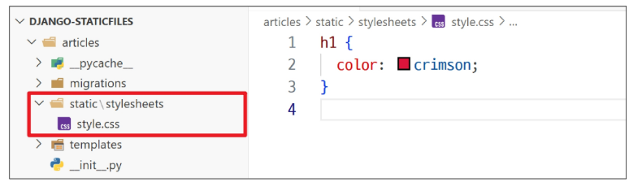
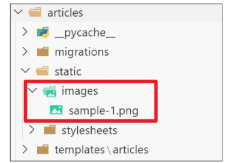
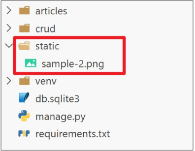
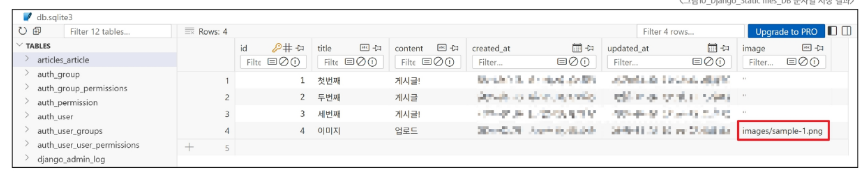

## 목차

### Static files
- 웹 서버와 정적 파일
- Static files 기본 경로
- Static files 추가 경로

### Media files
- 이미지 업로드
- 업로드 이미지 제공
- 업로드 이미지 수정

### 참고
- upload_to 활용
- AWS 인프라 이해
- BaseModelForm

-------

# Static files
## Static files
정적 파일

서버 측에서 변경되지 않고 고정적으로 제공되는 파일.

마치 식당에 비치된 '인쇄된 메뉴판'과 같습니다. 메뉴판은 손님이 바뀐다고 내용이 변하지 않고, 항상 동일한 모습으로 제공됩니다.

- 대표적인 종류: CSS 파일, JavaScript 파일, 이미지 파일, 폰트 파일


-----

## 웹 서버와 정적 파일

## 웹 서버의 기본 역할

- "요청 받은 주소(URL)에 해당하는 자원을 찾아 응답해주는 것"
- 마치 도서관 사서에게 "A-3 구역의 3번째 책을 주세요"라고 요청하면, 사서가 해당 위치로 가서 책을 찾아 우리에게 건네 주는 것과 같음
    - 여기서 'A-3 구역의 3번째'가 바로 **URL**이고, '책'이 **자원(Resource)**에 해당


## 정적 파일과 URL의 관계

- 웹 서버가 제공하는 가장 기본적인 자원이 바로 **정적 파일(Static Files)**

### 정적 파일 제공
- 웹 서버는 요청 받은 URL을 보고, 서버 컴퓨터의 특정 폴더에 저장된 CSS, JS, 이미지 같은 정적 파일을 찾아 제공

### URL의 필요성
- 결국 "정적 파일이 사용자에게 보이려면, 그 파일에 접근할 수 있는 고유한 주소(URL)가 반드시 필요하다"는 의미


## 처리 과정 요약

1.  사용자: 브라우저에 [http://example.com/images/logo.png](https://www.google.com/search?q=http://example.com/images/logo.png) 라는 주소를 입력하며 이미지를 요청
2.  웹 서버: /images/logo.png 라는 URL을 확인하고, 서버에 미리 약속된 폴더에서 logo.png 파일을 찾음
3.  웹 서버: 찾은 이미지 파일을 HTTP 응답에 담아 사용자에게 전송
4.  사용자: 브라우저가 응답 받은 이미지 파일을 화면에 보여줌


## Static files 경로의 종류

1. 기본 경로
2. 추가 경로


### Static files 기본 경로

```
app폴더/static/
```


## 기본 경로 CSS 스타일 제공 (1/3)

- articles/static/stylesheets/ 경로에 CSS 파일 배치




## 기본 경로 CSS 스타일 제공 (2/3)

  - 메인 페이지에서 CSS 파일 불러오기
  - static files 경로는 DTL의 static tag를 사용해야
  - built-in tag가 아니기 때문에 load tag를 사용해 import 후 사용 가능

<!-- end list -->

```html

<link rel="stylesheet" href="">
```


## 

- 특정 라이브러리의 태그와 필터를 현재 템플릿에서 사용할 수 있도록 불러오는 역할
- 은  태그를 사용하기 위해, Django 템플릿 시스템에 "이제부터 static 관련 태그를 사용하겠다."고 알려주는 선언문
- load 태그는 템플릿 파일의 가장 상단에 한 번만 작성하면 됩니다.

---

## 

- settings.py 파일의 STATIC_URL 값을 기준으로, 해당 정적 파일의 전체 URL 경로를 계산하여 생성
- 예를 들어, STATIC_URL = 'static/' 이고 CSS 파일이 static/css/style.css에 위치한다면, 경로가 필요한 위치에 로 작성


## STATIC\_URL이란?

STATIC\_URL: 정적 파일의 '웹 주소'

- 웹 페이지에서 정적 파일에 접근할 때 사용할 URL의 시작 부분(접두사)을 지정하는 설정
- 이는 서버 컴퓨터에 저장된 실제 파일 경로가 아니라, 오직 웹(**브라우저**)에서만 사용되는 **주소**
- 마치 서버의 정적 파일 폴더에 'static/' 이라는 웹 주소 별명을 붙여주는 것과 같습니다. 브라우저가 이 별명으로 파일을 요청하면, Django는 약속된 실제 폴더에서 파일을 찾아 응답해줍니다.
- 기본 값: 'static/'


## 기본 경로 이미지 파일 제공 (1/3)

- articles/static/images/ 경로에 이미지 파일 배치




## 기본 경로 이미지 파일 제공 (2/3)

  - DTL의 static tag를 사용해 이미지 경로 작성

<!-- end list -->

```html

```


## 기본 경로 이미지 파일 제공 (3/3)

  - 제공된 이미지의 URL 확인
  - [http://127.0.0.1:8000/static/images/sample-1.png](https://www.google.com/search?q=http://127.0.0.1:8000/static/images/sample-1.png)


## URL 생성 공식

URL + **STATIC\_URL** + 정적파일 경로

`http://127.0.0.1:8000/static/images/sample-1.png`


## Static files 추가 경로

**STATICFILES\_DIRS에 문자열로 추가 경로를 설정**


## STATICFILES\_DIRS

기본 경로 외에 추가적으로 탐색할 경로의 목록을 지정하는 리스트

- 마치 기본 도서관 외에, 책을 보관하는 '외부 창고'들의 주소 목록을 알려주는 것과 같습니다.
- Django는 이 목록에 있는 모든 폴더를 방문하여 필요한 정적 파일을 찾습니다.
- 이 설정은 여러 앱에서 공통으로 사용되는 CSS 프레임워크(예: Bootstrap)나 JavaScript 라이브러리처럼 특정 앱에 속하지 않는 정적 파일들을 프로젝트 최상위 폴더(BASE\_DIR) 같은 곳에 모아두고 관리할 때 매우 유용합니다.


## STATICFILES\_DIRS 설정

  - 이처럼 설정하면, Django는 기본 경로인 각 앱의 static/ 폴더를 모두 확인한 후, 프로젝트의 최상위 폴더에 있는 static/ 폴더도 추가로 탐색하게 됨

<!-- end list -->

```python
# settings.py
STATICFILES_DIRS = [
    BASE_DIR / 'static',
]
```


## 추가 경로 이미지 파일 제공 (1/3)

- 설정한 추가 경로에 이미지 파일 배치




## 추가 경로 이미지 파일 제공 (2/3)

  - DTL의 static tag를 사용해 이미지 경로 작성

<!-- end list -->

```html

```


## 추가 경로 이미지 파일 제공 (3/3)

  - 제공된 이미지의 URL 확인
  - `http://127.0.0.1:8000/static/sample-2.png`


## 정적 파일의 핵심 원리: 주소(URL)가 있어야 찾아갈 수 있다.

- 컴퓨터에 파일이 존재하는 것만으로는 웹 페이지에 보일 수 없음
- 외부의 손님(브라우저)이 파일을 찾아올 수 있도록 반드시 '웹 주소(URL)'라는 문패를 달아줘야

| 구분 | 개념 | 비유 |
| :--- | :--- | :--- |
| 서버 (내 컴퓨터) | 실제 파일 경로 | "내 방 책상 위 세 번째 서랍" |
| 웹 (인터넷 세상) | URL (웹 주소) | "서울시 강남구 테헤란로 999" |


-----------


# Media files
## Media files
미디어 파일

사용자가 웹사이트를 통해 직접 업로드하는 파일

- Static files이 사이트 개발자가 미리 준비해 둔 '고정된' 파일이라면, Media files는 사이트 운영 중 사용자에 의해 생성되고 변경되는 '동적인' 파일.
- 마치 쇼핑몰의 기본 로고나 아이콘은 정적 파일이고, 사용자가 상품 후기를 작성하며 올리는 상품 사진은 **미디어 파일**인 것과 같습니다.


# 이미지 업로드

## ImageField()

  - 이미지 파일을 업로드하기 위해 사용하는 Django 모델 필드

### 데이터베이스 저장 방식

  - 가장 중요한 특징은 이미지 파일 자체가 데이터베이스에 저장되는 것이 아니라는 점
  - 데이터베이스에는 upload\_to 경로를 기준으로 한 이미지 파일의 경로(문자열)만 저장되고, 실제 파일은 서버의 특정 폴더(MEDIA\_ROOT)에 저장

<!-- end list -->

```python
# models.py
class Article(models.Model):
    # 이미지는 'MEDIA_ROOT경로/images/' 경로에 저장되고,
    # DB에는 'images/sample.png'와 같은 경로 문자열이 저장됨
    image = models.ImageField(upload_to='images/')
```

  - upload\_to는 선택 인자


## 미디어 파일 제공 전 준비사항

1. settings.py에 MEDIA\_ROOT, MEDIA\_URL 설정
2. 작성한 MEDIA\_ROOT와 MEDIA\_URL에 대한 URL 지정


## MEDIA\_ROOT란?

MEDIA\_ROOT: 미디어 파일의 '실제 창고' 주소

  - 사용자가 업로드한 미디어 파일들이 서버 컴퓨터 어디에 저장될지를 지정하는 절대 경로
  - 서버 내부에서만 사용하는 물리적인 폴더 주소로, Django는 파일을 저장하거나 읽어올 때 이 경로를 사용

<!-- end list -->

```python
# 프로젝트 폴더(BASE_DIR) 안에 'media'라는 폴더를 실제 저장소로 사용
MEDIA_ROOT = BASE_DIR / 'media'
```


## MEDIA\_URL

MEDIA\_URL: 미디어 파일의 '웹 주소' 별명

  - MEDIA\_ROOT에 저장된 파일들을 웹 페이지에서 접근할 때 사용할 URL의 시작 부분을 지정
  - STATIC\_URL과 동일한 역할로, 실제 저장 위치를 숨기고 웹에서 사용할 공개 주소 별명을 만들어주는 역할

<!-- end list -->

```python
# media/ 라는 주소로 파일을 요청하면 MEDIA_ROOT 폴더에서 찾아 응답
MEDIA_URL = 'media/'
```


## MEDIA\_ROOT와 MEDIA\_URL 설정 (1/2)

  - MEDIA\_ROOT는 파일을 저장하고 관리하기 위한 서버의 실제 경로, **MEDIA\_URL은 그 파일을 웹에서 보여주기 위한 가상의 주소**

<!-- end list -->

```python
# settings.py
MEDIA_ROOT = BASE_DIR / 'media'
MEDIA_URL = 'media/'
```


## MEDIA\_ROOT와 MEDIA\_URL 설정 (2/2)

  - settings.MEDIA\_URL: "media/로 시작하는 URL 요청이 오면"
  - document\_root=settings.MEDIA\_ROOT: "MEDIA\_ROOT에 지정된 실제 폴더에서 파일을 찾아"

<!-- end list -->

```python
from django.conf import settings
from django.conf.urls.static import static

urlpatterns = [
    path('admin/', admin.site.urls),
    path('articles/', include('articles.urls')),
] + static(settings.MEDIA_URL, document_root=settings.MEDIA_ROOT)
```

-----

### TIP (개발 환경에서 미디어 파일 서빙 원리)

  - Django의 개발 서버는 기본적으로 파이썬 코드를 실행하여 동적인 웹 페이지를 보여주는 애플리케이션 서버.
  - 사용자가 올린 이미지 파일 같은 정적 파일을 어떻게 찾아 보여줘야 하는지 스스로 알지 못함.
  - 따라서 개발자가 직접 URL 경로를 만들어 "이 주소로 요청이 오면, 이 폴더에서 파일을 찾아 보여줘"라는 규칙을 추가해야 함.
  - 결론적으로 이 코드는, Django 개발 서버가 미디어 파일을 처리할 수 있도록 임시 '웹 주소'와 '실제 파일 위치'를 연결해주는 역할.


## 이미지 업로드 구현 (1/8)

  - Article 모델 클래스에 image 필드 작성
  - blank=True 속성을 작성해 빈 문자열이 저장될 수 있도록 제약 조건 설정
      - 게시글 작성 시 이미지 첨부 없이도 작성할 수 있도록 하기 위함

### blank 속성

  - 폼 유효성 검사 시 해당 필드를 필수 또는 선택 사항으로 만들지 결정하는 속성

<!-- end list -->

```python
# articles/models.py
class Article(models.Model):
    title = models.CharField(max_length=10)
    content = models.TextField()
    image = models.ImageField(upload_to='images/', blank=True)
    created_at = models.DateTimeField(auto_now_add=True)
    updated_at = models.DateTimeField(auto_now=True)
```

  - 기존 필드 사이에 작성해도 실제 테이블 생성 시에는 가장 우측(뒤)에 추가됨


## 이미지 업로드 구현 (2/8)

  - migration 진행 과정 중 에러 발생

<!-- end list -->

```bash
$ python manage.py makemigrations
SystemCheckError: System check identified some issues:

ERRORS:
articles.Article.image: (fields.E210) Cannot use ImageField because Pillow is not installed.
HINT: Get Pillow at https://pypi.org/project/Pillow/ or run command "python -m pip install Pillow".
```

### Pillow

  - 파이썬에서 이미지를 열고, 크기 조절이나 필터 적용 같은 다양한 편집 작업을 수행한 후 저장할 수 있게 해주는 필수 이미지 처리 라이브러리
  - ImageField를 사용하려면 반드시 **Pillow** 라이브러리가 필요


## 이미지 업로드 구현 (3/8)

  - Pillow 설치 후 migrations 재진행

<!-- end list -->

```bash
$ pip install pillow
$ python manage.py makemigrations
$ python manage.py migrate
$ pip freeze > requirements.txt
```


## 이미지 업로드 구현 (4/8)

  - form 요소의 enctype 속성 추가

### enctype 속성

  - form 데이터가 서버로 제출될 때, 해당 데이터가 어떤 형식으로 인코딩될지 지정하는 속성

<!-- end list -->

```html
<h1>CREATE</h1>
<form action="" method="POST" enctype="multipart/form-data">

{{ form }}
<input type="submit">
</form>
```

  - **파일 업로드 시에는 반드시 multipart/form-data로 설정해야**


## 이미지 업로드 구현 (5/8)

  - ModelForm의 2번째 인자로 요청 받은 파일 데이터 **request.FILES** 작성

<!-- end list -->

```python
# articles/views.py
def create(request):
    if request.method == 'POST':
        form = ArticleForm(request.POST, request.FILES)
    ...
```

### TIP

  - ModelForm의 두번째 인자로 파일을 작성한 이유는?
  - ModelForm의 상위 클래스인 BaseModelForm의 생성자 함수의 2번째 위치 인자로 파일을 받도록 설정되어


## 이미지 업로드 구현 (8/8)

- 이미지 업로드 후 DB 확인
    - 이미지 파일 자체가 데이터베이스에 저장되는 것이 아닌 upload\_to 경로를 기준으로 한 이미지 파일의 경로(문자열)만 저장




# 업로드 이미지 제공

## 게시글 상세 페이지에 업로드 한 이미지 제공 (1/2)

### ImageField의 .url 속성

  - 업로드 파일의 웹 주소
  - ImageField나 FileField에 저장된 파일 객체에서 .url 속성을 사용하면, 해당 파일을 웹에서 접근할 수 있는 전체 URL 주소를 얻을 수

<!-- end list -->

```html



```

  - 이미지를 업로드하지 않은 게시물은 detail 템플릿을 렌더링 불가
  - 이미지 데이터가 있는 경우만 이미지를 출력할 수 있도록 if 태그를 활용


# 업로드 이미지 수정

## 업로드 이미지 수정 (1/2)

  - 수정 페이지 form 요소에 **enctype** 속성 추가

<!-- end list -->

```html
<h1>UPDATE</h1>
<form action="" method="POST" enctype="multipart/form-data">

{{ form }}
<input type="submit">
</form>
```


## 업로드 이미지 수정 (2/2)

  - update view 함수에서 업로드 파일 데이터 **request.FILES**에 대한 추가 코드 작성

<!-- end list -->

```python
# articles/views.py
def update(request, pk):
    article = Article.objects.get(pk=pk)
    if request.method == 'POST':
        form = ArticleForm(request.POST, request.FILES, instance=article)
    ...
```


------------

# 참고

## upload_to 활용

## upload\_to 속성 심화 활용

- 단순한 문자열 경로 외에도, 업로드 경로를 동적으로 생성하는 두 가지 유용한 방법을 제공

1. 날짜를 이용한 경로 구성
2. 함수를 이용한 동적 경로 생성


## 1\. 날짜를 이용한 경로 구성

  - strftime()의 형식 코드를 사용하여 파일이 업로드된 날짜를 기준으로 폴더를 자동으로 생성 가능

      - %Y: 4자리 연도
      - %m: 2자리 월
      - %d: 2자리 일

<!-- end list -->

```python
class Photo(models.Model):
    # 2100년 1월 1일에 업로드하면 '2100/01/01/' 폴더에 저장됨
    image = models.ImageField(blank=True, upload_to='%Y/%m/%d/')
```


## 2\. 함수를 이용한 동적 경로 생성

  - 더 복잡한 로직으로 경로를 만들고 싶을 때는, upload\_to에 함수를 직접 전달 가능

  - 이 함수는 두 가지 인자를 받음

      - instance: 파일이 첨부된 모델의 인스턴스 (해당 게시글 객체 등)
      - filename: 업로드된 파일의 원본 이름

<!-- end list -->

```python
# 경로 생성 함수 정의
def articles_image_path(instance, filename):
    # instance.user.username을 통해 게시글 작성자의 이름을 가져옴
    # 예: 'images/ssafy_user/my_photo.jpg' 와 같은 경로를 반환
    return f'images/{instance.user.username}/{filename}'

class Article(models.Model):
    user = ...
    image = models.ImageField(blank=True, upload_to=articles_image_path)
```

  - 이를 통해 특정 유저의 폴더에 파일을 저장하는 등 매우 유연한 경로 생성이 가능


---------

# AWS 인프라 이해하기

## AWS (Amazon Web Services)

- 아마존이 제공하는 클라우드 컴퓨팅 플랫폼
- 서버, 스토리지, 데이터베이스 같은 IT 인프라를 직접 구매하지 않고, 인터넷을 통해 필요한 만큼 **빌려 쓰는 서비스**

---
### AWS 핵심 서비스 3가지

| 서비스 | 역할 | 설명 |
| :--- | :--- | :--- |
| EC2 | 가상 서버 | 클라우드에 생성하는 고성능 컴퓨터 |
| S3 | 파일 저장소 | 이미지, 동영상 등 모든 파일을 보관하는 객체 스토리지 |
| RDS | 데이터베이스 | 데이터를 체계적으로 관리하는 관계형 데이터베이스 |


## EC2, S3, RDS를 활용한 웹 서비스 구축

- EC2 (서버)
    - 웹 애플리케이션(Django)이 실행되는 컴퓨터의 역할
- S3 (파일 저장소)
    - 사용자가 올린 이미지나 사이트의 로고 등 정적 파일을 보관하는 외부 창고 역할
- RDS (데이터베이스)
    - 회원 정보, 게시글 등 중요한 데이터를 기록하고 관리하는 장부 역할


## 데이터 흐름 요약


1. 사용자 ➡️ EC2 (HTTP Request)
    - 사용자가 브라우저를 통해 웹 사이트에 접속(요청). 이 요청은 가장 먼저 EC2에 도달
2. EC2 ↔️ RDS (DB Query)
    - EC2의 Django 애플리케이션은 요청을 처리하기 위해 필요한 데이터(예: 게시글, 사용자 정보)를 RDS에 조회하거나 새로운 데이터를 저장
3. EC2 ➡️ 사용자 (HTML Response)
    - EC2는 DB 정보와 HTML 템플릿을 조합하여 완전한 웹 페이지(HTML)를 만들어 사용자에게 응답
    - HTML 내 이미지, CSS, JS 파일의 주소가 S3를 가리키도록(src="https://...S3...") 포함되어
4. 사용자 ➡️ S3 (File Request)
    - HTML을 받은 사용자의 브라우저는 페이지 완성을 위해, HTML에 명시된 S3 주소로 직접 이미지나 CSS 파일을 요청/EC2를 거치지 않음
5. 사용자 ⬅️ S3 (File Response)
    - S3는 요청 받은 파일을 사용자 브라우저에 직접 전송
6. (파일 업로드 시) 사용자 ➡️ EC2 ➡️ S3
    - 사용자가 이미지를 업로드하면, 요청은 EC2로 감. EC2의 Django 앱은 파일을 받아 S3에 저장


## 클라우드 컴퓨팅 플랫폼을 사용하는 이유

- 비용 절감
    - 물리 장비를 직접 구매할 필요 없이, 사용한 만큼만 비용을 지불
- 유연성과 확장성
    - 필요에 따라 서버 사양이나 저장 공간 용량을 몇 번의 클릭만으로 자유롭게 조절 가능
- 글로벌 서비스
    - 전 세계에 위치한 데이터 센터를 통해 어떤 국가의 사용자에게도 빠르고 안정적인 서비스를 제공 가능


