# Template & URLs

## 목차
### Template System
* Django Template system
* Django Template Language
  
### 템플릿 상속
* 상속 관련 DTL 태그
  
### 요청과 응답
* HTML form
* HTML form 핵심 속성
* HTML form 활용


### Django URLs
* Variable Routing
* App URL 정의

### URL 이름 지정
* Naming URL patterns
* DTL URL tag

### URL 이름 공간
* app_name 속성

### 참고
* 추가 템플릿 경로
* DTL 주의사항
* Trailing Slashes

# Template System
## Django Template System(DTS)

## Django Template system
**파이썬 데이터(context)를 HTML 문서(Template)와 결합**하여, **로직과 표현을 분리**한 채 동적인 웹페이지를 생성하는 도구

* 뉴스 사이트를 떠올려보세요. 모든 기사는 헤더, 폰트, 광고 위치 등 **동일한 페이지 틀(Template)을 공유**
* 하지만 각 페이지에 들어가는 **데이터(context)**, 즉 기사 제목, 내용, 기자 이름은 모두 다름

* **HTML** : 웹 페이지의 의미와 구조를 정의하는 언어

## HTML의 콘텐츠를 변수 값에 따라 변경
* **빨간 상자**의 내용이 변수에 따라 바뀌게 해보자

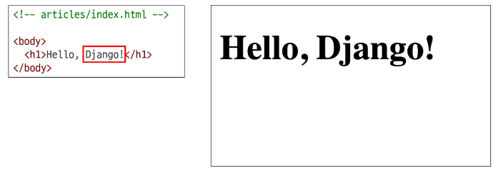

* `context['name']`이 변경되면 응답 받은 HTML의 모습도 변경되는 걸 확인

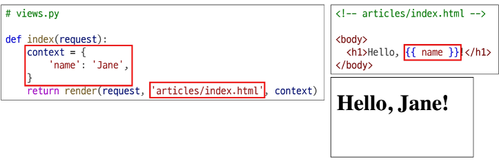

## Django Template system의 목적
* '**페이지 틀**'에 '**데이터**'를 동적으로 결합하여 수많은 페이지를 효율적으로 만들어 내기 위함

## Django Template Language
DTL

Template에서 조건, 반복, 변수 등의 프로그래밍적 기능을 제공하는 시스템


## DTL Syntax
1. Variable
2. Filters
3. Tags
4. Comments

## 1\. Variable (1/2)

  * Django Template에서의 변수
  * `render` 함수의 세 번째 인자로 딕셔너리 타입으로 전달
  * 해당 딕셔너리 $\\text{key}$에 해당하는 문자열이 $\\text{template}$에서 사용 가능한 변수명이 됨
  * $\\text{dot}('.')$을 사용하여 변수 속성에 접근 가능

<!-- end list -->

```
{{ variable }}
```

```
{{ variable.attribute }}
```

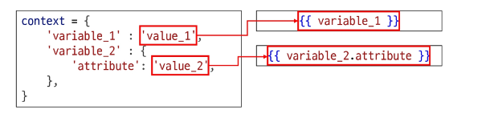

## 2\. Filters

  * 표시할 변수를 수정할 때 사용 (변수 + '**|**' + 필터)
  * $\\text{chained}$(연결)이 가능하며 일부 필터는 인자를 받기도 함
  * 약 60개의 $\\text{built-in template filters}$를 제공

<!-- end list -->

```
{{ variable|filter }}
```

```
{{ name|truncatewords:30 }}
```

## 3\. Tags (1/2)

  * 반복 또는 논리를 수행하여 제어 흐름을 만듦
  * 일부 태그는 시작과 종료 태그가 필요
  * 약 24개의 built-in template tags를 제공

<!-- end list -->

```

```

```
 
```

## 3. Tags (2/2)
* `if`, `else`, `endif` 태그


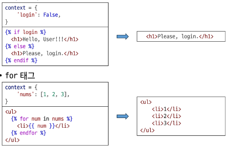


## 4\. Comments

  * 주석
      * inline

<!-- end list -->

```html
<h1>Hello, {# name #}</h1>
```

  * multiline

<!-- end list -->

```

...

```

## DTL 예시

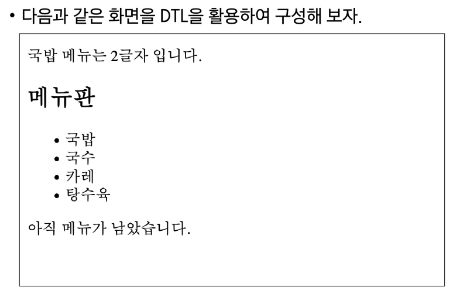

## urls.py

```python
urlpatterns = [
    path('admin/', admin.site.urls),
    path('articles/', views.index),
    path('dinner/', views.dinner),
]
```

-----

## views.py

```python
import random

def dinner(request):
    foods = ['국밥', '국수', '카레', '탕수육']
    picked = random.choice(foods)
    context = {
        'foods': foods,
        'picked': picked,
    }
    return render(request, 'articles/dinner.html', context)
```

-----

## articles/dinner.html

```html
<p>{{ picked }} 메뉴는 {{ foods|length }}글자입니다.</p>
<h2>메뉴판</h2>
<ul>

    <li>{{ food }}</li>

</ul>


<p>메뉴가 소진되었습니다.</p>

<p>아직 메뉴가 남았습니다.</p>

```


---
# 템플릿 상속
## 기본 템플릿 구조의 한계
* 만약 모든 템플릿에 **Bootstrap**을 적용하려면?
  * 모든 템플릿에 **Bootstrap CDN**을 작성해야 할까?

## 템플릿 상속
Template inheritance
1.  페이지의 **공통요소**를 포함
2.  하위 템플릿이 **재정의**를 할 수 있는 공간을 정의
* 여러 템플릿이 **공통요소**를 공유할 수 있게 해주는 기능


## 상속 구조 만들기 (1/3)
* **skeleton** 역할을 하게 되는 상위 템플릿(**base.html**) 작성
  * **파일명이 반드시 base일 필요는 없음**
  * 모든 템플릿이 공유했으면 좋겠는 **공통요소**를 작성
  * 템플릿 별로 재정의할 부분은 **block 태그**를 활용


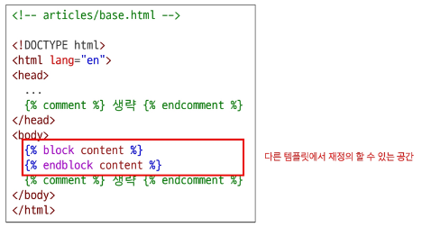

## 상속 구조 만들기 (2/3)

  * 기존 하위 템플릿들이 상위 템플릿을 상속받도록 변경
      * `extends` 태그로 상속받을 템플릿 결정
      * `block` 태그를 활용해 `base.html`의 같은 이름으로 작성된 `block` 태그의 내용을 대체


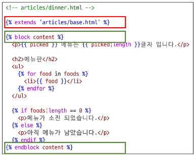


## 상속 구조 만들기 (3/3)
 - 최종 형태
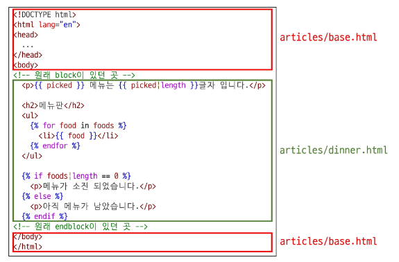

---
## 상속 관련 DTL 태그

## 'extends' tag

```

```

  * 자식(하위) 템플릿이 부모 템플릿을 확장한다는 것을 알림
  * **반드시 자식 템플릿 최상단에 작성되어야 함**
      * `extends` 태그는 2개 이상 사용 불가

-----

## 'block' tag

```
 
```

  * 하위 템플릿에서 재정의를 할 수 있는 블록을 정의
  * 상위 템플릿에서 작성하며 하위 템플릿이 작성할 수 있는 공간을 지정


## 다시 살펴보기
* 하위 템플릿의 `block`이 상위 템플릿의 `block`의 내용을 대체하게 됨

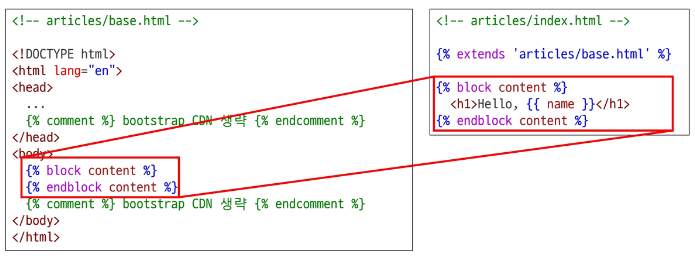


# 요청과 응답
## HTML form
## 데이터를 보내고 가져오기
Sending and Retrieving form data

HTML '**form**' element를 통해 사용자와 애플리케이션 간의 상호작용 이해하기

## HTML form (1/2)
* $\text{HTTP}$ 요청을 서버에 보내는 가장 편리한 방법

---
### 클라이언트 서버 구조
인터넷에 연결된 서로 다른 두 컴퓨터가 데이터를 주고받는 웹의 동작 방식 중 하나

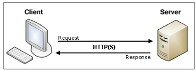


`#` 부분에 서버의 주소가 들어가게 됨 

## 'form' element
사용자로부터 할당된 데이터를 서버로 전송하는 HTML 요소
* 웹에서 사용자 정보를 입력하는 여러 방식 ($\text{text}$, $\text{password}$, $\text{checkbox}$ 등)을 제공

## form을 이용해 Naver로 요청 보내기: "**fake Naver**"

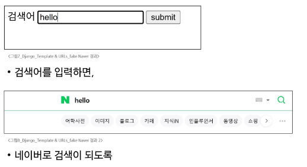

> 서버는 요청 덩어리를 받음    
> 검색어에 입력한 데이터를 서버가 인식하기 좋게 하는 방법?   
> 사용자 입력 데이터에 딕셔너리의 키나 이름을 붙여줌   
> `<input type="text" name="#" id="message">`  
> name이 비워져있음 -> 사용자가 입력하는 키  
>
> 네이버에 싸피 검색하면  
> `https://search.naver.com/search.naver?where=nexearch&sm=top_hty&fbm=0&ie=utf8&query=싸피ackey=lxn63s41` 이렇게 나옴  
> ? 또는 &를 기준으로 나누어짐 핵심은 
> `https://search.naver.com/search.naver?query=싸피`  
> `https://search.naver.com/search.naver` 이 부분이 action이고
> `query` 이 부분이 name, ?는 브라우저가 알아서 구분해줌


## fake Naver 실습 (1/4)

  * `form`을 이용해 Naver에 요청을 보내 보자.
  * `form` 요소로 검색창을 만들기

-----

### urls.py

```python
urlpatterns = [
    path('admin/', admin.site.urls),
    path('articles/', views.index),
    path('dinner/', views.dinner),
    path('search/', views.search),
]
```

-----

### views.py

```python
def search(request):
    return render(request, 'articles/search.html')
```

-----

### articles/search.html

```html



<form action="#" method="GET">
    <label for="message">검색어</label>
    <input type="text" name="query" id="message">
    <input type="submit" value="submit">
</form>

```
## fake Naver 실습 (2/4)

  * `form`을 이용해 Naver에 요청을 보내 보자.
      * `input`에 `hello`를 입력하고 제출 버튼을 누른 뒤 브라우저 URL 확인

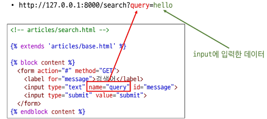

## fake Naver 실습 (3/4)
* `form`을 이용해 Naver에 요청을 보내 보자.
  * 실제 Naver에서 검색 후 URL 확인

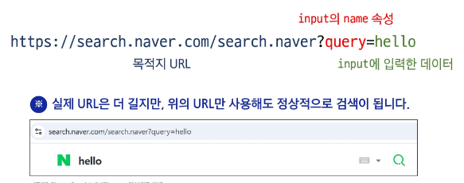

## fake Naver 실습 (4/4)
* `form`을 이용해 Naver에 요청을 보내 보자.
  * `action`의 URL 변경 후 테스트

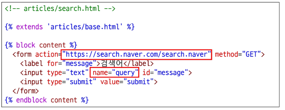


# HTML form 핵심 속성

## 'action' & 'method'
`form`의 핵심 속성 2가지

**데이터를 어디(action)로 어떤 방식(method)으로 요청할지**

### action & method 예시

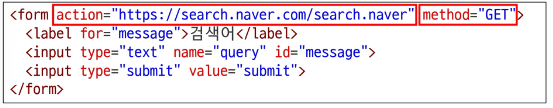

* **action**
  * 입력 데이터가 전송될 URL을 지정 (목적지)
    * `action`을 지정하지 않으면 데이터는 현재 페이지의 URL로 설정
* **method**
  * 데이터를 어떤 방식으로 보낼 것인지 정의
  * 데이터의 HTTP request method(GET, POST)를 지정

## 'input' element
사용자의 데이터를 입력 받을 수 있는 HTML 요소
`type` 속성 값에 따라 다양한 유형의 입력 데이터를 받음
* 핵심 속성 - '**name**'

## 'name' attribute

```html
<input type="text" name="query" id="message">
```

  * `input` 요소의 핵심 속성
  * 사용자가 입력한 데이터에 붙이는 이름(**key**)
  * 데이터를 제출했을 때 서버는 `name` 속성에 설정된 값을 통해서만 사용자가 입력한 데이터에 접근 가능

## Query String Parameters
* 사용자의 입력 데이터를 $\text{URL}$ 주소에 **파라미터**를 통해 서버로 보내는 방법
* 문자열은 **앰퍼샌드(`&`)**로 연결된 $\text{key=value}$ 쌍으로 구성되며, 기본 $\text{URL}$과는 **물음표(`?`)**로 구분

* 예시
  * `http://host:port/path?**key=value**&**key=value**`


# HTML form 활용

## 사용자 입력 데이터를 받아 그대로 출력하는 서버 만들기
* `view` 함수는 몇 개가 필요할까?

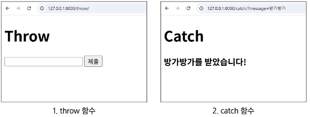

## 1. throw 로직 작성
 - fake Naver를 참고하여 작성해보기 

## urls.py

```python
urlpatterns = [
    path('throw/', views.throw),
]
```

-----

## views.py

```python
def throw(request):
    return render(request, 'articles/throw.html')
```

-----

## articles/throw.html

```html



<h1>Throw</h1>
<form action="/catch/" method="GET">
    <input type="text" id="message" name="message">
    <input type="submit" value="submit">
</form>

```

## 2\. catch 로직 작성

  * `throw` 페이지에서 요청한 사용자 입력 데이터는 어떻게 가져와야 할까?

-----

### urls.py

```python
urlpatterns = [
    path('catch/', views.catch),
]
```

-----

### views.py

```python
def catch(request):
    context = ???
    return render(request, 'articles/catch.html', context)
```

-----

### articles/catch.html

```html



<h1>Catch</h1>
<h3>{{ ??? }}를 받았습니다!</h3>

```


## HTTP request 객체
`form`으로 전송한 데이터뿐만 아니라 $\text{Django}$로 들어오는 **모든 요청 관련 데이터**가 담겨 있음 (`view` 함수가 호출될 때 첫 번째 인자로 전달됨)

## request 객체 살펴보기
* `view` 함수의 `request` 매개변수의 여러 가지 정보를 확인해보자.

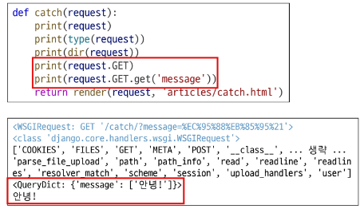

## request 객체에서 form 데이터 추출
* `request.GET`에 작성한 `message`가 담겨있음을 확인 가능

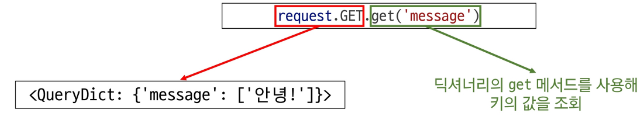

## 3\. catch 로직 마무리

  * `throw` 페이지에서 요청한 사용자 입력 데이터는 어떻게 가져와야 할까?

-----

### views.py

```python
def catch(request):
    message = request.GET.get('message')
    context = {
        'message': message,
    }
    return render(request, 'articles/catch.html', context)
```

-----

### articles/catch.html

```html



<h1>Catch</h1>
<h3>{{ message }}를 받았습니다!</h3>

```


## throw - catch 간 요청과 응답 정리 (1/2)
* 브라우저에 `http://127.0.0.1:8000/throw/`를 입력하면 발생하는 일

1.  throw/ 로 요청 (**throw 페이지를 줘!**)
2.  throw/ 문자열과 일치하는 `urls.py`의 $\text{path}$ 함수 호출
3.  `throw view` 함수 호출
4.  `throw view` 함수가 응답 객체를 반환
5.  응답 객체 전달
6.  응답 객체 해석 후 화면 출력


## throw - catch 간 요청과 응답 정리 (2/2)
* `throw` 페이지에서 일어나는 일

1.  `throw` 페이지에서 `form` 데이터 작성 후 제출 (`form` 요소의 `action` 속성 값으로 요청)
2.  `catch/`로 요청 (+ 사용자 입력 데이터와 함께)
3.  `catch/` 문자열과 일치하는 `urls.py`의 $\text{path}$ 함수 호출
4.  `catch view` 함수 호출
5.  `catch view` 함수에서 사용자가 보낸 `form` 데이터 추출 후 응답 객체를 반환
6.  응답 객체 전달
7.  응답 객체 해석 후 화면 출력


# Django URLs
## 요청과 응답에서 Django URLs의 역할

- 요청 URL에 따라 실행될 view 함수가 달라짐

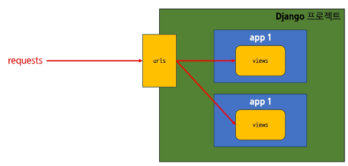

## URL dispatcher
**(문항 관리자, 분배기)**

URL 패턴을 정의하고
해당 패턴이 일치하는 요청을 처리할 view 함수를 연결(매핑)


## Variable Routing

## **현재 URL 관리의 문제점**

- 탬플릿의 많은 부분이 중복되고, URL의 일부만 변경되는 상황이라면?
  • 계속해서 비슷한 URL과 탬플릿을 작성해 나가야 할까?
```python
urlpatterns = [
    path('articles/1/', ...),
    path('articles/2/', ...),
    path('articles/3/', ...),
    path('articles/4/', ...),
    path('articles/5/', ...),
    ....
]
```

## Variable Routing (1/2)

- URL 일부에 변수를 포함시키는 것
  • 변수는 view 함수의 인자로 전달 가능

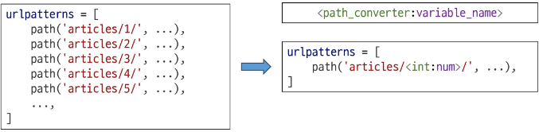


## Variable Routing (2/2)

`<path_converter:variable_name>`

```python
path('articles/<int:num>', views.detail)
path('hello/<str:name>/', views.greeting)
```

• 요청 URL의 `<int:num>`, `<str:name>`의 위치에 들어있는 것이 변수처럼 취급됨  
  • 접수 num 변수가 `views.detail`에 직접 name 변수가 `views.greeting`에 키워드 전달됨  
  • 예) 요청 URL이 `/articles/10/`이면, `views.detail(request, num=10)`의 형태로 호출  

• **Path Converter**
  • URL 변수의 타입을 지정
  • str, int 등 5가지 타입 지원


## Variable Routing 실습 (1/4)

```python
# urls.py
urlpatterns = [
    path('articles/<int:num>/', views.detail),
]
```

```python
# views.py
def detail(request, num):
    context = {
        'num': num,
    }
    return render(request, 'articles/detail.html', context)
```

```html
<!-- articles/detail.html -->



<h1>Detail</h1>
<h2>{{ num }}번 글입니다.</h2>

```

**Path Converter의 변수명과 View 함수의 파라미터 이름은 같아야 함**


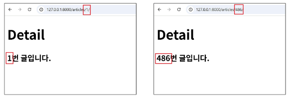

## Variable Routing 실습 (2/4)

```python
# urls.py
urlpatterns = [
    path('hello/<str:name>/', views.greeting),
]
```

```python
# views.py
def greeting(request, name):
    context = {
        'name': name,
    }
    return render(request, 'articles/greeting.html', context)
```

```html
<!-- articles/greeting.html -->



<h1>Greeting</h1>
<h3>{{ name }}님 안녕하세요 !!</h3>

```

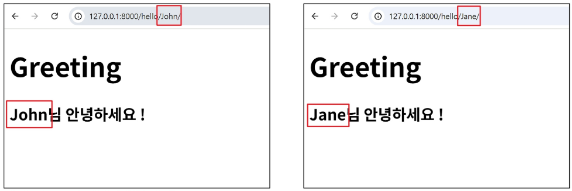

## App URL 정의 

## App URL mapping
**각 앱에 URL을 정의하는 것**

프로젝트와 각 앱이 URL을 나누어 관리를 편하게 하기 위함

현재는 앱이 하나밖에 없지만, 앞으로 앱이 늘어나게 되면
서로 다른 앱의 URL들이 섞이지 않도록 나누어 관리하는 방법

## 각각 앱 pages 생성 후 발생할 수 있는 문제

• view 함수 이름이 같거나, 같은 패턴의 URL 주소를 사용하게 되는 경우?

• 아래와 같이 해결할 수 있으나 더 좋은 방법이 필요

```python
# urls.py

from articles import views as article_views
from pages import views as page_views

urlpatterns = [
    ....,
    path('pages', page_views.index),
]
```

**"URL을 각자 app에서 관리하자"**

### 변경된 URL 구조
 - 각 앱의 urls.py에서 각자의 URL 관리

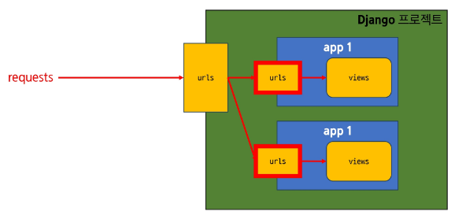

## include('**app.urls**')
**프로젝트 내부 앱들의 URL을 참조할 수 있도록 매핑하는 함수**

URL의 일치하는 부분까지 잘라내고,
남은 문자열 부분은 후속 처리를 위해 include된 URL로 전달

## include 함수 (1/2)

• 각 앱에서 urls.py를 만들고

```python
# articles/urls.py
from django.urls import path
from . import views

urlpatterns = [
    path('index/', views.index),
]
```

• 프로젝트 urls.py에서 **include()**로 추가

```python
# firstpjt/urls.py
from django.urls import path, include

urlpatterns = [
    path('articles/', include('articles.urls')),
]
```

## include 함수 (2/2)

• 요청 URL이 `http://127.0.0.1:8000/articles/index/` 일 때

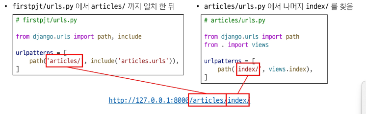

## URL 구조 변화 
* 지금까지 만든 URL 이동시키기

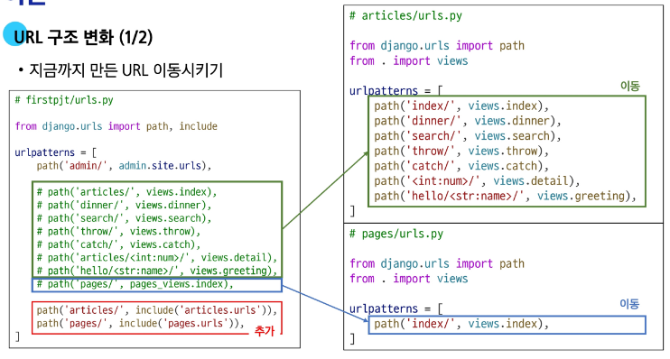

# URL 이름 지정
## Naming URL patterns

## URL 구조 변경에 따른 문제점

• 기존 'articles/' 주소가 'articles/index/'로 변경됨에 따라 해당 URL을 사용하는 모든 위치를 찾아가 변경해야 함

```python
# firstpjt/urls.py
from django.urls import path, include

urlpatterns = [
    path('articles/', include('articles.urls')),
]
```

```python
# articles/urls.py
from django.urls import path
from . import views

urlpatterns = [
    path('index/', views.index),
]
```

**"URL에 이름을 지어주면 이름만 기억하면 되지 않을까?"**

## Naming URL patterns

• URL에 이름을 지정하는 것
  • path 함수에 name 인자를 기본드 인자로 정의해서 사용

```python
# articles/urls.py
from django.urls import path
from . import views

urlpatterns = [
    path('index/', views.index, name='index'),
    path('dinner/', views.dinner, name='dinner'),
    path('search/', views.search, name='search'),
    path('throw/', views.throw, name='throw'),
    ....,
]
```

```python
# pages/urls.py
from django.urls import path
from . import views

urlpatterns = [
    path('index/', views.index, name='index'),
]
```

## URL 표기 방법 (1/2)

• 해당 url을 사용했던 곳의 링크 변경
  • 새로운 articles/urls.py

```python
# articles/urls.py
from django.urls import path
from . import views

urlpatterns = [
    path('index/', views.index, name='index'),
    path('dinner/', views.dinner, name='dinner'),
    path('search/', views.search, name='search'),
    path('throw/', views.throw, name='throw'),
    ....,
]
```

• articles/index.html 변화

```html
<!-- articles/index.html -->



<h1>Hello, {{ name }}</h1>
<a href="/dinner/">dinner</a>
<a href="/search/">search</a>
<a href="/throw/">throw</a>

```

```html
<!-- articles/index.html -->



<h1>Hello, {{ name }}</h1>
<a href="">dinner</a>
<a href="">search</a>
<a href="">throw</a>

```

**a 태그의 href 속성 값 뿐만 아니라 form의 action 속성 값 변경이 주어야 함**


## DTL URL tag
## 'url' tag

``

주어진 URL 패턴의 이름과 일치하는 절대 경로 주소를 반환

URL에 이름을 부여할 경우 **url 태그**와 이름을 이용해
템플릿 상에서 이름으로 실제 주소를 작성할 수 있게 해줌

## 'url' tag (1/3)

``

• 주어진 URL 패턴의 이름과 일치하는 절대 경로 주소를 반환

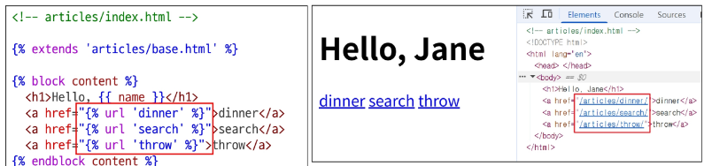

**태그 이름, URL 이름, 인자 등은 쉼표()로 구분되지 않음**

## 'url' tag (3/3)

``

• DTL의 for 태그에서 사용한 변수 이름 사용 가능

```python
# articles/views.py
def index(request):
    context = {
        'nums': [1, 2, 3],
    }
    return render(request, 'articles/index.html', context)
```

```html
<!-- articles/index.html -->

    <a href="">Article {{ num }}</a>

```

**실제 경로는 이렇게 동일함**

# URL 이름 공간
## app_name 속성

## URL 이름 지정 후 남은 문제

• articles 앱의 url 이름과 pages 앱의 url 이름이 같은 상황

• 단순히 이름만으로는 완벽하게 분리할 수 없음
  • articles와 pages 모두 index가 있음

```python
# articles/urls.py
urlpatterns = [
    path('index/', views.index, name='index'),
]
```

```python  
# pages/urls.py
urlpatterns = [
    path('index/', views.index, name='index'),
]
```

**"이름에 성(key)을 붙이자"**

## 'app_name' 속성 지정 (1/3)

• urls.py에 app_name 변수 설정

```python
# articles/urls.py
app_name = 'articles'
urlpatterns = [
    path('index/', views.index, name='index'),
]
```

```python
# pages/urls.py
app_name = 'pages'
urlpatterns = [
    path('index/', views.index, name='index'),
]
```

## 'app_name' 속성 지정 (2/3)

• urls.py에 app_name 변수 설정

```python
# articles/urls.py
app_name = 'articles'
urlpatterns = [
    path('index/', views.index, name='index'),
]
```

```python
# pages/urls.py
app_name = 'pages'
urlpatterns = [
    path('index/', views.index, name='index'),
]
```

• app_name 이 추가 되는 순간부터 url 태그에도 해당 내용이 반영되어야 함

`` → ``


# 참고
## 추가 템플릿 경로 

## 추가 템플릿 경로 지정 (1/2)

• 앱 폴더 내부 templates 폴더(기본 경로) 외에 템플릿을 위치하고 싶을 때

```python
TEMPLATES = [
    {
        'BACKEND': 'django.template.backends.django.DjangoTemplates',
        'DIRS': [
            BASE_DIR / 'templates',
        ],
        'APP_DIRS': True,
        'OPTIONS': {
            'context_processors': [
                'django.template.context_processors.request',
                'django.contrib.auth.context_processors.auth',
                'django.contrib.messages.context_processors.messages',
            ],
        },
    },
]
```

## 추가 템플릿 경로 지정 (2/2)

• 새로운 템플릿 경로

```
📁 articles
📁 firstpjt
📁 templates
    📄 base.html
📄 db.sqlite3
📄 manage.py
📄 requirements.txt
```

• 하위 템플릿에서 extends의 경로 수정 필요

``

## BASE_DIR

• settings.py에서 경로지정을 편하게 하기 위해
최상단 지점을 지정해 둔 변수

```python
# settings.py
BASE_DIR = Path(__file__).resolve().parent.parent
```

**TIP**: Python의 객체 지향 파일 시스템 경로에 대한 좋은 자료를 찾아보세요.  
https://docs.python.org/ko/3.9/library/pathlib.html#module-pathlib


## DTL 주의사항

• Python 처럼 일부 프로그래밍 구조(if, for 등)를 사용할 수 있지만 명칭을 그렇게 설계 했을 뿐

• Python 코드로 실행되는 것이 아니며 **Python과는 관련 없음**

• 프로그래밍적 로직이 아니라 표현을 위한 것임을 명심하기

• **프로그래밍적 로직은 되도록 view 함수에서 작성 및 처리할 것**

• 공식 문서를 참고해 다양한 태그와 필터 사용해보기
  • https://docs.djangoproject.com/en/5.2/ref/templates/builtins/

## Trailing Slashes
## URL의 Trailing Slashes

• Django는 URL 끝에 '/'가 없다면 자동으로 붙임

• "기술적인 측면에서, `foo.com/bar`와 `foo.com/bar/`는 서로 다른 URL"
  • 검색 엔진 로봇이나 웹 트래픽 분석 도구에서는 이 둘 주소를 서로 다른 페이지로 보기 때문

• 그래서 Django는 검색 엔진이 혼동하지 않게 하기 위해 무조건 붙이는 것을 선택한 것

• 그러나 모든 프레임워크가 이렇게 동작하는 것은 아니니 주의


--------


## 연습 문제

**1. Django에서 템플릿 시스템을 사용하는 주요 목적은?**

a) 데이터베이스를 관리하기 위해  
b) HTML과 Python 코드를 분리하여 작성하기 위해  
c) 사용자 인증을 처리하기 위해  
d) 프로젝트 디렉터리를 만들기 위해

**2. Django Template Language(DTL)에서 변수 출력 시 사용하는 문법은?**

a) `{{ 변수명 }}`  
b) ``  
c) `(( 변수명 ))`  
d) `[ 변수명 ]`

**3. 템플릿 상속 시, 하위 템플릿이 상속하는 상위 템플릿을 지정할 때 사용하는 태그는?**

a) ``  
b) ``  
c) ``  
d) ``

**4. HTML form을 통해 데이터를 전송할 때 사용하는 HTTP 메서드가 아닌 것은?**

a) GET  
b) POST  
c) DELETE  
d) FETCH

**5. form 태그에 action 속성이 없을 경우 기본으로 동작하는 경로는?**

a) 루트 경로(/)  
b) 이전 페이지  
c) 현재 페이지  
d) form이 있는 템플릿의 상위 템플릿

**6. 다음 중 URL 패턴에서 변수로 값을 전달하는 방법으로 올바른 것은?**

a) `path('user/<int:id>/', views.user_detail)`  
b) `path('user/{id}/', views.user_detail)`  
c) `url('user/<int:id>/', views.user_detail)`  
d) `get('user/:id/', views.user_detail)`

**7. Django에서 앱 별로 URL 구성을 따로 할 수 있도록 해주는 설정은?**

a) urls.py에서 include() 사용  
b) views.py에서 import  
c) models.py 연결  
d) settings.py에 form 작성

**8. Django에서 URL에 이름을 지정해 사용하는 이유는?**

a) URL을 암호화하기 위해  
b) URL을 외부로 노출하지 않기 위해  
c) 템플릿에서 링크를 쉽게 연결하기 위해  
d) URL을 길게 보이게 하기 위해

**9. Django 템플릿에서 URL 태그를 사용할 때 올바른 문법은?**

a) `{{ url 'home' }}`  
b) `[[ url 'home' ]]`  
c) ``  
d) `<% url 'home' %>`

**10. app_name 속성을 사용하는 주요 목적은?**

a) URL 경로를 암호화하기 위해  
b) 앱 이름으로 템플릿을 렌더링하기 위해  
c) URL 이름이 중복되지 않도록 네임스페이스를 지정하기 위해  
d) settings.py에 앱을 등록하기 위해

**11. Django에서 템플릿 파일의 경로를 설정할 때 사용하는 설정 변수는?**

a) STATICFILES_DIRS  
b) MEDIA_ROOT  
c) TEMPLATES  
d) TEMPLATE_PATH

**12. Django Template Language 사용 시, 다음 중 올바르지 않은 변수 출력 방식은?**

a) `{{ title }}`  
b) ``  
c) `{{ user.name }}`  
d) `{{ 1|add:2 }}`

## 정답 및 해설

**1.** b) HTML과 Python 코드를 분리하여 작성하기 위해 **2.** a) `{{ 변수명 }}` **3.** c) `` **4.** d) FETCH  
**5.** c) 현재 페이지 **6.** a) `path('user/<int:id>/', views.user_detail)` **7.** a) urls.py에서 include() 사용  
**8.** c) 템플릿에서 링크를 쉽게 연결하기 위해

**해설:**

**1.** Django 템플릿 시스템은 HTML과 Python 코드를 분리하여 보다 구조적인 웹 페이지를 작성할 수 있도록 함

**2.** 변수를 출력할 때는 `{{ 변수명 }}` 형태로 사용하며, 태그 ``와는 구분됨

**3.** 템플릿 상속 구조를 만들기 위해 `` 형태로 상위 템플릿을 지정함

**4.** HTML form에서는 기본적으로 GET과 POST 메서드를 사용하며, DELETE와 FETCH는 사용하지 않음

**5.** action 속성이 없으면 현재 페이지로 데이터를 전송함

**6.** Django에서는 path() 함수를 사용하며, 변수는 `<자료형:이름>` 형태로 지정함

**7.** 앱별 urls.py를 메인 urls.py에 include()로 포함시켜 앱 URL 관리를 가능하게 함

**8.** URL에 이름을 지정해두면 템플릿에서 `` 문법으로 사용 가능하여 유지보수가 편리함

## 정답 및 해설

**9.** c) `` **10.** c) URL 이름이 중복되지 않도록 네임스페이스를 지정하기 위해  
**11.** c) TEMPLATES **12.** b) ``

**해설:**

**9.** URL 태그는 `` 문법으로 사용하여 URL을 역으로 생성할 수 있음

**10.** 여러 앱에서 동일한 URL 이름을 사용할 수 있으므로, app_name을 통해 네임스페이스를 설정해 충돌을 방지함

**11.** 템플릿 경로는 settings.py의 TEMPLATES 설정 안의 'DIRS' 항목에 추가함

**12.** ``는 태그에 사용되고, 변수 출력에는 `{{ }}`를 사용해야 하므로 ``는 잘못된 문법


## 핵심 키워드

| 개념 | 설명 | 예시 |
|------|------|------|
| DTL 변수 | render 함수에 전달한 데이터를 template에서 사용하는 DTL | `{{ name }}`, `{{ data.name }}` |
| DTL 필터 | DTL 변수를 특정 조건으로 수정해서 사용할 때 활용하는 DTL | `{{ name|truncatewords:30 }}` |
| DTL 태그 | 반복 또는 논리를 수행하여 제어 흐름을 만드는 DTL | ``, `` |
| Variable Routing | URL 일부에 변수를 포함시키는 것 | `'articles/<int:num>/'`, `'hello/<str:name>'` |
| Django | Python 기반의 대표적인 웹 프레임워크 |  |
| 디자인 패턴 (Design Pattern) | 공통적인 문제를 해결하는 데 쓰이는 형식화 된 관행 | MVC, MTV |


## 요약 정리

### • Django Template system
  • 데이터 표현을 제어하면서, 표현과 관련된 부분을 담당
  • Django Template Language를 활용해 조건, 반복, 변수 등의 프로그래밍적 기능을 제공

### • 템플릿 상속
  • 페이지의 공통요소를 포함하고, 재정의할 수 있는 공간을 정의하는 템플릿을 먼저 작성
  • 이후 하위 템플릿이 해당 템플릿을 상속받아, 해당 공통 부분을 작성할 필요 없게 하는 기능

### • HTML form
  • HTML 상에서 HTTP 요청을 서버에 보내는 가장 편리한 방법
  • action 속성에 어디에 method 속성에 어떤 방식으로 요청을 보낼지 결정
  • 웹에서 사용자 정보를 입력하는 여러 방식 제공
    • text, password, checkbox 등


### • URL dispatcher
  • URL 패턴을 정의하고, 해당 패턴과 일치하는 요청을 view 함수와 연결하는 요소
  • 프로젝트 폴더의 urls.py를 이용해 설정
  • 유지보수를 위해 앱마다 추가로 urls.py를 작성하고 추가 가능

### • Variable Routing
  • 변수에 따라 URL의 일부를 변수로 취급할 수 있음
    • str, int 등 5가지 타입 지원

### • Naming URL patterns
  • URL 주소가 바뀌는 상황에 대비하여 URL에 이름을 부여는 것
    • path 함수에 name 인자를 키워드 인자로 정의해서 사용
  • app_name 속성을 이용해 앱별로 이름을 구분할 수 있음

  