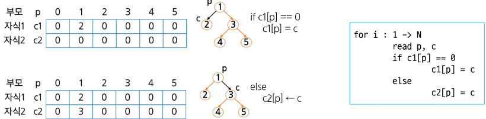

# TREE

## 목차

### 트리

* 트리
* 이진 트리
* 순회
* 이진 트리의 표현1
* 이진 트리의 표현2
* 연습 문제
* 이진 탐색 트리
* 힙

### 트리의 개념

* 비선형 구조임.
* 원소들 간에 1:n 관계를 가지는 자료구조임.
* 원소들 간에 계층관계를 가지는 계층형 자료구조임.
* 상위 원소에서 하위 원소로 내려가면서 확장되는 트리(나무) 모양의 구조임.

### 트리의 정의

* 한 개 이상의 노드로 이루어진 유한 집합이며, 다음 조건을 만족함.
  * 노드 중 최상위 노드를 루트(root)라 함.
  * 나머지 노드들은 $n(>=0)$개의 분리 집합 $T_1$, ..., $T_n$으로 분리될 수 있음.
* 이들 $T_1$, ..., $T_n$은 각각 하나의 트리가 되며(재귀적 정의), 루트의 부 트리(subtree)라 함.


### 용어정리

* **노드 (node)**: 트리의 원소
  * 트리 T의 노드 - A, B, C, D, E, F, G, H, I, J, K
* **간선 (edge)**: 노드를 연결하는 선. 부모 노드와 자식 노드를 연결함.
* **루트 노드 (root node)**: 트리의 시작 노드
  * 트리 T의 루트 노드 - A
  


* **형제 노드 (sibling node)** - 같은 부모 노드의 자식 노드들
    * B, C, D 는 형제 노드

* **조상 노드** - 간선을 따라 루트 노드까지 이르는 경로에 있는 모든 노드들
    * K의 조상 노드 : F, B, A

* **서브 트리 (subtree)** - 부모 노드와 연결된 간선을 끊었을 때 생성되는 트리

* **자손 노드** - 서브 트리에 있는 하위 레벨의 노드들
    * B의 자손 노드 - E, F, K


* **노드의 차수**: 노드에 연결된 자식 노드의 수
  * B의 차수 = 2, C의 차수 = 1
* **트리의 차수**: 트리에 있는 노드의 차수 중에서 가장 큰 값
  * 트리 T의 차수 = 3
* **단말 노드(리프 노드)**: 차수가 0인 노드. 자식 노드가 없는 노드.


* **노드의 깊이(높이)**: 루트에서 노드에 이르는 간선의 수. 노드의 레벨.
  * B의 깊이 = 1, F의 깊이 = 2
* **트리의 깊이(높이)**: 트리에 있는 노드의 깊이 중에서 가장 큰 값. 최대 레벨.
  * 트리 T의 깊이 = 3

  

### 이진 트리

* 모든 노드들이 2개의 서브트리를 갖는 특별한 형태의 트리임.
* 각 노드가 자식 노드를 최대한 2개까지만 가질 수 있는 트리임.
  * 왼쪽 자식 노드(`left child node`)
  * 오른쪽 자식 노드(`right child node`)


### 이진 트리의 특성

* 레벨 `i`에서의 노드의 최대 개수는 $2^i$개임.
* 높이가 `h`인 이진 트리가 가질 수 있는 노드의 최소 개수는 `(h+1)`개가 되며, 최대 개수는 $(2^{h+1}-1)$개임.


### 포화 이진 트리 (Full Binary Tree)

* 모든 레벨에 노드가 포화 상태로 차 있는 이진 트리.
* 높이가 `h`일 때, 최대의 노드 개수인 $(2^{h+1}-1)$개의 노드를 가짐.
  * 높이 3일 때 $2^{3+1}-1=15$개의 노드를 가짐.
* 루트를 1번으로 하여 $(2^{h+1}-1)$까지 정해진 위치에 대한 노드 번호를 가짐.


### 완전 이진 트리 (Complete Binary Tree)

* 높이가 `h`이고 노드 수가 `n`개일 때, $(2^h \le n < 2^{h+1})$ 포화 이진 트리의 노드 번호 1번부터 n번까지 빈자리가 없는 이진 트리.
* **예**: 노드가 10개인 완전 이진 트리.


### 편향 이진 트리 (Skewed Binary Tree)

* 높이가 `h`에 대한 최소 개수의 노드를 가지면서 한쪽 방향의 자식 노드만을 가진 이진 트리.
* **종류**:
  * 왼쪽 편향 이진 트리
  * 오른쪽 편향 이진 트리


# 순회
### 순회 (`traversal`)

* 트리의 노드들을 체계적으로 방문하는 것.  
* 트리의 각 노드를 중복되지 않게 전부 방문(`visit`)하는 것.
* 트리는 비선형 구조이기 때문에 선형 구조에서와 같이 선후 연결 관계를 알 수 없음.
---

### 3가지의 기본적인 순회 방법

* **전위 순회** (`preorder traversal`): VLR (방문-왼쪽-오른쪽)
  * 부모 노드 방문 후, 자식 노드를 좌, 우 순서로 방문.
* **중위 순회** (`inorder traversal`): LVR (왼쪽-방문-오른쪽)
  * 왼쪽 자식 노드, 부모 노드, 오른쪽 자식 노드 순서로 방문.
* **후위 순회** (`postorder traversal`): LRV (왼쪽-오른쪽-방문)
  * 자식 노드를 좌, 우 순서로 방문한 후, 부모 노드로 방문.

  

  ### 전위 순회 (`preorder traversal`)

  * **수행 방법**:

    1.  현재 노드 n을 방문하여 처리한다. → V
    2.  현재 노드 n의 왼쪽 서브트리로 이동한다. → L
    3.  현재 노드 n의 오른쪽 서브트리로 이동한다. → R

  * **전위 순회 알고리즘**:

<!-- end list -->

```python
def preorder_traverse(T) : # 전위 순회
    if T:                  # T is not None
        visit(T)           # print(T.item)
        preorder_traverse(T.left)
        preorder_traverse(T.right)
```
### 전위 순회 결과 예시

* **순서 1**: T0 → T1 → T2
* **순서 2**: A → B D (T3) → C F G
* **총 순서**: A B D E H I C F G


### 중위 순회 (`inorder traversal`)

  * **수행 방법**:

    1.  현재 노드 `n`의 왼쪽 서브트리로 이동. → L
    2.  현재 노드 `n`을 방문하여 처리. → V
    3.  현재 노드 `n`의 오른쪽 서브트리로 이동. → R

  * **중위 순회 알고리즘**:

<!-- end list -->

```python
def inorder_traverse(T) : # 중위 순회
    if T :                 # T is not None
        inorder_traverse(T.left)
        visit(T)
        inorder_traverse(T.right)
```

### 중위 순회 결과 예시

* **순서 1**: T1 → T0 → T2
* **순서 2**: D B (T3) → A → F C G
* **총 순서**: D B H E I A F C G


### 후위 순회 (`postorder traversal`)

  * **수행 방법**:

    1.  현재 노드 n의 왼쪽 서브트리로 이동한다. → L
    2.  현재 노드 n의 오른쪽 서브트리로 이동한다. → R
    3.  현재 노드 n을 방문하여 처리한다. → V

  * **후위 순회 알고리즘**:

<!-- end list -->

```python
def postorder_traverse(T) : # 후위 순회
    if T:                     # T is not None
        postorder_traverse(T.left)
        postorder_traverse(T.right)
        visit(T)              # print(T.item)
```
### 후위 순회 결과 예시

* **순서 1**: T1 → T2 → T0
* **순서 2**: D (T3) B → F G C → A
* **총 순서**: D H I E B F G C A


## 이진 트리의 표현
### 배열을 이용한 이진 트리의 표현

* 이진 트리에 각 노드 번호를 다음과 같이 부여함.
* 루트의 번호를 1로 함.
* 레벨 $n$에 있는 노드에 대하여 왼쪽부터 오른쪽으로 $2^n$부터 $2^{n+1}-1$까지 번호를 차례로 부여함.
* **포화 이진 트리, 완전 이진 트리**에 적합함.


### 노드 번호의 성질

* 노드 번호가 `i`인 노드의 부모 노드 번호? `i / 2`
* 노드 번호가 `i`인 노드의 왼쪽 자식 노드 번호? `2 * i`
* 노드 번호가 `i`인 노드의 오른쪽 자식 노드 번호? `2 * i + 1`
* 레벨 `n`의 노드 번호 시작 번호는? `2^n`

### 배열을 이용한 이진 트리의 표현

* 노드 번호를 배열의 인덱스로 사용.
* 높이가 h인 이진 트리를 위한 배열의 크기?
  * 레벨 i의 최대 노드 수는 $2^i$.
  * 따라서 $1+2+4+8+ \dots + 2^h = \sum_{i=0}^{h} 2^i = 2^{h+1}-1$


### 부모 번호를 인덱스로 자식 번호를 저장

* 간선의 개수 **N**: 4
* 부모 자식 순: 1 2, 1 3, 3 4, 3 5



### 자식 번호를 인덱스로 부모 번호를 저장


### 루트 찾기, 조상 찾기


### 배열을 이용한 이진 트리의 표현의 단점

* 편향 이진 트리의 경우 사용하지 않는 배열 원소에 대한 메모리 공간 낭비가 발생함.
* 트리의 중간에 새로운 노드를 삽입하거나 기존의 노드를 삭제할 경우 배열의 크기 변경이 어려워 비효율적임.

### 연결리스트를 이용한 트리의 표현

* 배열을 이용한 이진 트리의 표현의 단점을 보완함.

---

### 연결 자료구조를 이용한 이진 트리의 표현

* 이진 트리의 모든 노드는 최대 2개의 자식 노드를 가지므로 일정한 구조의 단순 연결 리스트 노드를 사용함.


### 완전 이진 트리의 연결 리스트 표현


### 수식 트리

* 수식을 표현하는 이진 트리임.
* 수식 이진 트리(`Expression Binary Tree`)라고 부르기도 함.
* 연산자는 루트 노드이거나 가지 노드임.
* 피연산자는 모두 잎 노드임.


### 수식 트리의 순회

* **중위 순회**: `A / B * C * D + E` (식의 중위 표기법)
* **후위 순회**: `A B / C * D * E +` (식의 후위 표기법)
* **전위 순회**: `+ * * / A B C D E` (식의 전위 표기법)


----


## 이진 탐색 트리 (BST, Binary Search Tree)

* 데이터들을 빠르게 검색할 수 있도록 체계적으로 저장을 해 두고, 최대 $O(\log_2 n)$의 빠른 속도로 값을 검색할 수 있는 자료구조.
* 빠르게 검색될 수 있도록 특정 규칙을 갖는 이진 트리 형태로 값을 저장함.

### 리스트 vs BST 성능

* BST는 리스트보다 더 빠른 삽입/삭제/탐색이 가능함.

---

### 리스트 성능

* **삽입**: $O(n)$, 단 맨 끝 삽입은 $O(1)$
* **삭제**: $O(n)$, 단 맨 끝 삭제는 $O(1)$
* **탐색**: $O(n)$

---

### BST 성능

* **삽입**: 평균 $O(\log_2 N)$
* **삭제**: 평균 $O(\log_2 N)$
* **탐색**: 평균 $O(\log_2 N)$

### 이진 탐색 트리 (BST, Binary Search Tree)

* 탐색 작업을 효율적으로 하기 위한 자료구조.
* 모든 원소는 서로 다른 유일한 키를 가짐.
* `key(왼쪽 서브트리) < key(루트 노드) < key(오른쪽 서브트리)`
* 왼쪽 서브트리와 오른쪽 서브트리도 이진 탐색 트리.
* 중위 순회하면 오름차순으로 정렬된 값을 얻을 수 있음.


### 탐색 연산

* 루트에서 시작함.
* 탐색할 키 값 `x`를 루트 노드의 키 값과 비교함.
    * (키 값 `x` = 루트 노드의 키 값)인 경우: 원하는 원소를 찾았으므로 탐색 연산 성공.
    * (키 값 `x` < 루트 노드의 키 값)인 경우: 루트 노드의 왼쪽 서브트리에 대해 탐색 연산을 수행.
    * (키 값 `x` > 루트 노드의 키 값)인 경우: 루트 노드의 오른쪽 서브트리에 대해 탐색 연산을 수행.
* 서브트리에 대해 순환적으로 탐색 연산을 반복함.

### 삽입 연산

1.  먼저 **탐색 연산**을 수행함.
    * 삽입할 원소와 같은 원소가 트리에 있으면 삽입할 수 없으므로, 같은 원소가 트리에 있는지 탐색하여 확인함.
    * 탐색에서 탐색 실패가 결정되는 위치가 삽입 위치가 됨.
2.  **탐색 실패한 위치에 원소를 삽입함**.
    * 다음에는 5를 삽입하는 예시.

    

### 이진 탐색 트리의 성능

* 탐색(`searching`), 삽입(`insertion`), 삭제(`deletion`) 시간은 트리의 높이(`h`)만큼 시간이 걸립니다.
  * $O(h)$, `h`는 BST의 깊이(`height`).

---

### 평균의 경우

* 이진 트리가 균형적으로 생성되어 있는 경우.
* $O(\log_2 n)$.

---

### 최악의 경우

* 한쪽으로 치우친 경사 이진 트리의 경우.
* $O(n)$.
* 순차 탐색과 시간 복잡도가 같음.


### 이진 탐색 트리의 성능

* **검색 알고리즘의 비교**
    * 배열에서의 순차 검색: $O(N)$
    * 정렬된 배열에서의 순차 검색: $O(N)$
    * 정렬된 배열에서의 이진 탐색: $O(\log_2 N)$ (고정 배열 크기와 삽입, 삭제 시 추가 연산 필요)
    * 이진 탐색 트리에서의 평균: $O(\log_2 N)$
    * 최악의 경우: $O(N)$
        * 완전 이진 트리 또는 균형 트리로 바꿀 수 있다면 최악의 경우를 없앨 수 있음.
        * 새로운 원소를 삽입할 때 삽입 시간을 줄임.
        * 평균과 최악의 시간이 같음: $O(\log_2 N)$
    * 해쉬 검색: $O(1)$ (추가 저장 공간 필요)

---

# 힙 (`heap`)

* 완전 이진 트리에 있는 노드 중에서 키값이 가장 큰 노드나 가장 작은 노드를 찾기 위해 만든 자료구조.

---

### 최대 힙 (`max heap`)

* 키값이 가장 큰 노드를 찾기 위한 **완전 이진 트리**.
  * `{부모 노드의 키값 > 자식 노드의 키값}`
* 루트 노드: 키값이 가장 큰 노드.

---

### 최소 힙 (`min heap`)

* 키값이 가장 작은 노드를 찾기 위한 **완전 이진 트리**.
  * `{부모 노드의 키값 < 자식 노드의 키값}`
* 루트 노드: 키값이 가장 작은 노드.

### 힙의 예


### 힙이 아닌 이진 트리의 예


### 힙 연산 - 삽입 1


### 힙 연산 - 삽입 2


### 힙 연산 - 삭제

* 힙에서는 루트 노드의 원소만을 삭제할 수 있음.
* 루트 노드의 원소를 삭제하여 반환함.
* 힙의 종류에 따라 최댓값 또는 최솟값을 구할 수 있음.


### 힙을 이용한 우선순위 큐

* 완전 이진 트리로 구현된 자료구조로, 키 값이 가장 큰 노드나 가장 작은 노드를 찾기에 적합한 자료구조  
* 아래의 예는 최소 힙(Min heap)으로서, 가장 작은 키 값을 가진 노드가 항상 루트에 위치  
* 힙의 키를 우선순위로 활용하여 우선순위 큐를 구현  


