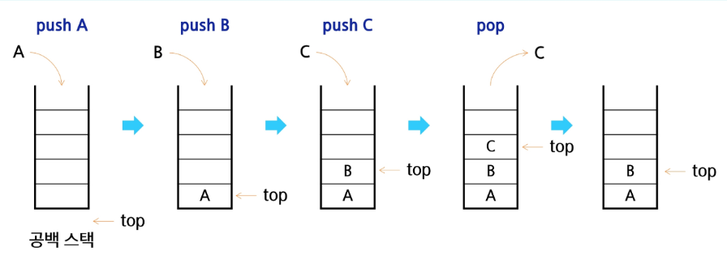

### 목차
#### Stack 자료구조 이해
- Stack의 개념과 특성
- Stack의 기본 연산
- Stack 구현 실습
#### Stack 응용
- 괄호 검사
- Function Call
#### Stack 기반 문제 해결 기법
- 재귀호출
- Memoization
- DP
- DFS

## Stack 자료구조 이해
### Stack의 개념과 특성

### 스택(Stack)의 개념
물건을 쌓아 올리듯 자료를 쌓아 올린 형태의 자료구조

---

* **선형구조** : 자료 간의 관계가 1:1의 관계를 갖는다. (예: 배열, 리스트)
* **비선형구조** : 자료 간의 관계가 1:N의 관계를 갖는다. (예: 트리, 그래프)
* 대표적인 선형 자료구조 중 하나
* 스택에 자료를 삽입하거나, 스택에서 자료를 꺼낼 수 있습니다.

### 스택(Stack)의 특성
### 후입선출  
**LIFO, Last-In-First-Out** 가장 마지막에 놓은 자료가 가장 먼저 나오는 것  

---

예를 들어, 스택에 1, 2, 3을 차례대로 넣으면 꺼낼 때는 3, 2, 1 순서로 나오게 됩니다.

## Stack의 기본 연산
### 스택을 프로그램에서 구현하기 위해서 필요한 자료구조와 연산  
* 배열을 사용해 구현할 수 있음  
    * 파이썬에서는 리스트를 사용해 구현할 수 있습니다.  
* 저장소 자체를 스택이라 부르기도 함  
    * 용도에 따라 메모리의 일부를 스택으로 부릅니다.  
* 스택에서 마지막 삽입된 원소의 위치  
    * 스택 포인터, top으로 부르며 데이터를 넣거나 뺄 때 기준이 되는 위치입니다.

### 스택의 연산  

* **삽입 (Push)**
    * 저장소에 자료를 저장하는 연산으로, 보통 push라고 부릅니다.
* **삭제 (Pop)**
    * 저장소에서 삽입 자료의 역순으로 꺼내는 연산으로, 보통 pop이라고 부릅니다.
* **스택이 공백인지 아닌지를 확인하는 연산 (isEmpty)**
    * 스택이 비어 있으면 True, 아니면 False를 반환합니다.
* **스택의 top에 있는 item(원소)을 반환하는 연산 (peek)**
    * 삭제는 하지 않습니다.

### 스택의 삽입/삭제 과정  
* 빈 스택에 원소 A,B,C를 차례로 삽입(push) 후 한번 삭제(pop)하는 연산 과정  



## Stack 구현 실습
### Push 연산

  * `append` 메서드를 통해 리스트의 마지막에 데이터를 삽입

<!-- end list -->

```python
def my_push(item):  
    s.append(item)  
```

  * 인덱스 연산을 활용한 구현

<!-- end list -->

```python
def my_push(item, size):  
    global top  
    top += 1  
    if top==size:  
        print('overflow!')  
    else:  
        stack[top] = item  
```

### 단순한 Push 연산

  * 크기가 정해진 리스트와 인덱스 연산을 활용

<!-- end list -->

```python
size = 10  
stack = [0] * size  
top = -1  
  
push(10, size)  
top += 1 # push(20)  
stack[top] = 20 #  
```

### Pop 연산

  * 남은 데이터 중 가장 늦게 저장된 데이터를 삭제하는 연산

<!-- end list -->

```python
def my_pop():  
    if len(s) == 0:  
        # underflow  
        return  
    else:  
        return s.pop() # 리스트 s의 마지막 원소 삭제  
```

### 인덱스 연산을 이용한 Pop 연산

  * 크기가 정해진 리스트와 인덱스 활용

<!-- end list -->

```python
def my_pop():  
    global top  
    if top == -1:  
        print('underflow')  
        return 0  
    else:  
        top -= 1  
        return stack[top+1]  
  
print(pop())  
```

```python
if top > -1: # pop()  
    top -= 1  
    print(stack[top+1])  
```

### 스택 구현 고려 사항  

* **1차원 배열을 사용하여 구현할 경우** * **장점:** 구현이 용이합니다.  
    * **단점:** 스택의 크기를 변경하기가 어렵습니다.  
* **해결 방법: 저장소를 동적으로 할당하여 스택을 구현하는 방법** *(동적 연결 리스트를 이용하여 구현하는 방법)* * **장점:** 메모리를 효율적으로 사용합니다.  
    * **단점:** 구현이 복잡합니다.  

---  

### 용어 설명  

* **동적 메모리 할당** : 필요한 만큼 메모리를 할당하고 해제하여 유연하게 크기를 조절할 수 있습니다.  
* **연결리스트** : 데이터와 다음 노드의 주소를 함께 저장하여 요소들이 순차적으로 연결된 자료구조  
* **메모리** : 컴퓨터에서 데이터를 저장하고 처리하기 위해 사용하는 일시적인 저장 공간


