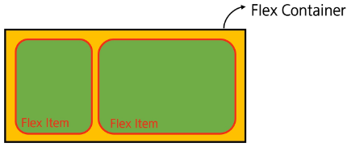

# Web
# CSS Layout

### 목차

### CSS Box Model

* display 속성(박스의 화면 배치 방식)
* Normal flow
* 기타 display 속성

---

### CSS position

* Position 유형
* z-index


### CSS Flexbox

* Flexbox 구성 요소
* Flexbox 속성
* flex-wrap 응용

---

### 참고

* 마진 상쇄
* 박스 타입 별 수평 정렬
* 실제 Position 활용 예시
* Flexbox Shorthand 속성
* Flexbox 속성 정리

## CSS Box Model
### display 속성(박스의 화면 배치 방식)

### 박스 타입

* 박스 타입에 따라 페이지에서의 배치 흐름 및 다른 박스와 관련하여 박스가 동작하는 방식이 달라짐.

---

### 박스 타입 종류

1.  Block 타입
2.  Inline 타입

### Block 타입

  * 블록 타입은 하나의 독립된 덩어리처럼 동작하는 요소임.
  * 마치 책의 각 문단과 같음. 모든 문단이 항상 새로운 줄에서 시작하고, 그 자체로 하나의 독립된 덩어리를 이룸. 다른 문단이 옆에 끼어들 수 없음. 이처럼 블록 타입은 웹 페이지의 큰 구조와 단락을 만듦.

<!-- end list -->

```css
.index {
    display: block;
}
```

### Block 타입 특징

* 항상 새로운 행으로 나열됨 (한 줄 전체를 차지하며 너비 100%).
* `width`, `height`, `margin`, `padding` 속성을 모두 사용할 수 있음.
* `padding`, `margin`, `border`로 인해 다른 요소를 상자로부터 밀어냄.
* `width` 속성을 지정하지 않으면 박스는 `inline` 방향으로 사용 가능한 공간을 모두 차지함 (상위 컨테이너 너비 100%로 채우는 것과 같음).

---

### 대표적인 Block 타입 태그

* `h1`~`h6`, `p`, `div`, `ul`, `li`

### Block 타입의 대표: `div`

  * 다른 HTML 요소들을 그룹화하여 레이아웃을 구성하거나 스타일링을 적용할 때 사용함.
  * 헤더, 푸터, 사이드바 등 웹 페이지의 다양한 섹션을 구조화하는 데 가장 많이 쓰이는 요소임.

-----

### 예시 코드 및 결과

  * **HTML 코드**:

<!-- end list -->

```html
<div class="container">
    <h1>제목</h1>
    <p>단락 내용입니다.</p>
</div>
<div>
    <p>콘텐츠</p>
</div>
```

  * **결과**: `div`가 각각 독립된 블록으로 나타나며, 그 안에 포함된 요소들이 세로로 배치됨.

  ### Inline 타입

  * 문장 안의 단어처럼 흐름에 따라 자연스럽게 배치되는 요소임.
  * 마치 문장 속 단어를 형광펜으로 칠하는 것과 같음. 형광펜을 칠해도 문장의 흐름이 끊기지 않고 단어는 제자리에 있는 것처럼, **`inline` 타입**은 줄을 바꾸지 않고 텍스트의 일부에만 스타일을 적용할 때 사용됨.

<!-- end list -->

```css
.index {
    display: inline;
}
```

### `inline` 타입 특징

* 줄바꿈이 일어나지 않음 (콘텐츠의 크기만큼만 영역을 차지함).
* `width`와 `height` 속성을 사용할 수 없음.
* **수직 방향(상하)**: `padding`, `margin`, `border`가 적용되지만, 다른 요소를 밀어낼 수는 없음.
* **수평 방향(좌우)**: `padding`, `margin`, `border`가 적용되어 다른 요소를 밀어낼 수 있음.

---

### 대표적인 `inline` 타입 태그

* `a`, `img`, `span`, `strong`

### Inline 타입의 대표: `span`

  * **자체적으로 시각적 변화 없음**: 스타일을 적용하기 전까지는 특별한 변화가 없음.
  * **텍스트 일부 조작**: 문장 내 특정 단어나 구문에만 스타일을 적용할 때 유용함.
  * **문서의 구조에 변화 없음**: 블록 요소처럼 줄바꿈을 일으키지 않으므로, 문서의 구조에 큰 변화를 주지 않음.

-----

### 예시 코드 및 결과

  * **HTML 코드**:

<!-- end list -->

```html
<p>이 문장에서 <span style="color: blue;">파란색</span> 단어만 색상이 다릅니다.</p>
<p>이 단어는 <span class="highlight-text">강조</span>되었습니다.</p>
<p>이것은 <span id="changeText">클릭</span>하면 변경됩니다.</p>
```

  * **결과**: `span` 태그가 감싸는 부분에만 스타일이 적용되어, 텍스트 흐름을 그대로 유지하면서 특정 부분에만 변화를 줌.
      * 이 문장에서 **파란색** 단어만 색상이 다릅니다.
      * 이 단어는 **강조**되었습니다.
      * 이것은 **클릭**하면 변경됩니다.


## Normal flow

### Normal flow

* 일반적인 흐름 또는 레이아웃을 변경하지 않은 경우 웹 페이지 요소가 배치되는 방식.
* 워드(Word) 문서를 예로 들면, 엔터를 눌러 문단을 나누는 것이 **`block` 요소**의 배치 방식임. 엔터를 누르지 않고 계속 타이핑하는 것이 **`inline` 요소**의 배치 방식임.

### 기타 `display` 속성

1.  `inline-block`
2.  `none`
3.  `flex`

### `inline-block` 타입

  * `inline`과 `block`의 특징을 모두 가진 특별한 `display` 속성값임.
  * 마치 '줄 서 있는 사람들'과 같음. 각 사람은 한 줄로 나란히 서 있지만(`inline`), 사람마다 키와 덩치가 다르므로 각각 공간을 가지고 있음(`block`).

<!-- end list -->

```css
.index {
    display: inline-block;
}
```

### `inline-block` 타입 특징

* `Block`과 `Inline`의 특징을 합친 것임 (줄바꿈 없이 크기 지정 가능).
* `width` 및 `height` 속성 사용 가능함.
* `padding`, `margin` 및 `border`로 인해 다른 요소가 상자에서 밀려남.

---

### TIP

* 주로 가로로 정렬된 내비게이션 메뉴나 여러 개의 버튼, 이미지 갤러리처럼 수평으로 나열하면서 각 항목의 크기를 직접 제어하고 싶을 때 매우 유용하게 사용됨.

### `none` 타입

  * 요소를 화면에 표시하지 않고, 공간조차 부여되지 않음.
  * 축구팀의 '후보 선수'와 같음. 선수는 팀 명단(HTML)에 포함되어 있지만, 벤치에 앉아있을 땐 경기장(웹 페이지)에 보이지 않음.   
  주전 선수는 후보 선수의 공간을 남겨두지 않고, 포메이션을 짬. 이처럼 요소가 레이아웃에서 아예 빠져 있는 상태가 `none` 타입임.

<!-- end list -->

```css
.index {
    display: none;
}
```

### `none` 타입 예시

  * 요소를 화면에 표시하지 않고, 공간조차 부여되지 않음.

-----

### 코드 및 결과

  * **HTML 코드**:

<!-- end list -->

```html
<div class="box"></div>
<div class="box none"></div>
<div class="box"></div>
```

  * **CSS 코드**:

<!-- end list -->

```css
.box {
    width: 100px;
    height: 100px;
    background-color: red;
    border: 2px solid black;
}
.none {
    display: none;
}
```

  * **결과**: 두 번째 `<div class="box none"></div>`는 `display: none;` 속성으로 인해 화면에 보이지 않고, 공간도 차지하지 않으므로 첫 번째 `div`와 세 번째 `div`가 바로 이어서 표시됨.

  

  ## CSS Position
  ### CSS Layout

* 각 요소의 위치와 크기를 조정하여 웹 페이지의 디자인을 결정하는 것.
* 요소들을 상하좌우로 정렬하고 간격을 맞춰 전체적인 페이지의 뼈대를 구성함.
* 핵심 속성: `display`( `block`, `inline`, `flex`, `grid` 등).

---

### CSS Position

* 요소를 Normal Flow에서 제거하여 다른 위치로 배치하는 것.
* 다른 요소 위에 올리기, 화면의 특정 위치에 고정시키기 등을 할 수 있음.
* 핵심 속성: `position`( `static`, `relative`, `absolute`, `fixed`, `sticky` 등).

### Position 이동 방향

* 네 가지 방향 속성(`top`, `bottom`, `left`, `right`)을 이용해 요소의 위치를 조절할 수 있음.
* 겹치는 요소의 쌓이는 순서를 `z-index` 속성을 통해 조절할 수 있음.


### Position 유형

1.  `static`
2.  `relative`
3.  `absolute`
4.  `fixed`
5.  `sticky`

### 1\. Position: `static`

  * 요소를 `Normal Flow`에 따라 배치함.
  * `top`, `right`, `bottom`, `left` 속성이 적용되지 않음.
  * `position` 속성의 기본값임.

<!-- end list -->

```css
.static {
    position: static;
    background-color: lightcoral;
}
```

  * **HTML 코드**:

<!-- end list -->

```html
<div class="container">
    <div class="box static">Static</div>
    <div class="box absolute">Absolute</div>
    <div class="box relative">Relative</div>
    <div class="box fixed">Fixed</div>
</div>
```

  * **CSS 코드**:

<!-- end list -->

```css
* {
    box-sizing: border-box;
}
body {
    height: 1500px;
}
.container {
    position: relative;
    height: 300px;
    width: 300px;
    border: 1px solid black;
}
.box {
    height: 100px;
    width: 100px;
    border: 1px solid black;
}
```


### 2\. Position: `relative`

  * 요소를 `Normal Flow`에 따라 배치함.
  * 자신의 원래 위치(`static`)를 기준으로 이동함.
  * `top`, `right`, `bottom`, `left` 속성으로 위치를 조정함.
  * 다른 요소의 레이아웃에 영향을 주지 않음 (요소가 차지하는 공간은 `static`일 때와 같음).

<!-- end list -->

```css
.relative {
    position: relative;
    background-color: lightblue;
    top: 100px;
    left: 100px;
}
```

### 3\. Position: `absolute`

  * 요소를 `Normal Flow`에서 제거함.
  * 가장 가까운 `relative` 부모 요소를 기준으로 이동함.
  * 만족하는 부모 요소가 없다면 `body` 태그를 기준으로 함.
  * `top`, `right`, `bottom`, `left` 속성으로 위치를 조정함.
  * 문서에서 요소가 차지하는 공간이 없어짐.

<!-- end list -->

```css
.absolute {
    position: absolute;
    background-color: lightgreen;
    top: 100px;
    left: 100px;
}
```

### 4\. Position: `fixed`

  * 요소를 `Normal Flow`에서 제거함.
  * 현재 화면영역(viewport)을 기준으로 이동함.
  * 스크롤해도 항상 같은 위치에 유지됨.
  * `top`, `right`, `bottom`, `left` 속성으로 위치를 조정함.
  * 문서에서 요소가 차지하는 공간이 없어짐.

<!-- end list -->

```css
.fixed {
    position: fixed;
    background-color: gray;
    top: 0;
    right: 0;
}
```

### 5. Position: `sticky`

* `relative`와 `fixed`의 특성을 결합한 속성임.
* 스크롤 위치가 임계점에 도달하기 전에는 `relative`처럼 동작함.
* 스크롤 위치가 임계점에 도달하면 `fixed`처럼 화면에 고정됨.
* 다음 `sticky` 요소가 나오면 이전 `sticky` 요소의 자리를 대체함. (이전 `sticky` 요소와 다음 `sticky` 요소의 위치가 겹치게 되기 때문임)

### `z-index`

  * 요소의 쌓임 순서를 정하는 속성임.
  * 마치 연극 무대의 배우와 배경과 같음. 무대 뒤에는 숲 배경(`z-index: 1`)이 있고, 그 앞에는 배우(`z-index: 10`)가 서 있음. 배우의 `z-index`가 더 높기 때문에 배경보다 앞에 보이게 됨. 이처럼 `z-index`는 요소들의 앞뒤 순서를 정해 입체감을 만듦.

<!-- end list -->

```css
.index {
    z-index: 1;
}
```

### `z-index` 속성

* 정수 값을 사용하여 z축 순서(쌓임 순서)를 지정함.
* 값이 클수록 요소가 위에 쌓이게 됨.
* `static`이 아닌 요소에만 적용됨.
* 기본값은 `auto`로, 부모 요소의 `z-index` 값에 영향을 받음.
* 같은 부모 내에서만 `z-index` 값을 비교하며, 값이 같으면 HTML 문서 순서대로 쌓임.
* 부모의 `z-index`가 낮으면 자식의 `z-index`가 아무리 높아도 부모보다 위로 올라갈 수 없음.

---

### TIP

* `position` 속성이 `static`(기본값)이 아닌 요소에만 `z-index`가 적용됨.
* 음수 `z-index` 값은 요소를 부모 요소의 뒤(배경)로 보낼 때 사용할 수 있음.


## CSS Flexbox
### 박스 표시(`Display`) 타입

1.  **Outer display 타입**
    * `block` 타입
    * `inline` 타입
2.  **Inner display 타입**
    * 박스 내부의 요소들이 어떻게 배치될지를 결정함.
    * `CSS Flexbox`(속성: `flex`)

### CSS Flexbox

  * 요소를 행과 열 형태로 배치하는 1차원 레이아웃 방식임.
  * 마치 책장의 책들을 정리하는 것과 같음. 책장(**flex 컨테이너**) 안에 책들(**flex 아이템**)을 넣고, "책들을 왼쪽에 붙여줘" 혹은 "서로 같은 간격으로 띄워줘" 같은 명령을 통해 손쉽게 배치할 수 있음.

<!-- end list -->

```css
.container {
    display: flex;
}
```

### CSS Flexbox

* 요소를 행과 열 형태로 배치하는 1차원 레이아웃 방식임.
* '공간 배열' & '정렬'


### Flexbox 구성 요소

* main axis
* cross axis
* flex container
* flex item


### main axis (주 축)

* flex item들이 배치되는 기본 축.
* `main start`에서 시작하여 `main end` 방향으로 배치함 (기본값).


### cross axis (교차 축)

* `main axis`에 수직인 축.
* `cross start`에서 시작하여 `cross end` 방향으로 배치함 (기본값).


### Flex Container

* `display: flex;` 또는 `display: inline-flex;`가 설정된 부모 요소.
* 이 컨테이너의 1차 자식 요소들이 **Flex Item**이 됨.
* `flexbox` 속성 값들을 사용하여 자식 요소 **Flex Item**들을 배치하는 주체.


### Flex Item

* `Flex Container` 내부에 레이아웃되는 항목임.
* 이후 배우는 내용을 이용해 자유로운 순서 변경 및 정렬 가능함.



### Flexbox 속성 목록

* **Flex Container** 관련 속성
    * `display`
    * `flex-direction`
    * `flex-wrap`
    * `justify-content`
    * `align-items`
    * `align-content`

---

* **Flex Item** 관련 속성
    * `align-self`
    * `flex-grow`
    * `flex-basis`
    * `order`


```html
display: flex; >> 교차 축 방향으로 바꿈
축 방향 기본 : row
flex - direction : 메인 축 바꿈
row-reverse : 오른쪽에서 왼쪽
column-reverse : 아래에서 위로
```

### 1. Flex Container 지정

* `display` 속성을 `flex`로 설정하면 **Flex Container**로 지정됨.
* `flex item`은 기본적으로 행(주 축의 기본값인 가로 방향)으로 나열됨.
* `flex item`은 주 축의 시작 선에서 시작함.
* `flex item`은 교차 축의 크기를 채우기 위해 늘어남.

```css
.container {
    height: 500px;
    border: 1px solid black;
    display: flex;
}
```


### 2\. `flex-direction`

  * `flex item`이 나열되는 방향을 지정하는 속성.
      * `row`(기본값): 아이템을 가로 방향으로, 왼쪽에서 오른쪽으로 배치.
      * `column`: 아이템을 세로 방향으로, 위에서 아래로 배치.
      * `-reverse`로 지정하면 `flex item` 배치의 시작 선과 끝 선이 서로 바뀜.

<!-- end list -->

```css
.container {
    /* flex-direction: row; */
    flex-direction: column;
    /* flex-direction: row-reverse; */
    /* flex-direction: column-reverse; */
}
```


### 3\. `flex-wrap`

  * **`flex item`** 목록이 \*\*`flex container`\*\*의 한 행에 들어가지 않을 경우, 다른 행에 배치할지 여부를 설정하는 속성임.
      * `nowrap`(기본값): 줄 바꿈을 하지 않음.
      * `wrap`: 여러 줄에 걸쳐 배치될 수 있게 설정함.

<!-- end list -->

```css
.container {
    /* flex-wrap: nowrap; */
    flex-wrap: wrap;
}
```


### 4\. `justify-content`

  * 주 축을 따라 `flex item`들을 정렬하고 간격을 조정하는 속성임.
      * `flex-start`(기본값): 주 축의 시작점으로 정렬
      * `center`: 주 축의 중앙으로 정렬
      * `flex-end`: 주 축의 끝점으로 정렬

<!-- end list -->

```css
.container {
    /* justify-content: flex-start; */
    justify-content: center;
    /* justify-content: flex-end; */
}
```


### 5\. `align-content`

  * 컨테이너에 여러 줄의 `flex item`이 있을 때, 그 줄들 사이의 공간을 어떻게 분배할지 지정하는 속성임.
  * `flex-wrap`이 `wrap` 또는 `wrap-reverse`로 설정된 여러 행에만 적용됨.
  * `flex item`이 두 줄 이상일 때만 의미가 있음 ( `flex-wrap`이 `nowrap`으로 설정된 경우는 제외).

-----

### 속성

  * `stretch`(기본값): 여러 줄을 교차 축에 맞게 늘려 빈 공간을 채움.
  * `center`: 여러 줄을 교차 축의 중앙에 맞춰 정렬.
  * `flex-start`: 여러 줄을 교차 축의 시작점(보통 위쪽)에 맞춰 정렬.
  * `flex-end`: 여러 줄을 교차 축의 끝점(보통 아래쪽)에 맞춰 정렬.

<!-- end list -->

```css
.container {
    flex-wrap: wrap;
    /* align-content: flex-start; */
    align-content: center;
    /* align-content: flex-end; */
}
```


### 6\. `align-items`

  * 컨테이너 안에 있는 `flex item`들의 교차 축 정렬 방법을 지정하는 속성임.
      * `stretch`(기본값): 아이템을 교차 축 높이를 꽉 채우도록 늘려남.
      * `center`: 아이템을 교차 축의 중앙에 맞춰 정렬.
      * `flex-start`: 아이템을 교차 축의 시작점(가로 방향일 경우 위쪽)에 맞춰 정렬.
      * `flex-end`: 아이템을 교차 축의 끝점(가로 방향일 경우 아래쪽)에 맞춰 정렬.

<!-- end list -->

```css
.container {
    align-items: center;
    /* align-items: stretch; */
    /* align-items: flex-start; */
    /* align-items: flex-end; */
}
```


### 7\. `align-self`

  * 컨테이너 안에 있는 `flex item`들을 교차 축을 따라 개별적으로 정렬하는 속성.

-----

### 속성

  * `auto`(기본값): 부모 컨테이너의 `align-items` 속성 값을 상속함.
  * `stretch`: 해당 아이템만 교차 축 방향으로 늘어나 컨테이너를 꽉 채우도록 정렬.
  * `center`: 해당 아이템만 교차 축의 중앙에 정렬.
  * `flex-start`: 해당 아이템만 교차 축의 시작점(가로 방향일 경우 위쪽)에 정렬.
  * `flex-end`: 해당 아이템만 교차 축의 끝점(가로 방향일 경우 아래쪽)에 정렬.

<!-- end list -->

```css
.item1 {
    align-self: center;
}

.item2 {
    align-self: flex-end;
}
```


### 목적에 따른 속성 분류

* **배치**: `flex-direction`, `flex-wrap`
* **공간 분배**: `justify-content`, `align-content`
* **정렬**: `align-items`, `align-self`

---

### 속성 쉽게 이해하는 방법

* `justify` - 주 축
* `align` - 교차 축

---

### TIP

* `justify-items` 및 `justify-self` 속성이 없는 이유는?
    * 애초에 필요가 없기 때문임.
    * `margin: auto`를 통해 정렬 및 배치가 간단하게 가능함.


### 8\. `flex-grow` (1/3)

  * 남는 행 여백을 비율에 따라 각 `flex item`에 분배함.
  * `flex item`이 컨테이너 내에서 확장하는 비율을 지정함.

-----

### 코드 및 결과

  * **HTML 코드**:

<!-- end list -->

```html
<div class="container">
    <div class="item-1">1</div>
    <div class="item-2">2</div>
    <div class="item-3">3</div>
</div>
```

  * **CSS 코드**:

<!-- end list -->

```css
.container {
    display: flex;
    width: 100%;
}
.item {
    height: 100px;
    color: white;
    font-size: 3rem;
}
.item-1 {
    background-color: red;
    flex-grow: 1;
}
.item-2 {
    background-color: green;
    flex-grow: 2;
}
.item-3 {
    background-color: blue;
    flex-grow: 3;
}
```

  * **결과**: `flex-grow` 속성값인 `1`, `2`, `3`의 비율에 따라 남는 공간이 세 개의 아이템에 각각 분배됨.

-----

### TIP: `flex-shrink`

  * `flex-grow`의 반대되는 개념임.
  * 컨테이너의 공간이 부족할 때, `flex item`이 줄어드는 비율을 지정하는 속성임.


### flex-grow(2/3)


### flex-grow(3/3)
- 남은 여백을 각 flex item의 비율만큼 추가


### 8\. `flex-basis`

  * `flex item`의 초기 크기 값을 지정함.
  * `flex-basis`와 `width`를 동시에 적용한 경우 `flex-basis`가 우선함.

-----

### 코드 및 결과

  * **HTML 코드**:

<!-- end list -->

```html
<div class="container">
    <div class="item-1">1</div>
    <div class="item-2">2</div>
    <div class="item-3">3</div>
</div>
```

  * **CSS 코드**:

<!-- end list -->

```css
.container {
    display: flex;
    width: 100%;
}
.item {
    height: 100px;
    color: white;
    font-size: 3rem;
}
.item-1 {
    background-color: red;
    flex-basis: 300px;
}
.item-2 {
    background-color: green;
    flex-basis: 600px;
}
.item-3 {
    background-color: blue;
    flex-basis: 300px;
}
```

  * **결과**: 세 개의 아이템이 `flex-basis`에 설정된 값인 `300px`, `600px`, `300px`을 기준으로 초기 크기를 가짐.


## flex-wrap 응용

### 반응형 레이아웃 작성 (1/2)

* 다양한 디바이스와 화면 크기에 자동으로 적용하여 콘텐츠를 최적으로 표시하는 웹 레이아웃 방식.
* `flex-wrap`을 사용해 반응형 레이아웃을 작성함 (`flex-grow` & `flex-basis`를 활용).


### 반응형 레이아웃 작성 (2/2) 코드 예시

  * **HTML 코드**:

<!-- end list -->

```html
<div class="card">
    
    <div class="content">
        <h2>Heading</h2>
        <p>...</p>
    </div>
</div>
```

  * **CSS 코드**:

<!-- end list -->

```css
.card {
    width: 80%;
    border: 1px solid black;
    display: flex; /* 1번: .card 요소를 flex 컨테이너로 설정 */
    flex-wrap: wrap; /* 2번: 컨테이너 공간 부족 시 줄바꿈 허용 */
}
img {
    width: 100%;
}
.thumbnail {
    flex-basis: 700px; /* 3번: flex item의 기본 너비 설정 */
    flex-grow: 1; /* 4번: 여유 공간이 있을 때 늘어나는 비율 지정 */
    /* flex: 1 700px; */
}
.content {
    flex-basis: 350px; /* 3번: flex item의 기본 너비 설정 */
    flex-grow: 1; /* 4번: 여유 공간이 있을 때 늘어나는 비율 지정 */
    /* flex: 1 350px; */
}
```


# 참고
### Margin collapsing (마진 상쇄)

* 두 `block` 타입 요소의 `margin-top`과 `margin-bottom`이 만나 더 큰 `margin`으로 결합되는 현상임.


### Margin collapsing (마진 상쇄) 예시

* 두 요소 모두 `margin 20px`이지만 실제 두 요소의 상/하 공간은 40이 아닌 20으로 상쇄됨.


### TIP: Margin collapsing (마진 상쇄) 이유

* 복잡한 레이아웃에서 요소 간 간격을 일관되게 유지할 수 있음 (일관성).
* 요소 간의 간격을 더 예측 가능하고 관리하기 쉽게 만듦 (단순성).

## 박스 타입 별 수평 정렬

### Block 요소의 수평 정렬

  * `margin: auto`를 사용함.

  * 블록의 너비를 지정하고 좌우 마진을 `auto`로 설정하면 됨.

  * **HTML 코드**:

<!-- end list -->

```html
<div class="box margin-auto"></div>
```

  * **CSS 코드**:

<!-- end list -->

```css
.box {
    width: 100px;
    height: 100px;
    background-color: crimson;
    border: 1px solid black;
}
.margin-auto {
    margin: 0 auto;
}
```

-----

### Inline 요소의 수평 정렬

  * `text-align`을 사용함.

  * 부모 요소에 적용함.

  * **HTML 코드**:

<!-- end list -->

```html
<div class="text-center">
    <span>inline 요소</span>
</div>
```

  * **CSS 코드**:

<!-- end list -->

```css
.text-center {
    text-align: center;
}
```

## Flexbox Shorthand 속성
### Shorthand: `flex-flow`

  * `flex-direction`과 `flex-wrap` 속성을 한 번에 지정할 수 있는 단축 속성임.

-----

### 코드 예시

  * **기본 속성 사용 시**:

<!-- end list -->

```css
.container {
    flex-flow: flex-direction flex-wrap;
}
```

  * **단축 속성 사용 시**:

<!-- end list -->

```css
.container {
    flex-direction: row;
    flex-wrap: wrap;
}
```
### Flexbox 속성 정리

* **`flex-direction`**: `flex item`이 나열되는 방향을 지정함.
* **`flex-wrap`**: 컨테이너가 넘칠 경우, 다른 행에 배치할지 결정하는 속성.


### Shorthand: `flex`

  * `flex-grow`, `flex-shrink`, `flex-basis` 속성을 한 번에 설정할 수 있는 단축 속성.
  * 기본값으로는 `0 1 auto`로 설정됨.

-----

### 기본 속성 사용 시

  * **`1. One value, unitless number: flex-grow`**
    ```css
    flex-grow: 2;
    flex-shrink: 1;
    flex-basis: 0%;
    ```
  * **`2. One value, length or percentage: flex-basis`**
    ```css
    flex-grow: 1;
    flex-shrink: 1;
    flex-basis: 10rem; /* 또는 flex-basis: 30%; */
    ```
  * **`3. Two values: flex-grow | flex-basis`**
    ```css
    flex-grow: 1;
    flex-shrink: 1;
    flex-basis: 30px;
    ```
  * **`4. Two values: flex-grow | flex-shrink`**
    ```css
    flex-grow: 2;
    flex-shrink: 2;
    flex-basis: 0%;
    ```
  * **`5. Three values: flex-grow | flex-shrink | flex-basis`**
    ```css
    flex-grow: 2;
    flex-shrink: 2;
    flex-basis: 10%;
    ```

-----

### 단축 속성 사용 시

  * **`1. One value, unitless number: flex-grow`**
    ```css
    flex: 2;
    ```
  * **`2. One value, length or percentage: flex-basis`**
    ```css
    flex: 10rem;
    flex: 30%;
    ```
  * **`3. Two values: flex-grow | flex-basis`**
    ```css
    flex: 1 30px;
    ```
  * **`4. Two values: flex-grow | flex-shrink`**
    ```css
    flex: 2 2;
    ```
  * **`5. Three values: flex-grow | flex-shrink | flex-basis`**
    ```css
    flex: 2 2 10%;
    ```

### `flex-direction`

1.  **`row`**(기본값): 아이템을 가로 방향으로, 왼쪽에서 오른쪽으로 배치.
2.  **`row-reverse`**: 아이템을 가로 방향으로, 오른쪽에서 왼쪽으로 배치.
3.  **`column`**: 아이템을 세로 방향으로, 위에서 아래로 배치.
4.  **`column-reverse`**: 아이템을 세로 방향으로, 아래에서 위로 배치.


### `flex-wrap`

1.  **`wrap`**: 여러 줄에 걸쳐 배치될 수 있게 설정함.
2.  **`nowrap`**(기본값): 줄 바꿈을 하지 않음.


### `justify-content` 속성

1.  **`flex-start`**(기본값): 주 축의 시작점으로 정렬
2.  **`flex-end`**: 주 축의 끝점으로 정렬
3.  **`center`**: 주 축의 중앙으로 정렬
4.  **`space-between`**: 첫 아이템은 시작점, 마지막 아이템은 끝점에 붙이고 아이템들 사이의 간격을 균등하게 분배
5.  **`space-around`**: 각 아이템의 둘레(around)에 균등한 간격으로 분배 (양 끝 아이템은 절반의 간격이 설정)
6.  **`space-evenly`**: 모든 아이템들 사이와 양 끝의 간격을 모두 동일하게 분배


### `justify-content` 속성

1.  **`flex-start`**(기본값): 주 축의 시작점으로 정렬
2.  **`flex-end`**: 주 축의 끝점으로 정렬
3.  **`center`**: 주 축의 중앙으로 정렬
4.  **`space-between`**: 첫 아이템은 시작점, 마지막 아이템은 끝점에 붙이고 아이템들 사이의 간격을 균등하게 분배
5.  **`space-around`**: 각 아이템의 둘레(around)에 균등한 간격으로 분배 (양 끝 아이템은 절반의 간격이 설정)
6.  **`space-evenly`**: 모든 아이템들 사이와 양 끝의 간격을 모두 동일하게 분배


### `align-content` 속성

1.  **`flex-start`**: 여러 줄을 교차 축의 시작점에 맞춰 정렬함.
2.  **`flex-end`**: 여러 줄을 교차 축의 끝점(보통 아래쪽)에 맞춰 정렬함.
3.  **`center`**: 여러 줄을 컨테이너의 중앙으로 정렬함.
4.  **`space-between`**: 첫 줄은 시작점에, 마지막 줄은 끝점에 붙이고, 그 사이 줄들의 간격을 균등하게 분배함.
5.  **`space-around`**: 각 줄의 위아래(around)에 균등한 간격을 분배함 (컨테이너의 시작과 끝에는 절반의 간격이 설정).
6.  **`space-evenly`**: 모든 줄들 사이와 양 끝의 간격을 모두 동일하게 분배함.


### `align-items` 속성

1.  **`stretch`**(기본값): 아이템이 교차 축 방향으로 늘어나 컨테이너를 꽉 채우도록 정렬.
2.  **`flex-start`**: 아이템을 교차 축의 시작점(가로 방향일 경우 위쪽)에 맞춰 정렬.
3.  **`flex-end`**: 아이템을 교차 축의 끝점(가로 방향일 경우 아래쪽)에 맞춰 정렬.
4.  **`center`**: 아이템을 교차 축의 중앙에 맞춰 정렬.


### `align-self` 속성

1.  **`stretch`**: 해당 아이템만 교차 축 방향으로 늘어나 컨테이너를 꽉 채우도록 정렬.
2.  **`flex-start`**: 해당 아이템만 교차 축의 시작점(가로 방향일 경우 위쪽)에 정렬.
3.  **`flex-end`**: 해당 아이템만 교차 축의 끝점(가로 방향일 경우 아래쪽)에 정렬.
4.  **`center`**: 해당 아이템만 교차 축의 중앙에 정렬.

