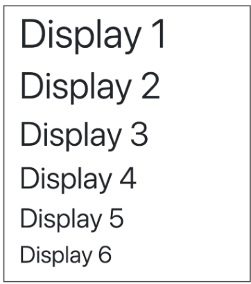
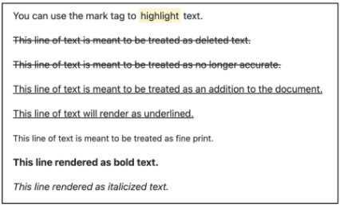
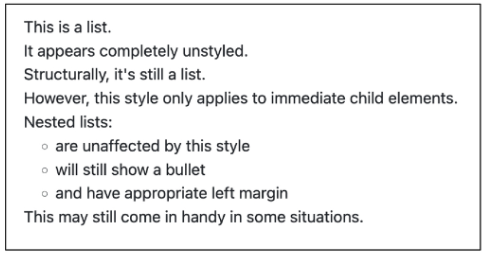
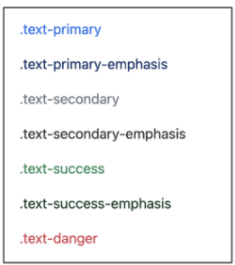
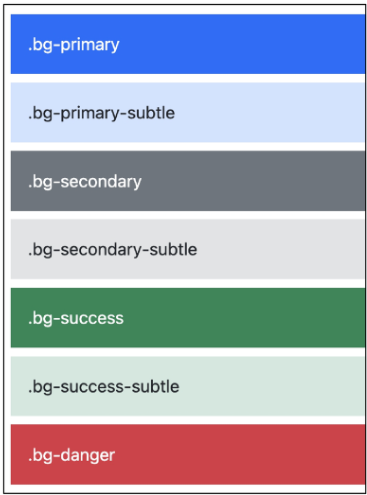
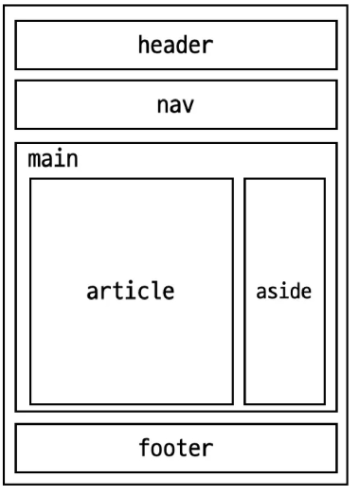

# Web
## Bootstrap

### 목차

### Bootstrap

* Bootstrap 사용 가이드

---

### Reset CSS

---

### Bootstrap 활용

* Typography
* Colors
* Component


### Semantic Web

* Semantic in HTML
* Semantic in CSS

---

### 참고

* Bootstrap을 사용하는 이유
* CDN 없이 사용하기
* 의미론적 마크업


## Bootstrap

* **CSS 프론트엔드 프레임워크 (Toolkit)**
* 미리 만들어진 다양한 디자인 요소들을 제공하여 웹 사이트를 빠르고 쉽게 개발할 수 있도록 함.

### Bootstrap 사용해보기

  * **2. Include Bootstrap's CSS and JS.** 코드 복사.
  * Bootstrap은 CSS와 JavaScript로 만들어져 있음.
  * `link`와 `script` 요소를 HTML에 추가함.

-----


```html
<!DOCTYPE html>
<html lang="en">
<head>
    <meta charset="utf-8">
    <meta name="viewport" content="width=device-width, initial-scale=1">
    <title>Bootstrap demo</title>
    <link href="https://cdn.jsdelivr.net/npm/bootstrap@5.3.3/dist/css/bootstrap.min.css" rel="stylesheet" integrity="sha384-QWTKZyjpPEjISv5WaRU9OFeRpok6YctnYmDr5pNlyT2bRjXh0JMhjwGN+ALEwIH" crossorigin="anonymous">
</head>
<body>
    <h1>Hello, world!</h1>
    <script src="https://cdn.jsdelivr.net/npm/bootstrap@5.3.3/dist/js/bootstrap.bundle.min.js" integrity="sha384-YvpcrYf0tY3lHB60NNkmXc5s9fDVZLESaAA55NDzOxhy9GkcIdslK1E7N7gIeH2z" crossorigin="anonymous"></script>
</body>
</html>
```

### CDN (Content Delivery Network)

* 서버와 사용자 사이의 물리적인 거리를 줄여 콘텐츠 로딩에 소요되는 시간을 최소화함. 웹 페이지 로딩 속도를 높이는 것이 목적.
* 지리적으로 사용자와 가까운 CDN 서버에 콘텐츠를 저장해 사용자에게 전달함.


## Bootstrap 사용 가이드

### Bootstrap 기본 사용법

  * Bootstrap에는 특정한 규칙이 있는 클래스 이름으로 스타일 및 레이아웃이 미리 작성되어 있음.

-----

### Spacing을 표현하는 방법

  * **`property`**: `margin` 또는 `padding`
  * **`sides`**: 방향 (`top`, `left`, `x`, `y` 등)
  * **`size`**: `Spacing`의 상대적 너비

**예시**:

  * `mt-5`

**클래스명 구조**:
`{property}{sides}-{size}`

**코드 예시**:

```html
<p class="mt-5">Hello, world!</p>
```

-----

  * **`margin`**: 해당 요소와 다른 요소와의 외부 간격
  * **`padding`**: 해당 요소의 border와 내부 사이의 여백
    
### Bootstrap에서 클래스 이름으로 Spacing을 표현하는 방법 (1/2)

| Property | 값 |
| :--- | :--- |
| `m` | `margin` |
| `p` | `padding` |

---

| Sides | 값 |
| :--- | :--- |
| `t` | `top` |
| `b` | `bottom` |
| `s` | `left` |
| `e` | `right` |
| `y` | `top`, `bottom` |
| `x` | `left`, `right` |
| `blank` | 4 `sides` |

---

| Size | 값(상대) | 값(절대) |
| :--- | :--- | :--- |
| `0` | `0 rem` | `0px` |
| `1` | `0.25 rem` | `4px` |
| `2` | `0.5 rem` | `8px` |
| `3` | `1 rem` | `16px` |
| `4` | `1.5 rem` | `24px` |
| `5` | `3 rem` | `48px` |
| `auto` | `auto` | `auto` |

---

* **`rem`**: 최상위 요소의 글씨 크기를 기준으로 크기가 결정되는 상대 단위.

## Reset CSS
### Bootstrap 적용 전/후 비교

* Bootstrap을 HTML에 반영하면 일부 스타일이 바뀜.
  * `h1` 요소의 폰트가 변경됨.
  * `body`와의 여백이 사라짐.

### Reset CSS

* 모든 HTML 요소 스타일을 일관된 기준으로 재설정하는 간결하고 압축된 규칙 시트.
* HTML Element, Table, List 등의 요소들에 일관성 있게 스타일을 적용시키는 기본 단계임.

### Reset CSS 사용 배경

* 모든 브라우저는 각자의 `user agent stylesheet`를 가지고 있음.
* 이는 웹사이트를 보다 읽기 편하게 하기 위함임.
* 문제는 이 설정이 브라우저마다 상이하다는 것.
* 모든 브라우저에서 웹사이트를 동일하게 보이게 만들어야 하는 개발자에게는 매우 골치 아픈 일.
* 모두 똑같은 스타일 상태로 만들고 스타일 개발을 시작해야 함.

### User-agent stylesheets

* 모든 문서에 기본 스타일을 제공하는 기본 스타일 시트임.

### Normalize CSS

* Reset CSS 방법 중 대표적인 방법임.
* 웹 표준 기준으로 브라우저 중 하나가 불일치하면 차이가 있는 브라우저를 수정하는 방법임.
  * 경우에 따라 IE 또는 EDGE 브라우저는 표준에 따라 수정할 수 없는 경우도 있는데, 이 경우 IE 또는 EDGE의 스타일을 나머지 브라우저에 적용시킴.

### Bootstrap에서의 Reset CSS

* Bootstrap은 `bootstrap-reboot.css`라는 파일명으로 `normalize.css`를 자체적으로 커스터마이징하여 사용함.

## Bootstrap 활용
### Typography

  * 제목, 본문 텍스트, 목록 등

-----

### 코드 및 결과

  * **HTML 코드**:

<!-- end list -->

```html
<div class="display-1">Display 1</div>

<p>You can use the mark tag to <mark>highlight</mark> text.</p>

<ul class="list-unstyled">
    <li>Unstyled list item 1</li>
    <li>Unstyled list item 2</li>
</ul>
```

  * **결과**:
      * `display-1` 클래스가 적용된 제목
      * `<mark>` 태그로 형광펜 효과가 적용된 텍스트
      * `list-unstyled` 클래스가 적용되어 기본 스타일이 제거된 목록


### Display headings

  * 기존 Heading보다 더 눈에 띄는 제목이 필요한 경우 사용.
  * 더 크고 약간 다른 스타일을 가짐.

<!-- end list -->

```html
<h1 class="display-1">Display 1</h1>
<h1 class="display-2">Display 2</h1>
<h1 class="display-3">Display 3</h1>
<h1 class="display-4">Display 4</h1>
<h1 class="display-5">Display 5</h1>
<h1 class="display-6">Display 6</h1>
```



### Inline text elements

  * HTML 인라인 요소에 대한 스타일

<!-- end list -->

```html
<p>You can use the mark tag to <mark>highlight</mark> text.</p>
<p><del>This line of text is meant to be treated as deleted text.</del></p>
<p><s>This line of text is meant to be treated as no longer accurate.</s></p>
<p><ins>This line of text is meant to be treated as an addition to the document.</ins></p>
<p><u>This line of text will render as underlined.</u></p>
<p><small>This line of text is meant to be treated as fine print.</small></p>
<p><strong>This line rendered as bold text.</strong></p>
<p><em>This line rendered as italicized text.</em></p>
```



### Lists

  * HTML `list` 요소에 대한 스타일

<!-- end list -->

```html
<ul class="list-unstyled">
    <li>This is a list.</li>
    <li>It appears completely unstyled.</li>
    <li>Structurally, it's still a list.</li>
    <li>However, this style only applies to immediate child elements.</li>
    <li>Nested lists:
        <ul>
            <li>are unaffected by this style</li>
            <li>will still show a bullet</li>
            <li>and have appropriate left margin</li>
        </ul>
    </li>
    <li>This may still come in handy in some situations.</li>
</ul>
```



## Colors
### Bootstrap Color System

* Bootstrap이 지정하고 제공하는 색상 시스템.
* 일관성 있는 의미론적 관점의 색상을 적용할 수 있게 해줌.
  * 'blue' 대신 'primary', 'red' 대신 'danger' 등.

### Colors

* `Text`, `Border`, `Background` 및 다양한 요소에 사용하는 Bootstrap의 색상 키워드.

### Text colors

  * 텍스트에 색상을 적용하는 Bootstrap 클래스.

-----

### 코드 예시

```html
<p class="text-primary">.text-primary</p>
<p class="text-primary-emphasis">.text-primary-emphasis</p>
<p class="text-secondary">.text-secondary</p>
<p class="text-secondary-emphasis">.text-secondary-emphasis</p>
<p class="text-success">.text-success</p>
<p class="text-success-emphasis">.text-success-emphasis</p>
<p class="text-danger">.text-danger</p>
```



### Background colors

  * 배경에 색상을 적용하는 Bootstrap 클래스.

-----

### 코드 예시

```html
<div class="p-3 mb-2 bg-primary text-white">.bg-primary</div>
<div class="p-3 mb-2 bg-primary-subtle text-emphasis-primary">.bg-primary-subtle</div>
<div class="p-3 mb-2 bg-secondary text-white">.bg-secondary</div>
<div class="p-3 mb-2 bg-secondary-subtle text-emphasis-secondary">.bg-secondary-subtle</div>
<div class="p-3 mb-2 bg-success text-white">.bg-success</div>
<div class="p-3 mb-2 bg-success-subtle text-emphasis-success">.bg-success-subtle</div>
<div class="p-3 mb-2 bg-danger text-white">.bg-danger</div>
```



## Component
### Bootstrap Component

* Bootstrap에서 제공하는 UI 관련 요소.
* **UI 관련 요소**: 버튼, 내비게이션 바, 카드, 폼, 드롭다운 등.

## Bootstrap Component

Bootstrap에서 제공하는 UI 관련 요소

UI 관련 요소란 버튼, 네비게이션 바, 카드, 폼, 드랍다운 등을 의미함.

### Component 이점
- 일관된 디자인을 제공하여 웹 사이트의 구성 요소를 구축하는데 유용하게 활용됨.

---

### 대표 컴포넌트 사용해보기
- Alerts
- Badges
- Cards
- Navbar

---

### TIP
- Component의 동작은 JavaScript를 사용해서 만들어짐.
- 만약 동작이 잘 되지 않을 경우, 다음을 확인해 볼 것.
- Bootstrap의 `<script>` 요소가 잘 추가되어 있는지 확인하기.
- “data--*”로 시작하는 속성들이 잘 정의되어 있는지 확인하기.

# Semantic Web

웹 데이터를 의미론적으로 구조화된 형태로 표현하는 방식

요소의 시각적 측면이 아닌 요소의 목적과 역할에 집중하는 방식임.

## Sementic in HTML
### HTML 요소가 의미를 가진다는 것
- 외형보다는 요소 자체의 의미에 집중하는 것

**`<p style="font-size: 30px;">Heading</p>`**
단순히 제목처럼 보이게 큰 글자로 만드는 것

**`<h1>Heading</h1>`**
"페이지 내 최상위 제목"이라는 의미를 제공하는 요소 `h1`
- 브라우저에 의해 스타일이 지정됨

### HTML Semantic Element 예시
- **header**
  - 소개 및 탐색에 도움을 주는 콘텐츠

- **nav**
  - 현재 페이지 내, 또는 다른 페이지로의 링크를 보여주는 구획

- **main**
  - 문서의 주요 콘텐츠

- **article**
    - 독립적으로 구분해 배포하거나 재사용될 수 있는 구성의 콘텐츠 구획
- **section**
    - 문서의 독립적인 구획
    - 더 적합한 요소가 없을 때 사용

- **aside**
  - 문서의 주요 내용과 간접적으로만 연관된 부분
- **footer**
  - 가장 가까운 조상 구획(main, article 등)의 작성자, 저작권 정보, 관련 문서

Semantic 요소가 브라우저에 보여질 때는 div 요소와 똑같이 나오게 됨.

```html
<header>
    <h1>Header</h1>
</header>
<nav>
    <ul>
        <li><a href="#">Home</a></li>
    </ul>
</nav>
<main>
    <article>
        <h2>Article Title</h2>
        <p>Article content</p>
    </article>
    <aside>
        <h3>Aside</h3>
        <ol>
            <li><a href="#">Link</a></li>
        </ol>
    </aside>
</main>
<footer>
    <p>&copy; All rights reserved.</p>
</footer>
```



# Sementic in CSS
# CSS 방법론

CSS를 효율적이고 유지 보수가 용이하게 작성하기 위한 일련의 가이드라인

# OOCSS
Object Oriented CSS

객체 지향적 접근법을 적용하여 CSS를 구성하는 방법론

다음과 같은 순서로 진행함.
1. 구조와 스킨을 분리
2. 컨테이너와 컨텐츠를 분리

  - **구조와 스킨 분리**
      - 구조와 스킨을 분리함으로써 재사용 가능성을 높임.

<!-- end list -->

```css
/* bad */
.blue-button {
  border: none;
  font-size: 1em;
  padding: 10px 20px;
  background-color: blue;
  color: white;
}
.red-button {
  border: none;
  font-size: 1em;
  padding: 10px 20px;
  background-color: red;
  color: white;
}
```

하나의 선택자에 구조와 색상(스킨)에 대한 선언이 혼재됨.

  - 다른 색의 버튼을 추가할 때 구조 코드 반복

-----

```css
/* good */
.button {
  border: none;
  font-size: 1em;
  padding: 10px 20px;
}
.button-blue {
  background-color: blue;
  color: white;
}
.button-red {
  background-color: red;
  color: white;
}
```

구조(.button)와 색상(.button-blue)을 나타내는 선택자가 분리됨.

  - 다른 색의 버튼을 추가할 때 다른 선언만 추가

### 2. 컨테이너와 컨텐츠 분리
- 객체에 직접 적용하는 대신 객체를 둘러싸는 컨테이너에 스타일을 적용함.
- 스타일을 정의할 때 위치에 의존적인 스타일을 사용하지 않도록 함.
- 콘텐츠를 다른 컨테이너로 이동시키거나 재배치할 때 스타일이 깨지는 것을 방지함.

---

### TIP
- Bootstrap의 미디어 객체(Utilities > Flex > Media object)는 컨테이너와 콘텐츠 분리 원칙을 잘 보여주는 예시임.

### OOCSS 적용 예시 (1/2)

  - **변경 전**

      - `.header`와 `.footer` 클래스가 폰트 크기와 색 둘 다 영향을 주고 있음.

  - **변경 후**

      - `.container .title`은 폰트 크기 담당 (콘텐츠 스타일)
      - `.header`와 `.footer`는 폰트 색 담당 (컨테이너 스타일)

<!-- end list -->

```css
/* bad */
.header h2 {
  font-size: 24px;
  color: white;
}
.footer h2 {
  font-size: 24px;
  color: black;
}
```

-----

```css
/* good */
.container .title {
  font-size: 24px;
}
.header {
  color: white;
}
.footer {
  color: black;
}
```

### Bootstrap을 사용하는 이유
- 가장 많이 사용되는 CSS 프레임워크
- 사전에 디자인된 다양한 컴포넌트 및 기능
  - 빠른 개발과 유지보수
- 손쉬운 반응형 웹 디자인 구현
- 커스터마이징(customizing)이 용이
- 크로스 브라우징(Cross browsing) 지원
  - 모든 주요 브라우저에서 작동하도록 설계되어 있음


  ### 의미론적인 마크업이 필요한 이유

* **검색엔진 최적화(SEO)**
  * 검색 엔진이 해당 웹 사이트를 분석하기 쉽게 만들어 검색 순위에 영향을 줌.

* **웹 접근성(Web Accessibility)**
  * 웹 사이트, 도구, 기술이 고령자나 장애를 가진 사용자들이 사용할 수 있도록 설계 및 개발하는 것
  * ex) 스크린 리더를 통해 시각장애 사용자에게 웹의 글씨를 읽어줌.

  