# Web
## Responsive Web

## 목차

### Bootstrap Grid system

* Grid system 구조

---

### Grid system for responsive web

* Grid system Breakpoints
* Breakpoints 실습

---

### CSS Layout 종합 정리

### UX & UI

* UX
* UI

---

### 참고

* The Grid System
* Grid cards
* UI Design Guidelines

### Bootstrap Grid system

* 웹 페이지의 레이아웃을 조정하는 데 사용되는 12개의 컬럼으로 구성된 시스템임.
* 반응형 디자인을 지원해 웹 페이지를 모바일, 태블릿, 데스크탑 등 다양한 기기에서 적절하게 표시할 수 있도록 도움.
* Grid system에 대한 자세한 설명은 참고 자료에서 확인할 수 있음.

### 반응형 웹 디자인 (Responsive Web Design)

* 디바이스 종류나 화면 크기에 상관없이 어디서든 일관된 레이아웃 및 사용자 경험을 제공하는 디자인 기술임.
* 32인치 모니터, 태블릿, 스마트폰 등 화면 크기에 따라 요소의 배치를 변경하여 일관된 사용자 경험을 제공할 수 있음.

### Grid system 기본 요소 (1/4)

* **Container**: `Column`들을 담고 있는 공간.

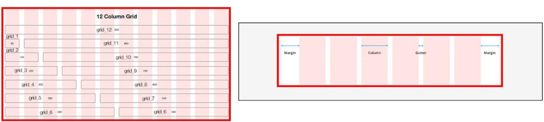

* **Column**: 실제 콘텐츠를 포함하는 부분

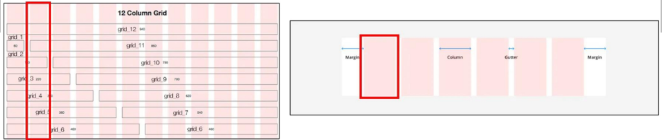

* **Gutter**: 컬럼과 컬럼 사이의 여백 영역(상하좌우).

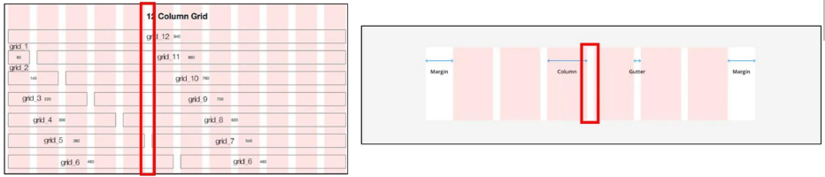

  * 1개의 `row` 안에 12개의 `column` 영역이 구성됨.
  * 각 요소는 12개 중 몇 개를 차지할 것인지 지정됨.

-----

### 코드 예시

```html
<div class="container">
    <div class="row">
        <div class="col-4"></div>
        <div class="col-4"></div>
        <div class="col-4"></div>
    </div>
</div>
```

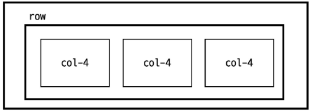

## Grid System 실습

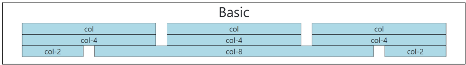

- 첫 번째 줄

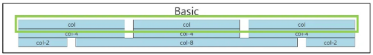

### Bootstrap Grid System 예시

  * **HTML 코드**:

<!-- end list -->

```html
<div class="container">
    <div class="row">
        <div class="col">
            <div class="box">col</div>
        </div>
        <div class="col">
            <div class="box">col</div>
        </div>
        <div class="col">
            <div class="box">col</div>
        </div>
    </div>
</div>
```

  * **CSS 코드**:

<!-- end list -->

```css
.box {
    border: 1px solid black;
    background-color: lightblue;
    text-align: center;
}
```

- 두번째 줄
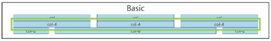

### Bootstrap Grid System 예시

  * **HTML 코드**:

<!-- end list -->

```html
<div class="container">
    <div class="row">
        <div class="col-4">
            <div class="box">col-4</div>
        </div>
        <div class="col-4">
            <div class="box">col-4</div>
        </div>
        <div class="col-4">
            <div class="box">col-4</div>
        </div>
    </div>
</div>
```

  * **CSS 코드**:

<!-- end list -->

```css
.box {
    border: 1px solid black;
    background-color: lightblue;
    text-align: center;
}
```

- 세번째 줄

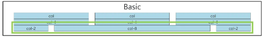

### Bootstrap Grid System 예시

  * **HTML 코드**:

<!-- end list -->

```html
<div class="container">
    <div class="row">
        <div class="col-2">
            <div class="box">col-2</div>
        </div>
        <div class="col-8">
            <div class="box">col-8</div>
        </div>
        <div class="col-2">
            <div class="box">col-2</div>
        </div>
    </div>
</div>
```
### 하나의 Column에 또다른 Row 넣기

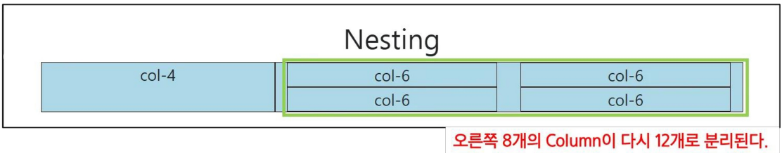

### Bootstrap Grid System 예시

  * **HTML 코드**:

<!-- end list -->

```html
<div class="container">
    <div class="row">
        <div class="col-4 box">
            <div>col-4</div>
        </div>
        <div class="col-8 box">
            <div class="row">
                <div class="col-6">
                    <div class="box">col-6</div>
                </div>
                <div class="col-6">
                    <div class="box">col-6</div>
                </div>
                <div class="col-6">
                    <div class="box">col-6</div>
                </div>
                <div class="col-6">
                    <div class="box">col-6</div>
                </div>
            </div>
        </div>
    </div>
</div>
```

### Offset으로 Column 생략하기

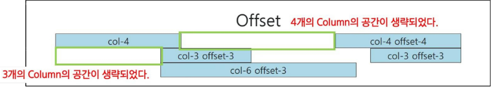

### Bootstrap Grid System `offset` 예시

  * **HTML 코드**:

<!-- end list -->

```html
<div class="container">
    <div class="row">
        <div class="col-4 offset-4">
            <div class="box">col-4 offset-4</div>
        </div>
    </div>
    <div class="row">
        <div class="col-3 offset-3">
            <div class="box">col-3 offset-3</div>
        </div>
        <div class="col-3 offset-3">
            <div class="box">col-3 offset-3</div>
        </div>
    </div>
    <div class="row">
        <div class="col-6 offset-3">
            <div class="box">col-6 offset-3</div>
        </div>
    </div>
</div>
```

### Gutters

* Grid system에서 `column` 사이의 여백 영역.
* x축은 `padding`, y축은 `margin`으로 여백을 생성함.
* 실제 컬럼 간의 좌우 간격(x축)은 변하지 않으며, `padding`으로 인해 컬럼 안의 콘텐츠(`contents`) 너비가 변함.

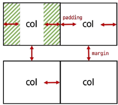

### Grid System 실습 - gutters (1/3)

  * `Gutter`를 이용해 간격을 조정함.
      * `gx-0`: 좌우 여백 제거
      * `col` 사이 여백 제거

-----

### 코드 및 결과

  * **HTML 코드**:

<!-- end list -->

```html
<div class="container">
    <div class="row gx-0">
        <div class="col-6">
            <div class="box">col</div>
        </div>
        <div class="col-6">
            <div class="box">col</div>
        </div>
    </div>
</div>
```

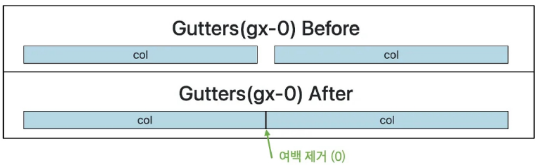

  * **결과**: `gx-0` 클래스 적용으로 `col` 사이의 가로 여백이 제거됨.


  ### Grid System 실습 - gutters (2/3)

  * `Gutter`를 이용해 간격을 조정함.
      * `gy-5`: `row` 사이의 여백 증가

-----

### 코드 및 결과

  * **HTML 코드**:

<!-- end list -->

```html
<div class="container">
    <div class="row gy-5">
        <div class="col-6">
            <div class="box">col</div>
        </div>
        <div class="col-6">
            <div class="box">col</div>
        </div>
        <div class="col-6">
            <div class="box">col</div>
        </div>
        <div class="col-6">
            <div class="box">col</div>
        </div>
    </div>
</div>
```

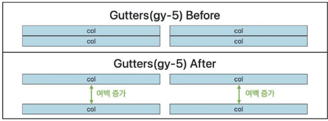

  * **결과**: `gy-5` 클래스 적용으로 두 번째 줄의 `row`에 세로 여백이 증가함.


### Grid System 실습 - gutters (3/3)

  * `Gutter`를 이용해 간격을 조정함.
      * `g-5`: 가로/세로 여백 모두 증가

-----

### 코드 및 결과

  * **HTML 코드**:

<!-- end list -->

```html
<div class="container">
    <div class="row g-5">
        <div class="col-6">
            <div class="box">col</div>
        </div>
        <div class="col-6">
            <div class="box">col</div>
        </div>
        <div class="col-6">
            <div class="box">col</div>
        </div>
        <div class="col-6">
            <div class="box">col</div>
        </div>
    </div>
</div>
```

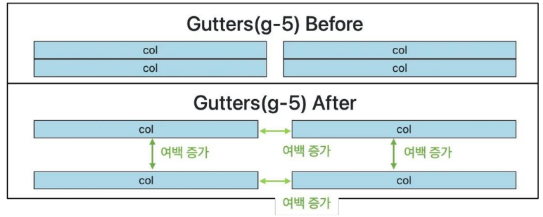

  * **결과**: `g-5` 클래스 적용으로 `row` 안의 `col` 사이의 가로 및 세로 여백이 모두 증가함.


## Responsive Web Design

* 디바이스 종류나 화면 크기에 상관없이 어디서든 일관된 레이아웃 및 사용자 경험을 제공하는 디자인 기술.
* Bootstrap grid system에서는 12개의 `column`과 6개의 `breakpoints`를 사용하여 반응형 웹 디자인을 구현함.  

### Grid system breakpoints

* 웹 페이지를 다양한 화면 크기에서 적절하게 배치하기 위한 분기점임.
* 화면 너비에 따라 6개의 분기점을 제공함(`xs, sm, md, lg, xl, xxl`).

---

### Breakpoints 정보

| | **xs** | **sm** | **md** | **lg** | **xl** | **xxl** |
| :--- | :---: | :---: | :---: | :---: | :---: | :---: |
| | <576px | ≥576px | ≥768px | ≥992px | ≥1200px | ≥1400px |
| **Container** `max-width` | None(auto) | 540px | 720px | 960px | 1140px | 1320px |
| **Class prefix** | `.col-` | `.col-sm-` | `.col-md-` | `.col-lg-` | `.col-xl-` | `.col-xxl-` |

---

* 각 `breakpoints`마다 설정된 최대 너비 값 "이상"으로 화면이 커지면 `grid system` 동작이 변경됨.


# UX
User Experience

제품이나 서비스를 사용하는 사람들이 느끼는 전체적인 경험과 만족도를 개선하고 최적화하기 위한 디자인과 개발 분야

### UX 예시
- 백화점 1층에서 느껴지는 좋은 향수 향기
- 러쉬 매장 근처만 가도 맡을 수 있는 러쉬 향기
- 원하는 음악을 검색할 때, 검색 기능이 적절하게 작동하고 검색 결과가 정확하게 나오는 것

### UX 설계
* 사람들의 마음과 생각을 이해하고 정리해서 제품에 녹여내는 과정
* 유저 리서치, 데이터 설계 및 정제, 유저 시나리오, 프로토타입 설계
* 프로토타입(Prototype)은 제품 개발 전 실제 작동 방식을 미리 보고 검증하기 위한 초기 모델임.

# UI
User Interface

서비스와 사용자 간의 상호작용을 가능하게 하는 디자인 요소들을 개발하고 구현하는 분야

### UI 예시
* 리모콘
  * 사용자가 버튼을 누르면 TV가 켜지고, 채널을 변경하거나 볼륨을 조절할 수 있음.

* ATM
  * 사용자가 터치스크린을 통해 사용자 정보를 입력하고, 원하는 금액을 선택할 수 있음.

* 웹 사이트
  * 사용자가 로그인 버튼을 누르면, 이동하는 화면의 디자인 및 레이아웃

  ### UI 설계
* 예쁜 디자인보다는 사용자가 더 쉽고 편리하게 사용할 수 있도록 고려함.
* 이를 위해서는 디자인 시스템, 중간 산출물, 프로토타입 등이 필요함.
* 프로토타입(Prototype)은 제품 개발 전 실제 작동 방식을 미리 보고 검증하기 위한 초기 모델임.

### The Grid system
* CSS가 아닌 편집 디자인에서 나온 개념으로 구성 요소를 잘 배치해서 시각적으로 좋은 결과물을 만들기 위함
* 기본적으로 안쪽에 있는 요소들의 행과 열을 맞추는 것에서 기인
* 정보 구조와 배열을 체계적으로 작성하여 정보의 질서를 부여하는 시스템

### Grid cards 
* `row-cols` 클래스를 사용하여 해당 표시할 열(카드) 수를 손쉽게 제어할 수 있음.


1. Bootstrap의 Grid system에서 열(column)을 구성하기 위한 클래스 접두사는?
- a) .container
- b) .col-
- c) .row-
- d) .grid-

2. Bootstrap Grid에서 하나의 row는 몇 개의 column으로 구성되는가?
- a) 10
- b) 12
- c) 16
- d) 6

3. 다음 중 3등분된 열을 만들기 위한 클래스 조합은?
- a) .col-md-3
- b) .col-md-4
- c) .col-md-6
- d) .col-md-9

4. 다음 중 부트스트랩의 기본 grid 구성 단위가 아닌 것은?
- a) .container
- b) .row
- c) .column
- d) .col

5. col-6은 전체 grid의 몇 퍼센트를 차지하는가?
a) 25%
b) 33.3%
c) 50%
d) 100%

6. 사용자 경험(UX)에서 가장 중요한 요소는 무엇인가?
a) 멋진 애니메이션
b) 복잡한 기능
c) 사용의 용이성
d) 광고 배너의 수

7. Bootstrap에서 가장 작은 화면을 위한 breakpoint 접두사는?
a) sm
b) xl
c) md
d) lg

8. 다음 중 992px 이상의 중간 화면에 적용되는 Bootstrap 클래스는?
a) col-sm-6
b) col-md-6
c) col-lg-6
d) col-xl-6

9. Bootstrap의 breakpoint 중 'xl'은 어떤 해상도 이상을 의미하는가?
a) 768px
b) 992px
c) 1200px
d) 1400px

10. col-12 col-md-6으로 지정했을 때 나타나는 효과는?
a) 모든 화면에서 12칸 차지
b) 작은 화면에선 6칸, 큰 화면에선 12칸
c) 작은 화면에선 12칸, 중간 화면부터 6칸
d) 항상 6칸 차지


### 정답 및 해설

1. Bootstrap에서는 열을 지정할 때 `.col-` 접두사를 사용해 컬럼의 크기나 반응형 동작을 설정함.
2. Bootstrap Grid system은 한 줄(row)에 최대 12개의 column을 포함할 수 있도록 설계되어 있음.
3. Bootstrap은 12단 그리드 시스템으로 동작하므로, `.col-md-4`는 12를 3으로 나눈 4단위의 열을 생성함.
4. Bootstrap에서는 `.container`, `.row`, `.col`이 grid 시스템의 핵심 단위임. `.column`이라는 클래스는 존재하지 않음.
5. `col-6`은 전체 12칸 중 6칸을 차지하므로 50%를 의미함.
6. UX의 핵심은 사용자가 서비스를 쉽게 이해하고 활용할 수 있도록 하는 '사용성'임.
7. Bootstrap 5부터 `xs`는 생략되고, `sm`부터 사용됨. `sm`은 576px 이상의 화면에 적용됨.
8. `col-lg-6`은 992px 이상의 큰 화면에서 컬럼 6칸을 차지하게 함.
9. `xl`은 약 1200px 이상에서 적용되는 Bootstrap breakpoint임.
10. `col-12`는 기본적으로 전체 12칸을 차지하며, `col-md-6`은 중간 크기부터는 6칸만 차지하라는 의미임.

