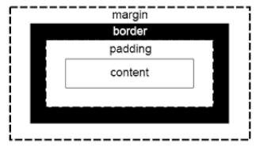
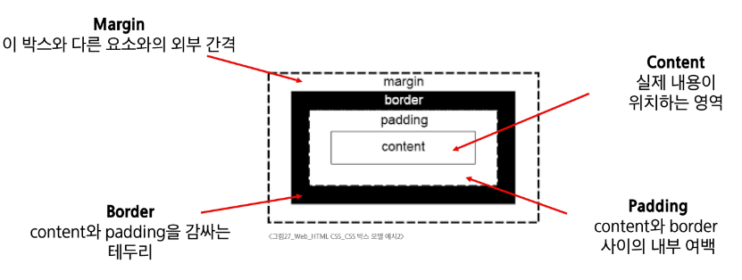
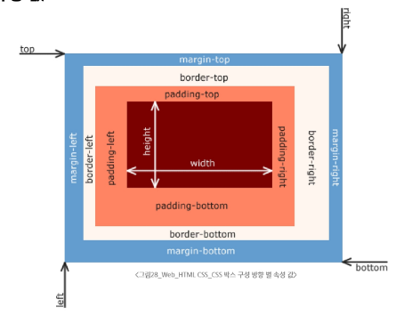

# Web
## HTML & CSS

## 목차

### 웹

### 웹 구조화
- HTML
- Structure of HTML
- Text Structure

### 웹 스타일링
- CSS
- CSS 구문
- CSS 선택자
- CSS 선언
- 명시도

### CSS Box Model
- 박스 구성 요소
- shorthand 속성(단축 속성)
- box-sizing 속성(박스의 크기 계산법)

### 참고
- 명시도 관련
- HTML 스타일 가이드
- CSS 스타일 가이드
- MDN

---

## 웹

### World Wide Web (WWW)
인터넷으로 연결된 컴퓨터들이 정보를 공유하는 거대한 정보 공간

### Web
Web site, Web application 등을 통해 사용자들이 정보를 검색하고 상호 작용하는 기술

### Web page
HTML, CSS 등의 웹 기술을 이용하여 만들어진, "Web site"를 구성하는 하나의 요소

#### Web page 구성 요소
- **HTML** - "Structure" (구조)
- **CSS** - "Styling" (스타일링)  
- **JavaScript** - "Behavior" (동작)

---

## 웹 구조화

### HTML (HyperText Markup Language)
웹 페이지의 의미와 구조를 정의하는 언어

#### HyperText
웹 페이지를 다른 페이지로 연결하는 링크

- 참조를 통해 사용자가 한 문서에서 다른 문서로 즉시 접근할 수 있는 텍스트
- 비선형성 / 상호연결성 / 사용자 주도적 탐색

#### Markup Language
태그 등을 이용하여 문서나 데이터의 구조를 명시하는 언어

- 인간이 읽고 쓰기 쉬운 형태이며, 데이터의 구조와 의미를 정의하는 데 집중
- ex) HTML, Markdown

### Structure of HTML

#### HTML 구조 (1/2)

**`<!DOCTYPE html>`**
- 해당 문서가 html로 문서라는 것을 나타냄

**`<html></html>`**
- 전체 페이지의 콘텐츠를 포함

**`<title></title>`**
- 브라우저 탭 및 즐겨찾기 시 표시되는 제목으로 사용

```html
<!DOCTYPE html>
<html lang="en">
<head>
    <meta charset="UTF-8">
    <title>My page</title>
</head>
<body>
    <p>This is my page</p>
</body>
</html>
```

#### HTML 구조 (2/2)

**`<head></head>`**
- HTML 문서에 관련된 설명, 설정 등 컴퓨터가 식별하는 메타데이터를 작성
- 사용자에게 보이지 않음

**`<body></body>`**
- HTML 문서의 내용을 나타냄
- 페이지에 표시되는 모든 콘텐츠를 작성
- 한 문서에 하나의 body 요소만 존재

### HTML element(요소)

- 하나의 요소는 여는 태그와 닫는 태그 그리고 그 안의 내용으로 구성됨
- 닫는 태그는 태그 이름 앞에 슬래시가 포함됨
  - 닫는 태그가 없는 태그도 존재

```
Opening tag          Closing tag
<p>My cat is very grumpy</p>
    └─── Content ──────┘
└─────── Element ─────────┘
```

### HTML Attributes (속성)

사용자가 원하는 기준에 맞도록 요소를 설정하거나 다양한 방식으로 요소의 동작을 조절하기 위한 값

**목적**
- 나타내고 싶지 않지만 추가적인 기능, 내용을 담고 싶을 때 사용
- CSS에서 스타일 적용을 위해 해당 요소를 선택하기 위한 값으로 활용됨

**작성 규칙**
1. 속성은 요소 이름과 속성 사이에 공백이 있어야 함
2. 하나 이상의 속성들이 있는 경우엔 속성 사이에 공백으로 구분함
3. 속성 값은 열고 닫는 따옴표로 감싸야 함

```html
<p class="editor-note">My cat is very grumpy</p>
   └─── Attribute ────┘
```

### HTML 구조 예시 (1/2)

```html
<!DOCTYPE html>
<html lang="en">
<head>
    <meta charset="UTF-8">
    <title>My page</title>
</head>
<body>
    <p>My page</p>
    <a href="https://www.google.co.kr/">Google</a>
    
    
</body>
</html>
```

**주요 태그 설명:**
- `<p></p>` : Paragraph(문단)의 약자로, 텍스트 문단을 만드는 태그
- `<a></a>` : Anchor(닻)의 약자로, 다른 페이지로 이동시키는 하이퍼링크 태그  
- `</img>` : Image(이미지)의 약자로, src 에 지정된 그림을 보여주는 태그

### Text Structure

HTML의 주요 목적 중 하나는 텍스트 구조와 의미를 제공하는 것

예를 들어 h1 요소는 단순히 텍스트를 크게만 만드는 것이 아닌 현재 문서의 최상위 제목이라는 의미를 부여하는 것

```html
<h1>Heading</h1>
```

**TIP**
의미에 맞는 태그 사용은 스크린 리더, 검색 엔진 최적화(SEO)의 기본이 됨
- 스크린 리더: 화면 내용을 소리로 읽어주는 프로그램
- 검색 엔진 최적화(SEO): 검색 결과 상단에 내 사이트를 노출시켜 방문자를 늘리는 작업

#### 대표적인 HTML Text structure

**Heading & Paragraphs**
- h1~6, p

**Lists**
- ol, ul, li

**Emphasis & Importance**
- em, strong

```html
<body>
    <h1>Main Heading</h1>
    <h2>Sub Heading</h2>
    <p>This is my page</p>
    <p>This is <em>emphasis</em></p>
    <p>Hi <strong>my name</strong> is Air</p>
    <ol>
        <li>파이썬</li>
        <li>알고리즘</li>
        <li>웹</li>
    </ol>
</body>
```

#### CSS Selectors: 기본 선택자 (2/3)

**클래스 선택자 ('.' (dot))**
- 주어진 클래스 속성을 가진 모든 요소를 선택

**아이디 선택자 ('#')**
- 주어진 아이디 속성을 가진 요소 선택
- 문서에는 주어진 아이디를 가진 요소가 하나만 있어야 함

**속성 선택자('[' (대괄호))**
- 주어진 속성이나 속성값을 가진 모든 요소 선택
- 속성의 존재 여부, 값의 일치/포함 등 다양한 조건으로 요소를 정교하게 선택 가능

```css
/* 클래스 선택자 */
.green {
    color: green;
}

/* 아이디 선택자 */
#purple {
    color: purple;
}

/* 속성 선택자 */
[class] {
    background-color: yellow;
}
```

#### 상대 단위의 해결사: "rem" (2/2)

**일관성 및 예측 가능성**
- 요소가 아무리 깊게 중첩되어도 기준은 항상 html이므로, em처럼 계산이 복잡해지지 않음

**유지보수 용이성**
- html의 font-size만 변경하면 사이트 전체의 레이아웃과 폰트 크기를 일관되게 조절할 수 있음

**접근성 향상**
- 사용자가 브라우저에서 설정한 기본 폰트 크기를 html이 상속받으므로, 사용자의 설정에 맞춰 사이트 전체가 유연하게 확대/축소 됨

#### 단위 비교 정리

| 단위 | 기준 | 장점 | 단점/주의사항 | 추천 사용처 |
|------|------|------|--------------|------------|
| px | 화면의 픽셀 | 직관적, 고정된 크기 | 접근성/반응형에 불리 | border-width 등 절대적 크기가 필요할 때 |
| em | 부모 요소의 font-size | 부모에 따라 유연하게 변경 | 중첩 시 계산 복잡 | 특정 컴포넌트 내부에서만 상대적인 크기 조절이 필요할 때 |
| rem | `<html>`의 font-size | 일관성, 유지보수성, 접근성 | 루트 폰트 크기에 의존적 | 웹사이트 전반의 font-size, margin, padding 등 |
| % | 부모 요소의 크기 | 컨테이너에 맞춰 유동적으로 | font-size에 사용 시 em과 유사하게 동작 | width, height 등 레이아웃 구성 시 |

### 명시도 (Specificity)

겹치는 요소에 적용할 CSS 선언을 결정하기 위한 알고리즘

- CSS Selector에 가중치를 계산하여 어떤 스타일을 적용할지 결정
- 동일한 요소를 가리키는 2개 이상의 CSS 규칙이 있는 경우, 가장 높은 명시도를 가진 Selector가 승리하여 스타일이 적용됨

#### CSS
**Cascading Style Sheet**
- 웹 페이지의 디자인과 레이아웃을 구성하는 언어

#### Cascade
**계단식**
- 한 요소에 동일한 가중치를 가진 선택자가 적용될 때
- CSS에서 마지막에 나오는 선언이 사용됨

#### Cascade 퀴즈
h1 태그 내용에 적용되는 색은?

```css
h1 {
    color: red;
}
h1 {
    color: purple;
}
```

**답: purple** (마지막에 선언된 스타일이 적용)

#### 명시도 적용 퀴즈
동일한 h1 태그에 다음과 같이 스타일이 작성되면, h1 태그 내용에 적용되는 색은?

```css
.make-red {
    color: red;
}
h1 {
    color: purple;
}
```

**답: red** (클래스 선택자가 요소 선택자보다 명시도가 높음)

#### 명시도가 높은 순

1. **Importance**
   - !important

2. **Inline 스타일**

3. **선택자**
   - id 선택자 > class 선택자 > 요소 선택자

4. **소스 코드 선언 순서**

**선택자 명시도 순서:**
- **id 선택자(#id)**: 페이지에서 딱 하나의 특별한 요소를 선택할 때 사용
- **class 선택자(.class)**: 여러 요소에 동일한 스타일을 적용할 때 사용  
- **요소 선택자(ex: p, div, ...)**: 페이지의 모든 특정 태그(p, div 등)를 선택

#### 명시도 예시

```css
h2 {
    color: darkviolet !important;
}

p {
    color: blue;
}

.orange {
    color: orange;
}

.green {
    color: green;
}

#red {
    color: red;
}
```

```html
<p>1</p>
<p class="orange">2</p>
<p class="green orange">3</p>
<p class="orange green">4</p>
<p id="red" class="orange">5</p>
<h2 id="red" class="orange">6</h2>
<p id="red" class="orange" style="color: brown;">7</p>
<h2 id="red" class="orange" style="color: brown;">8</h2>
```

**결과 분석:**
1. `<p>1</p>` → blue (요소 선택자)
2. `<p class="orange">2</p>` → orange (클래스 선택자)
3. `<p class="green orange">3</p>` → orange (마지막 클래스)
4. `<p class="orange green">4</p>` → green (마지막 클래스)
5. `<p id="red" class="orange">5</p>` → red (id 선택자가 우선)
6. `<h2 id="red" class="orange">6</h2>` → darkviolet (!important가 최우선)
7. `<p id="red" class="orange" style="color: brown;">7</p>` → brown (인라인 스타일)
8. `<h2 id="red" class="orange" style="color: brown;">8</h2>` → darkviolet (!important가 인라인보다도 우선)

### !important

다른 우선순위 규칙보다 우선하여 적용하는 키워드

**주의사항:**
Cascade의 구조를 무시하고 강제로 스타일을 적용하는 방식이므로 사용을 권장하지 않음

```css
/* !important 사용 예시 */
h1 {
    color: red !important;
}

/* 인라인 스타일이 있어도 !important가 우선됨 */
```

#### 값의 단위(Units)

color: red; 처럼 키워드로 끝나는 값도 있지만, 크기나 간격을 나타낼 때는 단위가 필수적

단위는 크게 절대 단위와 상대 단위로 나뉨

| 구분 | 단위 종류 | 특징 |
|------|-----------|------|
| 절대 단위 | px, pt, cm 등 | 다른 요소의 영향을 받지 않는 고정된 크기 |
| 상대 단위 | %, em, rem, vw, vh 등 | 다른 요소(부모, 화면 또는 영역 등)의 크기에 따라 상대적으로 결정 |

**TIP**
웹 디자인에서는 반응형 웹과 접근성 때문에 "상대 단위의 중요성"이 매우 높음.
값이 얼마 따라는 단위를 살펴하는 것이 권장됨.

#### 절대 단위의 대표: "px"

화면을 구성하는 가장 작은 단위인 '픽셀'을 기준으로 하는 절대 단위

모니터 해상도에 따라 크기가 결정되며, 직관적이고 예측이 쉬움

**장점**
- 디자인 시안과 거의 동일한 결과물을 만들 수 있음
- 요소의 크기를 명확하게 고정하고 싶을 때 유용

**단점**
- 사용자가 브라우저의 기본 폰트 크기를 변경해도 요소의 크기가 함께 조절되지 않아 접근성에 불리
- 다양한 디바이스 크기에 유연하게 대응하는 반응형 디자인에 한계가 있음

#### 상대 단위: "em"

부모(parent) 요소의 font-size를 기준으로 크기가 결정되는 상대 단위

만약 부모 요소에 font-size가 없다면, 그 상위 부모의 font-size를 상속 받음

**장점**
- 부모 요소의 크기에 따라 자식 요소의 크기를 유연하게 조절할 수 있음

**단점:**
- 중첩 문제
- em 단위를 사용하는 요소가 중첩되면 기존 크기가 계속 변경되어 계산이 복잡해지고 예측이 어려워짐

**rem으로 해결**
**이후 바로 학습 예정**

#### 상대 단위의 해결사: "rem" (1/2)

**"Root em"**

em의 단점을 극복하기 위해 등장

부모 요소가 아닌, 최상위 요소(root element)인 `<html>`의 font-size를 기준으로 크기가 결정

html의 기본 font-size는 대부분의 브라우저에서 16px

```css
.title {
    font-size: 2rem; /* 16px * 2 = 32px */
}
.content {
    font-size: 1rem; /* 16px * 1 = 16px */
    padding: 1.5rem; /* 16px * 1.5 = 24px */
}
```

#### CSS 결합자(Combinators) (1/2)

**자손 결합자 (" " (space))**
- 첫 번째 요소의 자손 요소를 선택
- 예) p span은 `<p>` 안에 있는 모든 `<span>`을 선택 (하위 레벨 상관 없이)

**자식 결합자 (">")**
- 첫 번째 요소의 직계 자식만 선택
- 예) ul > li는 `<ul>` 안에 있는 모든 `<li>`를 선택 (한단계 아래 자식들만)

```css
<style>
....

/* 자손 결합자 */
.green > span {
    font-size: 30px;
}

/* 자식 결합자 */
.green li {
    color: brown;
}
</style>
```

### CSS Declaration

선택된 요소에 적용할 스타일을 구체적으로 명시하는 부분

```css
h1 {
    color: red;        /* 선언(Declaration) */
    font-size: 30px;
}
```

#### CSS 선언의 목적

- 선택자는 '어떤 요소에' 스타일을 적용할지 결정하는 규칙이고,
- 선언은 요소를 선택했으니, 이제 중괄호 {} 안에 '무엇을' 할지 정의
- 이 '무엇'에 해당하는 부분이 바로 선언(Declaration)

#### 속성(Property)
- 스타일링하고 싶은 기능이나 특성을 의미
- CSS가 미리 정의해 둔 키워드를 사용해야 함
- font-size, background-color, width, margin, padding 등

#### 값(Value)
- 속성에 적용할 구체적인 설정
- 속성이 받을 수 있는 값의 종류는 정해져 있음
- 16px, lightgray, 100%, 10rem 등

```css
h1 {
    color: red;        /* 속성(Property): 값(Value) */
    font-size: 30px;
}
```

---

## 웹 스타일링

### CSS (Cascading Style Sheet)
웹 페이지의 디자인과 레이아웃을 구성하는 언어

#### CSS 적용 방법

1. 인라인(Inline) 스타일
2. 내부(Internal) 스타일 시트  
3. 외부(External) 스타일 시트

##### 1. 인라인(Inline) 스타일
HTML 요소 안에 style 속성 값으로 작성

```html
<!DOCTYPE html>
<html lang="en">
<head>
...
</head>
<body>
    <h1 style="color: blue; background-color: yellow;">Hello World!</h1>
</body>
</html>
```

**특징:**
- 특정 요소 하나에만 CSS 스타일을 지정 적용하는 속성

##### 2. 내부(Internal) 스타일 시트
head 태그 안에 style 태그에 작성

```html
<!DOCTYPE html>
<html lang="en">
<head>
    ...
    <title>Document</title>
    <style>
        h1 {
            color: blue;
            background-color: yellow;
        }
    </style>
</head>
```

**특징:**
- `<head>` 태그 제목, CSS 등 보이지 않는 설정 정보를 담는 태그
- `<style>` 태그 CSS 코드를 작성하여 페이지 전체에 적용하는 태그

##### 3. 외부(External) 스타일 시트
별도 CSS 파일 생성 후 HTML link 태그를 사용해 불러오기

```html
<!-- structure.html -->
<!DOCTYPE html>
<html lang="en">
<head>
    <link rel="stylesheet" href="style.css">
    <title>Document</title>
</head>
<body>
    <h1>Hello World!</h1>
</body>
</html>
```

```css
/* style.css */
h1 {
    color: blue;
    background-color: yellow;
}
```

**특징:**
- `<link>` 태그: 외부 스타일 시트(CSS)를 HTML 문서에 연결하는 태그

**TIP**
스타일 적용 우선순위는 인라인 > 내부 > 외부 순으로 적용됨.
CSS는 우선순위를 이용해 우지보수를 편하게 하고, 필요 시 특수한 경우에만 사용하는 것을 추천함.
(일반한 수업을 위해서 여기 코드는 내부 스타일로 진행하기).

### CSS 기본 구조와 문법

#### 선택자(Selector)
'누구를' 꾸밀지 지정하는 부분

#### 선언(Declaration)
'어떻게' 꾸밀지에 대한 구체적인 한 줄의 명령
속성과 값이 한 쌍으로 이루어지며, 세미콜론(;)으로 끝남

#### 속성(Property)
바꾸고 싶은 스타일의 종류를 나타냄

#### 값(Value)
속성에 적용할 구체적인 설정을 나타냄

```css
h1 {
    color: red;         /* 선언 */
    font-size: 30px;    /* Declaration */
}
/*   속성    값    */
/* Property Value */
```

### CSS Selectors

HTML 요소를 선택하여 스타일을 적용할 수 있도록 하는 선택자

```css
h1 {
    color: red;
    font-size: 30px;
}
```

#### CSS Selectors 종류

**기본 선택자**
- 전체(*) 선택자
- 요소(tag) 선택자
- 클래스(class) 선택자
- 아이디(id) 선택자
- 속성(attr) 선택자 등

**결합자 (Combinators)**
- 자손 결합자 (" " (space))
- 자식 결합자 (">")

#### CSS Selectors: 기본 선택자 (1/3)

**전체 선택자 (*)**
- HTML 모든 요소를 선택

**요소 선택자**
- 지정한 모든 태그를 선택

```css
/* 전체 선택자 */
* {
    color: red;
}

/* 요소 선택자 */
h2 {
    color: orange;
}
h3,
h4 {
    color: blue;
}
```

```html
<body>
    <h1 class="green">Heading</h1>
    <h2>선택자 연습</h2>
    <h3>Hello</h3>
    <h4>Nice to meet you</h4>
    <p id="purple">그럼 목록</p>
    <ul class="green">
        <li>파이썬</li>
        <li>알고리즘</li>
        <li>웹</li>
        <ol>
            <li>HTML</li>
            <li>CSS</li>
            <li>PYTHON</li>
        </ol>
    </ul>
    <p class="green">
        Lorem, <span>ipsum</span> dolor.
    </p>
    <p class="yellow">TEST</p>
</body>
```

## 상속
네, 요청하신 교안 캡처본 내용을 정리해 드립니다.

### CSS 상속

* 기본적으로 CSS는 상속을 통해 부모 요소의 속성을 자식에게 상속하여 재사용성을 높임.

---

### 상속 되는 속성

* 텍스트 관련 요소(font, color, text-align), opacity, visibility 등

---

### 상속 되지 않는 속성

* Box model 관련 요소(width, height, border, box-sizing 등)
* position 관련 요소(position, top/right/bottom/left, z-index 등)

### CSS 상속 예시

  * 상속 예시 HTML:

<!-- end list -->

```html
<ul class="parent">
    <li class="child">Hello</li>
    <li class="child">Bye</li>
</ul>
```

  * 상속 예시 CSS:

<!-- end list -->

```css
/* 상속 예시 CSS */

.parent {
    /* 상속 O */
    color: red;
    /* 상속 X */
    border: 1px solid black;
}
```

  * 결과: 
      * Hello  
      * Bye  
      빨간 글씨

### CSS 상속 여부 확인

* MDN의 각 속성별 문서 하단에서 상속 여부를 확인할 수 있음.  

## CSS Box Model 

### CSS Box Model

* 웹 페이지의 모든 HTML 요소를 감싸는 사각형 상자 모델
* 요소의 크기, 배치, 간격을 결정하는 규칙

### CSS Box Model 구성 요소

* **내용(content)**, **안쪽 여백(padding)**, **테두리(border)**, **외부 간격(margin)**으로 구성되어 요소의 크기와 배치를 결정함.







### Box 구성 요소 예시

  * **HTML 코드**:

<!-- end list -->

```html
<body>
    <div class="box1">box1</div>
    <div class="box2">box2</div>
</body>
```

  * **CSS 코드**:

<!-- end list -->

```css
/* Box 구성 요소 예시 css*/
.box1 {
    width: 200px;
    padding-left: 25px;
    padding-bottom: 25px;
    margin-left: 25px;
    margin-top: 50px;
    border-width: 3px;
    border-style: solid;
    border-color: black;
}
.box2 {
    width: 200px;
    padding: 25px 50px;
    margin: 25px auto;
    border: 1px dashed black;
}
```

  * **결과**: `box1`과 `box2`의 크기, 여백, 테두리가 위 CSS 설정에 따라 화면에 나타남. `box2`의 `margin: 25px auto`는 가로 중앙 정렬을 가능하게 함.

  ## shorthand 속성 (단축 속성)

  ### shorthand 속성: 'border'

  * `border-width`, `border-style`, `border-color`를 한 번에 설정하기 위한 속성임.
  * 작성 순서는 영향을 주지 않음.

<!-- end list -->

```css
border: 2px solid black;
```

-----

### shorthand 속성: 'margin' & 'padding'

  * 4방향의 속성을 각각 지정하지 않고 한 번에 지정할 수 있는 속성임.
  * **4개 값**: 상/우/하/좌 순서 (시계방향)

<!-- end list -->

```css
/* 상/우/하/좌 */
margin: 10px 20px 30px 40px;
padding: 10px 20px 30px 40px;
```

  * **3개 값**: 상 / 좌우 / 하 순서

<!-- end list -->

```css
/* 상 / 좌우 / 하 */
margin: 10px 20px 30px;
padding: 10px 20px 30px;
```

  * **2개 값**: 상하 / 좌우 순서

<!-- end list -->

```css
/* 상하 / 좌우 */
margin: 10px 20px;
padding: 10px 20px;
```

  * **1개 값**: 4방향 모두 동일

<!-- end list -->

```css
/* 4방향 모두 동일 */
margin: 10px;
padding: 10px;
```

## box-sizing 속성(박스의 크기 계산법)
p82~

