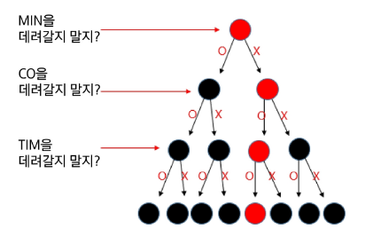

# 목차

## 조합적 문제
- 부분 집합
- 조합

## 탐욕 알고리즘
- Greedy
- Knapsack 문제
- 활동 선택 문제
- 연습 문제

------------

## 조합적 문제

-------------

# 부분집합
### powerset

어떤 집합의 공집합과 자기자신을 포함한 모든 부분

구하고자 하는 어떤 집합의 원소 개수가 n일 경우 부분집합의 수는 $2^n$개이다.

## 집합에 포함된 원소들을 선택하는 것
- 부분 집합 예시
- 오른쪽 표는 집합 {A, B, C}로 만들 수 있는 부분 집합의 예시입니다.
- 부분 집합에는 아무것도 선택하지 않은 경우도 포함됩니다. (공집합)

| {A, B, C} |
| :--- |
| { } |
| {A} |
| {B} |
| {A, B} |
| {C} |
| {A, C} |
| {B, C} |
| {A, B, C} |

### **집합에서 부분 집합을 찾아내는 구현 방법**

1.  **완전 탐색**

    * 재귀 호출을 이용한 완전 탐색으로 부분 집합을 구할 수 있습니다.
    * 실전보다는 완전 탐색 학습용으로 추천하는 방법입니다.

2.  **Binary Counting**

    * 2진수 & 비트연산을 이용하여 부분 집합을 구할 수 있습니다.
    * **모든 부분 집합**이 필요할 때 사용하는 추천 방법입니다.


### **완전 탐색으로 부분 집합 구하기**

* 민철이에게는 세 명의 친구가 있음
    {MIN, CO, TIM}
* 함께 영화관에 갈 수 있는 멤버 구성
* 모든 경우의 수 출력

### **완전 탐색을 이용한 구현**

* O, X로 집합에 포함시킬지 말지 결정



* 이 경우 Path 배열은 **[X, O, O]** 가 되며, 이는 **MIN**을 제외하고 **{CO, TIM}**이 선택된 것입니다.

## 코드 구현

* **Branch**: 2개
* **Level**: 3개

```python
arr = ['O', 'X']
path = []
name = ['MIN', 'CO', 'TIM']

def run(lev):
    if lev == 3:
        print(path)
        return

    for i in range(2):
        path.append(arr[i])
        run(lev + 1)
        path.pop()

run(0)
```

### 출력 결과

```
['O', 'O', 'O']
['O', 'O', 'X']
['O', 'X', 'O']
['O', 'X', 'X']
['X', 'O', 'O']
['X', 'O', 'X']
['X', 'X', 'O']
['X', 'X', 'X']
```

## 완성된 소스코드

* 이름 출력 코드 추가
* 코드: 1. subset\_recursion.py

```python
arr = ['O', 'X']
path = []
name = ['MIN', 'CO', 'TIM']

def run(lev):
    # 3개를 뽑았을 때 출력
    if lev == 3:
        print_name()
        return

    for i in range(2):
        path.append(arr[i])
        run(lev + 1)
        path.pop()

run(0)
```

### 이름 출력 함수

```python
def print_name():
    print('{ ', end='')
    for i in range(3):
        if path[i] == 'O':
            print(name[i], end=' ')
    print('}')
```

### 출력 결과

```
{ MIN CO TIM }
{ MIN CO }
{ MIN TIM }
{ MIN }
{ CO TIM }
{ CO }
{ TIM }
{ }
```

## 바이너리 카운팅 (Binary Counting)

* 원소 수에 해당하는 N개의 비트열을 이용해 **부분집합** 표시

* `001` → 부분 집합 `{A}`

  * **0번 비트**가 1 → 첫 원소 `A`만 포함된 부분집합

* `110` → 부분 집합 `{B, C}`

  * **1번, 2번 비트**가 1 → 두 번째와 세 번째 원소 `B`, `C`가 포함된 부분집합

### 예시 표

| 10진수 | 이진수 | {A, B, C} |
| ---- | --- | --------- |
| 0    | 000 | {}        |
| 1    | 001 | {A}       |
| 2    | 010 | {B}       |
| 3    | 011 | {A, B}    |
| 4    | 100 | {C}       |
| 5    | 101 | {A, C}    |
| 6    | 110 | {B, C}    |
| 7    | 111 | {A, B, C} |

## 부분 집합의 총 개수

* 만들 수 있는 집합의 총 개수는 $2^n$

  * $n = 3$ → 총 8개의 부분 집합 존재

* $2^n$ 은 `1 << n` 공식을 이용하여 빠르게 계산 가능

```python
print(pow(2, 3))
print(1 << 3)
```

### 출력 결과

```
8
8
```


## 완성된 부분 집합 코드

* `get_sub(0)` \~ `get_sub(7)` 호출 → 모든 부분 집합 출력

```python
arr = ['A', 'B', 'C']
n = len(arr)

def get_sub(tar):
    for i in range(n):
        if tar & 0x1:
            print(arr[i], end='')
        tar >>= 1

for tar in range(1 << n):  # range(0, 8)
    print('{', end='')
    get_sub(tar)
    print('}')
```

### 출력 결과

```
{}
{A}
{B}
{AB}
{C}
{AC}
{BC}
{ABC}
```


## 조합 (Combination)

서로 다른 n개의 원소 중 r개를 **순서 없이** 골라낸 것

## 순열과 조합 차이

### 순열

* {A, B, C, D, E} 5명 중 1등, 2등, 3등 뽑기
* **A B C** 와 **C B A** 는 **다른 경우**

$$
^nP_r = \frac{n!}{(n-r)!}, \quad (n \geq r)
$$

---

### 조합

* 5명 중 3명 뽑기
* **A B C** 와 **C B A** 는 **같은 경우**

$$
nCr = \frac{n!}{(n-r)! \cdot r!}, \quad (n \geq r)
$$

$$
nCr = n-1C_{r-1} + n-1C_r
$$

$$
nC_0 = 1
$$


## 5명 중 3명 뽑기: 필요한 for문 수

* 3중 for문 가능

## 5명 중 n명 뽑기: 필요한 for문 수

* N중 for문 가능 → **재귀호출 구현 필요**
* Branch: 최대 5개
* Level: n

## start 파라미터를 추가하여 조합 소스코드 완성

* **Level = n**
* **Branch = 5**

### 구현 방법

1. 처음 `recur` 함수의 `start` 값은 0
   → `0 ~ 5`까지 반복하며 재귀호출
2. 만약 `i`가 3으로 선택되면, 재귀호출 시 `start`는 4가 되며
   다음 `for문`은 4부터 수행

```python
arr = ['A', 'B', 'C', 'D', 'E']
n = 3

path = []

def recur(cnt, start):
    if cnt == n:
        print(*path)
        return

    for i in range(start, len(arr)):
        path.append(arr[i])
        recur(cnt + 1, i + 1)
        path.pop()

recur(0, 0)
```
----
# 탐욕 알고리즘 
----

## Greedy
### 탐욕 알고리즘
결정이 필요할 때, **현재 기준으로 가장 좋아 보이는** 선택지로 결정하여 답을 도출하는 알고리즘

## 대표적인 문제 해결 기법
1. 완전 탐색 (Brute-Force)
    * 답이 될 수 있는 모든 경우를 시도해보는 알고리즘

2. **Greedy**
    * 결정이 필요할 때 **가장 좋아 보이는 선택지**로 결정하는 알고리즘

3. DP
    * 현재에서 가장 좋아 보이는 것을 선택하는 것이 아닌, 과거의 데이터를 이용하여 현재의 데이터를 만들어내는 문제 해결 기법

4. 분할 정복 (차후 학습 예정)
    * 큰 문제를 작은 문제로 나누어 해결하는 문제 해결 기법


## 동전 교환 문제
아래 그림과 같이 총 네 종류의 동전이 있다.
손님의 돈을 최소한의 동전 수를 사용하여 교환해 주려고 한다.

만약 1,730원을 거슬러주기 위해 사용할 수 있는 최소 동전 수는 몇 개인가?

10, 50, 100, 500

## 1,730원을 거슬러 줄 수 있는 최소 동전의 수
* 큰 동전부터 최대한 거슬러 주면 됨.
    이처럼, 좋아 보이는 값을 먼저 선택하는 것을 **그리디(Greedy), 탐욕(욕심쟁이) 알고리즘**이라고 함.
* 500원 = 3개 = 누적 1,500원
* 100원 = 2개 = 누적 1,700원
* 10원 = 3개 = 누적 1,730원

## 그리디로 성립하는 조건인 10, 50, 100, 500원 동전일 때 1,730원을 거슬러 주는 소스코드

```python
coin_list = [500, 100, 50, 10] # 큰 동전부터 앞으로 작성함
target = 1730
cnt = 0

for coin in coin_list:
    possible_cnt = target // coin  # 현재 동전으로 가능한 최대 수

    cnt += possible_cnt         # 정답에 더해준다.
    target -= coin * possible_cnt # 금액을 빼준다.
print(cnt)
```

  * 출력결과 : 8

## 동전 구성이 다른 경우
동전이 5, 20, 100 단위로 존재함
530원을 거슬러 주기 위해서 사용해야 하는 최소 동전의 수는?

5, 20, 100

## 동전 교환 문제를 완전탐색으로 해결한다면?
1. **0원이 될 때까지** 모든 경우를 다 구함.
2. **최소 Level이 되는** 경우를 찾으면 정답이 됨.

## 동전 교환 문제를 풀 때, **Greedy 알고리즘에서의 예외**
만약 100원을 거슬러 주어야 하는 경우, 총 몇 개의 동전이 필요한가?

Greedy로 접근 → 액수가 큰 동전을 먼저 선택하면 4개. (70원 하나, 10원 3개)
정답 → 50원 동전만 사용하여 정답은 2개

## Greedy가 성립하는 경우 vs 성립하지 않는 경우
* 10, 50, 100, 500 처럼 모든 동전이 배수 관계인 경우는 Greedy 적용 가능
* 10, 50, 70 처럼 모든 동전이 배수 관계가 아닌 경우는 Greedy **적용 불가**

## 화장실 문제
### [도전] 화장실 문제를 Greedy로 풀어보기
어떤 기준으로 접근해야 대기시간의 누적 합이 최소가 될지 고민해보고 구현해보기.  

기숙사에는 하나의 화장실만 존재함.
A ~ D 학생은 각자의 평균 화장실 사용 시간이 다음과 같음.
- A : 15분
- B : 30분
- C : 50분
- D : 10분

만약 A가 먼저 화장실을 이용한다면,
나머지 인원 B, C, D는 대기를 해야 함.

B, C, D 각자의 대기시간들의 총 합은 15분 * 3 = 45분.

이후, B가 화장실을 이용하는 경우
나머지 인원 C, D는 대기를 해야 함.

각자의 대기시간의 누적 합은 45분 + (30분 * 2) = 105분.

이후, C가 화장실을 이용하는 경우
나머지 D는 대기를 해야 함.

각자의 대기시간의 누적 합은 105분 + (50분 * 1) = 155분.

마지막으로 D가 화장실을 이용함.

이 때는 아무도 기다리지 않기에,
총 대기시간의 누적 합은 155분.

## Knapsack 문제

## 0-1 Knapsack (물건을 넣거나 뺄 수만 있는 문제)
도둑이 보물들이 있는 창고에 침입함.
도둑은 최대 30kg까지 짐을 담아갈 수 있음.

물건의 개수(N) 그리고 물건 별 무게(W)와 가격(P)이 주어질 때, 어떤 물건을 담아야 도둑이 최대 이득을 볼 수 있을지 구하기.

| | 무게 | 값 |
|:---|:---|:---|
|물건1|**5kg**|**50만원**|
|물건2|**10kg**|**60만원**|
|물건3|**20kg**|**140만원**|

* 물건은 하나 씩만 존재함.
* 최대 30kg까지 짐을 담고자 할 때, 어떤 물건을 담아야 최대로 수익을 낼 수 있는지 찾는 문제

Kg 당 가치가 가장 높은 것을 먼저 담으면 안됨.
0-1 Knapsack을 Greedy로 접근하면 안되는 예외 케이스가 존재
**0-1 Knapsack 문제는 Greedy로 해결할 수 없음.**
**완전 탐색 혹은 DP로 접근해야 함.**

## Fractional Knapsack 문제
0-1 Knapsack과 달리, 물건을 원하는 만큼 자를 수 있는 Knapsack 문제.

| | 무게 | 값 | 값/kg |
|:---|:---|:---|:---|
|물건1|5kg|50만원|10만원/kg|
|물건2|10kg|60만원|6만원/kg|
|물건3|20kg|140만원|7만원/kg|

정답은 아니지만, 가방에 담을 수 있는 예시:
물건1에서 5kg + 물건2에서 10kg + 물건3에서 15kg = 50 + 60 + 105 = 215만원

Greedy로 접근해도 될지 고민해보기.

## Fractional Knapsack 문제 해결 방법
* Greedy가 성립함.
* **Kg 당 가격이 가장 높은 물건을 최대한 담으면 됨.**
* 최대 수익
    - 가장 kg 당 금액이 높은 물건1, 전체 사용 (50만원)
    + 두번째로 kg 당 금액이 높은 물건3, 전체 사용 (140만원)
    + 세번째로 kg 당 금액이 높은 물건2, 나머지 모두 사용 (5kg만 사용, 30만원)
    = 50 + 140 + 30 = 220만원

## Fractional Knapsack 소스코드

```python
n = 3
target = 30 # Knapsack KG
things = [(5, 50), (10, 60), (20, 140)] # (Kg, Price)

# 정렬 : (price / kg)
total = 0
for kg, price in things:
    per_price = price / kg

    # 만약 가방에 남은 용량이 얼마되지 않는다면,
    # 물건을 잘라 가방에 넣고 끝낸다.
    if target < kg:
        total += target * per_price
        break
    
    total += price
    target -= kg

print(int(total))
```

## 부분 집합의 합 문제 구현하기
* 아래의 10개의 정수 집합에 대한 모든 부분 집합 중 원소의 합이 0이 되는 부분집합을 모두 출력.
    {-1, 3, -9, 6, 7, -6, 1, 5, 4, -2}

### 출력 결과
{6, -6}
{-1, 3, -2}
{-9, 7, 4, -2}